# Control Browser Guide

## Introduction

The Controls Browser is built to provide an overview of the current risks in your Information System.  
It provides administrators with an overview of the controls and associated defects (discrepancies) and when possible the means to remediate the risk.  

## Overview

### Access

The Controls Browser is available via the `Controls` menu, in the `Controls Browser` item:

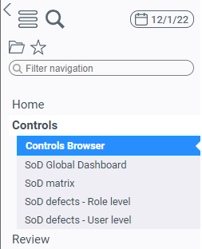

### Main page

#### Filters

The top of the page can be used to filter the list of controls displayed.  

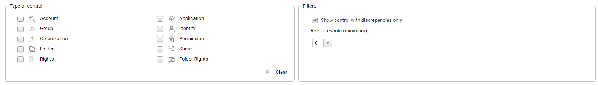

Available filters are:  

- `Type of control`: the entity associated to the controls (Account, Identity, Organization, _etc._) or more specific targets (Rights, Folder, Folder Rights, _etc._)
- `Show controls with discrepancies only`: show/hide controls that have no defect
- `Risk threshold (minimum)`: filter controls based on a minimum risk level (from 0 to 5)

> All filters except the `Type of control` are persistent user variables. Filters are kept between sessions.  

#### List of controls

The list of controls matching the selected filters is shown in the table below the filter selection fields:  

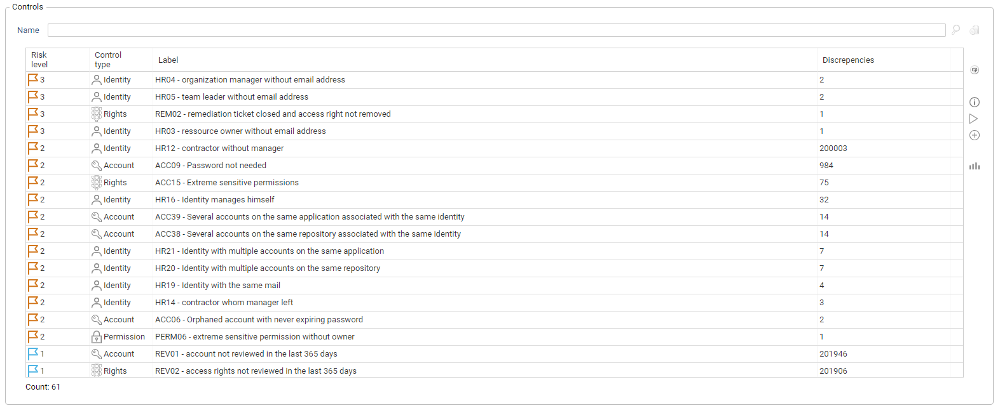

The default columns displayed are:  

- `Risk level`: the control risk level (from 0 - Low to 5 - High)
- `Control type`: the type of control, based on the control's scope. This can be the same as the entity, or more specific in some cases (Rights, Folder, Folder Rights, _etc._)
- `Label`: the control code (_i.e._ ACC09, REV02, _etc._) followed by the control display name (_i.e._ Orphaned Account, Sensitive permissions, _etc._)
- `Discrepancies`: the number of discrepancies (or defects) for the control

> Other columns are all available via the right click's `Configure` menu.  

#### Control Information

A pane, hidden by default, is available on the right hand side of the page. It displays detailed information about the control selected in the table on the left:  

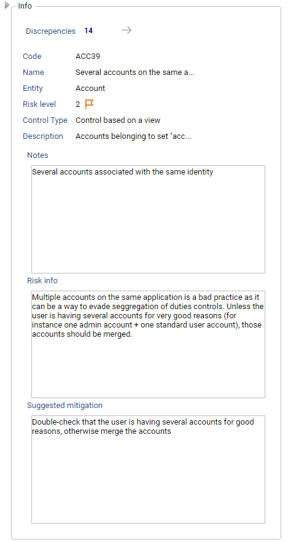

## Dialogs

Clicking on a control in the results table will open a dialog with the information pertaining to the control (same as in the pane detailed above):  

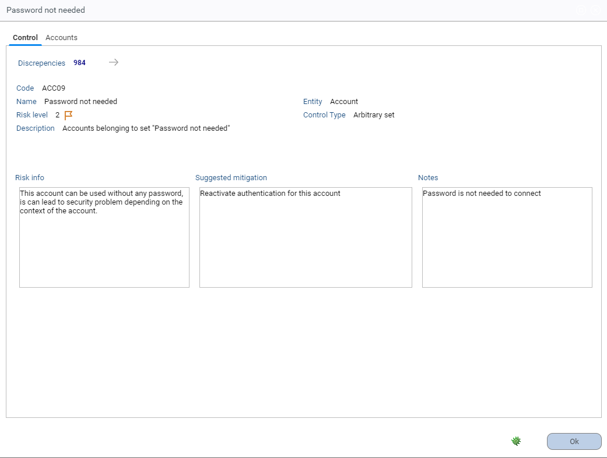

The list of available tabs in the dialog will depend on the type of control. They will be displayed alongside the control details and list of entities with discrepancies (accounts, identities, _etc._):  

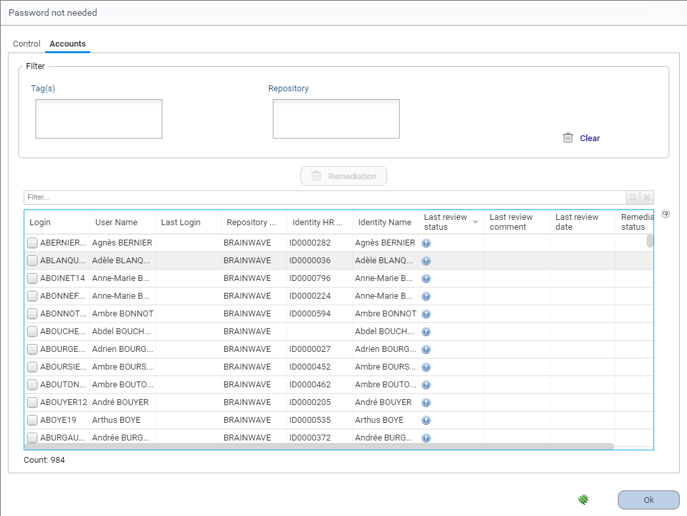  

Most entities with defects can be filtered using `Tags` and another entity. For example, accounts can be filtered by Repository, permissions by Application, _etc._  

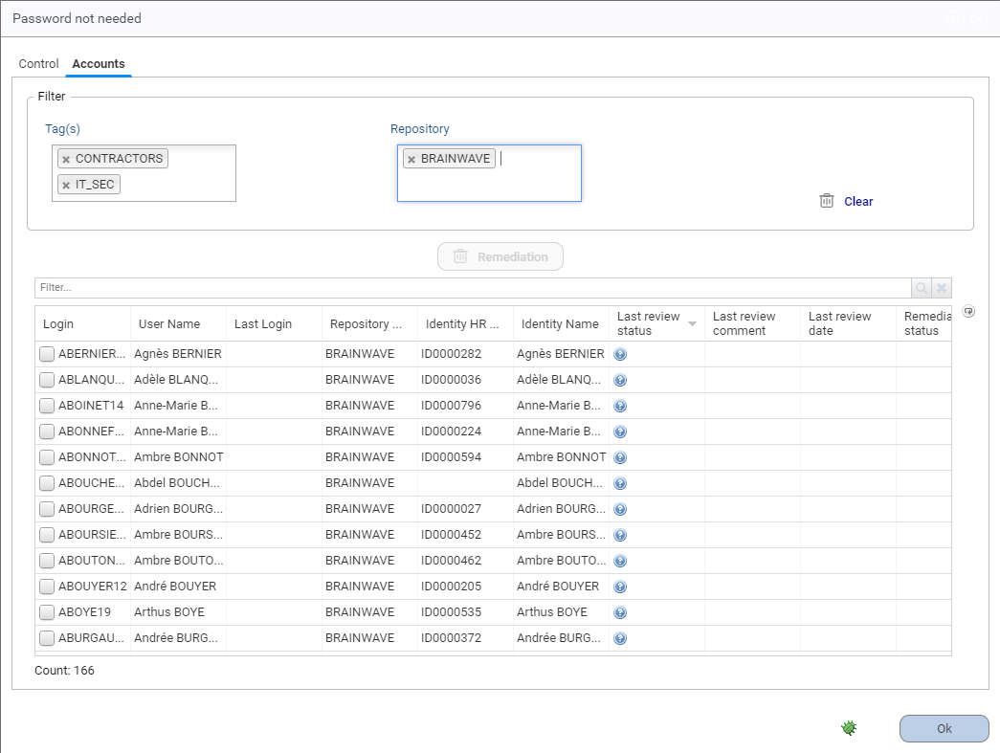

> If calculated during the execution plan Controls with a root cause will also show the associated permissions

### Remediation

For controls on Accounts and Rights, it is possible to launch a remediation process directly from the controls browser. This is done by selecting the desired discrepancies in the displayed list:  

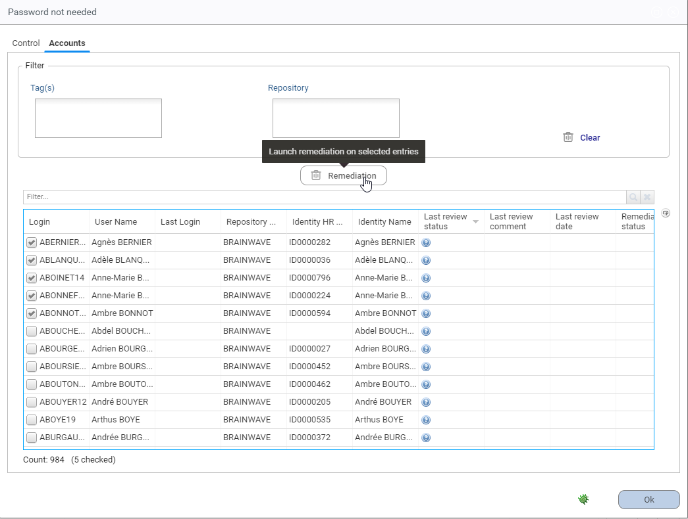

This action will open a confirmation dialog that allows you to set a `Comment` and a `Status` for the remediation:  

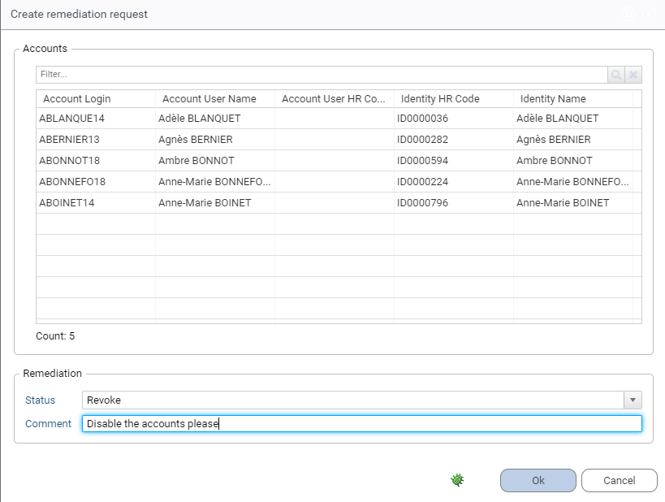  

The remediation status is then updated and the `new` status will be displayed on the right:  

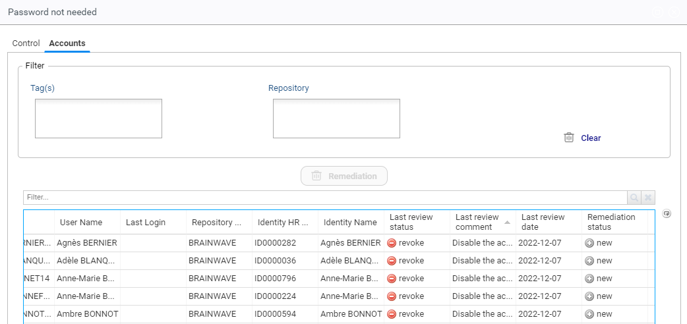

Once a remediation has been requested, the associated entries are added to the list of remediation actions in the standard remediation page of IAP (these pages are not part of the controls browser):  

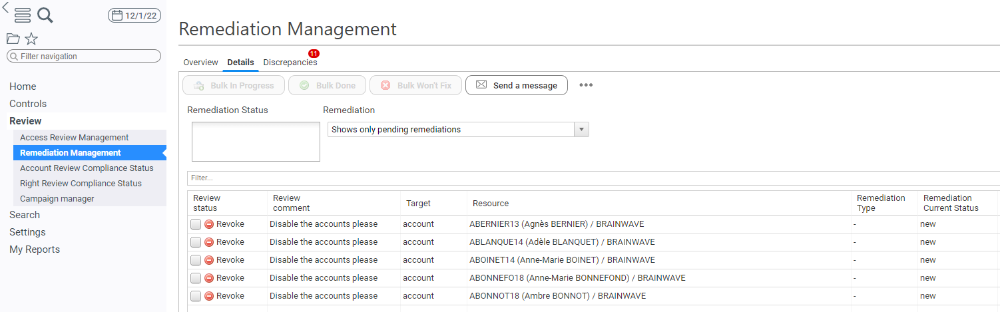

The remediation status is updated accordingly in the controls browser during the remediation process:  

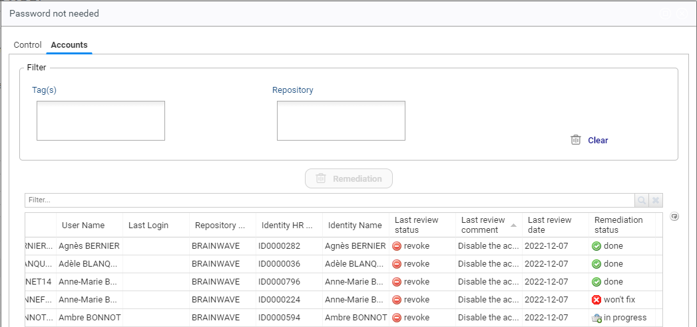

> Right remediation works in a similar way, however the `last review` information is not displayed as it only exists for accounts.  
> It _could_ be retrieved via review ticket, but it is not done for performance reasons.  

### Control actions

There are a few actions available via the buttons on the right side of the controls list:  

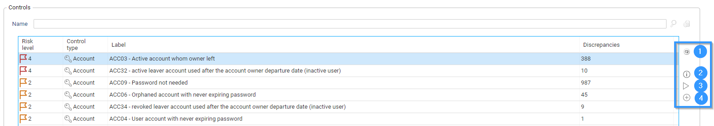

1. Refresh the list of controls (can be useful if controls are running in the background)
2. Open the control details dialog (similar to the information shown in the detail pane)
3. Execute the control: updates the control results in the latest timeslot (`*`)
4. Add a control: add control results for a control that is in the project but has not been run during the execution plan (`*`)

> (`*`) for `3.` and `4.`, the number of discrepancies shown in the `Controls Browser` will not be updated accordingly  
> You **must run** a new timeslot to update the KPIs (and associated metadata)

## Known limitations

### Control types

Some control types are masked from the control list, as they require dedicated interfaces to allow relevant decision making:  

- SOD Controls (types `3` and `6`)
- Theoretical rights controls (type `5`)

> They will be enabled in a future version of IAP

### Metadata

For better performance, the `Controls Browser` uses **metadata** to store the number of discrepancies on each control.  
This means that if you try to use the `Controls Browser` on an existing timeslot, all the controls will have **0** discrepancies.  
It also means that if you re-run or add a control on a timeslot, the discrepancies will not be updated accordingly.  
You **must launch a new timeslot** to update the indicators (the required metadata is included in the execution plan).  

> [!warning] As the control browser depends on metadata calculated during the execution plan it is not compatible with timeslots that existed before the installation of `Controls Browser`.  
