# Detail pages

All detail pages follow the same navigation logic.  

The detail pages presents a 360° view of the selected entity, information is available through a series of tabs. Identity Analytcs Services or Platform dynamically pre-compute the tabs content and automatically hide most of the tabs if they are empty/not relevant in the context. This greatly simplify the browsing but can be a little confusing at first. As a general rule, consider that if a tab is not present it is because its content is empty.  

IAS/IAP enforce the "security by design" principle, as a result, the end-user cannot evade from a detail page. If context information is needed, it will be presented as a dialog box. Dialog boxes can be nested if needed.  

Context information is available through hyperlinks located in the widgets (Table, Pivot table, Buttons, ...)  

Please note also that most of the components (Table and Pivot Table) are configurable in a way that the end-user can configure the columns that he wants to display as well as their order. He can also export the table/pivot table content in Excel format. Right click on the widget in order to do so. Please go to the [How to configure tables, columns and export data](#standard-tables) section to know more about table customization.   

## Detail pages main tabs

Here is the list of the main tabs available for each resource type:  

- **Details tab** (first tab) presents general information regarding the selected entity.  
- **Security Model tab** (second tab) is an optional tab, it presents the computed business activities as well as the theoretical access rights that this entity is having. For instance, access granted through a ticketing system or an IAM system. Comparing these "theoretical" rights with the real one in the target application will provide the overallocated rights. Business activities are the prefered way to perform SoD checks. As a result, if he wants to configure SoD check, he MUST load business activities.
- **Access tab** (third tab) is an optional tab, it presents the "real" access rights as correlated from the various data sources (basically, the access rights that RadiantOne Identity Analytics found for this entity on the loaded systems).  
- **Controls tab** (fourth tab) presents the list of all the control defects found for this entity.  
- **Analytics tab** (fifth tab) presents all the analytics available for this entity. Analytics can be simple reports as well as more elaborated management interfaces.  
- **Decision history** (last tab) is an optional tab, it presents all the decision taken for this entity such as access review decision or entity update made through IAS/IAP (account reconciliation, classification update, management information update, ...).  

## organisation details page

The aim of the organisation details page is to help the end-user identify and mitigate the risky situations within teams. He will have an overview of the caracteristics of each organisation with the possibility to investigate with a risk based approach on members and their accesses to application, infrastructure and data.

In all the sub-tabs of the organisation details page, as in any table in IAP, the end-user can configure and add new columns and KPIs by right clicking on the table and selecting "Configure". Please go to the [How to configure tables, columns and export data](#standard-tables) section to know more about table customization.

When relevant, the end-user can also filter the results to include all the sub-organisations of the selected organisation using the "only this organisation" checkbox.

### Details tab

This tab presents general information regarding the selected organisation through four sub-tabs:  

- in **organisation tab**, key KPIs and management information about the selected organisation are provided. Please refer to the [Risk ranking and risk analysis](#computed-kpis) section of this document for more information about Risk rank, Max risk level, nb of Identities at risk and percentage of identities at risk.  

- in **Managers tab**, the list of selected organisation's managers. 
When the end-user is a **functional or technical administrator** (roles `functionaladmin`, `technicaladmin`), he can also add a new organisation manager and configure delegation, delete an organisation manager, access to the organisation manager updates audit trail, by clicking on the three icons avalaible on the right side of the table.  
  
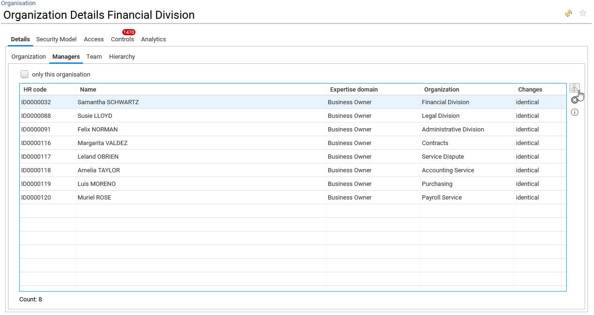

- in **Team tab**, the team members list is provided.
In this table the end-user can include inactive identities if needed.  
He is also able to compare team members regarding accesses at application, permission, account, group, share and folder levels. To do so, he needs to select two or more identities in the list and click on the "compare" button. For more details on that, please reach the [how to compare identities, accounts, permissions or groups](#how-to-compare-identities-accounts-permissions-or-groups-with-each-others) section.  
The end-user can click also on the name or HRcode of an identity to open the related identity detail window.  

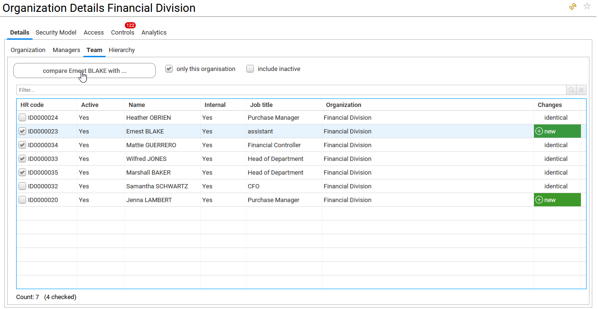

- in **Hierarchy tab**, the graphical representation of the organisation chart is provided here.  

### Security Model tab

This is an optional tab, it presents the computed business activities as well as the theoretical access rights that the selected account is having. For instance, access granted through a ticketing system or an IAM system. Comparing these "theoretical" rights with the real one in the target application will provide the overallocated rights.

- in **Business Activities tab**, the list of Business Activities accessible by one or more team members is provided. When controls defect such as SoD issues have been detected for a Business Activities, a orange icon is displayed in the first column by default. 
The end-user can click also on the name of the Business Activity to open the related Business Activity detail window.  
Note that this tab requires the Booster for ERP/SoD licence.

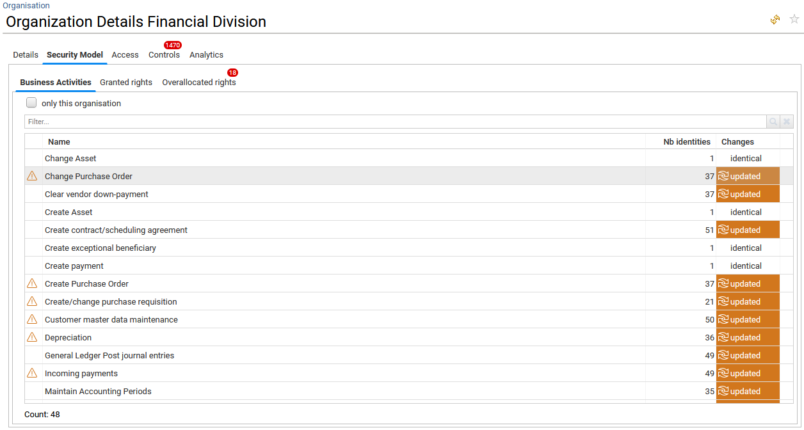

- in **Granted rights tab**, the end-user has access to the list of all the roles granted by the applications. 
He can click also on the name of the permission/role/profile to open the related detail window.  
Note that this tab requires the Booster for IAM or ERP/SoD licence.   

- in **Overallocated rights**, the end-user has access to the list of permissions and accounts that are overallocated with regard to the theoretical rights uploaded in Identity Analytics.  
He can click also on the name or HRcode of an identity to open the related identity detail window.  
Note that this tab requires the Booster for IAM licence.  

### Access tab

This is an optional tab, it presents the "real" access rights as correlated from the various data sources (basically, the access rights that RadiantOne Identity Analytics found for the selected organization on the loaded systems).  

- in **Accounts tab**, the list of all the accounts of the team members is provided in a table.  
Clicking on the Login opens the account detail window.  

- in **Applications tab**, the list of applications accessible by any member of the team is listed in a table.  
Clicking on the Application code or Application name opens the application detail window.  

- in **Permissions tab**, the Applications and Permissions accessible by any member of the team are listed in a table.  
Clicking on the Permission code or Permission name opens the permission detail window, clicking on the Application name lead to the application detail window.  

- in **Access rights tab**, the list of accounts-permissions accessible by any of the team members is listed.  
Clicking on the identity name opens the identity detail window, on the Permission code or Permission name opens the permission detail window and on the Application name lead to the application detail window.

- in **Folders tab**, the list of folder rights (simplified ACLs), path and related share accessible by any of the team members is provided. This tab is only available if the end-user has the appropriate licence (Booster for Data Governance/Unstructured Data). By default, only folders with direct ACLs are displayed, not the sub folders with inheritance. The end-user is able to uncheck "Display only folders with ACLs" to get the full list of folders.
A Share family column is provided to list the type of unstructured data: SharedFolders (NTFS, CIFS), Microsoft365 (OneDrive, SharePointOnline, ExchangeOnline) and more.
In this tab, a filter is also provided through combobox to help the end-user select a specific share family and/or share and/or the folder depth requested.
Clicking on the Rights value in column "Rights" opens the rights definition window (the legend).  
Clicking on the Folder path name in column "Path" opens the Folder detail window.  

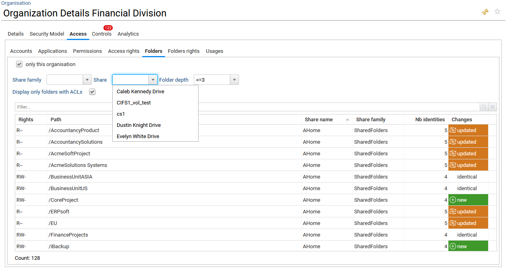

- in **Folders rights tab**, the list of accounts-folder rights accessible by any of the team members is provided. This tab is only available if the end-user has the appropriate licence (Booster for Data Governance/Unstructured Data). 
Top of the table, the options are exactly the same as for Folder tab, as described in the previous paragraph.
In addition, the end-user can click on the Account login to reach the account detail window.

- in **Usages tab** the list of activities is provided when some logs have been aggregated and consolidated in Identity Analytics as usages during the data collect phase.  

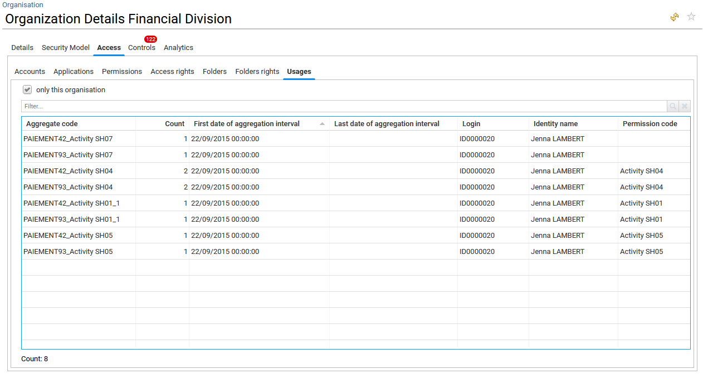

### Controls tab

It presents the list of all the control defects found for the selected organisation. 
Checking the box "Show selected control defect risks details" allow to display the Control and Risk descriptions and the Suggested mitigation on bottom of page.  
Clicking on the Control name leads to the Control detail window.

 

### Analytics tab

It presents all the analytics available for the selected organisation. Analytics can be simple reports as well as more elaborated management interfaces.
It will help to better understand how the access have been granted through the selected organisation's members by providing applications, roles, permissions, data access analysis reports, cross table analysis with peer groups analytics capabilities, analyze SoD defects matrix and to follow-up the changes that occured in the past ("Organisation timeline").

 

The full list of Analytics reports for any resources is available from the administration page and documented. Please go to section [Analytics reports](#how-to-list-all-the-available-analytics-reports-and-their-description) to know more.

### Decision history

This is an optional tab, it presents all the decision taken for this entity such as access review decision or entity update made through IAS/IAP (account reconciliation, classification update, management information update, ...).
The end-user is able in top of this table to filter per status such as "ok", "update", "revoke", "remove", "add", "not reviewed".

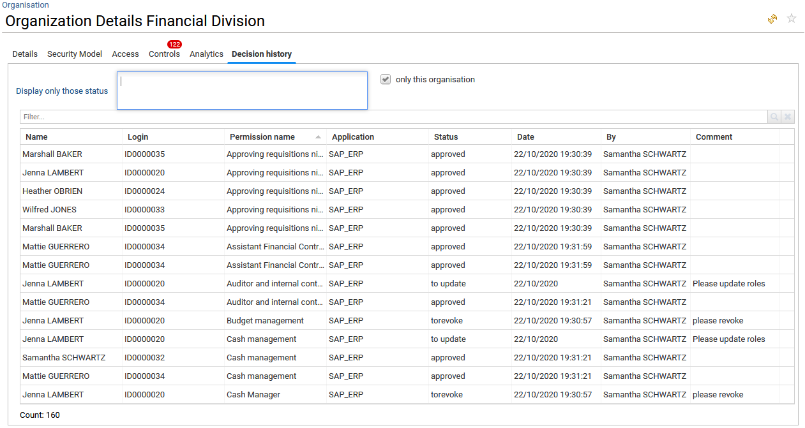

## Identities details page

The aim of the Identity details page is to help the end-user identify and mitigate the risky situations faced by a specific identity. He will have an overview of the characteristics of each identity with the possibility to investigate with a risk based approach on their accesses to application, infrastructure and data.  

In all the sub-tabs of the Identity details page, as in any table in IAS/IAP, the end-user can configure and add new columns and KPIs by right clicking on the table and selecting "Configure".  Please go to the [How to configure tables, columns and export data](#standard-tables) section to know more about table customization.  

### Details tab

This tab presents general information regarding the selected Identity.  

Depending on the responsibilities of the selected identity, different sub-tabs will be displayed:  
  
- for a standard user, the end-user will access to sub-tabs Identity, Position and Colleagues,  

- for a resource owner, the end-user will access to an additional sub-tab with regard to the standard user: Managed resources,  

- for an organisation manager or a line manager, the end-user will access to one or two additional sub-tabs with regard to the standrad user: Team when the identity is a line or organisational manager and Managed organisations when he is an organisational manager.  

- in **Identity tab**, key KPIs and information about the selected identity are provided. Please refer to the [Risk ranking and risk scoring](#computed-kpis) section of this document for more information about the Risk rank, max risk level and nb of risks.  

When the end-user is a **functional or technical administrator** (roles `functionaladmin`, `technicaladmin`), he can also add a new manager for the selected identity, delete a manager and access to the manager updates audit trail, by clicking on the three icons avalaible on the right side of the "Direct operational manager" section.  

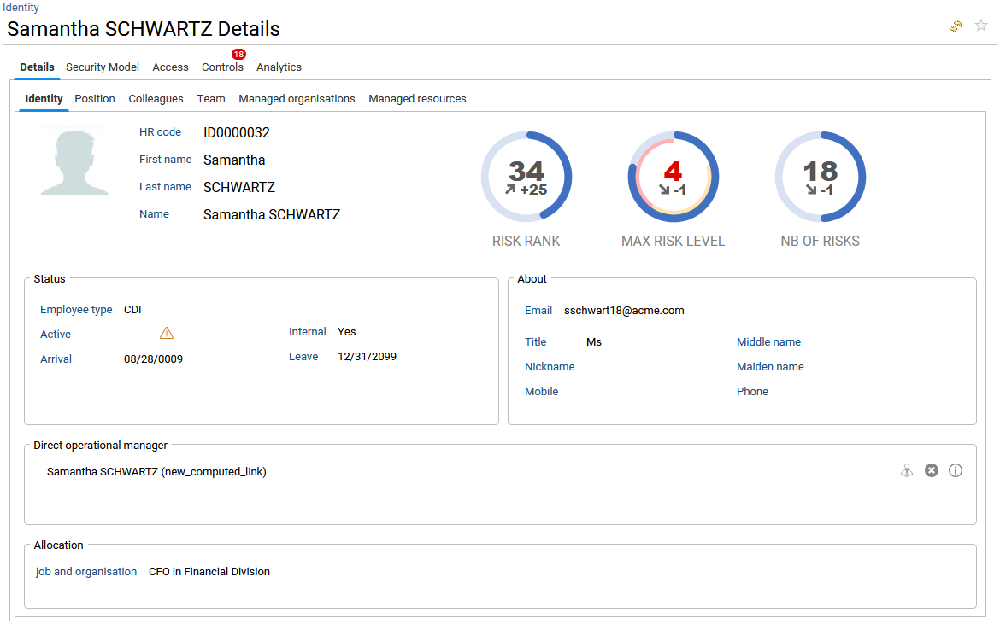

- in **Position tab**, the end-user can check the organisation hierarchy in which belongs the selected identity. Note that this table is configurable and the organisation Code and Short name can also be displayed.

- in **Colleagues tab**, he can check the identities working under the same manager or in the same team. He can also add the identities from sub-organisations by selecting "all colleagues" in the combo box.
The end-user can click also on the name or HRcode of an identity to open the related identity detail window.  

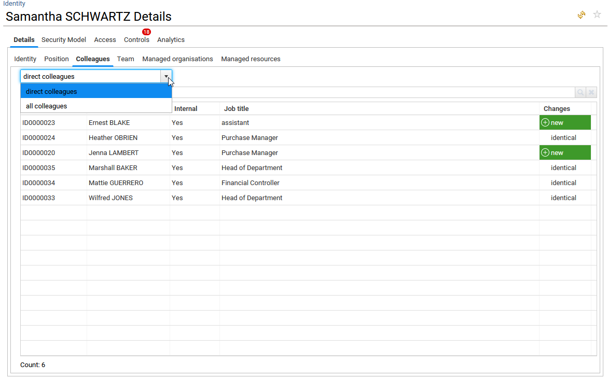

- in **Team tab**, when the selected identity is a line and/or an organisation manager, the end-user can access here to the list of identities the selected manager is responsible for.
A combobox allows to select which team is expected, the one as an organisation manager or the one as a line manager.
A checkbox "Whole team" can be checked to list all the identities working in the sub departements/organisations.
When selecting "as a line manager", the end-user can also filter the list of identities per expertise domain.
He is also able to compare a selected identity in the team with one or more others selected in the same table. For more details on that, please reach the [how to compare identities, accounts, permissions or groups](#how-to-compare-identities-accounts-permissions-or-groups-with-each-others) section. 
The end-user can click also on the name or HRcode of an identity to open the related identity detail window.  

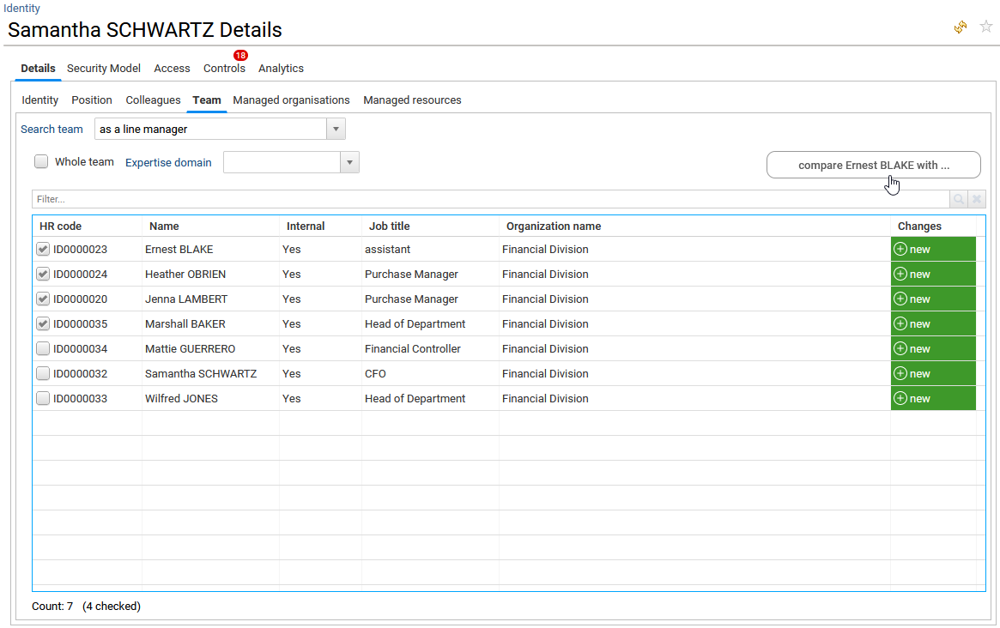

- in **Managed organisations tab**, when the selected identity is an organisation manager, the end-user will find out here the list of his managed organisations, with details on the related expertise domain.
He can click also on the short name or name of an organisation to open the related organisation detail window.

- in **Managed resources tab**, when the selected identity is a resource owner, the end-user can retrieve here the list of these resources, that could be of any type, such as Application, SharedFolders, Shares, Roles, Permissions, Accounts, Repositories, Groups and more.

### Security Model tab

This is an optional tab, it presents the computed business activities as well as the theoretical access rights that the selected identity is having. For instance, access granted through a ticketing system or an IAM system. Comparing these "theoretical" rights with the real ones in the target application will provide the overallocated rights.

- in **Business Activities tab**, the list of Business Activities accessible by the selected identity is provided. When controls defect such as SoD issues have been detected for a Business Activities, a orange icon is displayed in the first column by default. 
The end-user can click also on the name of the Business Activity to open the related Business Activity detail window.  
Note that this tab requires the Booster for ERP/SoD licence.

- in **Granted rights tab**, the end-user has access to the list of all the roles granted by the applications. 
He can click also on the name of the permission/role/profile code or name to open the related detail window.  
Note that this tab requires the Booster for IAM or ERP/SoD licence.   

- in **Overallocated rights**, the end-user has access to the list of permissions that are overallocated with regard to the theoretical rights uploaded in Identity Analytics.  
Note that this tab requires the Booster for IAM licence.  

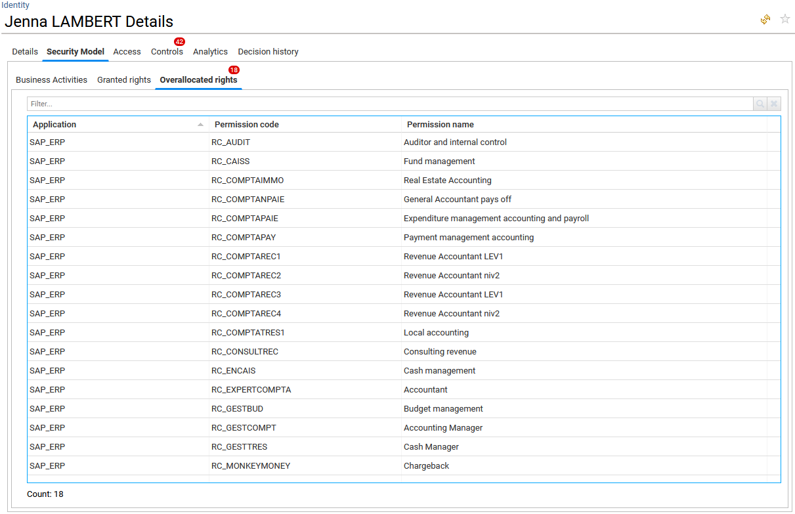

### Access tab

This is an optional tab, it presents the "real" access rights as correlated from the various data sources (basically, the access rights that Identity Analytics found for the selected identity on the loaded systems).  

- in **Accounts tab**, the list of all the accounts of the selected identity is provided in a table.  
Clicking on the Login opens the account detail window.  

- in **Applications tab**, the list of applications accessible by the selected identity is listed in a first table. Selecting an application will then provide in a second table on the right the list of the related profiles/roles/permissions that gives the selected identity access to the application.  
The table on the right is configurable so that the end-user can add columns to display for example the sensitivity level and sensitivity reason of each permission.

- in **Shares tab**, the list of folder path accessible by the selected identity is provided with Share and rights (simplified ACLs) details. This tab is only available if the end-user has the appropriate licence (Booster for Data Governance/Unstructured Data).  
By default, only folders with direct ACLs are displayed, not the sub folders with inheritance. The end-user is able to uncheck "Display only folders with ACLs" to get the full list of folders.  
A Share family column is provided to list the type of unstructured data: SharedFolders (NTFS, CIFS), Microsoft365 (OneDrive, SharePointOnline, ExchangeOnline) and more.
In this tab, a filter is also provided through combobox to help the end-user select a specific share family and/or share and/or the folder depth requested.
Clicking on the Rights value in column "Rights" opens the rights definition window (the legend).  
Clicking on the Folder path name in column "Path" opens the Folder detail window, and allows to investigate on access rights (simplified ACLs) and related groups.  
To know more about ACLs, please reach the [ACLs definition](#acls-definitions) section.

- in **Usages tab** the list of activities is provided when some logs have been aggregated and consolidated in RadiantOne Identity Analytics as usages during the data collect phase.  

### Controls tab

It presents the list of all the control defects found for the selected identity.  
Checking the box "Show selected control defect risks details" allow to display the Control and Risk descriptions and the Suggested mitigation on bottom of page.  
Clicking on the Control name leads to the Control detail window.

### Analytics tab

It presents all the analytics available for the selected identity. Analytics can be simple reports as well as more elaborated management interfaces.
It will help to better understand how the access have been granted to the selected identity by providing applications, roles, permissions, data access analysis reports, analyze SoD defects matrix, follow-up the changes that occured in the past ("Identity timeline") and a graphical representation of the identity's accesses (360° view of the identity).

 

Analytics reports available for ressources owned by the selected identity are also provided.
The full list of Analytics reports for any resources is available from the administration page and documented. Please go to section [Analytics reports](#how-to-list-all-the-available-analytics-reports-and-their-description) to know more.

### Decision history

This is an optional tab, it presents all the decision taken for this identity such as access review decision or identity update made through IAS/IAP.
The end-user is able in top of this table to filter per status such as "ok", "update", "revoke", "not reviewed" thanks to checkboxes.  

## Repositories

The aim of the Repository details page is to help the end-user identify and mitigate the risky situations within accounts and groups repositories. He will have an overview of the caracteristics of each repository with the possibility to investigate with a risk based approach on accounts, their owners and accesses to application, infrastructure and data.

In all the sub-tabs of the Repository details page, as in any table in IAS/IAP, the end-user can configure and add new columns and KPIs by right clicking on the table and selecting "Configure". Please go to the [How to configure tables, columns and export data](#standard-tables) section to know more about table customization.  

### Details tab

This tab presents general information regarding the selected Repository through three sub-tabs:  

- in **Repository tab**, key KPIs and management information about the selected repository are provided. Please refer to the [Risk ranking and risk analysis](#computed-kpis) section of this document for more information about Risk rank, Max risk level, nb of risks.  
When the end-user is a **functional or technical administrator** (roles `functionaladmin`, `technicaladmin`), he can also add a new manager for the selected identity, delete a manager and access to the manager updates audit trail, by clicking on the three icons avalaible on the right side of the "Managers" section.   

- in **Accounts tab**, the list of accounts available in the selected repository is provided.  
The end-user is able to compare accounts regarding accesses at application, permission, group, share and folder levels. To do so, he needs to select two or more accounts in the list and click on the "compare" button. For more details on that, please reach the [how to compare identities, accounts, permissions or groups](#how-to-compare-identities-accounts-permissions-or-groups-with-each-others) section.  
The end-user can click also on the Login or Username of an account to open the related account detail window.  
Note that by default, only enabled accounts are listed in any table listing accounts. The end-user can uncheck the checkbox "Hide disabled accounts" if he wants to review disabled accounts.

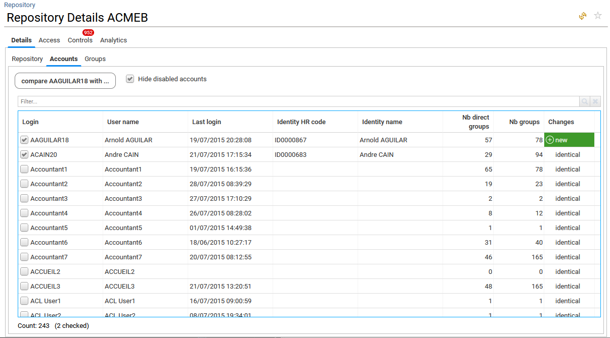

- in **Groups tab**, the list of groups available in the selected repository is provided.  
The end-user is also able to compare groups regarding members (accounts). To do so, he needs to select two or more groups in the list and click on the "compare" button. For more details on that, please reach the [how to compare identities, accounts, permissions or groups](#how-to-compare-identities-accounts-permissions-or-groups-with-each-others) section.  
The end-user can click also on the Name of a group to open the related group detail window.  
Note that he can also choose to list the hierarchy of groups by selecting in the combobox on top of the table "groups hierarchy with accounts number".  

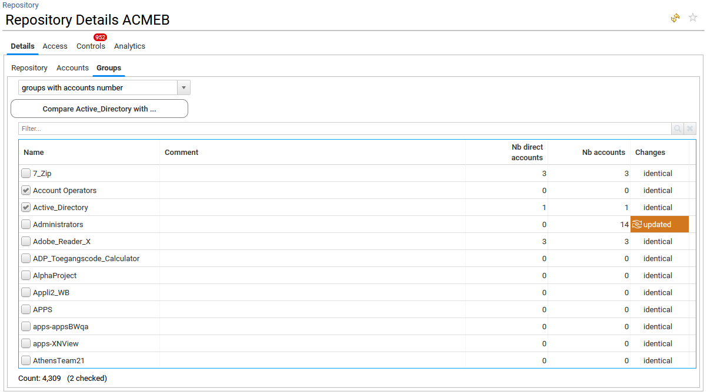

### Access tab

This is an optional tab, it presents the "real" access rights as correlated from the various data sources (basically, the access rights that Identity Analytics found for the selected repository on the loaded systems).  

- in **Applications tab**, the list of applications accessible by the selected repository's accounts is listed in a table, with permission, accounts and identity details. The end-user can click on the Name or Code of a permission to open the related permission detail window.

- in **Shares tab**, the list of folder accessible by the repository's accounts is provided with Share, rights (simplified ACLs) and accounts details. This tab is only available if the end-user has the appropriate licence (Booster for Data Governance/Unstructured Data).  
By default, only folders with direct ACLs are displayed, not the sub folders with inheritance. The end-user is able to uncheck "Display only folders with ACLs" to get the full list of folders.  
A Share family column is provided to list the type of unstructured data: SharedFolders (NTFS, CIFS), Microsoft365 (OneDrive, SharePointOnline, ExchangeOnline) and more.
In this tab, a filter is also provided through combobox to help the end-user select a specific share family and/or share and/or the folder depth requested.
Clicking on the Rights value in column "Rights" opens the rights definition window (the legend).  
Clicking on the Folder name in column "Folder" opens the Folder detail window, and allows to investigate on access rights (simplified ACLs) and related groups.  
To know more about ACLs, please reach the [ACLs definition](#acls-definitions) section.

### Controls tab

It presents the list of all the control defects found for the selected repository.  
Checking the box "Show selected control defect risks details" allow to display the Control and Risk descriptions and the Suggested mitigation on bottom of page.  
Clicking on the Control name leads to the Control detail window.  

### Analytics tab

It presents all the analytics available for the selected repository. Analytics can be simple reports as well as more elaborated management interfaces. It will help to improve the data quality of the selected repository (Similar groups analysis), to work on reconciliation and limit orphaned accounts (Orphaned account reconciliation management), and to follow-up the changes that occured in the past (Repository timeline).

The full list of Analytics reports for any resources is available from the administration page and documented. Please go to section [Analytics reports](#how-to-list-all-the-available-analytics-reports-and-their-description) to know more.

### Decision history

This is an optional tab, it presents all the decision taken for this repository such as access review decision or reconciliation and accounts update made through IAS/IAP.  
The end-user is able in top of this table to filter per status such as "reconciled-user", "create", "ok", "update", "revoke", "not reviewed" and more thanks to a combobox.  

## Accounts

The aim of the Accounts details page is to help the end-user identify and mitigate the risky situations faced by a specific account. He will have an overview of the caracteristics of each account with the possibility to investigate with a risk based approach on their accesses to application, infrastructure and data.  

In all the sub-tabs of the Account details page, as in any table in IAS/IAP, the end-user can configure and add new columns and KPIs by right clicking on the table and selecting "Configure". Please go to the [How to configure tables, columns and export data](#standard-tables) section to know more about table customization.   

### Details tab

This tab presents general information regarding the selected Repository through three sub-tabs:  

- in **Account tab**, key KPIs and owner information about the selected Account are provided. Please refer to the [Risk ranking and risk analysis](#computed-kpis) section of this document for more information about Risk rank, Max risk level, nb of risks.  

- in **Owner tab**, HR information about the account's owner is provided, such as the job title, the organisation, the manager of the owner and also the status: is he still working for the company?

When the end-user is a **functional or technical administrator** (roles `functionaladmin`, `technicaladmin`), he can also manage owner for the selected account (reconciliation of an account with an identity). Four icons are available on the right side of the Owner name to delete the reconciliation, set a new owner, specify an owner that has left the company, and finally specify that this account has no owner (it is a technical or service account).  

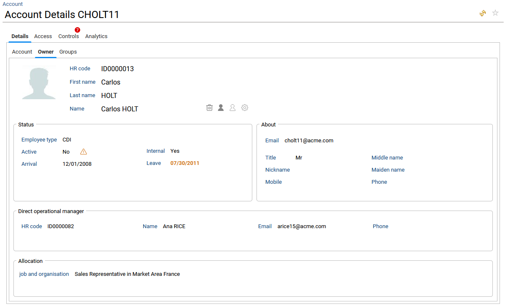

- in **Groups tab**, the list of groups available in the selected account is provided.  
The end-user can click on the Name of a group to open the related group detail window.  
Note that he can aslo choose to list, direct groups only, direct and indirect groups or the groups hierarchy by using the combobox on top of the table.

### Security Model tab

This is an optional tab, it presents the computed business activities as well as the theoretical access rights that the selected account is having. For instance, access granted through a ticketing system or an IAM system. Comparing these "theoretical" rights with the real ones in the target application will provide the overallocated rights. 

- in **Business Activities tab**, the list of Business Activities accessible by the selected account is provided. When controls defect such as SoD issues have been detected for a Business Activities, a orange icon is displayed in the first column by default. 
The end-user can click also on the name of the Business Activity to open the related Business Activity detail window.  
Note that this tab requires the Booster for ERP/SoD licence.

- in **Granted rights tab**, the end-user has access to the list of all the roles granted by the applications. 
He can click also on the name of the permission/role/profile code or name to open the related detail window.  
Note that this tab requires the Booster for IAM or ERP/SoD licence.    

- in **Overallocated rights**, the end-user has access to the list of permission/role/profile that are overallocated with regard to the theoretical rights uploaded in RadiantOne Identity Analytics.  
Note that this tab requires the Booster for IAM licence.  

### Access tab

This is an optional tab, it presents the "real" access rights as correlated from the various data sources (basically, the access rights that RadiantOne Identity Analytics found for the selected account on the loaded systems).  

- in **Applications tab**, the list of profiles/roles/permissions with the related application accessible by the selected account is listed.   
A combobox on top of the table allows to list all permission accessible by the selected account or to filter on the directly assigned, the directly assigned not through group or to display the permission hierarchy.  
Clicking on the Permission name in column "Name" opens the Permission detail window.

- in **Shares tab**, the list of folder path accessible by the selected account is provided with Share and rights (simplified ACLs) details. This tab is only available if the end-user has the appropriate licence (Booster for Data Governance/Unstructured Data).  
By default, only folders with direct ACLs are displayed, not the sub folders with inheritance. The end-user is able to uncheck "Display only folders with ACLs" to get the full list of folders.  
A Share family column is provided to list the type of unstructured data: SharedFolders (NTFS, CIFS), Microsoft365 (OneDrive, SharePointOnline, ExchangeOnline) and more.
In this tab, a filter is also provided through combobox to help the end-user select a specific share family and/or share and/or the folder depth requested.
Clicking on the Rights value in column "Rights" opens the rights definition window (the legend).  
Clicking on the Folder path name in column "Path" opens the Folder detail window, and allows to investigate on access rights (simplified ACLs) and related groups.  
To know more about ACLs, please reach the [ACLs definition](#acls-definitions) section.

- in **Usages tab** the list of activities is provided when some logs have been aggregated and consolidated in Identity Analytics as usages during the data collect phase.  

### Controls tab

It presents the list of all the control defects found for the selected account.  
Checking the box "Show selected control defect risks details" allow to display the Control and Risk descriptions and the Suggested mitigation on bottom of page.  
Clicking on the Control name leads to the Control detail window.  

### Analytics tab

It presents all the analytics available for the selected account. Analytics can be simple reports as well as more elaborated management interfaces. 
It will help to better understand the access of the selected account by providing a graphical representation of the groups (360° view of the account groups), of the permissions (360° view of the account permissions), and to follow-up the changes that occured in the past (Account timeline).

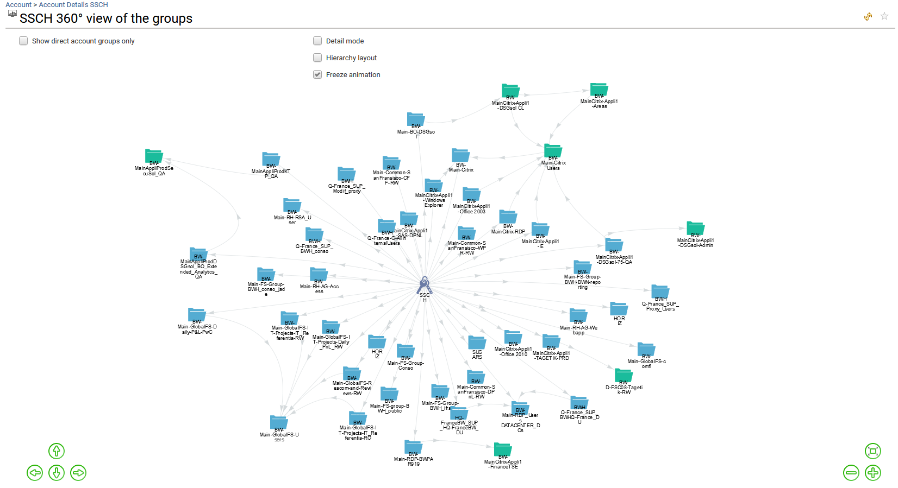

The full list of Analytics reports for any resources is available from the administration page and documented. Please go to section [Analytics reports](#how-to-list-all-the-available-analytics-reports-and-their-description) to know more.

### Decision history

This is an optional tab, it presents all the decision taken for this account such as access review decision or reconciliation and accounts update made through IAS/IAP.  
The end-user is able in top of this table to filter per status such as "ok", "update", "revoke", "not reviewed" and more thanks to a combobox.  

## Groups

The aim of the Group details page is to help the end-user identify and mitigate the risky situations within Groups. He will have an overview of the caracteristics of each group with the possibility to investigate with a risk based approach on groups, their members and owners, and the accesses they provide to application, infrastructure and data.  

In all the sub-tabs of the Group details page, as in any table in IAS/IAP, the end-user can configure and add new columns and KPIs by right clicking on the table and selecting "Configure". Please go to the [How to configure tables, columns and export data](#standard-tables) section to know more about table customization.   

### Details tab

This tab presents general information regarding the selected Group through four sub-tabs:  

- in **Group tab**, key KPIs, owner and hierarchy information about the selected group are provided.  
When the end-user is a **functional or technical administrator** (roles `functionaladmin`, `technicaladmin`), he can also add new managers for the selected group, delete them and access to the manager updates audit trail, by clicking on the three icons avalaible on the right side of the "Managers" section.   

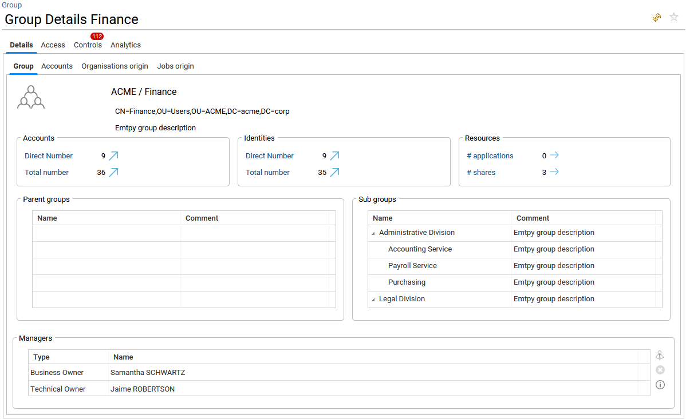

- in **Accounts tab**, the list of accounts available in the selected group is provided, with the related identity when the account is reconciled.  
The end-user can click on the Login or Username of an account to open the related account detail window.  
On top of the table, a combobox allows to display only direct accounts ("Accounts"), direct and indirect accounts ("All accounts"), and the hierachy of groups with the related accounts ("subgroups hierarchy") in a double table.  

  

- **organisations origin tab** gives a graphical overview of the distribution of identities members of this group throughout the company's organisations.

  

- **Jobs origin tab** gives a graphical overview of the distribution of identities members of this group throughout the jobs.  

### Access tab

This is an optional tab, it presents the "real" access rights as correlated from the various data sources (basically, the access rights that RadiantOne Identity Analytics found for the selected group on the loaded systems).  

- in **Applications tab**, the list of profiles/roles/permissions and accounts with the related application accessible by the selected group is listed.   
Clicking on the Permission name in column "Name" opens the Permission detail window.

- in **Shares tab**, the list of folder path accessible by the selected account is provided with Share and rights (simplified ACL) details. This tab is only available if the end-user has the appropriate licence (Booster for Data Governance/Unstructured Data).  
In this tab, a filter is also provided through combobox to help the end-user select the folder depth requested.  
Clicking on the Rights value in column "Rights" opens the rights definition window (the legend).  
Clicking on the Folder path name in column "Path" opens the Folder detail window, and allows to investigate on access rights (simplified ACL).  
To know more about ACLs, please reach the [ACLs definition](#acls-definitions) section.

- in **Usages tab** the list of activities is provided when some logs have been aggregated and consolidated in RadiantOne Identity Analytics as usages during the data collect phase.  

### Controls tab

It presents the list of all the control defects found for the accounts member of the selected group and the selected group itself.  
Checking the box "Show selected control defect risks details" allow to display the Control and Risk descriptions and the Suggested mitigation on bottom of page.  
Clicking on the Control name leads to the Control detail window.  

### Analytics tab

It presents all the analytics available for the selected group. Analytics can be simple reports as well as more elaborated management interfaces. 
It will help to better understand the hierarchy and the access granted by the selected group by providing a graphical representation of the groups ("360° view of the groups"), cross table analysis ("self-service analytics"), and to follow-up the changes that occured in the past ("Group timeline").

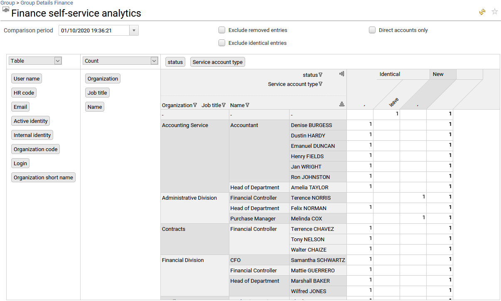

The full list of Analytics reports for any resources is available from the administration page and documented. Please go to section [Analytics reports](#how-to-list-all-the-available-analytics-reports-and-their-description) to know more.

### Decision history

This is an optional tab, it presents all the decision taken for this account such as access review decision or reconciliation and accounts update made through IAS/IAP.  
The end-user is able in top of this table to filter per status such as "ok", "update", "revoke", "not reviewed" and more thanks to a combobox.  

## Application

The aim of the Application details page is to help the end-user identify and mitigate the risky situations within Applications. He will have an overview of the caracteristics of each application with the possibility to investigate with a risk based approach on access rights and profiles/permissions with the related accounts and their owners.

In all the sub-tabs of the Application details page, as in any table in IAS/IAP, the end-user can configure and add new columns and KPIs by right clicking on the table and selecting "Configure". Please go to the [How to configure tables, columns and export data](#standard-tables) section to know more about table customization.  

### Details tab

This tab presents general information regarding the selected Application through three sub-tabs:  

- in **Application tab**, key KPIs and management information about the selected application are provided. Please refer to the [Computed KPIs](#computed-kpis) section of this document for more information about the computed indicators.  

When the end-user is a **functional or technical administrator** (roles `functionaladmin`, `technicaladmin`), he is able to update the Classification status and description of the application as presented in the copyscreen below by clicking on the pen icon upper right. This will be helpfull to prioritize the most risky applications during investigations and reviews. In addition, he can also add a new manager for the selected application, delete a manager and access to the manager updates audit trail, by clicking on the three icons avalaible on the right side of the "Managers" section. 

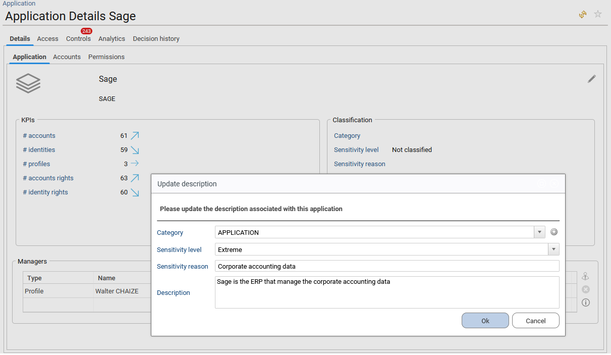

- in **Accounts tab**, the list of accounts available in the selected application is provided.  

The end-user is able to compare accounts regarding accesses at application, permission, group, share and folder levels. To do so, he needs to select two or more accounts in the list and click on the "compare" button. For more details on that, please reach the [how to compare identities, accounts, permissions or groups](#how-to-compare-identities-accounts-permissions-or-groups-with-each-others) section.  
The end-user can click also on the Login or Username of an account to open the related account detail window.  

- in **Permissions tab**, the Permissions giving access to the selected application are listed in a table. When controls defect such as SoD issues have been detected for a Permission/Role, a orange icon is displayed in the first column by default.  

On top of the table, a combobox allows to list either all permissions or only permissions of type profies/roles.
The end-user is also able to compare roles/permissions regarding account members. To do so, he needs to select two or more permissions in the list and click on the "compare" button. For more details on that, please reach the [how to compare identities, accounts, permissions or groups](#how-to-compare-identities-accounts-permissions-or-groups-with-each-others) section.  
Clicking on the Permission code or Permission name opens the permission detail window, clicking on the Application name lead to the application detail window.  

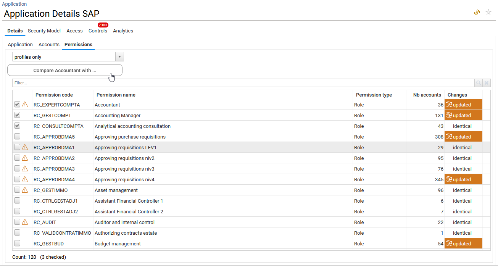

### Security Model tab  

This is an optional tab, it presents the computed business activities as well as the theoretical access rights that the selected Application is having. For instance, access granted through a ticketing system or an IAM system. Comparing these "theoretical" rights with the real ones in the target application will provide the overallocated rights.

- in **Business Activities tab**, the list of Business Activities accessible by the selected account is provided. When controls defect such as SoD issues have been detected for a Business Activities, a orange icon is displayed in the first column by default. The end-user can click also on the name of the Business Activity to open the related Business Activity detail window.  
Note that this tab requires the Booster for ERP/SoD licence.
- in **Granted rights tab**, the end-user has access to the list of all the roles granted by the selected application. He can click also on the name of the permission/role/profile code or name to open the related detail window. **Note** that this tab requires the Booster for IAM or ERP/SoD licence.
- in **Overallocated rights**, the end-user has access to the list of permission/role/profile that are overallocated with regard to the theoretical rights uploaded in RadiantOne Identity Analytics. He can click also on the Identity name or HR code to open the related detail window. **Note** that this tab requires the Booster for IAM licence. 

### Access tab

This is an optional tab, it presents the "real" access rights as correlated from the various data sources (basically, the access rights that RadiantOne Identity Analytics found for the selected application and the loaded identities, accounts and groups).  
- in **Access rights tab**, the list of accounts and identities with the permissions that give access to the selected application.  
Clicking on the Login or account User name opens the account detail window.
- **organisations origin tab** gives a graphical overview of the distribution of identities having access to this application throughout the company's organizations.  
- **Jobs origin tab** gives a graphical overview of the distribution of identities having access to this application throughout the jobs.
- in **Permission usage tab** gives a graphical overview of the distribution of user activities in the selected application throughout the permissions. This is provided when some logs have been aggregated and consolidated in RadiantOne Identity Analytics as usages during the data collect phase.  

- in **Usages tab** the list of activities is provided when some logs have been aggregated and consolidated in Identity Analytics as usages during the data collect phase.  

### Controls tab

It presents the list of all the control defects found for the selected Application with the related accounts and identities. 
Checking the box "Show selected control defect risks details" allow to display the Control and Risk descriptions and the Suggested mitigation on bottom of page.  
Clicking on the Control name leads to the Control detail window.

### Analytics tab

It presents all the analytics available for the selected application. Analytics can be simple reports as well as more elaborated management interfaces. 
It will help to better understand how the access have been granted to the selected application by providing a graphical representation of permissions attributions ("Permissions map"), cross table analysis ("access analysis" with peer groups analytics capabilities and "self-service analytics"), analyze the similar profiles/roles to rationalize them ("Similar profiles analytics") and to follow-up the changes that occured in the past ("Application timeline").

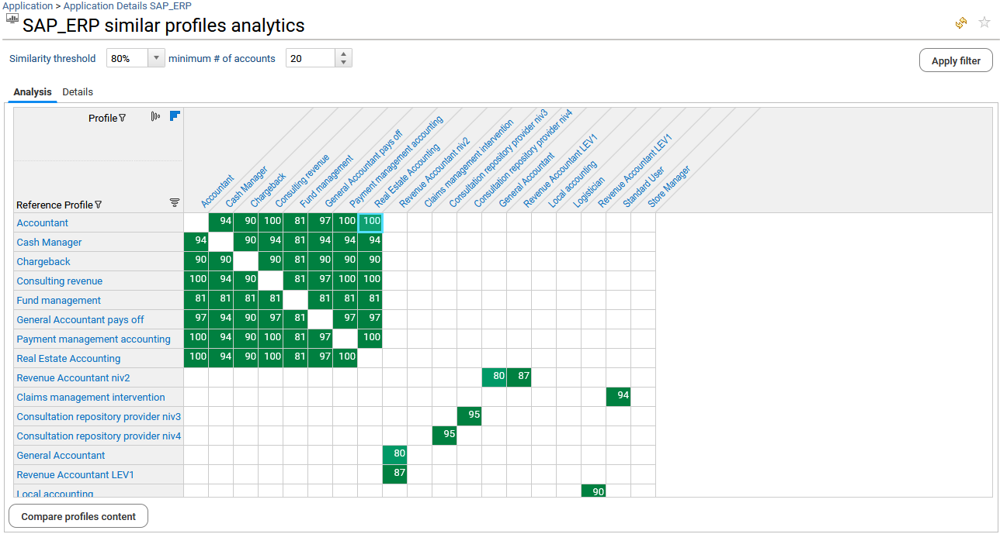

The full list of Analytics reports for any resources is available from the administration page and documented. Please go to section [Analytics reports](#how-to-list-all-the-available-analytics-reports-and-their-description) to know more.

### Decision history

This is an optional tab, it presents all the decision taken for this application such as access review decision and information updated through IAS/IAP (owners of the application, sensitivity level, description and more).  
The end-user is able in top of this table to filter per status such as "ok", "update", "revoke", "not reviewed" and more thanks to a combobox.  

## Permission

The aim of the Permission details page is to help the end-user identify and mitigate the risky situations within Permissions. He will have an overview of the caracteristics of each permission with the possibility to investigate with a risk based approach on access rights, sub permissions with the related accounts and their owners.

In all the sub-tabs of the Permission details page, as in any table in IAS/IAP, the end-user can configure and add new columns and KPIs by right clicking on the table and selecting "Configure". Please go to the [How to configure tables, columns and export data](#standard-tables) section to know more about table customization.   

### Details tab  
This tab presents general information regarding the selected Permission through two sub-tabs:  

- in **Permission tab**, key KPIs and management information about the selected permission are provided. Please refer to the [Computed KPIs](#computed-kpis) section of this document for more information about the computed indicators. When the end-user is a **functional or technical administrator** (roles `functionaladmin`, `technicaladmin`), he is able to update the Classification status and description of the permission as presented in the copyscreen below by clicking on the pen icon upper right. This will be helpfull to prioritize the most risky permissions during investigations, reviews and role mining. In addition, he can also add a new manager for the selected permission, delete a manager and access to the manager updates audit trail, by clicking on the three icons avalaible on the right side of the "Managers" section. 

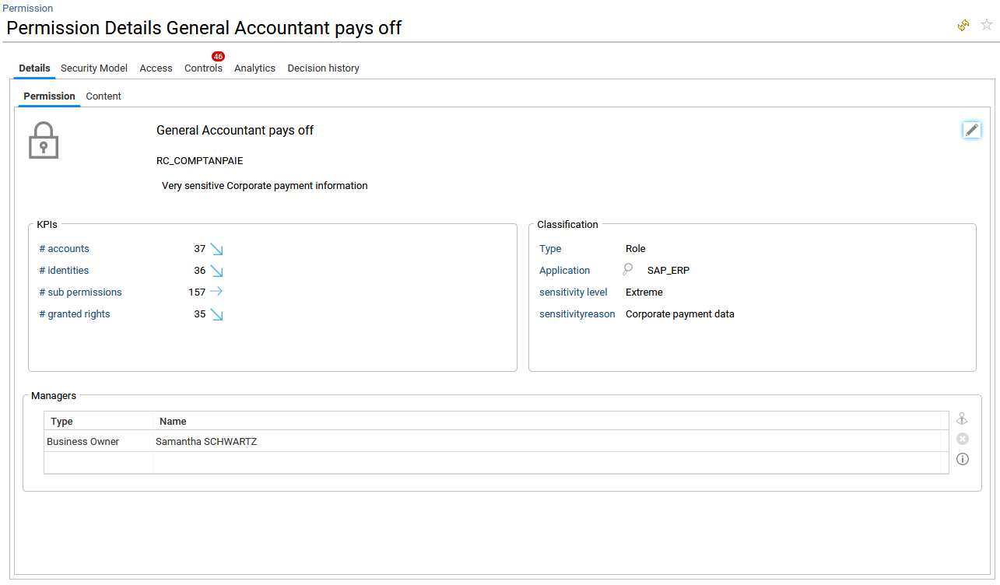

- in **Content**, the list of sub-permissions and fine-grained permissions is provided with a hierarchical display of information. Clicking on the sub-permission code or name will open the sub permission detail window.

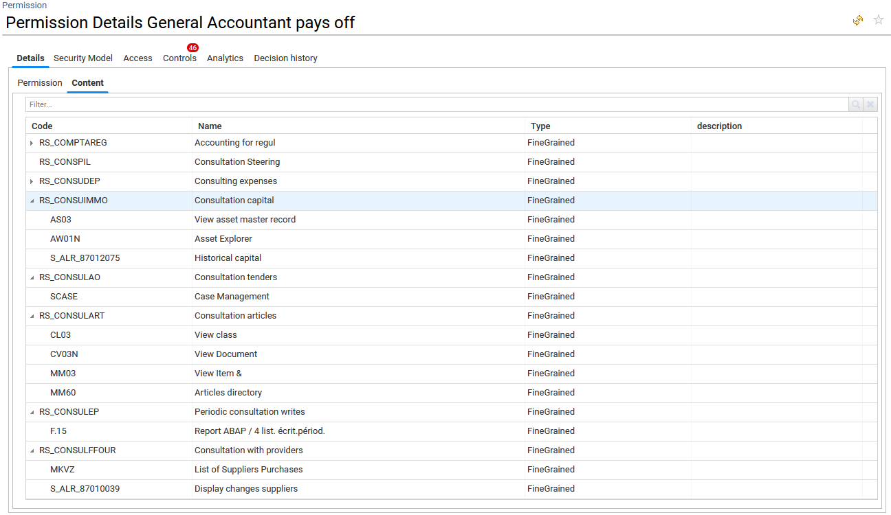

### Security Model tab  

This is an optional tab, it presents the theoretical access rights that the selected Permission is having. For instance, access granted through a ticketing system or an IAM system. Comparing these "theoretical" rights with the real ones in the target permission will provide the overallocated rights.

- in **Granted rights tab**, the end-user has access to the list of all the identities that **should** have access to the selected permission or role with regard to theoretical rights. He can click also on the name or HR code of the identity to open the related identity detail window. **Note** that this tab requires the Booster for IAM or ERP/SoD licence.  
- in **Overallocated rights**, the end-user has access to the list of identities who have overallocated rights with regard to the theoretical rights uploaded in RadiantOne Identity Analytics. 
Note that this tab requires the Booster for IAM licence. 
- in **Core model SoD problems**, the end-user has access to the list of SoD issues that are related to the selected permission/role. These are named as "Core model SoD issues" because it is the role itself that by definition provides access to incompatible activities. So that in this table, the end-user will find pairs of incompatible business activities with the related risk level. 

Clicking on the name of a business activity will open the Business Activity detail page and allow to investigate on its definition and why it is provided by the selected permission.  
Note that this tab requires the Booster for ERP/SoD licence.  

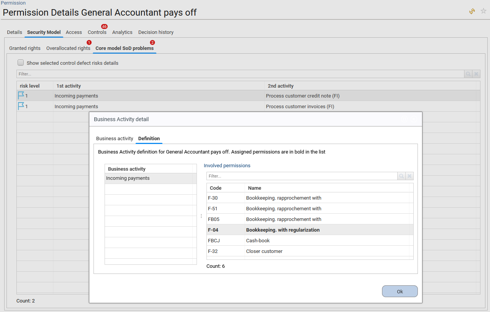

### Access tab

This is an optional tab, it presents the "real" access rights as correlated from the various data sources (basically, the access rights that RadiantOne Identity Analytics found for the selected permission and the loaded identities and accounts).  

- in **Accounts tab**, the list of accounts and identities that have access to the selected permission are provided. Clicking on the Login or account User name opens the account detail window.
- **organisations origin tab** gives a graphical overview of the distribution of identities having access to this permission throughout the company's organisations.
- **Jobs origin tab** gives a graphical overview of the distribution of identities having access to this permission throughout the jobs.

### Controls tab

It presents the list of all the control defects found for the selected Permission with the related accounts and identities.  
Checking the box "Show selected control defect risks details" allow to display the Control and Risk descriptions and the Suggested mitigation on bottom of page.  
Clicking on the Control name leads to the Control detail window.  

### Analytics tab

It presents all the analytics available for the selected permission. Analytics can be simple reports as well as more elaborated management interfaces. 
It will help to better understand the hierarchy and the access granted by the selected permission by providing a graphical representation of the sub-permissions ("360° view of the sub-permissions"), cross table analysis ("self-service analytics"), and to follow-up the changes that occured in the past ("Permission timeline").

The full list of Analytics reports for any resources is available from the administration page and documented. Please go to section [Analytics reports](#how-to-list-all-the-available-analytics-reports-and-their-description) to know more.

### Decision history

This is an optional tab, it presents all the decision taken for this permission such as access review decision and information updated through IAS/IAP (owners of the permission, sensitivity level, description and more).  
The end-user is able in top of this table to filter per status such as "ok", "update", "revoke", "not reviewed" and more thanks to a combobox.  

## Share

Share details page is only available if the end-user has the appropriate licence (Booster for Data Governance/Unstructured Data).
The aim of the Share details page is to help the end-user identify and mitigate the risky situations within Shares. He will have an overview of the caracteristics of each share with the possibility to investigate with a risk based approach on access rights and groups with the related accounts and their owners.  

In all the sub-tabs of the Share details page, as in any table in IAS/IAP, the end-user can configure and add new columns and KPIs by right clicking on the table and selecting "Configure". Please go to the [How to configure tables, columns and export data](#standard-tables) section to know more about table customization.   

### Details tab

This tab presents general information regarding the selected Share through three sub-tabs:  

- in **Share tab**, key KPIs and management information about the selected share are provided. Please refer to the [Computed KPIs](#computed-kpis) section of this document for more information about the computed indicators.  
When the end-user is a **functional or technical administrator** (roles `functionaladmin`, `technicaladmin`), he is able to update the Classification status and description of the share as presented in the copyscreen below by clicking on the pen icon upper right. This will be helpfull to prioritize the most risky share during investigations and reviews. In addition, he can also add new managers for the selected share, delete managers and access to the manager updates audit trail, by clicking on the three icons avalaible on the right side of the "Managers" section. 

  

- in **Accounts tab**, the list of accounts and when available the reconciled identities with access to the selected share is provided.  
The end-user is able to compare accounts regarding accesses at folder levels. To do so, he needs to select two or more accounts in the list and click on the "compare" button. For more details on that, please reach the [how to compare identities, accounts, permissions or groups](#how-to-compare-identities-accounts-permissions-or-groups-with-each-others) section.  
The end-user can click also on the Login or Username of an account to open the related account detail window.  

- in **Folders tab**, the Folders available in the selected Share are listed in a table.  
On top of the table, a combobox allows to list either the list of all folders or the hierarchy of folders.
The end-user is also able to compare when listing all folders the accounts and their related access rights. To do so, he needs to select two or more folders in the list and click on the "compare" button. For more details on that, please reach the [how to compare identities, accounts, permissions or groups](#how-to-compare-identities-accounts-permissions-or-groups-with-each-others) section.  
Clicking on the Folder path or name opens the Folder detail window.  

  

### Access tab

This is an optional tab, it presents the "real" access rights as correlated from the various data sources (basically, the access rights that RadiantOne Identity Analytics found for the selected share and the loaded identities, accounts and groups).  

- in **Access rights tab**, the list of folders in the selected share is provided with the accounts, identities and their access rights (simplified ACLs) details.  
By default, only folders with direct ACLs are displayed, not the sub folders with inheritance. The end-user is able to uncheck "Display only folders with ACLs" to get the full list of folders.  
In this tab, a filter is also provided through combobox to help the end-user select a specific folder depth.
Clicking on the Login or account User name opens the account detail window.  
Clicking on the Rights value in column "Rights" opens the rights definition window (the legend).  
To know more about ACLs, please reach the [ACLs definition](#acls-definitions) section.

- **organisations origin tab** gives a graphical overview of the distribution of identities having access to the content of this share throughout the company's organizations. 
- **Jobs origin tab** gives a graphical overview of the distribution of identities having access to the content of this share throughout the jobs. 
- in **Usages tab** the list of activities is provided when some logs have been aggregated and consolidated in RadiantOne Identity Analytics as usages during the data collect phase. 

### Controls tab

It presents the list of all the control defects found for the selected Share with the related accounts and identities.  
Checking the box "Show selected control defect risks details" allow to display the Control and Risk descriptions and the Suggested mitigation on bottom of page.  
Clicking on the Control name leads to the Control detail window.  

### Analytics tab

It presents all the analytics available for the selected organisation. Analytics can be simple reports as well as more elaborated management interfaces.  
It will help to better understand how the access have been granted to the selected share by providing for instance cross table analysis ("access analysis" with peer groups analytics capabilities and "self-service analytics").

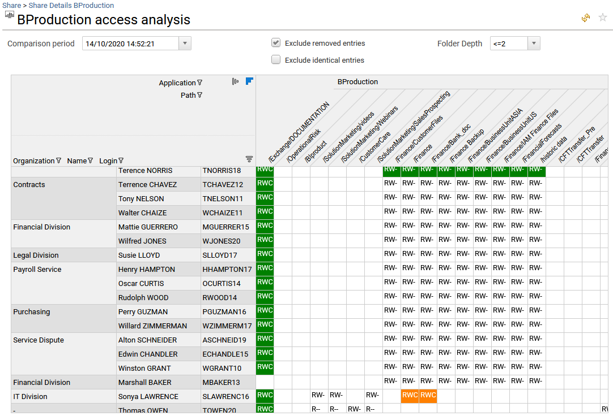

The full list of Analytics reports for any resources is available from the administration page and documented. Please go to section [Analytics reports](#how-to-list-all-the-available-analytics-reports-and-their-description) to know more.  

### Decision history

This is an optional tab, it presents all the decision taken for this Share such as access review decision and information updated through IAS/IAP (owners of the share, sensitivity level, description and more).  
The end-user is able in top of this table to filter per status such as "ok", "update", "revoke", "not reviewed" and more thanks to a combobox.  

## Folder

Folder details page is only available if the end-user has the appropriate licence (Booster for Data Governance/Unstructured Data).  
The aim of the Folder details page is to help the end-user identify and mitigate the risky situations within Shared folders. He will have an overview of the caracteristics of each folder with the possibility to investigate with a risk based approach on access rights and groups with the related accounts and their owners.  

In all the sub-tabs of the Folder details page, as in any table in IAP, the end-user can configure and add new columns and KPIs by right clicking on the table and selecting "Configure". Please go to the [How to configure tables, columns and export data](#standard-tables) section to know more about table customization. 

### Details tab

This tab presents general information regarding the selected Folder through two sub-tabs:  

- in **Folder tab**, key KPIs and management information about the selected folder are provided. Please refer to the [Computed KPIs](#computed-kpis) section of this document for more information about the computed indicators.  
When the end-user is a **functional or technical administrator** (roles `functionaladmin`, `technicaladmin`), he is able to update the Classification status and description of the share as presented in the copyscreen below by clicking on the pen icon upper right. This will be helpfull to prioritize the most risky share during investigations and reviews.  
In addition, he can also add new managers for the selected share, delete managers and access to the manager updates audit trail, by clicking on the three icons avalaible on the right side of the "Managers" section. 
Clicking on the magnifier icon, next to the Share name in the "Details & Classification" section will open the Share detail window.  

  

- in **ACLs** tab, the list of ACLs set at a group level or set at an account level are provided. This allows the end-user to understand how access rights are granted through the hierarchy of groups and also if he faces quality issues due to access granted directly at an account level.

In the "ACLs at a group level" section, clicking on the ACL line in the first table will display the related groups hierarchy in the "Selected ACL group details" section. In this same section, selecting a group will provide on the right the list of group members (accounts with the owner when the account is reconciled with an identity). Clicking on the account login will open the Account detail window.

 

In the "ACLs at an account level" section, clicking on the second magnifier icon on the right side of the table will open the Account detail window.

In the two sections, clicking on the first magnifier icon on the right side of the table will provide the definition of ACLs displayed in the table.  
The end-user can switch from basic to advanced ACL by checking the "Show Advanced Permissions" box on the bottom of the table. Then clicking on the first magnifier will provide the definition of the advanced ACLs as well. To know more about ACLs, please reach the [ACLs definition](#acls-definitions) section.

### Access tab

This is an optional tab, it presents the "real" access rights as correlated from the various data sources (basically, the access rights that RadiantOne Identity Analytics found for the selected folder and the loaded identities, accounts and groups).  

- in **Accounts tab**, the list of accounts with access to the selected folder is provided with reconciled identities and access rights (simplified ACL) details.  
Clicking on the Login or account User name opens the account detail window.  
Clicking on the Rights value in column "Rights" opens the rights definition window (the legend).  
To know more about ACLs, please reach the [ACLs definition](#acls-definitions) section.  

- **organisations origin tab** gives a graphical overview of the distribution of identities having access to the selected folder throughout the company's organisations.  
- **Jobs origin tab** gives a graphical overview of the distribution of identities having access to the selected folder throughout the jobs.
- in **Usages tab** the list of activities is provided when some logs have been aggregated and consolidated in RadiantOne Identity Analytics as usages during the data collect phase.  

### Controls tab

It presents the list of all the control defects found for the selected Folder with the related accounts and identities.  
Checking the box "Show selected control defect risks details" allow to display the Control and Risk descriptions and the Suggested mitigation on bottom of page.  
Clicking on the Control name leads to the Control detail window.  

### Analytics tab

It presents all the analytics available for the selected organisation. Analytics can be simple reports as well as more elaborated management interfaces.  
It will help to better understand how the access have been granted to the selected folder by providing for instance cross table analysis ("self-service analytics").  

The full list of Analytics reports for any resources is available from the administration page and documented. Please go to section [Analytics reports](#how-to-list-all-the-available-analytics-reports-and-their-description) to know more.  

### Decision history

This is an optional tab, it presents all the decision taken for this Folder such as access review decision and information updated through IAS/IAP (owners of the folder, sensitivity level, description and more).  
The end-user is able in top of this table to filter per status such as "ok", "update", "revoke", "not reviewed" and more thanks to a combobox.  
