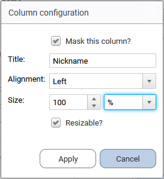
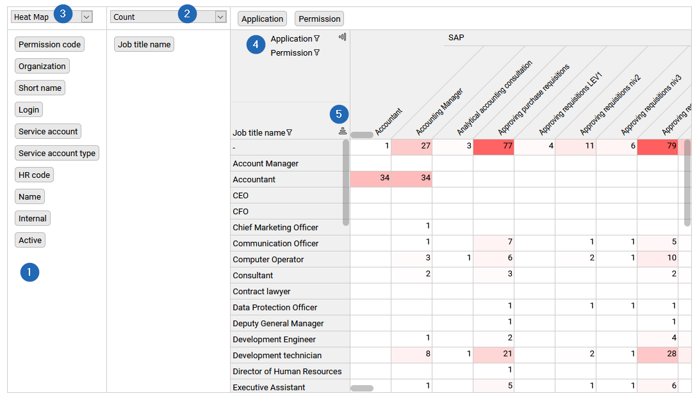
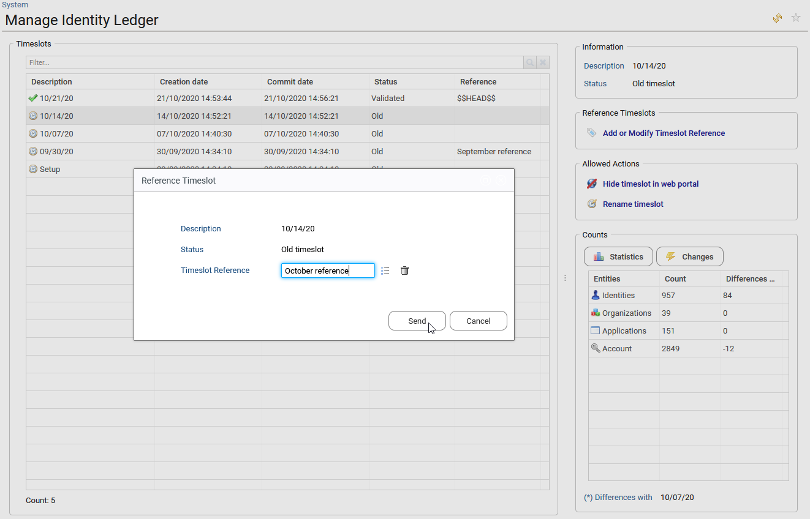
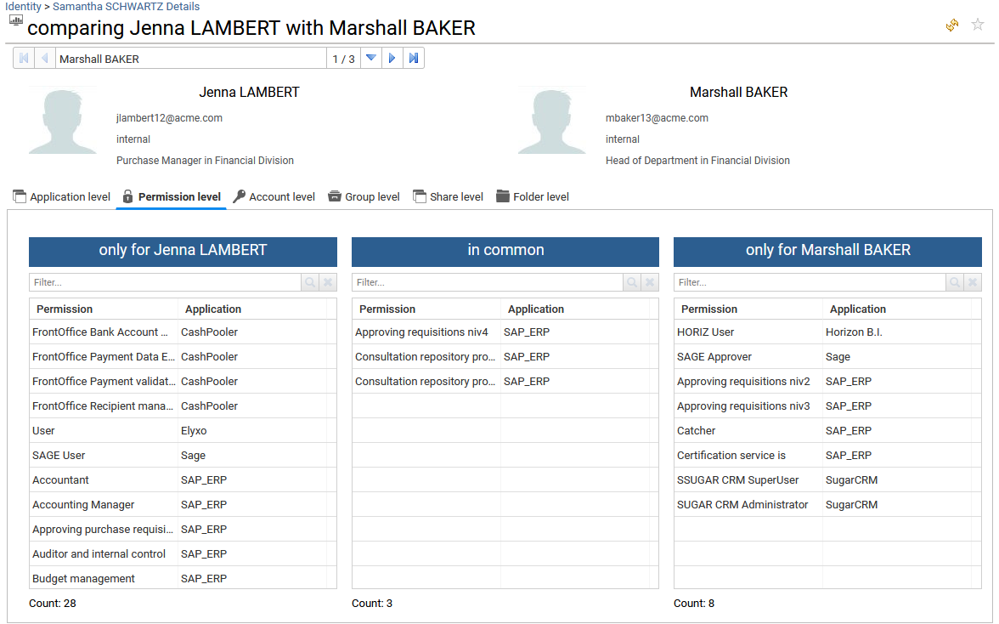
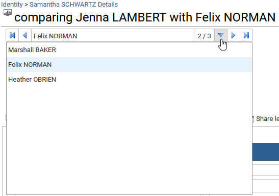

# How to configure tables, columns and export data

## standard tables
A right click on the Identity Analytics tables allows to export data and configure it.  

{ width=100% }  

By selecting "Export displayed columns to CSV" or "Export displayed columns to Excel format", the end-user can export the information present in the table only to a csv or Excel file, the hidden columns will be ignored.  

By selecting "Export all columns to CSV" or "Export all columns to Excel format", he will export all the information, hidden or not to a csv or Excel file.  

By selecting "Reset configuration", the end-user can restore the default columns.  
By selecting "configure", he can show/hide new columns, resize them and change their headers. 

When selecting this last option, he can hide or display by clicking on the "eye" icon on the left of the column header. The "Up" and "Down" buttons available on the right will allow to reorder the columns.   

{ width=40% }  

And finally the "Edit..." button allows to customize the selected column: 
- Mask the column,  
- Change the header,  
- Manage alignment of the column content,  
- Set the column size in % or px, 
- Unable the possibility to resize the column.

{ width=30% }

## cross tables
A cross table is a two-way table that displays aggregated information in rows and columns (also known as Dimensions). Its main purpose is to vizualize the relationship between rows and columns and to display large datasets in a condensed format. Cross table is generaly used in Analytics reports.  
Two types of cross-tables are provided by default, the standard one and the self-service one. A right click on the table content allows to extract the table with all the data. What is interesting here is that panes are freezed in Excel too, so that you can easily work and communicate.  

- in standard cross tables: 
The end-user can select a cell (**1**) and take actions accordingly (such as displaying a message, updating a detail panel or jumping to a different page ) when this is relevant. This option is used especialy in SoD analytics reports.

The end-user can filter rows and columns header values by clicking on the header of each column and row (**2**) and apply a filter on the available data.  

He can also sort row and column header values by clicking on the related icon (**3**). 

An option allows cluster sorting of crosstable cells using an **advanced classification algorithm**. This will help the end-user to work on peer group. To activate it, he needs to click on the icon (**4**) on the upper left.  

{ width=100% }

- self-service cross tables:  
With this kind of cross table, the end-user can create and organisae the information as he likes. He can drag and drop the available dimensions (**1**) to rows or columns to dynamically build a crosstable to fit his needs.  

He can also select the measure to use among the list of available measures (**2**), and the aggregation function to use ( eg. count, sum, maximum, average, etc…).  

The end-user can also select to display the aggregated data as figures, bar chart or heatmaps (**3**).  

As in a standard cross table, he can filter the different dimensions to display only a subset of the crosstable by clicking on the header of each column and row (**4**) and also sort row and column header values by clicking on the related icon (**5**).  

{ width=100% }

# How to configure the Comparison timeslot  

The end-user is able to define a comparison timeslots that will be used to evaluate all the changes between the curent set of data (timeslot) and an older one which is the reference timeslot. By default the comparison timeslot is the previous set of data.  

All these evaluations are computed during the data upload (the execution plan), so that if the end-user changes the reference timeslot, it will be taken into account for all the next data upload. If a timeslot in the history is added as a reference timeslot, it has no impact on the already loaded data of the existing timeslots.  

To modify the reference timeslot, the end-user needs to reach the "Identity Ledger Manager" available in the administration page: using the menu bar, go to Settings > System, then click on the button "Manage Identity Ledger". 

Note that this requires the **technical admin role** (role `technicaladmin`).  

By default, the current timeslot is always the reference timeslot (of type "&#36;&#36;HEAD&#36;&#36;") but this situation is temporary because it will be replaced by the next current timeslot the next time data is loaded.
If the user wants to keep it as a reference timeslot, he has to rename the reference "&#36;&#36;HEAD&#36;&#36;" with a new value.
In this case, and if several reference timeslots have been renamed, it will always be the last renamed reference timeslot that will be used as comparison timeslot for future data loadings.   

{ width=100% }

# How to compare identities, accounts, permissions or groups with each others  

In most of the tables available in the Detail pages, the end-user is able to compare resources one with each others:  

In the "Team" tab of organisation and Identity (when the identity is a manager) details pages, the end-user can **compare a selected identity** with others in the list.  
In the "Accounts" sub-tab of Repository, Application and Share details page, he can **compare a selected account** with others in the list.  
In the "Groups" tab of Repository details page, he can **compare a selected group** with others in the list.  
In the "Permissions" tab of Application details page, he can **compare a selected permission** with others in the list. 
In the "Folders" sub-tab of Share details page,  he can **compare a selected folder** with others in the list.

The first identity, group, permission or account selected in the list will be the one that will be compared with all the other selections.

{ width=100% }

For identities and accounts, the comparison is provided on each type of resources with regard to the comparison timeslot (see the previous section for more details) at Application, Permission, Group, Share and Folder level. These last two levels naturally require the Booster for Data Governance/Unstructured Data license.
When working on Identities, Accounts repositories are also compared.  

For Groups comparison, the comparison is provided only on group members (accounts).
For Permissions comparison, the comparison is provided only on accounts having access.

Once in the comparison dashboard, to compare the selected identity, account or group with another one of the selected list, the end-user can use the widget available on top of the page.  

{ width=50% }

# How to list all the available Analytics reports and their description

Analytics can be simple reports as well as more elaborated management interfaces.  
The full list of Analytics reports for any resources is available from the administration page: using the menu bar, go to Settings > System, then click on the button "Available analytics" to get the full list.  
The end-user is able to get more details by clicking on the report name or adding more columns by right clicking and selecting "configure".   
Note that this requires the **technical admin role** (role `technicaladmin`).  

{ width=100% }

# Advanced Feature: How to list all the available controls, their description and manage their execution  

IAS/IAP come with hundreds of controls which are available through the different interfaces and used to compute Risk KPIs.  
The full list of these controls is available from the administration page: using the menu bar, go to Settings > System, then click on the button "Available analytics" to get the full list.  
This list is built by scanning the controls available in your project, so all controls must be part of the RadiantOne Identity Analytics project to be seen and tto execute them.  

By using the buttons available on the right side of the table you can :
- display the selected control details,
- re-execute the selected control on the current timeslot,
- execute controls that are not included in the execution plan (data loading process) on the current timeslot,

This is very usefull when you set new account owners using IAS/IAP (work on reconciliation), new technical accounts, work on sensitivity status or entities ownership. Using this interface, you can recompute the related controls after having changed these attributes or improved the reconciliation status.

Some control are displayed in italic, that means the corresponding control file cannot be found in the project or the end-user can not execute them because there are generated automatically during the data load. This is especially the case for SoD controls because there are automatically created from an SoD matrix.

{ width=100% }

All the controls executed during data loading are used to compute the Risk rank and risk score.
