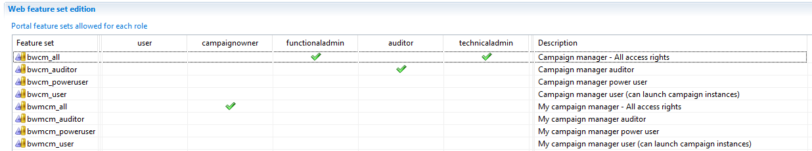

# Web portal roles

Configuration authentication and authorization is beyond the scope of this documentation. If you want to understand the RadiantOne Identity Analytics security model or if you want to configure authentication/authorization against Active Directory or through SAML, you should consult the following documentations

[Installation and deployment](https://documentation.brainwavegrc.com/Ader/docs/igrc-platform/installation-and-deployment/brainwave-webportal/)

[Web-portal HOW-TO](https://documentation.brainwavegrc.com/Ader/docs/how-to/web-portal/)

Several roles are available to restrict the end-users capabilities in IAP.
Those roles are sumarized here:

## user

Basic role that a user **MUST** have in order to be able to access to IAP, this role grant access to Access360 (basically, who am I, my task list, and what can I access to)

## functionaladmin

The functional administrator role is given on top of the user role in order to grant access to the whole Identity Ledger. Once granted this role, a user can access to all information through the search views, he can also browse the controls as well as some of the configuration interfaces (such as audit logs). Functional administrators have also access to the Campaign Manager in order to configure and manage new campaigns. Finally, Functional Administrators can update both classification & ownerships.

## auditor

The auditor role is given on top of the user role in order to grant access to the whole Identity Ledger. Once granted this role, a user can access to all information through the search views, he can also browse the controls as well as some of the configuration interfaces (such as audit logs). Business administrators have also access to the Campaign Manager. 

All access are granted in read-only mode.

## technicaladmin

The technical administrator role is given on top of the user role. The technical administrator role includes all the capabitilies of the business administrator role + technical administration capabilities such as Identity Ledger management (activate or hide timeslots).  

## Dynamic roles & management informations

 For your information, some dynamic roles are computed in RadiantOne Identity Analytics based on the Identity Ledger information, you do not need to manually asign those roles to the users:

- **campaignowner** the campaign owner role is given on top of the user role. This role is dynamically computed based on information present in the Identity Ledger: In order to have this role, the user must be asigned as an owner of at least one campaign. Once the role granted, the user has access to a restricted version of the campaign manager in order to launch & manage its own campaigns.

As you can see, there are no roles identifying the characteristics of the users such as line manager, organisation manager, ressource owner, ... this is because those ypes of information are dynamically computed based on the inforamtion in the Identity Ledger. It means that even though a user is only granted a **user** role, he can still access to more information than himself if he is considered as a manager.

As a general principle however, when a user only has the **user** role he won't be able to access any other information than their managed resources (enforcing the concept of least privilege). 

Please take this in consideration if you configure custom/add-hoc reports for the users.
