# IAP UX principles

## Administrator

### Search page

Administrator can browse the whole Identity Ledger, thus they have access to the search pages.

### Detail page

All detail pages follow the same navigation logic

The detail pages present a 360° view of the selected entity, information is available through a series of tabs. IAP dynamically pre-computes the tab content and automatically hides most tabs if they are empty or not relevant in the context. This greatly simplifies browsing but can be a little confusing at first.

As a general rule is to consider that if a tab is not present it is because its content is empty.

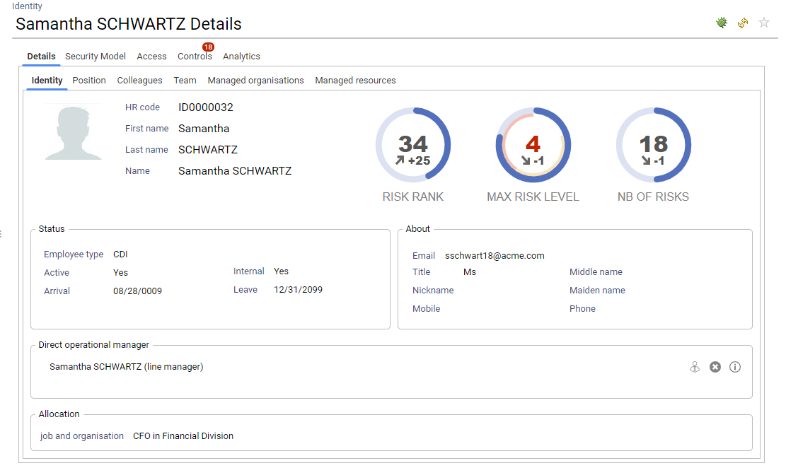

The first tab presents general information regarding the selected entity. In this example, information related to Samantha SCHWARTZ: Who is she, where is she working, her management responsibilites, ...


The second tab is optional, it presents the theoretical access rights of the entity. For instance, access granted through a ticketing system or an IAM system, as well as computed business activities. 

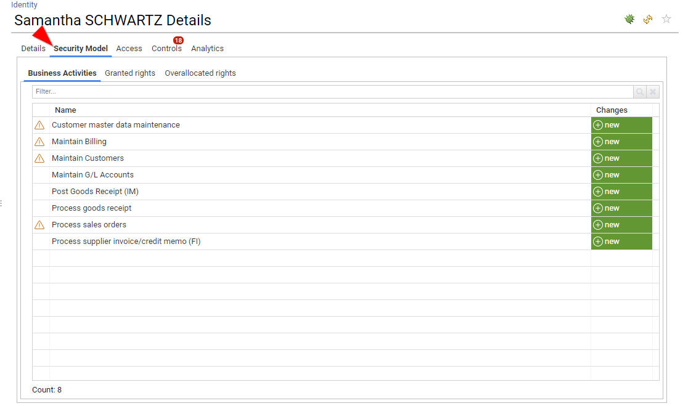

The third tab is optional, it presents the "real" access rights as correlated from the various data sources (basically, the access rights that RadiantOne Identity Analytics found for this entity on the loaded systems)

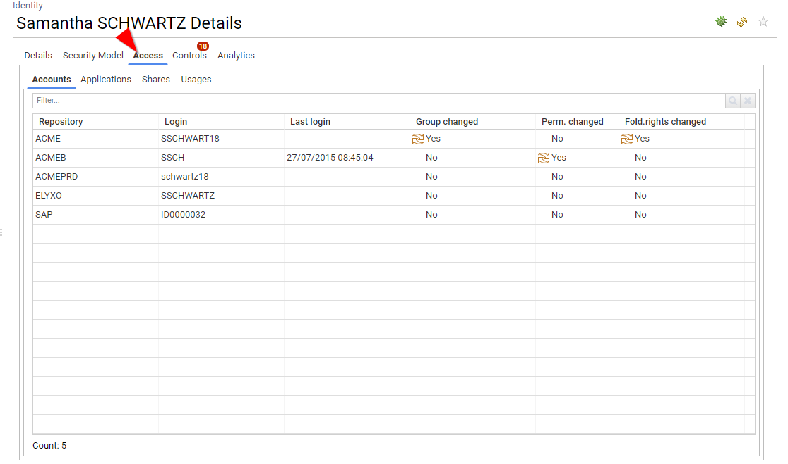

The fourth tab presents the list of all the control defects found for this entity


The fifth tab presents all the analytics available for this entity. Analytics can be simple reports as well as more elaborated management interfaces 

In case of an identity detail, the analytics tab also contains **ALL** the analytics that the corresponding identity can access through IAP, thus facilitating level 1 support.

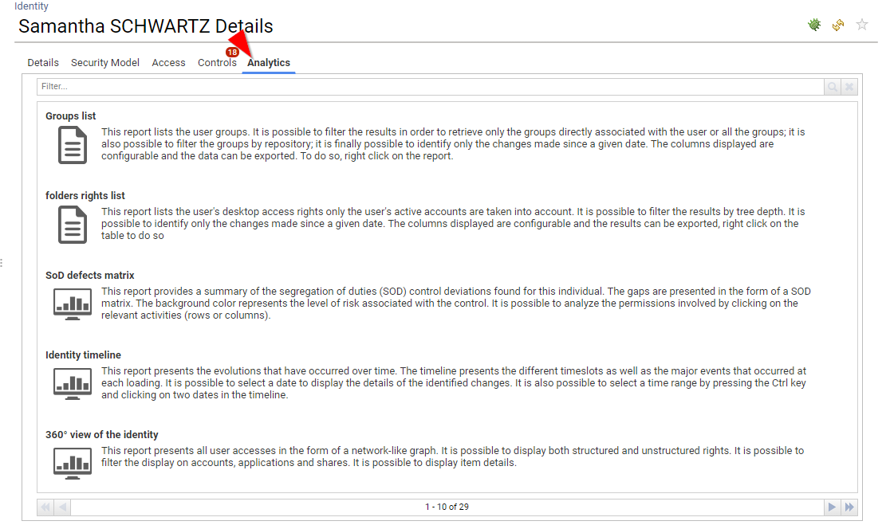

The last tab is optional, it presents all the decision taken for this entity such as access review decision or entity update made through IAP (account reconciliation, classification update, management information update, ...)

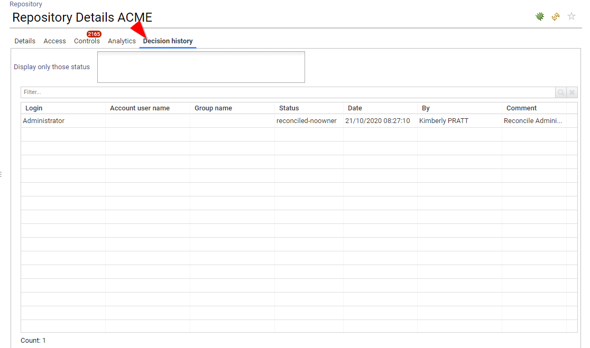

IAP enforce the "security by design" principle, as a result, you cannot drill down a detail page. If context information is needed, it will be presented as a dialog box. Dialog boxes can be nested if needed.

Contextual information is available through hyperlinks located in the widgets (Table, Pivot table, Buttons, ...)


Please note that most of the components (Table and Pivot Table) are configurable. You can configure the dispay of the desired columns as well as their order. 

You can also export the table/pivot table content in Excel format. Right click on the widget in order to do so.


## End user

End users can only access to their own information, basically: themselves, the resources that they manage (as a line manager or a resource owner), and the associated analytics and reports.

As a result, end users **DO NOT** have access to search pages. Drill-down is only available through the main interface in order to enforce the **least privilege** principle.

End user access their data through 'Access360'. By default, the left menu is empty (although it can contains more entries if mashup dashboards are configured or if the end user is an access certification campaign owner)


Tabs are dynamic, they are automatically displayed or hidden based on the user situation in the identity ledger:

- has pending tasks
- is a line manager
- is a resource owner
- user can access to unstructured data
- available reports
- available analytics

Analytics reports are dynamic, they are displayed based on the user situation in the identity ledger (line manager / resource manager)

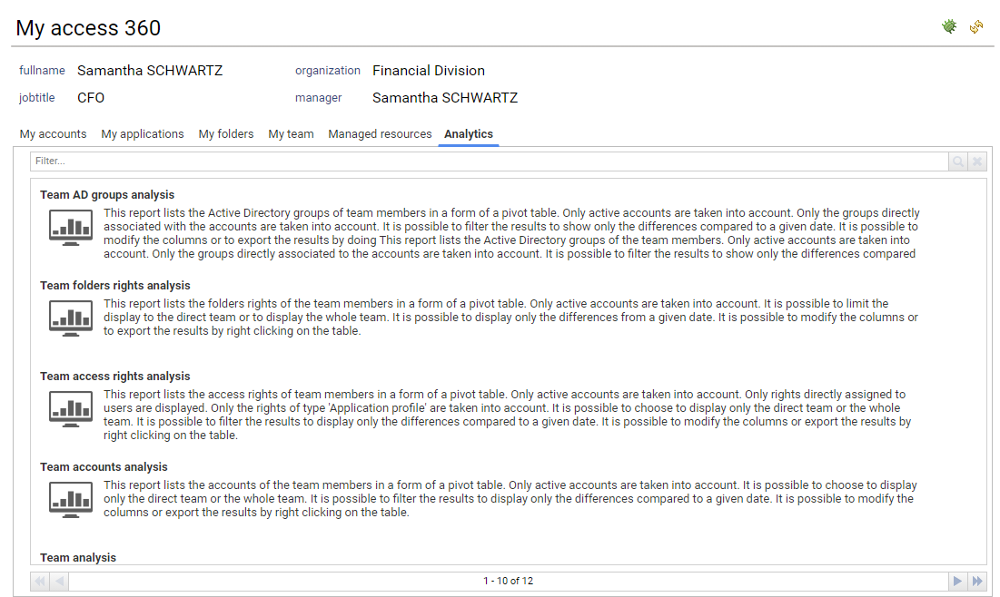

If the current user is a line manager or an organisation manager he has then access to his team details through the 'My Team' tab


Through this tab, the end user can compare users characteristics such as accounts, access rights, ...

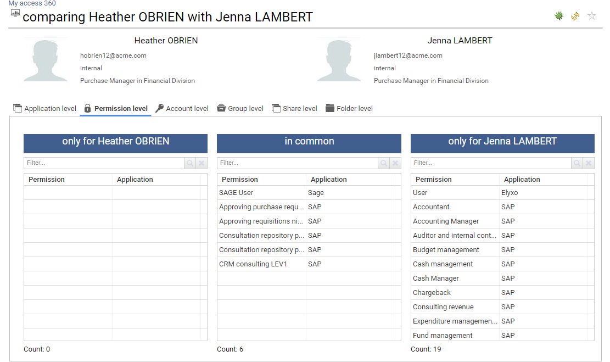

The current user can also access to identity details by clicking on the corresponding name. The identity detail pages is then displayed. In order to enforce the **least privilege** principle, the current user won't be able to crawl further though. All further details will be displayed as dialog boxes.

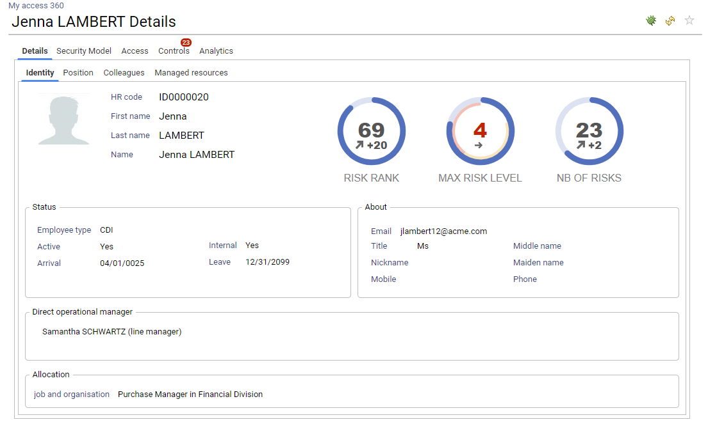

If the current user is a resource owner, he can then access the list of his managed resources  either as a `business owner` or a `technical owner`.


The current user can also access to the resource details by clicking on the corresponding name. The corresponding resource detail pages is then displayed. In order to enforce the **least privilege** principle, the current user won't be able to crawl further though. All further details will be displayed as dialog boxes.

Most analytics are presented in the same way: a search ribbon and a result section. Although all date-to-date comparisons are performed against the comparison timeslot, it is possible to select another timeslot in the analytics pages through the ribbon.

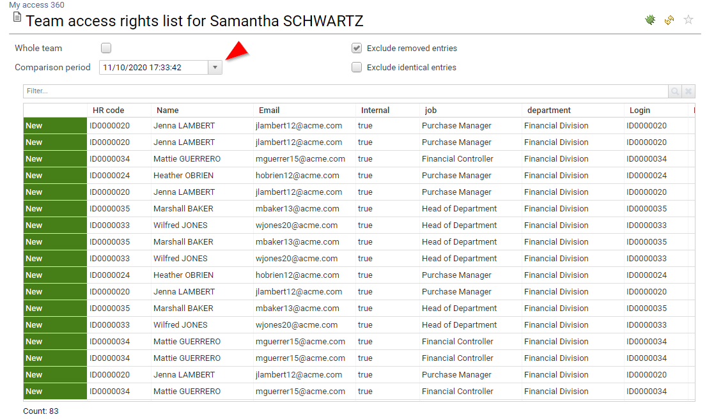

## UI Content Principles

### Only active accounts are displayed or leveraged in the UIs

The only way to access to disabled accounts is through repository details &rarr; accounts &rarr; 'Hide disabled accounts' option

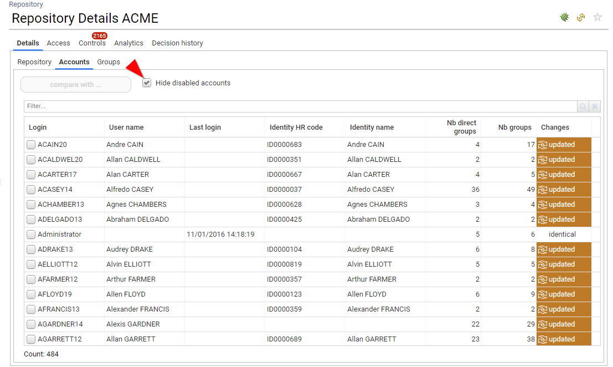

### Most empty tabs are hidden

In order to facilitate the navigation logic


### Only active identities are displayed UNLESS access rights are presented as well

If you want to list all the loaded identities you have to access to organisation detail &rarr; Team &rarr; 'Include inactive'


In the case of displaying access rights, all loaded identities are presented regardless of their status if they still have an active account 

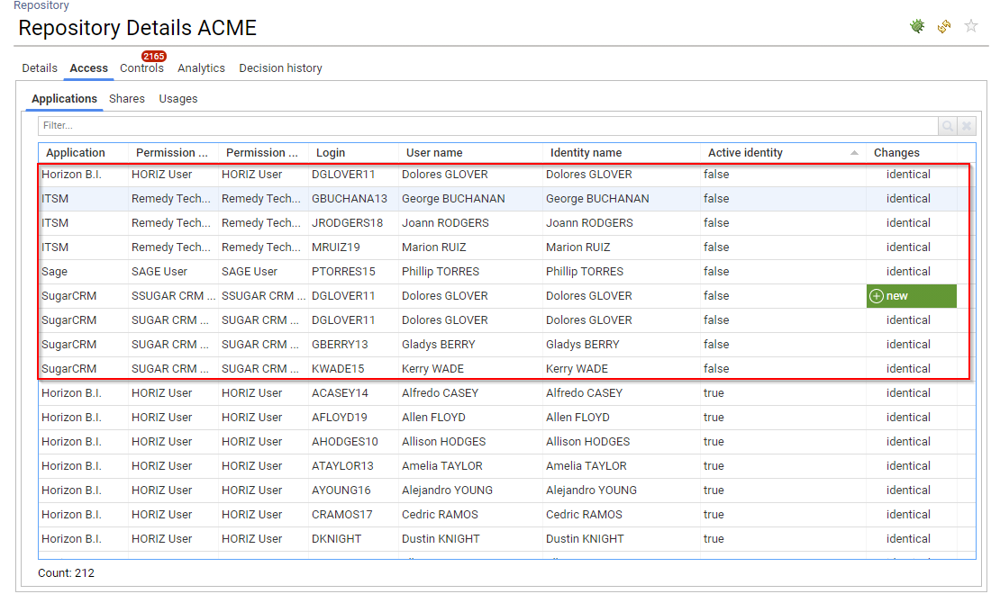

### Direct associations are privileged as they correspond to admin actions

We consider that whenever we display a list of assigned groups or assigned permissions it is more relevant to display the direct association as it is actionable: it corresponds to an admin action (revoke group, revoke right, ...)

You can still access sub-groups, sub-permissions in most interfaces, either through a combobox to select the kind of info that you want or by clicking on the hyperlink on the table / pivot table.


### For accounts/groups and accounts/perms analysis, alternative views are provided

Because, depending on the context, you do not always want the same depth of information displayed, most accounts/groups and accounts/perms panels include a combobox in order to select the prefered way of displaying the information

- Direct assignments only
- All assignments (including sub-groups, sub-permissions)
- Assignment hierarchy


### Useful analytics are directly integrated in the UI

For instance, account, group and permission comparison is no longer delivered as a dedicated add-on but is directly integrated in the detail pages to enforce the "3 clics away" manifesto principle

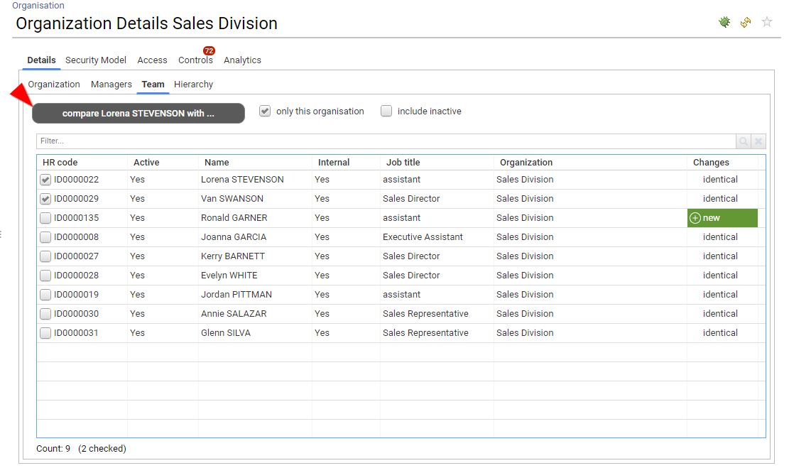

### Boosters are pre-integrated in the UI

Boosters are pre-integrated in the UI in order to facilitate the user experience.
The following boosters are pre-integrated:

- Data Governance Booster: 
UIs related to data access governance
- IAM Booster: 
UIs related to theoretical and granted rights analysis as well as overallocated rights
- ERP Booster: 
UIs related to SoD checks as well as business activities

Regardless of the data being loaded in the Identity Ledger, booster related information will be hidden if the license key does not include the booster.

Whatever the license status, you can hide Booster capabilities if needed through the "features". It can be useful if, for instance, you will only load unstructured data at a later project step.
In order to do so, you can edit the following featureset: `/webportal/features/licenses.featuresets`

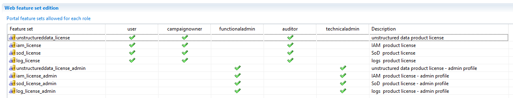

### Date to date comparison

Data to date comparison is performed whenever possible. Comparison is done with the previous timeslot OR the latest reference timeslot (if configured). Comparison takes the form of an additional column indicating whether this entry has not changed this the comparison date, if this is a new entry, if the entry has been updated.


You can also display removed entries if needed, although this functionality is disabled by default to avoid any confusion. In order to activate 'removed entries', you have to edit your user preferences by clicking on your name &rarr; Preferences.

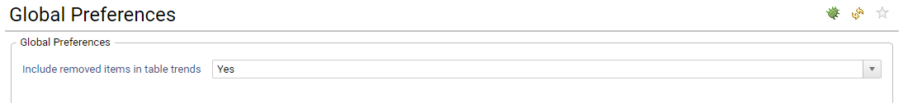

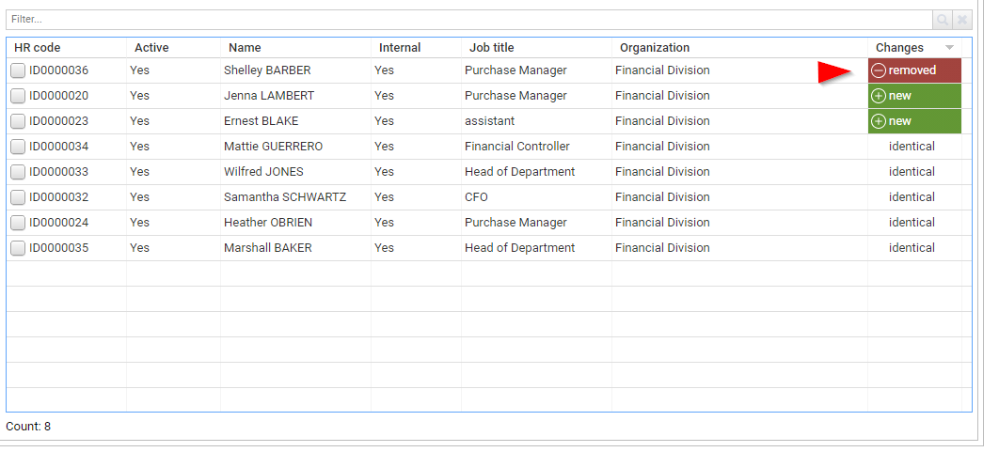

The timeslot used for comparison is visible through the calendar

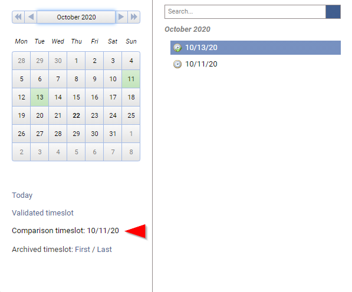

Timeslot used for comparison can be updated through "Settings &rarr; System &rarr; Manage Identity Ledger"

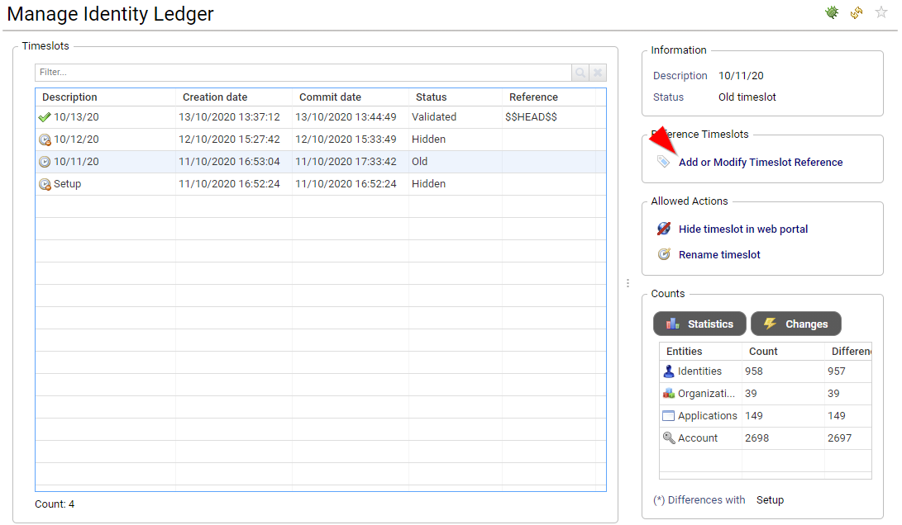

As a general rule, it is very important to understand that comparison is done through

- element existence in the comparison timeslot
- sub-elements cardinality (if any) such as nb of perms, nb of groups, nb of accounts, nb of identities, ...

Comparison is **NOT** performed base on a one on one attribute comparison, This means that, for instance, although an account attribute is updated (such as 'password never expires') it **WON'T** be displayed as updated.

### Trends

Trends are available and displayed whenever relevant. Trends are computed against the comparison Timeslot (see 'Date to date comparison' for more information).

Trends are also available in the search views as optional columns. Tooltips are available to present the current value and the previous value.

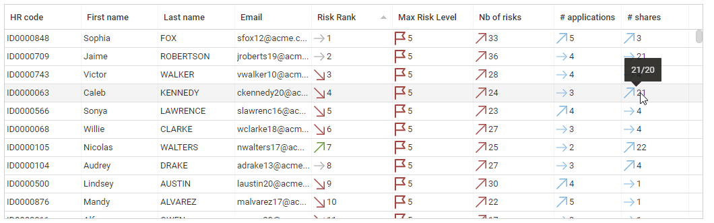


### Risk scoring & Risk ranking

IAP includes risk scoring and risk ranking for Accounts, Identities and Organisations. Risk scoring and risk ranking is based on control results, it helps to identify where the problems are located and how the problems evolve. 

Risk scoring is based on an aggregated score of the entity discrepancies, weighted by the controls risk levels.

Based on the risk scoring, a risk ranking is automatically computed. The hlower the value the higher the risk (account ranked #1 is the **MOST RISKY** account of the company). Entities with the exact same risk score are ranked the same, this is the reason why you can have ex aequo situations.

Ranking is very useful to reorder entries with a risk approach perspective.

Risks are available both on the search pages and on the details pages.


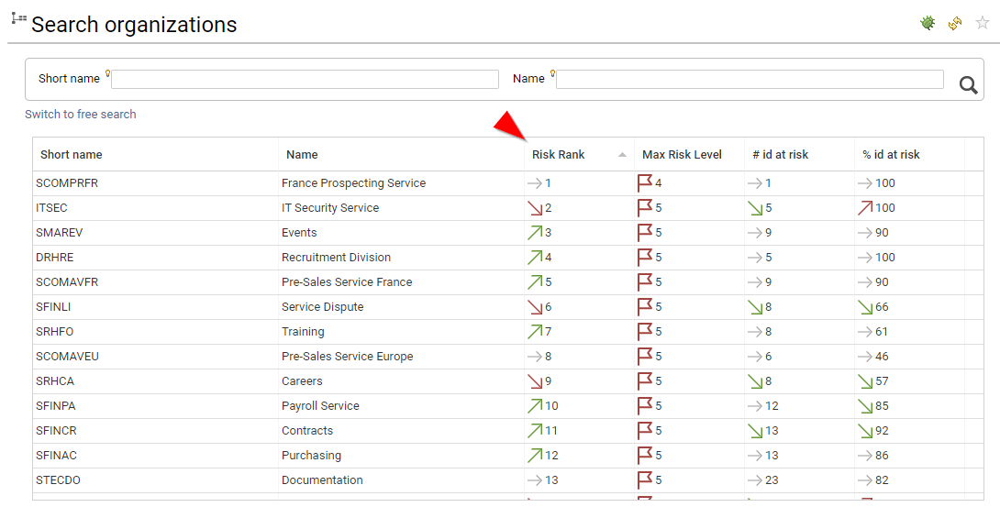

As risks are part of the datamodel, you can also leverage this information in search, access certification or custom reports.


For your information, risks scores are computed with the following approach:

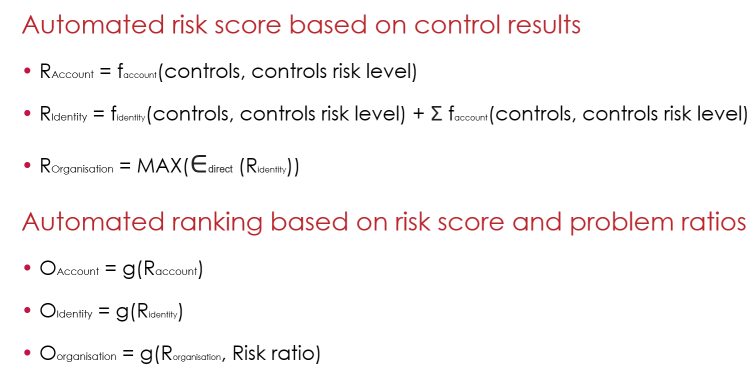


### KPIs in search page

Tons of KPIs are pre-computed and attached to the entities, most of them are available in the search pages, thus facilitating analysis from the search results:

- empty groups
- groups with the most accounts
- groups with the less accounts
- accounts with the most groups
- accounts with the less groups
- ...

Right click on the search table to show/hide the KPIs


The KPIs are part of the datamodel, as a result you can leverage those KPIs in your search functions, in your access reviews or in your custom reports.

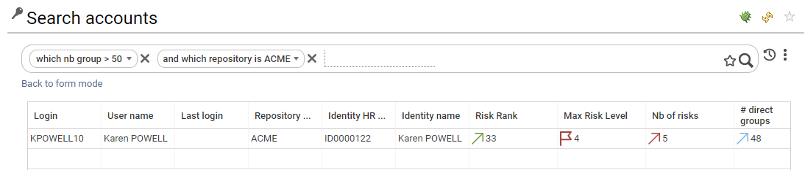

Please consult the "Metadata section" of this documentation for futher information regarding those KPIs.

### Classification and custom description

Starting with IAP 1.1 it is possible to manage entities classification and description directly through the web interface.

Updating classification and description through the web interface can be done for the following entities

- Organisation
- Repository
- Group
- Application
- Permission
- Share
- Folder

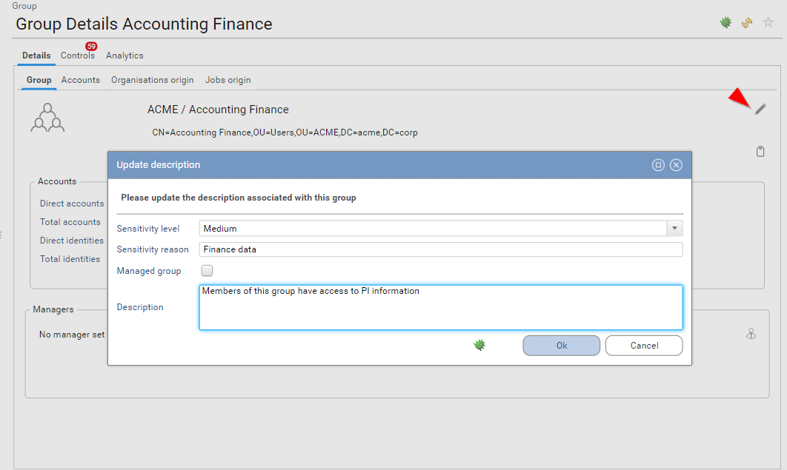

Sensitivity levels are stored as an integer value. The following sensitivity levels are available.

| sensitivity level | sensitivity level value |
| ----------------- | ----------------------: |
| not classified    | [EMPTY]                 |
| not classified    | 0                       |
| low               | 1                       |
| medium            | 2                       |
| high              | 3                       |
| extreme           | 4                       |

Keep this in mind as in search pages you **must** use the value instead of the pretty string in free search.

This information is displayed on detail pages, it can also be leveraged on search pages


Regarding Accounts and Identities, you cannot edit sensitivity level, you can instead compute them automatically. This computation will depend on the links associated with those accounts and identities.
The formula is:

```
AccountSensitivity = MAX(GroupSensitivity, PermissionSensitivity, RepositorySensitivity, ApplicationSensitivity)
IdentitySensitivity = MAX(AccountSensitivity, OrganisationSensivity)
```

This is a very powerful feature as it helps you to spot the most sensitive accounts and identities in just a few click: You just have to configure the sensitivity of some groups and permissions to start classifying your accounts and identities sensitivity.

Computing accounts and identities sensitivity can be done either through a manual process or automatically.

In order to manually compute those metrics you **MUST** have either the `technical administrator` role or the `functional administrator` role

Go to `Settings->System->Compute sensitivity levels`


As you can see, you can select which concepts will be leveraged in the computation. Once you have selected the entities to be considered in your computation you can click on `Compute sensitivity levels`. Please note that this process is asynchronous and can take some time depending on the volume of your data.

You can also launch this computation through a command line as everything is actually done through a technical workflow located in: `/workflow/bw_analytics/compute account identity metadata.workflow`

You can launch this workflow thanks to the `igrc_workflow` command

```Plaintext
"Usage: igrc_workflow <project name> <config directory path> <config name> <process name> [<filename>]"
"<config directory path> can contain several of these files:"
"- project.properties: file containing project configuration variables"
"- datasource.properties: file containing database connection configuration"
"- mail.properties: file containing mail server connection configuration"
"- workflow.properties: file containing workflow database connection configuration"
"- license.lic: file containing the RadiantOne Identity Analytics product license"
"<config name> is the name of the configuration (defined in a project .configuration file)"
"<process name> is a name of a workflow definition"
"<filename> is a path of the UTF-8 file containing the variables to set on process start"
"This command works on the validated timeslot."
"WARNING : This command refuses to work on memory configuration for the workflow"
"NOTE : A variable found in the file but not declared in the process is considered as an error"
```

Don't forget to configure a \<filename\> if you want to select specific entities in your computation. The following variables are available in the workflow for such purpose:

- includeapplications
- includefolders
- includegroups
- includeorganisations
- includepermissions
- includerepositories
- includeshares

Technically speaking, classification and custom description is using "metadatas" instead of the legacy "applicationinfos" and "permissioninfos" concept. Those metadatas are declared in: `/metadata/bw_analytics/metadata/`

Here are the available metadatas

| Entity       | Attribute name    | Description                                                                                                                                                                                      |
|--------------|-------------------|--------------------------------------------------------|
| Repository   | descr             | description                                                                                                                                                                                      |
| Repository   | sensitivityreason | sensitivity reason                                                                                                                                                                               |
| Repository   | sensitivitylevel  | sensitivity level                                                                                                                                                                                |
| Repository   | category          | category                                                                                                                                                                                         |
| Permission   | descr             | description                                                                                                                                                                                      |
| Permission   | sensitivityreason | sensitivity reason                                                                                                                                                                               |
| Permission   | sensitivitylevel  | sensitivity level                                                                                                                                                                                |
| Permission   | managed           | Whether or not this permission is managed, eg used for access rights management, this is especially useful for unstructured data where access rights requests are done for some permissions only |
| Organisation | descr             | description                                                                                                                                                                                      |
| Organisation | sensitivityreason | sensitivity reason                                                                                                                                                                               |
| Organisation | sensitivitylevel  | sensitivity level                                                                                                                                                                                |
| Identity     | descr             | description                                                                                                                                                                                      |
| Identity     | sensitivityreason | sensitivity reason                                                                                                                                                                               |
| Identity     | sensitivitylevel  | sensitivity level                                                                                                                                                                                |
| Group        | descr             | description                                                                                                                                                                                      |
| Group        | sensitivityreason | sensitivity reason                                                                                                                                                                               |
| Group        | sensitivitylevel  | sensitivity level                                                                                                                                                                                |
| Group        | managed           | Whether or not this group is managed, eg used for access rights management.                                                                                                                      |
| Application  | descr             | description                                                                                                                                                                                      |
| Application  | sensitivityreason | sensitivity reason                                                                                                                                                                               |
| Application  | sensitivitylevel  | sensitivity level                                                                                                                                                                                |
| Application  | category          | category                                                                                                                                                                                         |
| Account      | descr             | description                                                                                                                                                                                      |
| Account      | sensitivityreason | sensitivity reason                                                                                                                                                                               |
| Account      | sensitivitylevel  | sensitivity level                                                                                                                                                                                |

> **IMPORTANT**  You **CANNOT** use the legacy `comment` attribute in the Group entity, it **MUST** be replaced by the `descr` metadata if you want to makes it editable through the web GUI.

> **IMPORTANT**  You **CANNOT** use the legacy `applicationinfos` and `permissioninfos` metadata anymore, you **MUST** use those metadata instead, this can have an impact in your collect lines.

> **IMPORTANT**  If you are updating an existing RadiantOne Identity Analytics instance, you **MUST** migrate the legacy classification information (from `permissioninfos`, `applicationinfos` and `groups` to the new metadatas). In order to do so you **MUST** launch the data migration technical workflow `/workflow/bw_analytics/migratemetadata.workflow` at least once.

### Tags management

Starting with IAP 1.1 you can assign tags to the entities.
This is a very useful feature as tags can be both:

- Used to attach custom information to the entities
- Used as some kind of custom permanent baskets

For instance, you can tag the accounts that you want to revoke with a TOBEREVOKED tag and select them at once at a later time through the search page. You can tag very important identities with a VIP tag so that you know that you need to be very cautious with their access rights, you can prepare a series of group monitoring mashup dashboards based on a special tag sur as GROUPMONITOR and onboard groups by simply tagging them, you can even leverage tags in order to prepare your access review perimeters.

As you can see tags can be used in multiple ways.

Tags are displayed in the entity detail pane. If multiple tags are assigned to a single entity, they are presented with a comma separated string. You can edit those tags by clicking on the tag icon if you have one of the following role `functional administrator` or `technical administrator`


Those tags can be leveraged in the search pages:


If you are a `functional administrator` or `technical administrator`, you can perform bulk operation on tags through the search pages. 

- Bulk add a tag
- Bulk remove a tag
- Bulk remove all tags

All those operations are performed on **the current search results**

In order to do so, click on the context menu icon at the bottom right corner of the page.


Technically speaking, Tags are stored as metadata declared in `/metadata/bw_analytics/metadata/`

| identifier | name |
| ---------- | ---------- |
| bwa_repositorytags_tag | tag |
| bwa_accounttags_tag | tag |
| bwa_grouptags_tag | tag |
| bwa_identitytags_tag | tag |
| bwa_organisationtags_tag | tag |
| bwa_permissiontags_tag | tag |
| bwa_repositorytags_tag | tag |

> <span style="color:red">**Warning: **</span> Although you can assign several metadatas to a single entity, the metadata object is monovalued. If several metadata are assigned to a single entity, several metadata objects are created in the database. The `tag` value is used as a subkey in the metadata.
