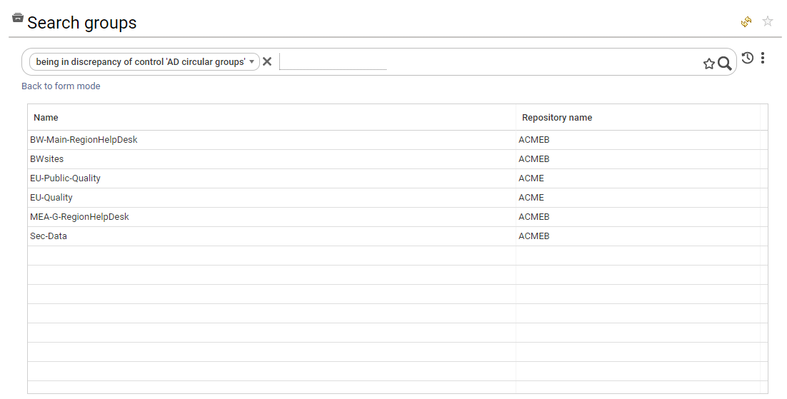

# Available Controls

IAP comes with more than 100 off-the-shelf controls. These controls identify problems related to:

* Data quality
* Security policy violation
* Compliance gaps such as access certification, and
* Discrepancies through peer group and predictive analysis.

These controls are part of the data model and are presented in each detail pane. They are also used to compute risk scores. You can use them in your own dashboards, reports, reviews and analytics. You can also search for errors through the search pages. (You will have to switch to "free search" and enable "show extended attributes" to do this.)

{ width=100% }

Here is an extract of the available controls in IAP. Please consult "Settings &rarr; System &rarr; Manage Controls Execution" for an updated list of the controls available in your instance.

---

* **Control ID:** `ACC_01`
* **Entity:** Account
* **Name:** Unused account
* **Description** Unused accounts are defined as accounts that have not been used for at least 90 days or those that have never been used at all.
* **Risk Level:** 1
* **Risk description:** Unused accounts are, by definition, no longer monitored by their respective owners. These accounts can be hacked and used by an insider to impersonate an individual while engaging in fraudulent activity. Accounts can be unused if the account owner is no longer using the service, if the account owner is a contractor who no longer works for the company, or if the account is a test/service account that is no longer being used.
* **Remediation:** Monitor the account's last login date. If the last login date is greater than 60 days (or if the account has never been used), notify the manager of the account owner to disable or delete it. The account owner's manager is in charge of enforcing the security policy within his scope of responsibility.

---

* **Control ID:** `ACC_02`
* **Entity:** Account
* **Name:** Orphaned account
* **Description** Active accounts identified as orphaned.
* **Risk Level:** 1
* **Risk description:** Orphaned accounts are neither assigned to an individual nor tracked as a service account. Therefore, they can be used by insiders, outliers or hackers to steal data or engage in rogue transactions.
* **Remediation:** Reconcile the account or disable it if it is no longer being used.

---

* **Control ID:** `ACC_03`
* **Entity:** Account
* **Name:** Active account whose owner has left the company.
* **Description** An active account belonging to an identity who has left the company.
* **Risk Level:** 4
* **Risk description:** Accounts must be terminated upon the departure of their owner. Otherwise they can be used by a third party (insider, hacker) to compromise data or steal information.
* **Remediation:** Verify that the owner has left the company and disable the account immediately.

---

* **Control ID:** `ACC_04`
* **Entity:** Account
* **Name:** Password never expires
* **Description** User account with a password that never expires.
* **Risk Level:** 2
* **Risk description:** User accounts with a password that never expires present a risk because once a password is shared, it can spread rapidly, exposing the assets of the company.
* **Remediation:** Reactivate the password's expiration date.

---

* **Control ID:** `ACC_05`
* **Entity:** Account
* **Name:** Password never expires - technical account
* **Description** Technical account with a password that never expires.
* **Risk Level:** 1
* **Risk description:** Technical/service accounts with a password that never expires present a risk because once a password is shared, it can spread rapidly, exposing the assets of the company.
* **Remediation:** Change the password on a regular basis or use a PAM solution to hide the password from users.

---

* **Control ID:** `ACC_06`
* **Entity:** Account
* **Name:** Password never expires - orphan account
* **Description** Orphaned account with a password that never expires.
* **Risk Level:** 2
* **Risk description:** Accounts with a password that never expires present a risk because once the password is shared, it can spread rapidly, exposing the assets of the company.
* **Remediation:** Reactivate the password's expiration date.

---

* **Control ID:** `ACC_07`
* **Entity:** Account
* **Name:** User password is too old.
* **Description** Active user account with a password that has not been changed in the last 90 days.
* **Risk Level:** 1
* **Risk description:** Passwords must be changed on a regular basis to comply with security policies and mitigate account-hacking risk.
* **Remediation:** For user accounts, verify whether or not the account is still being used. If not, disabled it. Otherwise, check the password policy and reactivate the password expiration policy.

---

* **Control ID:** `ACC_08`
* **Entity:** Account
* **Name:** Abnormal login attempts
* **Description** More than 20 unsuccessful login attempts have been detected on this account.
* **Risk Level:** 4
* **Risk description:** A high number of unsuccessful login attempts have been detected on this account. Someone (or a bot) may be attempting to hack into this account.
* **Remediation:** Contact the account owner to investigate. Check account security (password strength) and enable MFA, if needed.

---

* **Control ID:** `ACC_09`
* **Entity:** Account
* **Name:** Password not needed
* **Description** Password is not needed to connect.
* **Risk Level:** 2
* **Risk description:** This account can be used without a password which can lead to security problems depending on the type of account.
* **Remediation:** Reactivate authentication for this account.

---

* **Control ID:** `ACC_10`
* **Entity:** Account
* **Name:** User password cannot be changed
* **Description** User cannot change their password.
* **Risk Level:** 2
* **Risk description:** User accounts with a password that never expires or cannot be changed present a risk because once the password is shared, it can spread rapidly, exposing the assets of the company.
* **Remediation:** Reactivate the password update capability for this account.

---

* **Control ID:** `ACC_11`
* **Entity:** Account
* **Name:** Locked account
* **Description** The account is locked.
* **Risk Level:** 1
* **Risk description:** Locked accounts need to be monitored because they can correspond to former users accounts with unsuccessful login attempts.
* **Remediation:** Disable the account if it is no longer needed.

---

* **Control ID:** `ACC_12`
* **Entity:** Account
* **Name:** No user name
* **Description** The account does not have a username, only a login.
* **Risk Level:** 1
* **Risk description:** Accounts should be documented to help with auditing.
* **Remediation:** Enrich the account information.

---

* **Control ID:** `ACC_13`
* **Entity:** Account
* **Name:** Username inconsistency
* **Description** The account last name does not match with the account owner's last name.
* **Risk Level:** 1
* **Risk description:** This account could have been reassigned which can lead to security issues if the account permissions have not been updated accordingly.
* **Remediation:** Review account permissions.

---

* **Control ID:** `ACC_14`
* **Entity:** Account
* **Name:** Technical account without a manager
* **Description** A technical account without an account manager.
* **Risk Level:** 1
* **Risk description:** These are technical/service accounts that are not associated with an account owner. However, these accounts have sensitive access rights and, as a result, they should be associated with an account manager or business owner who is responsible for reviewing accounts and their permissions on a regular basis.
* **Remediation:** Assign a business owner to this account.

---

* **Control ID:** `ACC_15`
* **Entity:** Account
* **Name:** Extremely sensitive permissions
* **Description** An account with a permission sensitivity level that is set to Extreme (4).
* **Risk Level:** 2
* **Risk description:** Accounts granting "extreme sensitivity" access rights should be carefully monitored.
* **Remediation:** Verify that this account is not a standard user account. Review the account on a regular basis. Monitor account access.

---

* **Control ID:** `ACC_16`
* **Entity:** Account
* **Name:** Sensitive permissions
* **Description** An account with a permission sensitivity level that is set to High (3).
* **Risk Level:** 1
* **Risk description:** Accounts granting "high sensitivity" access rights should be carefully monitored.
* **Remediation:** Verify that this account is not a standard user account. Review the account on a regular basis. Monitor account access.

---

* **Control ID:** `ACC_17`
* **Entity:** Right
* **Name:** Overallocated right
* **Description** The access right is not found in the "granted rights" list.
* **Risk Level:** 2
* **Risk description:** Overallocated rights means that access rights have been given to individuals without following a formal approval process. This can be due to an IT administrative error or direct system update. Because these rights are not approved, they can lead to fraud or data-leakage risk.
* **Remediation:** Review the access right and remove it if it is not necessary. Update the table of granted rights.

---

* **Control ID:** `ACC_18`
* **Entity:** Right
* **Name:** Atypical access right
* **Description** Based on the analysis of an organizational peer group, this access right appears to be atypical.
* **Risk Level:** 1
* **Risk description:** Atypical access rights need to be monitored because they can correspond to stale access rights (access rights not removed when an individual moves from one department to another).
* **Remediation:** Review the access right and remove it if it is not necessary.

---

* **Control ID:** `ACC_19`
* **Entity:** Right
* **Name:** Atypical new access right
* **Description** Based on the analysis of an organizational peer group, this new access right appears to be atypical.
* **Risk Level:** 3
* **Risk description:** Atypical new access rights need to be monitored because they correspond to new access rights for an individual who appears unusual in the organizational context. It could be an IT error.
* **Remediation:** Review the access right and remove it if it is not necessary.

---

* **Control ID:** `ACC_20`
* **Entity:** Right
* **Name:** Atypical access right next to a position update
* **Description** Based on the analysis of an organizational peer group, this access right appears to be atypical.
* **Risk Level:** 2
* **Risk description:** Atypical access rights need to be monitored because they are unusual in the organizational context and the account user position just changed (organization). It could be a leftover access right.
* **Remediation:** Review the access right and remove it if it is not necessary.

---

* **Control ID:** `ACC_21`
* **Entity:** Account
* **Name:** Access to extremely sensitive folders
* **Description** An account with folders whose sensitivity level is set to Extreme (4).
* **Risk Level:** 2
* **Risk description:** Accounts granting "extreme sensitivity" access rights should be carefully monitored.
* **Remediation:** Verify that this account is not a standard user account. Review the account on a regular basis. Monitor account access.

---

* **Control ID:** `ACC_22`
* **Entity:** Account
* **Name:** Access to sensitive folders
* **Description** An account with folders whose sensitivity level is set to High (3).
* **Risk Level:** 1
* **Risk description:** Accounts granting "high sensitivity" access rights should be carefully monitored.
* **Remediation:** Verify that this account is not a standard user account. Review the account on a regular basis. Monitor account access.

---

* **Control ID:** `ACC_24`
* **Entity:** Right
* **Name:** Atypical folder right
* **Description** Based on the analysis of an organizational peer group, this access right appears to be atypical.
* **Risk Level:** 1
* **Risk description:** Atypical access rights need to be monitored because they can correspond to stale access rights (access rights not removed when an individual moves from one department to another).
* **Remediation:** Review the access right and remove it if it is not necessary.

---

* **Control ID:** `ACC_25`
* **Entity:** Right
* **Name:** Atypical new folder right
* **Description** Based on the analysis of an organizational peer group, this new access right appears to be atypical.
* **Risk Level:** 3
* **Risk description:** Atypical new access rights need to be monitored because they correspond to new access rights for an individual which seem unusual in the organizational context and the account user's position just changed (organization). It could be an IT error.
* **Remediation:** Review the access right and remove it if it is not necessary.

---

* **Control ID:** `ACC_26`
* **Entity:** Right
* **Name:** Atypical folder right next to a position update
* **Description** Based on the analysis of an organizational peer group, this access right appears to be atypical.
* **Risk Level:** 2
* **Risk description:** Atypical access rights need to be monitored because they seem unusual in the organizational context and the account user's position just changed (organization). It could be a leftover access right.
* **Remediation:** Review the access right and remove it if it is not necessary.

---

* **Control ID:** `ACC_27`
* **Entity:** Account
* **Name:** Reactivated user account
* **Description** A disabled account has been reactivated and the account is reconciled to an active identity.
* **Risk Level:** 1
* **Risk description:** Reactivated user accounts must be checked because they can be used by an insider to gain control of some systems if these accounts still have permissions.
* **Remediation:** Review the account. Is the account owner returning from a long-term absence?  Is he a contractor?  

---

* **Control ID:** `ACC_28`
* **Entity:** Account
* **Name:** Reactivated user account with inactive identity
* **Description** A disabled account has been reactivated and the account is reconciled to an inactive identity.
* **Risk Level:** 3
* **Risk description:** Reactivated users accounts must be checked because they can be used by an insider to gain control of some systems if these accounts still have permissions. The identity is marked as inactive which means that the account owner is no longer part of the company.
* **Remediation:** Review the account. Is the account owner returning from a long-term absence. Is he a contractor?  

---

* **Control ID:** `ACC_29`
* **Entity:** Account
* **Name:** Reactivated leaver account
* **Description** A disabled account has been reactivated and the account is marked as being associated with a person who has left the company (leaver).
* **Risk Level:** 3
* **Risk description:** Reactivated user accounts for whom the account owner is marked as no longer being part of the company must be checked because they can be used by an insider to gain control of some systems if these accounts still have permissions.
* **Remediation:** Review the account. Did the account owner return to the company? If this is the case, notify the HR department to update the HR repository.

---

* **Control ID:** `ACC_30`
* **Entity:** Account
* **Name:** Reactivated technical account
* **Description** A disabled account has been reactivated and account is marked as a technical account.
* **Risk Level:** 2
* **Risk description:** Reactivated technical accounts must be checked because they provide elevated privileges and can be used by an insider to gain control of some systems.
* **Remediation:** Review the reason for the reactivation of the technical account with the account manager.

---

* **Control ID:** `ACC_31`
* **Entity:** Account
* **Name:** Reactivated orphaned account
* **Description** A disabled account has been reactivated and the account is orphaned.
* **Risk Level:** 3
* **Risk description:** Reactivated orphaned accounts have no reason to be reactivated because they can be used by an insider to gain control of some systems.
* **Remediation:** Reconcile the account and review the reason for reactivation with the account owner/manager.

---

* **Control ID:** `ACC_32`
* **Entity:** Account
* **Name:** An active leaver account used after the account owner's departure date (inactive user).
* **Description** The account is active, but owner is inactive. The last connection date is more recent than the date of departure.
* **Risk Level:** 4
* **Risk description:** This account should have been revoked because the account owner has left the company. However, it appears that this account is still being used. Either the account password has been shared or the account has been hacked.
* **Remediation:** Investigate by analyzing the account logs and disable the account.

---

* **Control ID:** `ACC_33`
* **Entity:** Account
* **Name:** Active leaver account used after the account owner's departure date (leaver)
* **Description** The account is active but the owner has left th company. The last connection date is more recent than the date of departure.
* **Risk Level:** 4
* **Risk description:** This account should have been revoked because the account owner has left the company. However, it appears that the account is still being used. Either the account password has been shared or the account has been hacked.
* **Remediation:** Investigate by analyzing the account logs and disable the account.

---

* **Control ID:** `ACC_34`
* **Entity:** Account
* **Name:** Revoked leaver account used after the account owner's departure date (inactive user)
* **Description** The account is disabled and the owner is inactive. The last connection date is more recent than the date of departure.
* **Risk Level:** 2
* **Risk description:** This account has been revoked because the account owner has left the company. However, it appears that this account has been used after the account owner's departure date.
* **Remediation:** Investigate by analyzing the account logs.

---

* **Control ID:** `ACC_35`
* **Entity:** Account
* **Name:** Revoked leaver account used after the account owner's departure date (leaver)
* **Description** The account is disabled and the owner has left the company. The last connection date is more recent than the departure date.
* **Risk Level:** 2
* **Risk description:** This account has been revoked because the account owner left the company. However, it appears that this account has been used after account owner's departure date.
* **Remediation:** Investigate by analyzing the account logs.

---

* **Control ID:** `ACC_36`
* **Entity:** Account
* **Name:** Account not used since its creation
* **Description** The account creation date is the same as the account's last login date.
* **Risk Level:** 1
* **Risk description:** It seems that this account is not being used. It could be that this account was a test account, used only once, then forgotten.
* **Remediation:** Investigate and disable the account.

---

* **Control ID:** `ACC_37`
* **Entity:** Account
* **Name:** User with no department manager
* **Description** The account is reconciled to an identity that belongs to a department with no active manager known.
* **Risk Level:** 0
* **Risk description:** The absence of a known active department manager could be an issue. If a company plans to delegate user account controls to department managers, this account won't be included in the control plan KPIs.
* **Remediation:** Review your organizational tree and assign all departments to active managers.

---

* **Control ID:** `ACC_38`
* **Entity:** Account
* **Name:** Identity with multiple active accounts in the same repository
* **Description** Several accounts from the same repository are reconciled with the same identity.
* **Risk Level:** 2
* **Risk description:** Having multiple accounts in the same repository is a bad practice. It can be a way to evade Segregation of Duties (SoD) controls. Unless the user has several accounts for very good reasons (for instance an admin account, and a standard user account), those accounts should be merged.
* **Remediation:** Verify that the user holds these accounts for good reasons. Otherwise consider merging the accounts and their respective permissions.

---

* **Control ID:** `ACC_39`
* **Entity:** Account
* **Name:** Identity with multiple accounts in the same application
* **Description** Several accounts from the same application are reconciled with the same identity.
* **Risk Level:** 2
* **Risk description:** Having multiple accounts in the same application is a bad practice. It can be a way to evade Segregation of Duties (SoD) controls. Unless the user has several accounts for very good reasons (for instance an admin account, and a standard user account), those accounts should be merged.
* **Remediation:** Verify that the user holds these accounts for good reasons. Otherwise consider merging the accounts and their respective permissions.

---

* **Control ID:** `ACC_40`
* **Entity:** Account
* **Name:** Inactive account whose owner left the company at least 2 years ago
* **Description** This account is inactive, and is reconciled to a user who left the company at least 2 years ago.
* **Risk Level:** 1
* **Risk description:** Repositories should be cleaned up on a regular basis to avoid accounts sprawl on the systems. Inactive users accounts should be deleted after a quarantine period.
* **Remediation:** Delete this account.

---

* **Control ID:** `ACC_41`
* **Entity:** Account
* **Name:** AD or Azure account created more than 7 days after the identity's start date
* **Description** This AD or Azure Account was created more than 7 days after the identity's start date.
* **Risk Level:** 1
* **Risk description:** Some repositories, such as AD or Azure, are associated with the identity lifecycle. If the account is created more than 7 days after the identity's start date, it could highlight the fact that the on-boarding process is not efficient.
* **Remediation:** Verify if the account repository is associated with the identity lifecycle. If investigate why it took so long to create the account.

---

* **Control ID:** `GROUP_01`
* **Entity:** Group
* **Name:** Group is empty
* **Description** The group does not contain any accounts.
* **Risk Level:** 0
* **Risk description:** Empty groups should be removed if they are no longer being used to improve repository quality.
* **Remediation:** Verify that the group is still being used. If not, delete it.

---

* **Control ID:** `GROUP_02`
* **Entity:** Group
* **Name:** Group only contains deactivated accounts
* **Description** All the accounts in the group are deactivated.
* **Risk Level:** 0
* **Risk description:** Legacy groups should be removed if they are no longer being used to improve repository quality.
* **Remediation:** Verify if the group is still being used. If not, delete it.

---

* **Control ID:** `GROUP_03`
* **Entity:** Group
* **Name:** Group contains circular references
* **Description** Circular references are detected in the subgroups.
* **Risk Level:** 2
* **Risk description:** Circular references in subgroups can cause application outages (if they manage to retrieve all account subgroups without detecting circular references).
* **Remediation:** Solve the circular reference issue.

---

* **Control ID:** `GROUP_04`
* **Entity:** Group
* **Name:** Public group
* **Description** The group contains all (100%) of the active accounts.
* **Risk Level:** 0
* **Risk description:** The public group should be reviewed on a regular basis to ensure that it does not provide access to sensitive information.
* **Remediation:** Review group usage and permissions.

---

* **Control ID:** `GROUP_05`
* **Entity:** Group
* **Name:** Group is almost public
* **Description** The group contains 90% of the active accounts.
* **Risk Level:** 0
* **Risk description:** The public group should be reviewed on a regular basis to ensure that it does not provide access to sensitive information.
* **Remediation:** Review group usage and permissions.

---

* **Control ID:** `GROUP_06`
* **Entity:** Group
* **Name:** High sensitivity group owner left
* **Description** The manager of a highly sensitive group is inactive.
* **Risk Level:** 1
* **Risk description:** Sensitive groups must have an owner. Otherwise, they are not managed or reviewed.
* **Remediation:** Assign a manager to the group.

---

* **Control ID:** `GROUP_07`
* **Entity:** Group
* **Name:** High sensitivity group without owner
* **Description** No manager is found for a highly sensitive group.
* **Risk Level:** 1
* **Risk description:** Sensitive groups must have an owner. Otherwise, they are not managed or reviewed.
* **Remediation:** Assign a manager to the group.

---

* **Control ID:** `GROUP_08`
* **Entity:** Group
* **Name:** Extreme sensitivity group owner left
* **Description** The manager of an extremely sensitive group is inactive.
* **Risk Level:** 2
* **Risk description:** Sensitive groups must have a owner. Otherwise, they are not managed or reviewed.
* **Remediation:** Assign a manager to the group.

---

* **Control ID:** `GROUP_09`
* **Entity:** Group
* **Name:** Extreme sensitivity group without owner
* **Description** No manager is found for an extremely sensitive group.
* **Risk Level:** 2
* **Risk description:** Sensitive groups must have a owner. Otherwise, they are not managed or reviewed.
* **Remediation:** Assign a manager to the group.

---

* **Control ID:** `GROUP_10`
* **Entity:** Group
* **Name:** High sensitivity group owner is a contractor
* **Description** The manager of a highly sensitive group is a contractor.
* **Risk Level:** 0
* **Risk description:** Sensitive resources should not be managed by contractors.
* **Remediation:** Verify that this is a normal situation.

---

* **Control ID:** `GROUP_11`
* **Entity:** Group
* **Name:** Extreme sensitivity group owner is a contractor
* **Description** The manager of an extremely sensitive group is a contractor.
* **Risk Level:** 0
* **Risk description:** Sensitive resources should not be managed by contractors.
* **Remediation:** Verify that this is a normal situation.

---

* **Control ID:** `GROUP_12`
* **Entity:** Group
* **Name:** Highly sensitive group and new accounts
* **Description** New accounts within a highly sensitive group are found.
* **Risk Level:** 2
* **Risk description:** Sensitive group changes must be reviewed in order to mitigate IT errors and hacking attempts.
* **Remediation:** Review group changes.

---

* **Control ID:** `GROUP_13`
* **Entity:** Group
* **Name:** Extremely sensitive group and new accounts
* **Description** New accounts within an extremely sensitive group are found.
* **Risk Level:** 3
* **Risk description:** Sensitive group changes must be reviewed in order to mitigate IT errors and hacking attempts.
* **Remediation:** Review group changes.

---

* **Control ID:** `GROUP_14`
* **Entity:** Group
* **Name:** High sensitivity group without description
* **Description** The description field of a highly sensitive group is empty.
* **Risk Level:** 1
* **Risk description:** Sensitive groups must be documented.
* **Remediation:** Update the group description.

---

* **Control ID:** `GROUP_15`
* **Entity:** Group
* **Name:** Extreme sensitivity group without description
* **Description** The description field of an extremely sensitive group is empty.
* **Risk Level:** 1
* **Risk description:** Sensitive groups must be documented.
* **Remediation:** Update the group description.

---

* **Control ID:** `GROUP_16`
* **Entity:** Group
* **Name:** No group description
* **Description** The description field of a group is empty.
* **Risk Level:** 0
* **Risk description:** Groups should be documented.
* **Remediation:** Update the group description.

---

* **Control ID:** `GROUP_17`
* **Entity:** Group
* **Name:** No group sensitivity level
* **Description** The group sensitivity level is empty.
* **Risk Level:** 0
* **Risk description:** Groups should have a sensitivity level set in order to identify the applicable security policy.
* **Remediation:** Update the group sensitivity level.

---

* **Control ID:** `GROUP_18`
* **Entity:** Group
* **Name:** Public group grants access to highly sensitive permissions
* **Description** The permission sensitivity level is set at 3.
* **Risk Level:** 2
* **Risk description:** Sensitive information should not be public.
* **Remediation:** Review the group configuration and membership.

---

* **Control ID:** `GROUP_19`
* **Entity:** Group
* **Name:** Public group grants access to extremely sensitive permissions
* **Description** The permission sensitivity level is set at 4.
* **Risk Level:** 3
* **Risk description:** Sensitive information should not be public.
* **Remediation:** Review the group configuration and membership.

---

* **Control ID:** `GROUP_20`
* **Entity:** Group
* **Name:** Public group grants access to highly sensitive folders
* **Description** A public group grants access to highly sensitive folders and the permission sensitivity level is set at 3.
* **Risk Level:** 2
* **Risk description:** Sensitive information should not be public.
* **Remediation:** Review the group configuration and membership.

---

* **Control ID:** `GROUP_21`
* **Entity:** Group
* **Name:** Public group grants access to extremely sensitive folders
* **Description** A public group grants access to extremely sensitive folders and the permission sensitivity level is set a 4.
* **Risk Level:** 3
* **Risk description:** Sensitive information should not be public.
* **Remediation:** Review the group configuration and membership.

---

* **Control ID:** `GROUP_22`
* **Entity:** Group
* **Name:** Semi-public group grants access to highly sensitive permissions
* **Description** A semi-public group grants access to highly sensitive permissions and the permission sensitivity level is set at 3.
* **Risk Level:** 2
* **Risk description:** Sensitive information should not be public.
* **Remediation:** Review the group configuration and membership.

---

* **Control ID:** `GROUP_23`
* **Entity:** Group
* **Name:** Semi-public group grants access to extremely sensitive permissions
* **Description** A semi-public group grants access to extremely sensitive permissions and the permission sensitivity level is set at 4.
* **Risk Level:** 3
* **Risk description:** Sensitive information should not be public.
* **Remediation:** Review the group configuration and membership.

---

* **Control ID:** `GROUP_24`
* **Entity:** Group
* **Name:** Semi-public group grants access to highly sensitive folders
* **Description** A semi-public group grants access to highly sensitive folders and the permission sensitivity level is set at 3.
* **Risk Level:** 2
* **Risk description:** Sensitive information should not be public.
* **Remediation:** Review the group configuration and membership.

---

* **Control ID:** `GROUP_25`
* **Entity:** Group
* **Name:** Semi-public group grants access to extremely sensitive folders
* **Description** A semi-public group grants access to extremely sensitive folders and the permission sensitivity level is set at 4.
* **Risk Level:** 3
* **Risk description:** Sensitive information should not be public.
* **Remediation:** Review the group configuration and membership.

---

* **Control ID:** `GROUP_26`
* **Entity:** Group
* **Name:** High sensitivity and new accounts
* **Description** A highly sensitive group with new accounts.
* **Risk Level:** 1
* **Risk description:** Highly sensitive groups should be carefully monitored for account changes because these groups can lead to continuity, fraud or data-leakage risk.
* **Remediation:** Perform a review of the changes.

---

* **Control ID:** `GROUP_27`
* **Entity:** Group
* **Name:** Extreme sensitivity and new accounts
* **Description** An extremely sensitive group with new accounts
* **Risk Level:** 2
* **Risk description:** Extremely sensitive groups should be carefully monitored for account changes because these groups can lead to continuity, fraud or data-leakage risk.
* **Remediation:** Perform a review of the changes.

---

* **Control ID:** `GROUP_34`
* **Entity:** Group
* **Name:** Significant increase in group members
* **Description** The number of group members has increased by more than 1000 since the last analysis.
* **Risk Level:** 1
* **Risk description:** Significant changes regarding access rights can be caused by operational IT errors.
* **Remediation:** Review the change.

---

* **Control ID:** `GROUP_35`
* **Entity:** Group
* **Name:** Local server group with direct domain user account
* **Description** A local server group directly includes Active Directory domain active user accounts.
* **Risk Level:** 2
* **Risk description:** Local server groups are difficult to manage because most of the time one must connect to the server to manage the group content. Therefore, as a best practice, it is suggested that Active Directory domain accounts should not be directly added to these groups. This is because there is a high probability that one will forget to remove those memberships when necessary.
* **Remediation:** Create an Active Directory group with the same content and add the Active Directory group in this local server group. As a result, it will be possible to administer the local group content from Active Directory.

---

* **Control ID:** `GROUP_36`
* **Entity:** Group
* **Name:** Local server user group contains public access
* **Description** The local user group (sid S-1-5-32-545) contains public Active Directory domain access.
* **Risk Level:** 2
* **Risk description:** The local user group contains all the Active Directory domain accounts meaning that, unless overridden by a GPO, anyone can open a session locally on this server.
* **Remediation:** Verify that a GPO has been configured to prevent login by unauthorized users. As a best practice, create a group on the Active Directory domain and include this group as a subgroup of the local group in order to centrally manage who can open a session on this server.

---

* **Control ID:** `GROUP_37`
* **Entity:** Group
* **Name:** Local server remote desktop user group contains public access
* **Description** Local remote desktop user group (sid S-1-5-32-555) contains public Active Directory domain access.
* **Risk Level:** 3
* **Risk description:** The local remote desktop user group contains all the Active Directory domain accounts meaning that, unless overridden by a GPO, anyone can open a session locally on this server.
* **Remediation:** Verify that a GPO has been configured to prevent login by unauthorized users. As a best practice, create a group on the Active Directory domain and include this group as a subgroup of the local group in order to centrally manage who can open a session on this server.

---

* **Control ID:** `GROUP_38`
* **Entity:** Group
* **Name:** Local server remote management user group contains public access
* **Description** The local remote management user group (sid S-1-5-32-580) contains public Active Directory domain access.
* **Risk Level:** 3
* **Risk description:** The local remote management user group contains all the Active Directory domain accounts meaning that, unless overridden by a GPO, anyone can remotely execute PowerShell commands on this server.
* **Remediation:** Verify that a GPO has been configured to prevent login by unauthorized users. As a best practice, create a group on the Active Directory domain and include this group as a subgroup of the local group in order to centrally manage who can execute PowerShell commands on this server.

---

* **Control ID:** `GROUP_39`
* **Entity:** Group
* **Name:** Local server administrator group contains public access
* **Description** The local administrator group (sid S-1-5-32-544) contains public Active Directory domain access.
* **Risk Level:** 4
* **Risk description:** The local administrator group contains all Active Directory domain accounts meaning that, unless overridden by a GPO, anyone can open a session as a local administrator on this server.
* **Remediation:** Verify that a GPO has been configured to prevent login by unauthorized users. As a best practice, create a group on the Active Directory domain and include this group as a subgroup of the local group in order to centrally manage who can open a session as an administrator on this server.

---

* **Control ID:** `GROUP_40`
* **Entity:** Group
* **Name:** Local server power user group contains public access
* **Description** The local power user group (sid S-1-5-32-547) contains public Active Directory domain access.
* **Risk Level:** 3
* **Risk description:** The local power user group contains all the Active Directory domain accounts meaning that, unless overridden by a GPO, anyone can open a session as a power user on this server and create local accounts.
* **Remediation:** Verify that a GPO has been configured to prevent login by unauthorized users. As a best practice, create a group on the Active Directory domain and include this group as a subgroup of the local group in order to centrally manage who can open a session as a power user on this server.

---

* **Control ID:** `HR_01`
* **Entity:** Identity
* **Name:** No employee number
* **Description** The HR Code is empty.
* **Risk Level:** 1
* **Risk description:** Having unique employee numbers is a good practice because it helps with audits and account reconciliation processes by avoiding issues with duplicate names.
* **Remediation:** Consider entering an employee number if one exists.

---

* **Control ID:** `HR_02`
* **Entity:** Identity
* **Name:** No email found
* **Description** No email is found.
* **Risk Level:** 1
* **Risk description:** No interactions are possible without a valid email address, as in the example of self-certification.
* **Remediation:** Enter a valid email address.

---

* **Control ID:** `HR_03`
* **Entity:** Identity
* **Name:** Resource owner without email
* **Description** No email is found and the identity is a resource owner.
* **Risk Level:** 3
* **Risk description:** Resource owners have many security interactions, including approvals, recertification, level 1 control, etc. Without an email, security processes will not be able to reach this resource owner.
* **Remediation:** Enter a valid email address.

---

* **Control ID:** `HR_04`
* **Entity:** Identity
* **Name:** Department manager without email
* **Description** No email is found and the identity is a department manager.
* **Risk Level:** 3
* **Risk description:** Department managers have many security interactions, including approvals, recertification, level 1 control, etc. Without an email, security processes will not be able to reach this resource owner.
* **Remediation:** Enter a valid email address.

---

* **Control ID:** `HR_05`
* **Entity:** Identity
* **Name:** Team leader without email
* **Description** No email is found and the identity is a team leader.
* **Risk Level:** 3
* **Risk description:** Team leaders have many security interactions, including approvals, recertification, level 1 control, etc. Without an email, security processes will not be able to reach this resource owner.
* **Remediation:** Enter a valid email address.

---

* **Control ID:** `HR_06`
* **Entity:** Identity
* **Name:** Inactive identity
* **Description** The identity is active but all its accounts are either inactive or have not been used in the last 90 days.
* **Risk Level:** 1
* **Risk description:** The identity is active but all of its accounts are either inactive or have not been used in the last 90 days. This identity may have left the company.
* **Remediation:** Notify the HR department.

---

* **Control ID:** `HR_07`
* **Entity:** Identity
* **Name:** Phantom identity
* **Description** The identity is active but no accounts have been found.
* **Risk Level:** 1
* **Risk description:** The identity is active but no accounts have been found. This identity may have left the company.
* **Remediation:** Notify the HR department.

---

* **Control ID:** `HR_08`
* **Entity:** Identity
* **Name:** Contractor without end date
* **Description** An active identity, marked as a contractor, does not have an end date.
* **Risk Level:** 1
* **Risk description:** Contractors should have an end date to help with account revocation.
* **Remediation:** Add an end date.

---

* **Control ID:** `HR_09`
* **Entity:** Identity
* **Name:** Contractor with past-due end date and no active accounts
* **Description** An active identity, marked as as a contractor, has an outdated end date.
* **Risk Level:** 1
* **Risk description:** Contractors should be monitored carefully, especially during the off-boarding process.
* **Remediation:** Validate with the contractor manager.

---

* **Control ID:** `HR_10`
* **Entity:** Identity
* **Name:** Contractor with past-due end date and active accounts
* **Description** An active identity, marked as as a contractor, has an outdated end date but retains active accounts.
* **Risk Level:** 3
* **Risk description:** Contractors should be monitored carefully, especially during the off-boarding process. It could be that this identity has left the company but still has active accounts.
* **Remediation:** Validate with the contractor manager.

---

* **Control ID:** `HR_11`
* **Entity:** Identity
* **Name:** Employee without manager
* **Description** An active, internal identity has no direct manager.
* **Risk Level:** 1
* **Risk description:** All employees must have an assigned manager.
* **Remediation:** Assign this employee to a manager.

---

* **Control ID:** `HR_12`
* **Entity:** Identity
* **Name:** Contractor without manager
* **Description** An active, external identity, has no direct manager.
* **Risk Level:** 2
* **Risk description:** All contractors must have an assigned manager.
* **Remediation:** Assign this contractor to a manager.

---

* **Control ID:** `HR_13`
* **Entity:** Identity
* **Name:** Employee whose manager left the company
* **Description** An active, internal identity, has an inactive direct manager.
* **Risk Level:** 1
* **Risk description:** Employees must have a manager.
* **Remediation:** Assign this employee to a manager.

---

* **Control ID:** `HR_14`
* **Entity:** Identity
* **Name:** Contractor whose manager left the company
* **Description** An active, external identity has an inactive direct manager.
* **Risk Level:** 2
* **Risk description:** Contractors must have a manager.
* **Remediation:** Assign this contractor to a manager.

---

* **Control ID:** `HR_15`
* **Entity:** Identity
* **Name:** Employee with a contractor as a manager
* **Description** An active, internal identity has an external direct manager.
* **Risk Level:** 1
* **Risk description:** Employees must not be managed by a contactor, as this is an HR risk.
* **Remediation:** Verify the data quality of the HR source and solve the issue with the HR department.

---

* **Control ID:** `HR_16`
* **Entity:** Identity
* **Name:** Identity is its own manager
* **Description**  The identity is its own manager
* **Risk Level:** 2
* **Risk description:** This identity is its own manager. When access reviews are launched, this person will be assigned the review for their own entitlements. This should be avoided, and may point to HR data quality issues.
* **Remediation:** Reassign this identity to another manager.

---

* **Control ID:** `HR_17`
* **Entity:** Identity
* **Name:** Contractor leaving within the next 30 days
* **Description**  This contractor's departure date is coming the next 30 days
* **Risk Level:** 0
* **Risk description:** This contractor will leave the company within the next 30 days. The manager should verify if the contractor's end date is accurate. Upon departure, all the contractor's accesses will be disabled.
* **Remediation:** Verify the contractor's departure date with their manager.

---

* **Control ID:** `HR_18`
* **Entity:** Identity
* **Name:** Identity with namesakes
* **Description**  Multiple identities have identical first and last names (namesakes)
* **Risk Level:** 1
* **Risk description:** Namesakes must be carefully managed. They may be both a symptom of bad HR data quality, and a trigger for access rights provisioning mistakes.
* **Remediation:** Verify if this is a real namesake or a data quality issue. Identify possible unique identification attributes (employee number, for instance).

---

* **Control ID:** `HR_19`
* **Entity:** Identity
* **Name:** Identities with the same email address
* **Description**  Multiple identities have the same email address.
* **Risk Level:** 2
* **Risk description:** Several identities have the same email address. This may point to duplicated identities OR data quality issues in the HR system. This must be solved as it breaks all logical access control policies.
* **Remediation:** Investigate and solve the issue (deduplicate identities, or update one email address in the HR system)

---

* **Control ID:** `HR_20`
* **Entity:** Identity
* **Name:** Identity with multiple active accounts in the same repository
* **Description**  This identity holds several active accounts in a repository.
* **Risk Level:** 2
* **Risk description:** Having multiple accounts in the same repository is a bad practice. It can be a way to evade Segregation of Duties (SoD) controls. Unless the user has several accounts for very good reasons (for instance an admin account, and a standard user account), those accounts should be merged.
* **Remediation:** Verify that the user holds these accounts for good reasons. Otherwise consider merging the accounts and their respective permissions.

---

* **Control ID:** `HR_21`
* **Entity:** Identity
* **Name:** Identity with multiple active accounts in the same application
* **Description** This identity holds several active accounts in an application.
* **Risk Level:** 2
* **Risk description:** Having multiple accounts in the same application is a bad practice. It can be a way to evade Segregation of Duties (SoD) controls. Unless the user has several accounts for very good reasons (for instance an admin account, and a standard user account), those accounts should be merged.
* **Remediation:** Verify that the user holds these accounts for good reasons. Otherwise consider merging the accounts and their respective permissions.

---

* **Control ID:** `PERM_01`
* **Entity:** Permission
* **Name:** High sensitivity and new rights
* **Description** A highly sensitive permission has new access rights (active accounts added or removed).
* **Risk Level:** 1
* **Risk description:** Highly sensitive permissions should be carefully monitored for access right changes because these permissions can lead to continuity, fraud and data-leakage risk.
* **Remediation:** Perform a review of the changes.

---

* **Control ID:** `PERM_02`
* **Entity:** Permission
* **Name:** Extreme sensitivity and new rights
* **Description** An extremely sensitive permission has new access rights (active accounts added or removed).
* **Risk Level:** 2
* **Risk description:** Extremely sensitive permissions should be carefully monitored for access right changes because these permissions can lead to continuity, fraud and data-leakage risk.
* **Remediation:** Perform a review of the changes.

---

* **Control ID:** `PERM_03`
* **Entity:** Permission
* **Name:** High sensitivity and new folder rights
* **Description** Highly sensitive folders have new access rights (active accounts added or removed).
* **Risk Level:** 1
* **Risk description:** Highly sensitive folders should be carefully monitored for access right changes because these permissions can lead to continuity, fraud and data-leakage risk.
* **Remediation:** Perform a review of the changes.

---

* **Control ID:** `PERM_04`
* **Entity:** Permission
* **Name:** Extreme sensitivity and new folder rights
* **Description** Extremely sensitive folders have new access rights (active accounts added or removed).
* **Risk Level:** 2
* **Risk description:** Extremely sensitive folders should be carefully monitored for access right changes because these permissions can lead to continuity, fraud and data-leakage risk.
* **Remediation:** Perform a review of the changes.

---

* **Control ID:** `PERM_05`
* **Entity:** Permission
* **Name:** Highly sensitive permission without owner
* **Description** A highly sensitive permission has no owner.
* **Risk Level:** 1
* **Risk description:** A highly sensitive permission should have an owner and should be reviewed by the owner on a regular basis.
* **Remediation:** Assign an owner and request that he review the rights.

---

* **Control ID:** `PERM_06`
* **Entity:** Permission
* **Name:** Extremely sensitive permission without owner
* **Description** An extremely sensitive permission has no owner.
* **Risk Level:** 2
* **Risk description:** An extremely sensitive permission should have an owner and should be reviewed by the owner on a regular basis.
* **Remediation:** Assign an owner and request that he review the rights.

---

* **Control ID:** `PERM_07`
* **Entity:** Permission
* **Name:** Highly sensitive folders without owner
* **Description** Highly sensitive folders have no owner.
* **Risk Level:** 1
* **Risk description:** Highly sensitive folders should have an owner and should be reviewed by the owner on a regular basis.
* **Remediation:** Assign an owner and request that he review the rights.

---

* **Control ID:** `PERM_08`
* **Entity:** Permission
* **Name:** Extremely sensitive folders without owner
* **Description** Extremely sensitive folders have no owner.
* **Risk Level:** 2
* **Risk description:** Extremely sensitive folders should have an owner and should be reviewed by the owner on a regular basis.
* **Remediation:** Assign an owner and request that he review the rights.

---

* **Control ID:** `PERM_09`
* **Entity:** Permission
* **Name:** Highly sensitive permission without description
* **Description** Highly sensitive permission with an empty description field.
* **Risk Level:** 1
* **Risk description:** Highly sensitive permissions must be documented to help with  analysis and audits.
* **Remediation:** Fill in the description field.

---

* **Control ID:** `PERM_10`
* **Entity:** Permission
* **Name:** Extremely sensitive permission without description
* **Description** Extremely sensitive permission with an empty description field.
* **Risk Level:** 1
* **Risk description:** Extremely sensitive permissions must be documented to help with analysis and audits.
* **Remediation:** Fill in the description field.

---

* **Control ID:** `PERM_11`
* **Entity:** Permission
* **Name:** Highly sensitive folders without description
* **Description** Highly sensitive folders with an empty description field.
* **Risk Level:** 1
* **Risk description:** Highly sensitive folders must be documented to help with  analysis and audits.
* **Remediation:** Fill in the description field.

---

* **Control ID:** `PERM_12`
* **Entity:** Permission
* **Name:** Extremely sensitive folders without description
* **Description** Extremely sensitive folders with an empty description field.
* **Risk Level:** 1
* **Risk description:** Extremely sensitive folders must be documented to help with analysis and audits.
* **Remediation:** Fill in the description field.

---

* **Control ID:** `PERM_13`
* **Entity:** Permission
* **Name:** Significant increase in folder rights
* **Description** The increase in folder rights since the last analysis is greater than 100.
* **Risk Level:** 1
* **Risk description:** Significant changes with regards to folder rights can be caused by operational IT errors.
* **Remediation:** Review the change(s).

---

* **Control ID:** `PERM_14`
* **Entity:** Permission
* **Name:** Significant increase in access rights
* **Description** The increase in access rights since the last analysis is greater than 100.
* **Risk Level:** 1
* **Risk description:** Significant changes with regards to access rights can be caused by operational IT errors.
* **Remediation:** Review the change(s).

---

* **Control ID:** `PERM_15`
* **Entity:** Permission
* **Name:** Local share with AD domain account ACLs
* **Description** Local share permission ('/') contains direct active account access through ACLs.
* **Risk Level:** 2
* **Risk description:** Active Directory domain accounts should not be allowed to directly access local server shares because this is a local, server per server, configuration. There is a high risk of residual access rights.
* **Remediation:** A group in Active Directory should be referenced instead of a shared ACL. Centrally manage the access rights through Active Directory's group membership.

---

* **Control ID:** `QA_01`
* **Entity:** Application
* **Name:** Application without owner
* **Description** The application has no assigned owner.
* **Risk Level:** 1
* **Risk description:** Applications without owners are not managed or reviewed which could lead to increased fraud and data leakage risk.
* **Remediation:** Assign an owner to this application.

---

* **Control ID:** `QA_02`
* **Entity:** Organization
* **Name:** Organization without owner
* **Description** The organization does not have an assigned owner.
* **Risk Level:** 1
* **Risk description:** Organizations without owners are not managed or reviewed which could lead to increased fraud and data leakage risk.
* **Remediation:** Assign an owner to this organization.

---

* **Control ID:** `QA_03`
* **Entity:** Application
* **Name:** Application owner left the company
* **Description** The application owner has left the company.
* **Risk Level:** 1
* **Risk description:** Applications without owners are not managed or reviewed which could lead to increased fraud and data leakage risk.
* **Remediation:** Assign an owner to this application.

---

* **Control ID:** `QA_04`
* **Entity:** Organization
* **Name:** Organization owner left the company
* **Description** The organization owner has left the company.
* **Risk Level:** 1
* **Risk description:** Organizations without owners are not managed or reviewed which could lead to increased fraud and data leakage risk.
* **Remediation:** Assign an owner to this organization.

---

* **Control ID:** `QA_05`
* **Entity:** Application
* **Name:** Sensitive application owner is a contractor
* **Description** The owner is a contractor and the application sensitivity level is greater than 2.
* **Risk Level:** 0
* **Risk description:** Sensitive applications should not be managed by contractors.
* **Remediation:** Verify that this is a normal situation.

---

* **Control ID:** `QA_06`
* **Entity:** Organization
* **Name:** Organization owner is a contractor
* **Description** The organization owner is a contractor.
* **Risk Level:** 0
* **Risk description:** Organizations should not be managed by contractors.
* **Remediation:** Verify that this is a normal situation.

---

* **Control ID:** `QA_07`
* **Entity:** Organization
* **Name:** Orphaned organization
* **Description** The organization is orphaned.
* **Risk Level:** 1
* **Risk description:** This can be a data quality problem or a RadiantOne Identity Analytics connector error.
* **Remediation:** Verify that the data has been loaded properly into RadiantOne Identity Analytics. Partial data loading leads to partial analysis. If this is not the case, check with the HR department to correct this organization.

---

* **Control ID:** `QA_08`
* **Entity:** Organization
* **Name:** Empty organization
* **Description** The organization is empty.
* **Risk Level:** 1
* **Risk description:** This can be a data quality problem or a RadiantOne Identity Analytics connector error.
* **Remediation:** Verify that the data has been loaded properly into RadiantOne Identity Analytics. Partial data loading leads to partial analysis. If this is not the case, check with the HR department to correct this organization.

---

* **Control ID:** `QA_09`
* **Entity:** Application
* **Name:** No application description
* **Description** The application description is empty.
* **Risk Level:** 0
* **Risk description:** An application description should always be provided to help with analysis and audits.
* **Remediation:** Fill in the application description field.

---

* **Control ID:** `QA_10`
* **Entity:** Share
* **Name:** No share description
* **Description** The share description is empty.
* **Risk Level:** 0
* **Risk description:** A share application should always be provided to help with analysis and audits.
* **Remediation:** Fill in the share description field.

---

* **Control ID:** `QA_11`
* **Entity:** Application
* **Name:** No sensitivity level set for the application
* **Description** The application sensitivity level is empty.
* **Risk Level:** 0
* **Risk description:** The application sensitivity level should always be provided to help with analysis and audits.
* **Remediation:** Fill in the application sensitivity level field.

---

* **Control ID:** `QA_12`
* **Entity:** Share
* **Name:** No sensitivity level set for the share
* **Description** The share sensitivity level is empty.
* **Risk Level:** 0
* **Risk description:** The share sensitivity level should always be provided to help with analysis and audits.
* **Remediation:** Fill in the share sensitivity level field.

---

* **Control ID:** `QA_13`
* **Entity:** Permission
* **Name:** No sensitivity level set for the permission
* **Description** The permission sensitivity level is empty.
* **Risk Level:** 0
* **Risk description:** The permission sensitivity level should always be provided to help with analysis and audits.
* **Remediation:** Fill in the permissions sensitivity level field.

---

* **Control ID:** `QA_14`
* **Entity:** Permission
* **Name:** No sensitivity level set for the folder
* **Description** The folder sensitivity level is empty.
* **Risk Level:** 0
* **Risk description:** The folder sensitivity level should always be provided to help with analysis and audits.
* **Remediation:** Fill in the folder sensitivity level field.

---

* **Control ID:** `QA_15`
* **Entity:** Permission
* **Name:** No permission description
* **Description** The permission description field is empty and the sensitivity level is less than 3.
* **Risk Level:** 0
* **Risk description:** A permission description should always be provided to help with analysis and audits.
* **Remediation:** Fill in the permission description field.

---

* **Control ID:** `QA_16`
* **Entity:** Permission
* **Name:** No folder description
* **Description** The folder description field is empty, an ACL is associated, and the sensitivity level is less than 3.
* **Risk Level:** 0
* **Risk description:** A folder description should always be provided to help with analysis and audits.
* **Remediation:** Fill in the folder description field.

---

* **Control ID:** `REM_01`
* **Entity:** Account
* **Name:** Account not revoked
* **Description** A decision have been made to revoke this account and a remediation process has been implemented. Although the remediation process states that the account has been revoked, the account is still active in the system at the time of data loading.
* **Risk Level:** 3
* **Risk description:** A discrepancy between the remediation process (theoretical view of the situation) and the actual situation in the system can lead to fraud and data-leakage risk.
* **Remediation:** Revoke the account and investigate to understand why this error occurred using the "Decision History" tab on the Account Detail page.

---

* **Control ID:** `REM_02`
* **Entity:** Right
* **Name:** Access right not removed
* **Description** A decision has been made to revoke this access right and a remediation process has been implemented. Although the remediation process states that the access right has been revoked, the access right is still active in the system at the time of data loading.
* **Risk Level:** 3
* **Risk description:** A discrepancy between the remediation process (theoretical view of the situation) and the actual situation in the system can lead to fraud and data-leakage risk.
* **Remediation:** Revoke the access right and investigate to understand why this error occurred using the "Decision History" tab on the Application Detail page.

---

* **Control ID:** `REM_03`
* **Entity:** Right
* **Name:** Folder right not removed
* **Description** A decision have been made to revoke this folder right and a remediation process has been implemented. Although the remediation process states that the folder right has been revoked, the account is still active in the system at the time of data loading.
* **Risk Level:** 3
* **Risk description:** A discrepancy between the remediation process (theoretical view of the situation) and the actual situation in the system can lead to fraud and data-leakage risk.
* **Remediation:** Revoke the folder right and investigate to understand why this error occurred using the "Decision History" tab on the Share Detail page.

---

* **Control ID:** `REM_04`
* **Entity:** Identity
* **Name:** Identity not revoked
* **Description** A decision has been made to revoke this identity and a remediation process has been implemented. Although the remediation process states that the identity has been revoked, the account is still active in the system at the time of data loading.
* **Risk Level:** 3
* **Risk description:** A discrepancy between the remediation process (theoretical view of the situation) and the actual situation in the systems can lead to fraud and data-leakage risk.
* **Remediation:** Revoke the identity and investigate to understand why this error occurred using the Identity Detail page.

---

* **Control ID:** `REV_01`
* **Entity:** Account
* **Name:** Account not reviewed in the last 365 days
* **Description** The account has not been reviewed in the last 365 days.
* **Risk Level:** 1
* **Risk description:** Accounts should be reviewed on a regular basis to comply with security policy constraints.
* **Remediation:** Perform a review.

---

* **Control ID:** `REV_02`
* **Entity:** Right
* **Name:** Access rights not reviewed in the last 365 days
* **Description** The access rights have not been reviewed in the last 365 days.
* **Risk Level:** 1
* **Risk description:** Access rights should be reviewed on a regular basis to comply with security policy constraints.
* **Remediation:** Perform a review.

---

* **Control ID:** `REV_03`
* **Entity:** Right
* **Name:** Folder rights not reviewed in the last 365 days
* **Description** Folder fights have not been reviewed in the last 365 days.
* **Risk Level:** 1
* **Risk description:** Folder rights should be reviewed on a regular basis to comply with security policy constraints.
* **Remediation:** Perform a review.

---

* **Control ID:** `REV_04`
* **Entity:** Application
* **Name:** Application not reviewed in the last 365 days
* **Description** The application has not reviewed in the last 365 days.
* **Risk Level:** 1
* **Risk description:** Applications should be reviewed on a regular basis to comply with security policy constraints.
* **Remediation:** Perform a review.

---

* **Control ID:** `REV_05`
* **Entity:** Share
* **Name:** Share not reviewed in the last 365 days
* **Description** The share has not been reviewed in the last 365 days.
* **Risk Level:** 1
* **Risk description:** Shares should be reviewed on a regular basis to comply with security policy constraints.
* **Remediation:** Perform a review.

---

* **Control ID:** `REV_06`
* **Entity:** Identity
* **Name:** Identity not reviewed in the last 365 days
* **Description** The identity has not been reviewed in the last 365 days.
* **Risk Level:** 1
* **Risk description:** Identities should be reviewed on a regular basis to comply with security policy constraints.
* **Remediation:** Perform a review.

---

* **Control ID:** `REV_07`
* **Entity:** Organization
* **Name:** Organization not reviewed in the last 365 days
* **Description** The organization has not been reviewed in the last 365 days.
* **Risk Level:** 1
* **Risk description:** Organizations should be reviewed on a regular basis to comply with security policy constraints.
* **Remediation:** Perform a review  

---

* **Control ID:** `REV_08`
* **Entity:** Permission
* **Name:** Permission not reviewed in the last 365 days
* **Description** The permission has not been reviewed in the last 365 days.
* **Risk Level:** 1
* **Risk description:** Permissions should be reviewed on a regular basis to comply with security policy constraints.
* **Remediation:** Perform a review.

---

* **Control ID:** `REV_09`
* **Entity:** Folder
* **Name:** Folder not reviewed in the last 365 days
* **Description** The folder has not been reviewed in the last 365 days.
* **Risk Level:** 1
* **Risk description:** Folders should be reviewed on a regular basis to comply with security policy constraints.
* **Remediation:** Perform a review.

---

* **Control ID:** `REV_10`
* **Entity:** Group
* **Name:** Group not reviewed in the last 365 days
* **Description** The group has not been reviewed in the last 365 days.
* **Risk Level:** 1
* **Risk description:** Groups should be reviewed on a regular basis to comply with security policy constraints.
* **Remediation:** Perform a review.

---

* **Control ID:** `REV_11`
* **Entity:** Group membership
* **Name:** Group membership not reviewed in the last 365 days
* **Description** Group membership has not been reviewed in the last 365 days.
* **Risk Level:** 1
* **Risk description:** Group membership should be reviewed on a regular basis to comply with security policy constraints.
* **Remediation:** Perform a review.

---

* **Control ID:** `REV_12`
* **Entity:** Right
* **Name:** Highly sensitive access rights not reviewed in the last 90 days
* **Description** Highly sensitive access rights have not been reviewed in the last 90 days and the sensitivity level is set at 3.
* **Risk Level:** 1
* **Risk description:** Highly sensitive access rights should be reviewed on a regular basis to comply with security policy constraints.
* **Remediation:** Perform a review.

---

* **Control ID:** `REV_13`
* **Entity:** Right
* **Name:** Highly sensitive folder rights not reviewed in the last 90 days
* **Description** Highly sensitive folder rights have not been reviewed in the last 90 days and the sensitivity level is set at 3.
* **Risk Level:** 1
* **Risk description:** Highly sensitive folder rights should be reviewed on a regular basis to comply with security policy constraints.
* **Remediation:** Perform a review.

---

* **Control ID:** `REV_14`
* **Entity:** Group membership
* **Name:** Highly sensitive group membership not reviewed in the last 90 days
* **Description** Highly sensitive group membership has not been reviewed in the last 90 days.
* **Risk Level:** 1
* **Risk description:** Group membership should be reviewed on a regular basis to comply with security policy constraints.
* **Remediation:** Perform a review.

---

* **Control ID:** `REV_15`
* **Entity:** Right
* **Name:** Extremely sensitive access rights not reviewed in the last 30 days
* **Description** Extremely sensitive access rights have not been reviewed in the last 30 days and the sensitivity level is set at 4.
* **Risk Level:** 1
* **Risk description:** Extremely sensitive access rights should be reviewed on a regular basis to comply with security policy constraints.
* **Remediation:** Perform a review.

---

* **Control ID:** `REV_16`
* **Entity:** Right
* **Name:** Extremely sensitive folder rights not reviewed in the last 30 days
* **Description** Extremely sensitive folder rights have not been reviewed in the last 30 days and the sensitivity level is set at 4.
* **Risk Level:** 1
* **Risk description:** Extremely sensitive folder rights should be reviewed on a regular basis to comply with security policy constraints.
* **Remediation:** Perform a review.

---
