# My First Review

Through this chapter we will guide you to configure and operate your first access certification review with a typical example.

Three types of review can be configured:  

- Repository accounts review, to review all accounts in the selected referentials
- Application access rights review, to review all access rights in the selected applications
- Safe permissions review, to review all access rights in the selected CyberArk PAM Safes if you have enabled PAM Booster

In this chapter, we will configure and launch an application access rights review. The repository accounts review use the same principle, and a dedicated documentation is also available for the PAM Booster Designed for CyberArk.

## Use Case Description

The ACME company is a mid-sized company of roughly 1000 people, they are operating in the US and ran public last year. Therefore they need to comply with SOX constraints. As part of this, their finance systems must be reviewed on a quarterly basis to ensure that access rights are properly configured.

Financial systems are made of three applications:  

- Elyxo
- SAGE
- SAP

In the following chapters, we will discover how to configure and operate an access certification campaign as well as the remediation process to comply with SOX on this perimeter.

We consider that data has already been loaded and correlated:  

- Identities are loaded
- Line managers are loaded
- Elyxo, SAP and SAGE applications are loaded and accounts are reconciled with their respective owners
- Application managers are configured (both business owners and technical owners)

## Step 1 - Refine the review perimeter

### Applications to review

The first step is to define the review campaign perimeter: What needs to be reviewed.
In our context we want to review ALL access rights on the following applications:
- Elyxo
- SAGE

In the configuration page, select SAGE and Elyxo applications.

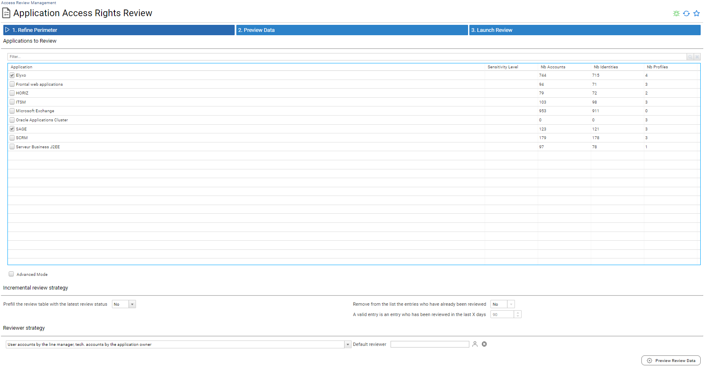

Please note, three steps are required to configure a campaign: 

1. The first step helps you to refine your review perimeter
2. The second step shows the data which will be reviewed
3. The final step concerns review campaign information and launching the review

ALL selected data MUST be reviewed, the reviewer is automatically identified based on the entries to be reviewed:  

- user accounts are reviewed by the line manager
- technical accounts are reviewed by the application owner

### Accounts Review Perimeter

To refine the review perimeter, the advanced mode allows you to include or exclude some types of accounts. For example: User accounts, technical accounts, orphaned accounts and leaver accounts

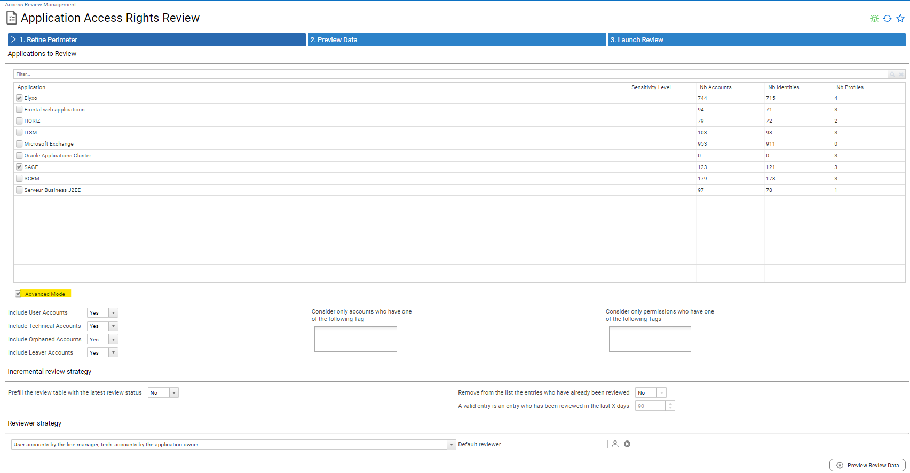

You can configure that only some accounts will be part of the review, ieither by playing with the options (user accounts, orphaned accounts, ...) or by tagging the accounts you want to include in your review thanks to the account search interface.

This is super flexible as it can be for instance used to review only accounts with some attributes or characteristics such as
- Accounts from people working in a given division / country / ...
- Accounts with a given sensitivity level
- Accounts with given controls defects
- ...

In our use case we want to review **ALL** accounts, so lets keep the default configuration

### Accounts Tag

To identify some specific accounts or some specific permissions, creating tags allows you to filter on them. Creating tags should be done before the review configuration.

For exemple, to create a tag and filter on accounts that number of risk is greater than 2, go to accounts search pages and select the rule that correspond to your need. And click on "Bulk add a tag in search results" to create your new tag. This new tag can be use to refine the perimeter of your review.

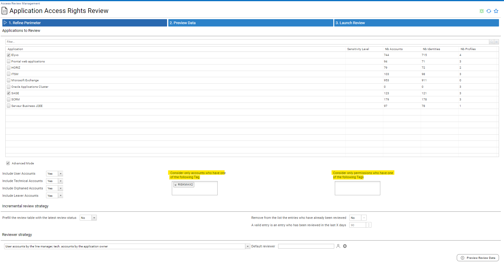

### Permissions Review Perimeter

Once again you can refine your review perimeter in this section by selecting only some permissions to review. In order to do so, you have to tag the permissions that will be part of the review perimeter thanks to the permission search interface.

This is super flexible as it can help you to review only some permissions such as:
- Sensitive permissions
- Permissions with given controls defects
- Admin permissions
- ...

Keep in mind that at the end the review configuration, only the lines whom **BOTH** accounts and permissions are part of the perimeter will be part the review.

In our use case we want to review **ALL** permissions, so lets keep the default configuration

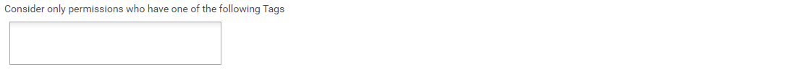

### Incremental Review Strategy

This section will help you to leverage previous access certification campaigns.
When enabled, previous review status will be used to "prefill" review status and review comment.

This happens **only** when:
- The entry has been reviewed in the configured timeframe (*A valid entry is an entry which has been reviewed in the last X days*) 
- In case of an user account, account owner characteristics have not changed since the last review: 
  - Organisation
  - Job Title
  - Internal status

You can also chose to simply remove those entries from the review perimeter if needed (if for instance you only want to review changes that occurred since the last review date, without displaying valid entries)

We won't use this feature for now as it is our very first access review campaign, so let's keep the default values for now

### Reviewer Strategy

This last section helps you to further refine the reviewer strategy.

RACI principle is enforced, as a result there is only **ONE** reviewer accountable for each entry to review.
- In case of several application owners configured in the system, only one application owner is picked (the one who is not 'delegated')
- In case of several direct line managers configured in the system, only one direct line manager is picked. Keep in mind that as a best practice, **DO NOT** configure several direct line managers in your system as it could leads to duplicated lines in some analytics

You can, for application owners, to review **ALL** the accounts, including user accounts.

This can be useful if for instance you need to review "privileged permissions" such as admin access rights granted to admin user accounts (accounts whom login is starting with *adm_* for instance). In this particular use case, you will most probably want to have those accounts reviewed by the application owner instead of the IT department line manager of the user accounts owners.  

Finally you can configure a *default reviewer* which will be used when no valid reviewer is found for a given entry.
This is the case if:
- A user account owner does not have any direct line manager
- The user account owner is no longer part of the company
- The user account owner does not have an email address
- An application does not have any business owner
- The application business owner is no longer part of the company
- The application business owner does not have an email address

As a best practice you should not use this parameter, you should instead ensure that all entries have a valid "manager" by performing a data quality check prior to launch your campaign.
As you will see, if RadiantOne Identity Analytics does not find any reviewer for a given line, it will be highlighted in the next section and you won't be able to start your review campaign.

Let's keep the default values for now and let's move to the next section by clicking on the *Preview Review Data* button

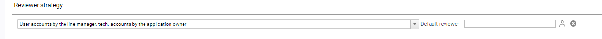

## Step 2 - Preview Data

This section will present a preview of the data to be reviewed as well as the *computed* reviewer for each entry.

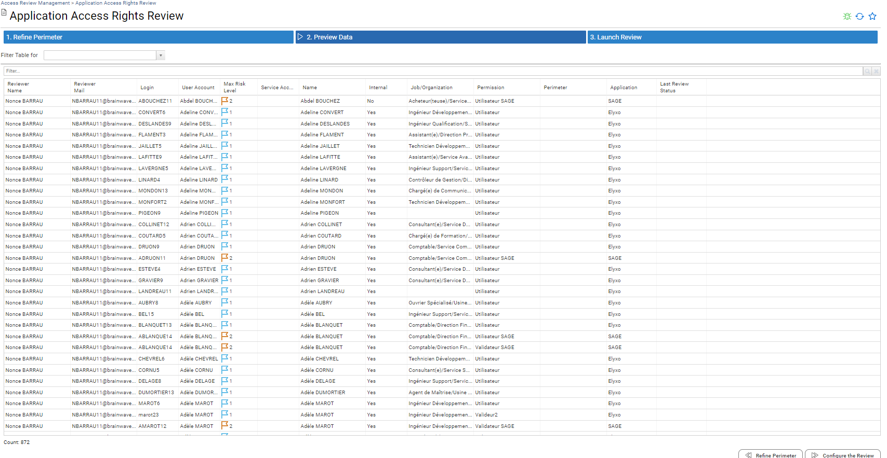

You can browse through the table, reorder the columns, add or remove columns through the options or export the data in CSV/excel format if needed (right click on the table for such purpose)

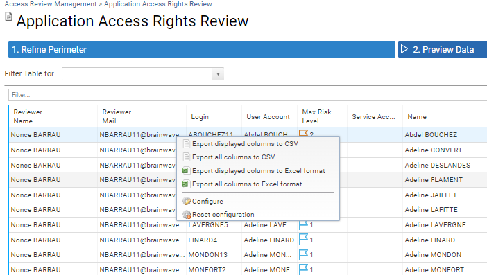

You can also access to objects details by clicking on the corresponding labels (login, name, permission, ...)

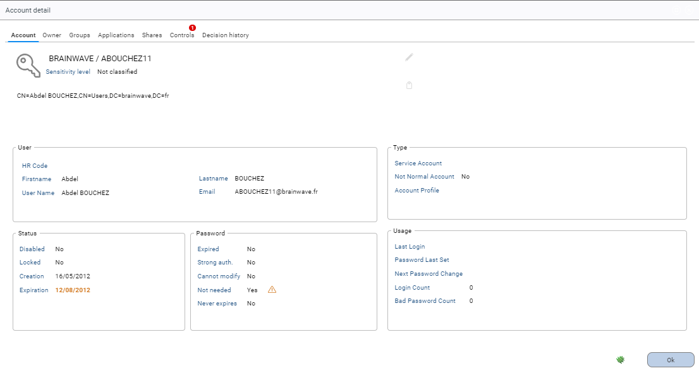

If some reviewers have not been found an error message is displayed on the screen and the * Configure the review* button is disabled. click on the *Refine Perimeter* button and refine your configuration by adding the missing managers to solve this problem.

As you can notice, the corresponding entries are highlighted in red.

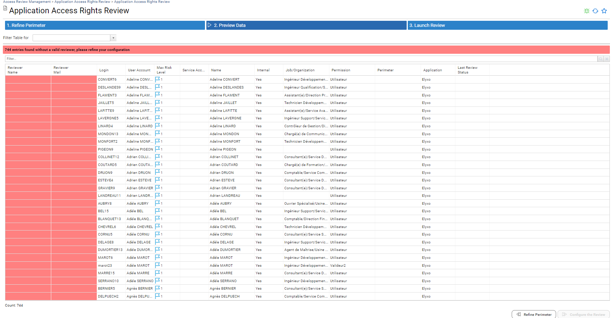

If everything is ok, you can click on *Configure the Review* to move forward

> [!note] If you want to run this access review campaign on a regular basis you can bookmark this page in your favorites by clicking on star button.  
> The configuration will be saved in a way that the queries will be run again when you will access to this page at a later time. As a result, your review perimeter data will be updated with *fresh* data when your will update your entitlement catalog with new data.

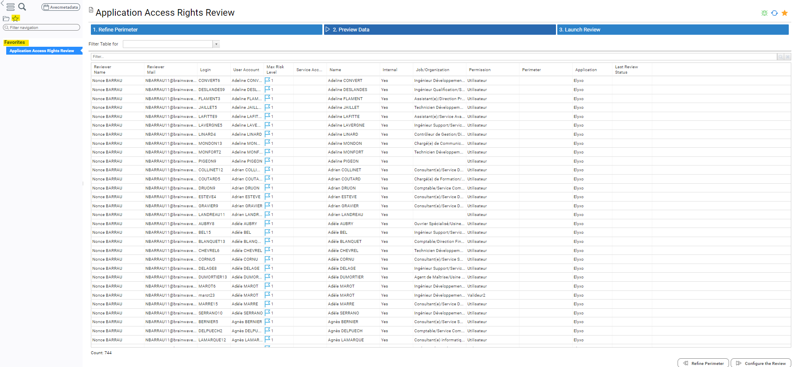

## Step 3 - Launch Review

You are almost done, the last thing you need is to give a pretty name to your review campaign, a due date and a priority number. This priority number can be useful when several campaigns are run at once and you give your reviewers a way to review their entries per priority level.

When self delegation is enabled, the reviewer can reassign its entries to team members (subordinates if reviewing as a line manager, other ressource owners if reviewing as a ressource owner). RACI principles are enforced: the initial reviewer will remain marked as accountable of the results.

When offline mode is enabled you can send notification and gentle reminder emails with the entries to review as an attachment (excel format). The reviewer just has to fulfill the excel document and send it back to the campaign manager once checked, the campaign manager can import those results in the review throught the UI.

1.Complete the entries to review on excel file

2. Upload the excel file . 

3. The number of review entries is displayed.

4. The review progress has been updated

Once everything is fulfilled, click on **Launch the Review** to launch your review.
Please note that it will launch the review **immediately**, but keep calm, it can be cancelled if needed.

## Step 4 - Send an email notification to the reviewers

Once your review campaign has been launched, it appears in the compliance review management page.
You can access to this page through the menu *Review / Access Review Management*

The very first thing you will want to do is to send a notification email to the reviewers. Select your campaign and click on the *Send a message* button

You have several choices here:
- Send a message to all the reviewers with all the entries as an attachment
- Send a message to the remaining reviewers only with the remaining entries to review as an attachment
- Send an email to all the reviewers without attachment
- Send an email to the remaining reviewers without attachment

The first two choices can be useful if you want to send the review content along with the email for instance when you want to enable "offline" reviews by some reviewers (reviewing through an excel spreadsheet instead of reviewing in the UI)
The latter are more "traditional" as they do not include any attachment.

Depending on your review strategy and your review phase (initial notification,gentle reminder), you have to select the right Mail Strategy in the combo box.

In our case, we choose *Send an email to all the reviewers without attachment*, we refine the mail content and we send the message.
Note that we are also sending those mails to *security_dataroom@acme.com*, this is a best practice as it can be used at a later time to prove to the auditors that notifications and gentle reminders have been sent to the reviewers.

The mails look like

## Step 5 - Reviewing entries

Reviewers have received an email and will connect to the RadiantOne Identity Analytics platform to review their entries. Reviewers have to select the review campaign to review. 

As a reviewer I can approve, revoke or comment one by one, I can also perform bulk operations by selecting several entries at once.

I can export data when clicking on the advanced options on the right (...) in CSV or XSLX, activate/deactivate advanced filtering and configure columns.

  

When activating the "Advanced filtering" option, I can filter and sort easily some of the columns like in an excel spreadsheet. 

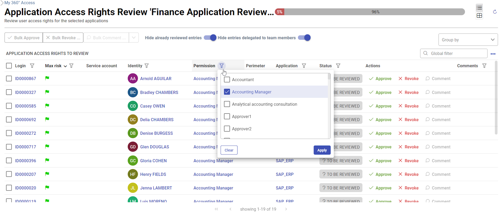  

When clicking on "Configure columns", I can reorder the table, add/remove columns or freeze first/last columns.

  

As I move forward in my reviews, if I check the option "Hide already reviewed entries", I see the list diminishing: all reviewed entries are no longer displayed in the list.
Nevertheless, I can change my mind and I am allowed to change the review status of any entry until the review campaign is finalized.
In order to do so, I just have to uncheck this option.

Only the remaining entries to review are displayed.

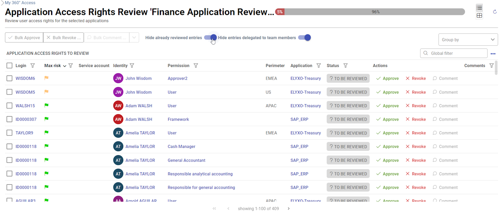

I can filter the entries by account, identity, permission or application thanks to the Global Filter.
This is useful if I want to review the entries by Login, Identity, Permission, Service Account, Application, Review Comment and use bulk operations when needed

Once everything has been reviewed I can close my web browser. I can change my mind and update review status by displaying reviewed entries by unchecingk the option "Hide already reviewed entries".

### Grouped list mode review

To facilitate the review, reviewers can group entries by account login, identity name, permission or application. This mode allows bulk approval or bulk revocation.  

Grouped by permission:

Grouped by application:

### Pivot table mode review

This mode is a graphic mode and allows reviewers to have graphic view.  

All entries can be organized to have a rapid view and help to identify discrepancies between accounts. Click on the button highlighted in yellow bellow. Discrepancy accounts will be quickly identified. With this mode bulk approval and bulk revocation are interesting. 

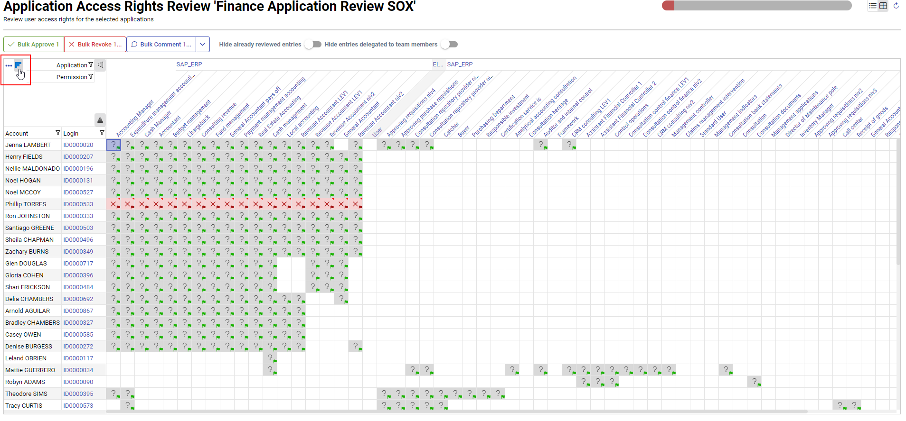

Filters on the pivot table can be directly applied to faciliate review.

## Step 6 - Measuring campaign progress and sending gentle reminders

Once connected as an administrator to the RadiantOne Identity Analytics platform, I select *Access Review Management* in the menu and pick my campaign to show its details

I can have a look at the current status and statistics.

I can also browse through the review perimeter to check the current review status

Finally, I can have a look at the requested actions so far (keep in mind that until the review is not finalized those decisions can change)

For now, I want to send a gentle reminder to the reviewers, I go back to the *Access Review Management* interface, I select my review and click *Send a message*

## Step 7 - Reviewing entries and delegate some entries to review to my team

Noel HOGAN receives a gentle reminder, he connects to the RadiantOne Identity Analytics interface to do the review.
He wants to delegate the review of all the "Elyxo" entries to a member of his team, responsible for this application.

He filters the list to show only entries related to elyxo  

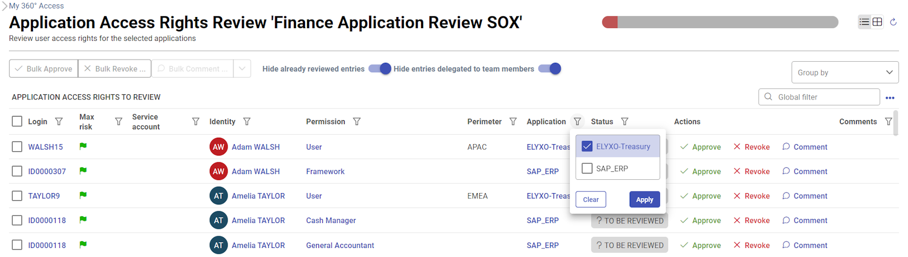  
 
and he selects all entries thanks to the *Check all* option  

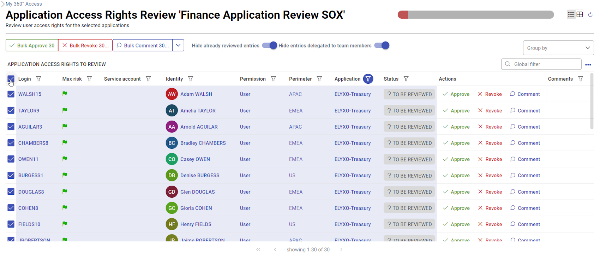  

and select *Ask team for help...*

  

Noel can now pick a team member to delegate those entries.

  

The following delegation principles are applied:

- When an individual reviews an entry as a *line manager* of the account owner, he can only delegate this entry to a team member
- When an individual reviews an entry as an *application business owner*, he can only delegate this entry to the other application business owners
- When you want to delegate several entries at once, the list **must** be uniform (you cannot delegate at the same time *line managers* entries and *application owners* entries)
- When you are the *default reviewer* of an entry, you cannot delegate it 
- You cannot delegate the review of an entry in a way that one will have to review himself

When Noel clicks on "Check", if the person cannot be the reviewer, the solution gives him the reason in a window:
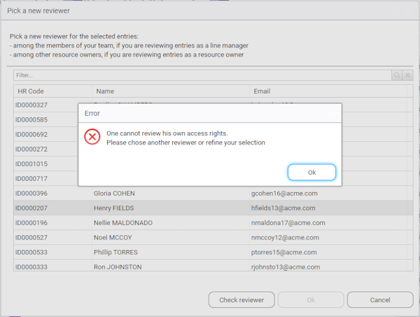

In case of doubt, you can display the 'Reviewer origin' column in the table.

Noel selects Philip TORRES in the list:

  
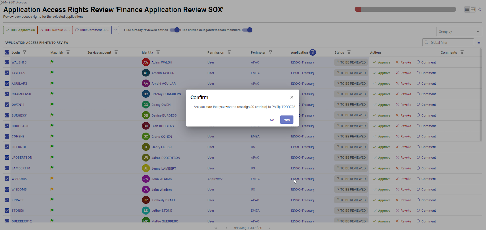  

Once done, the entries are now assigned to Philip. 
However, if he changed his mind, he still can display the related entries by unchecking the option "Hide entries delegated to team members".
He can also add columns, like the "Reviewer name", to manage entries if he has different delegatees, by clicking on the "..." on the right and selecting "Configure columns".

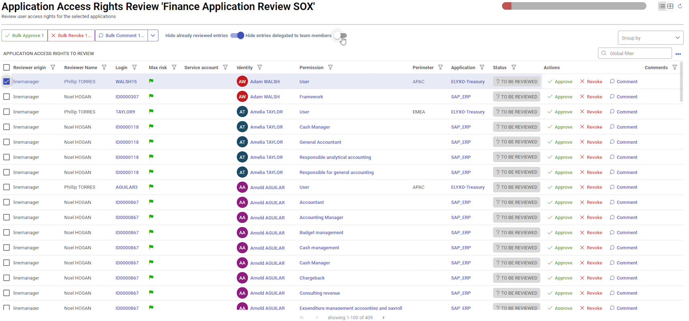  
  
Then he still can select them and reset them in order to delegate them to another person.  

  

> [!note] From a campaign management perspective we keep track of all the delegations by enforcing the RACI principles.  
> The initial reviewers are considered as **accountable** while the delegated reviewers are considered as **responsible**.  
> This can be highlighted in the campaign management interface.

As you can notice, a small icon appears at the beginning of the line because this review has been self-delegated. You can further display the *'*accountable name* if you want to have both the **responsible** and the **accountable** information.

If needed you can reset the delegation status by selecting those entries and clicking on *Force bulk reset*

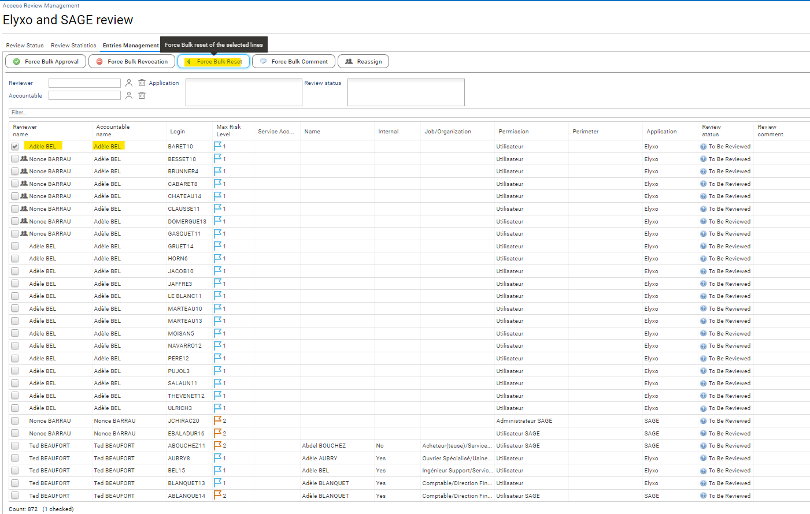

## Step 8 - Finalizing the review campaign

The campaign is now almost done, only some entries still need to be reviewed.

Regarding Adèle BEL, after a quick call with him, the campaign manager decides to approve the 15 entries
In order to do so, he switch to the *Entries Management* tab and force those entries status.

As you can see, once forced as *approved*, those entries have been marked as reviewed as *Nonce BARRAU* (the campaign owner) on behalf of *Adèle*. It means that when you force a review status as an administrator, RadiantOne Identity Analytics considers that you are acting **on behalf of** the accountable reviewer.

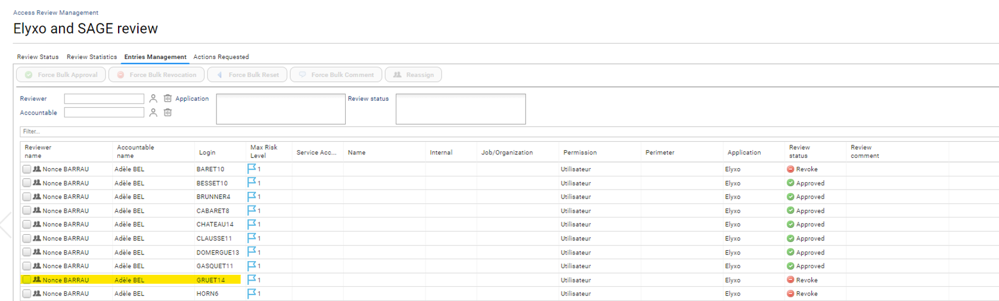

The campaign is now done, let's go back to the *Access Review Management* page and finalize it:
Select the campaign and click on *Finalize*

As some entries still need to be reviewed, a warning message appears and a decision regarding those entries must be taken:
- mark those remaining entries as to be *revoked*
- mark those remaining entries as *ok*
- mark those remaining entries as *not reviewed*

In our case we will mark them as *not reviewed* even though we **know** that it will correspond to a review failure

> [!note] Once finalized a review cannot be updated anymore. The remediation will be automatically launched once the campaign is finalized. This background operation can take some time.

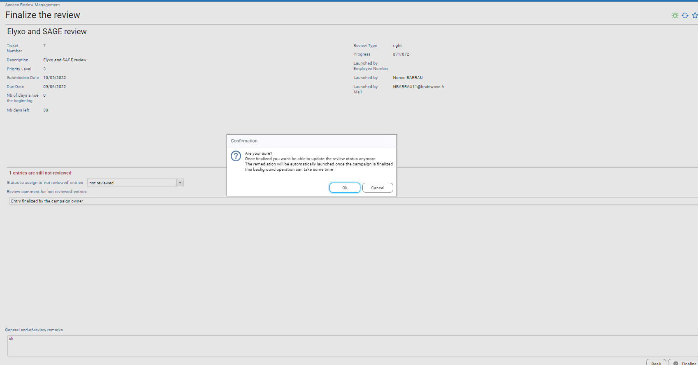

The review is now finalized, a compliance report is automatically generated and can be downloaded through the *Access Review Management* interface. Please refresh the page before. 

You can also browse the campaign details to access the KPIs

> [!note] *Review status* and *Actions Requested* link to *accounts* and *permissions* objects in the Identity Ledger, therefore if data is refreshed and those objects disappear they won't be listed anymore. As a result consider the compliance report as the **only** source of trust to prove that your review perimeter has been done. 

## Step 9 - Following up the remediation

Once your review campaign is finalized, requested remediations are automatically triggered.
You can follow up the remediation progress through the menu entry *Remediation management*

By default, it gives you a consolidated overview of *all* the remediation, whatever the campaigns.

Each remediation is associated with the corresponding **application technical owners**.
While remediation are in progress, application technical owners will see those remediation in their interface.

A remediation is following a simple ITSM change management process. Each remediation has its own current status and open/close state.

In our use case, once the *remediation management* displayed, the administrator can follow up the remediation
We can notice that some action have already been made

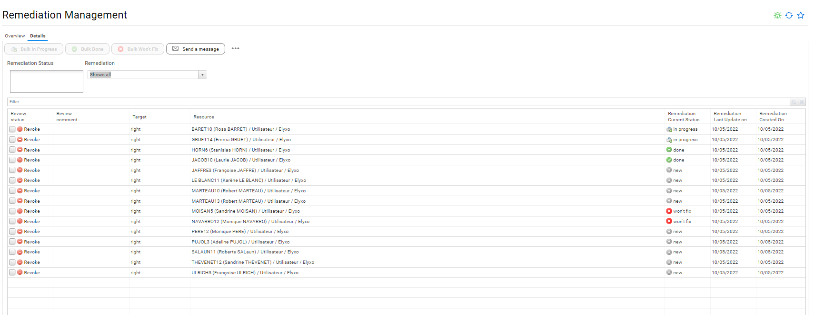

We can filter the remediation UI for our campaign thanks to the *Advanced Filters* feature in the *Details* toolbar as for now we only want to follow up remediation progress related to our campaign

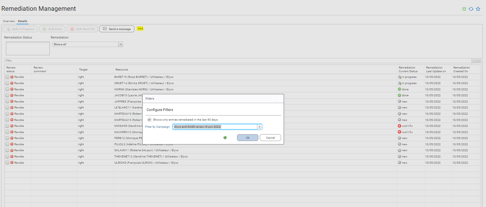

We click on *Send a message* in order to send a mail to **all** the application technical owners with pending remediation

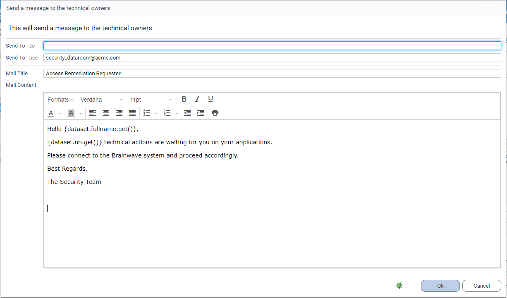

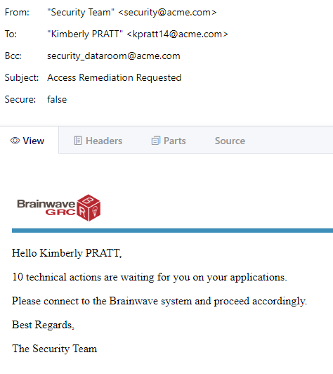

## Step 10 - Revoke entries as an application technical owner

As a technical SAP application owner, Kimberly receives an email.
She connects to the Identity Analytics platform to access the pending remediation list.

She revokes all the access in SAP except the one for MARTEAU13 as this one is still needed

## Step 11 - Double-check that all remediation have **really** been done

Once remediation are marked as done in the Identity Analytics platform, the RadiantOne Identity Analytics administrator refresh the data by extracting and loading fresh data from the target systems (HR, SAGE and Elyxo)

The Identity Analytics administrator can double-check in *Remediation Management* if everything is ok.
In our case, although Kimberly has marked the remediation as been done, nothing has been done in SAP: The access rights are still active

This is automatically highlighted in the *Remediation Management*: A new section *discrepancies* appears and list all those problems

The Identity Analytics  administrator now have to investigate with the application owner why we ended up with this situation

