# Key Concepts

This chapter presents the key concepts of access certification.

## Access Review Process

As seen in the previous chapter, access certification is a straight forward process involving 3 actors:

- Campaign owner
- Reviewer
- Resource technical owner

The campaign owner is responsible for configuring, launching and animating an access certification campaign.
In order to configure and launch a campaign, you must either be a **functional administrator** or a **technical administrator** of the RadiantOne Identity Analytics platform.

The reviewer is either a **direct line manager**, a resource owner set as **reviewer**, a resource owner set as **business owner** or **the user himself**.
Each "user account" or "access right" will be reviewed by the account owner direct line manager.
All the other entries (technical accounts, orphan accounts, ...) will be reviewed by the resource owner.
The application owner can be either defined as a **reviewer**, or **business owner** or **technical owner**. This can be updated in the application detail pages from the web portal or in the collect.

The *application technical owner* is involved in order to apply the requested changes once the access review is finalized.

This can be summarized as:

Once a campaign is configured, it is immediately launched.
The campaign will remain active until it is finalized by the campaign owner. A campaign due date is part of the campaign configuration and is displayed in the management interface.

Several campaigns can be launched at once. From a end user perspective, all entries to be reviewed are displayed in the same interface. The end user can still filter the entries per priority level, due date or even campaign to better manage his review operations.

The campaign **must** be finalized by the *campaign owner* thanks to the *Management Interface*. When a campaign is finalized, all entries are marked with a review status:

- ok
- revoke
- not reviewed

A compliance report is generated and all revoked entries are marked as to be remediated.
The remediation is active immediately when the campaign is finalized.

Remediation can be both embedded or delegated to a third party ITSM such as ServiceNow.
Embedded remediation follows a simple ITSM change management process:

Each entry will be tracked individually. The *application technical owner* is responsible for the remediation. 
Entries to remediate are displayed in his user interface.

Once an entry has been marked as *successfully remediated*, it will automatically be part of the control plan:
When a new Timeslot will be loaded, those remediation will be checked against the entitlement catalog in order to detect any discrepancy:
An access right still presents although it has been marked as *successfully remediated*. The list is available through the *Remediation Management* interface.

## Campaign configuration

**Compliance** is at stake here. As a result, campaign configuration is all about defining a perimeter of what **needs** to be reviewed.
In order to do so, campaign configuration starts with identifying the applications which will be part of the access review.

You can further refine the review perimeter by specifying that only some accounts/permissions will be part of the review.
The best practice is to *tag* those accounts/permissions and to specify those tags in the campaign configuration interface.

Remember that the reviewer is either a **direct line manager** a **resource owner** or the **user himself**.
Each "user account" will be reviewed by the account owner direct line manager
All the other accounts (technical accounts, orphan accounts, ...) will be reviewed by the resource owner.

This is computed during the campaign configuration.
In order for a campaign to be valid, **all** entries must have a reviewer assigned to them. If it is not the case, an error message is displayed in the *Preview data* panel which prevents you from launching the campaign.

You can refine the reviewers by browsing and updating the entitlement catalog management information.
A line manager is configured through the *identity detail* page.

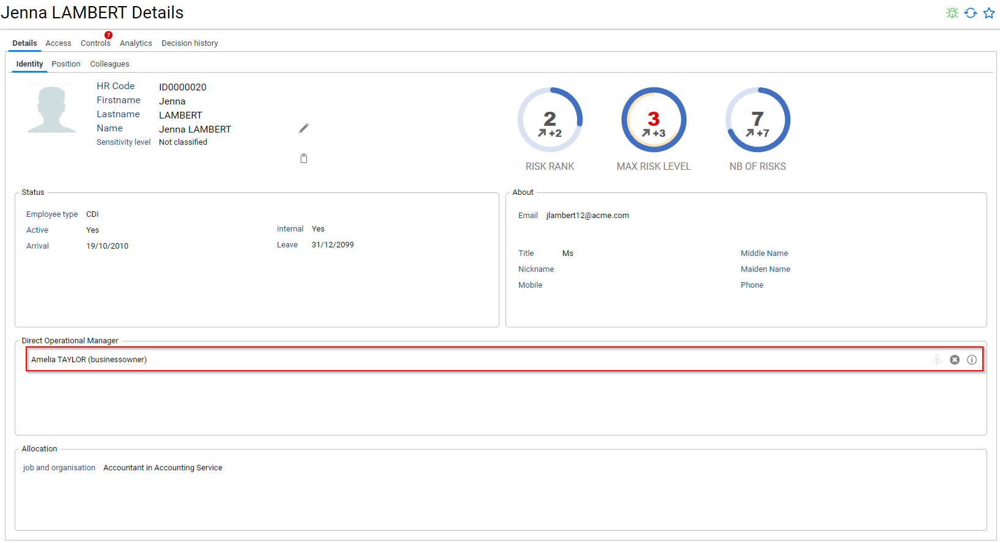

An *application business owner* or *application reviewer owner* is configured through the *application detail* page.

You can also configure a *default reviewer* in the campaign configuration page.

Keep in mind that a manager is considered valid only if:

- He is still *active* (departure date < current date)
- He has a *valid* email address

RadiantOne Identity Analytics is enforcing the **RACI principles**, as a result each reviewer identified during the configuration phase is considered **accountable** for reviewing its entries.  

There is **only one accountable reviewer per entry**. If several application owners are configured, Identity Analytics will pick the most important one (most probably the one who is not marked as a delegated manager) starting first with the *application reviewer owner*, then the *application business owner*. If several managers have the same priority ranking, RadiantOne Identity Analytics will pick one amongst the list.  

Regarding direct line managers, as a best practice you **should not have** several direct line managers assigned to an identity. If it is the case, RadiantOne Identity Analytics will pick one amongst the list.  

As you will see in the next chapters, the **accountable reviewer** can still reassign entries to his peers, they will then be considered as **responsible** for reviewing their entries *on behalf of* the accountable reviewer.

Once the configuration is done, you can launch the review. It will be launched automatically, it means that the entries to be reviewed will appear in the reviewers home page.

> **Note:** Once the campaign is launched, the reviewers are definitely assigned to their entries, it means that if you refresh your data afterwards and some management information change, it won't have any effect on the reviewers, they will still have to review their assigned entries.

## End User Functionalities

Entries to review are accessible through the end user interface.
As long as entries still need to be reviewed, *Entries to review* are displayed in the **first** panel "Access 360"

You can either review entries one by one or through bulk operations by selecting several entries and clicking on *bulk approval*, *bulk revocation* in the contextual menu.
You can reorder the table, and filter the entries either by selecting a given account/identity/permission/application or with the free text filter.

A contextual menu accessible with a right click on the table helps you to:

- export the table content in CSV/Excel format
- reorder columns
- add/remove columns
- select/unselect the displayed entries at once

> **Note:** Table configuration is *persistent*, it means that if you reorder/add/remove columns this will be *saved* in your personal settings. If you want to roll back to the default configuration you need to *Reset configuration* through the Table contextual menu.

By default, **all** entries which still needs to be reviewed are displayed in the table.

You can change your mind until the a review campaign is finalized even if you already have reviewed all your entries. 

In order to do so, you have to uncheck *Hide already reviewed entries*.

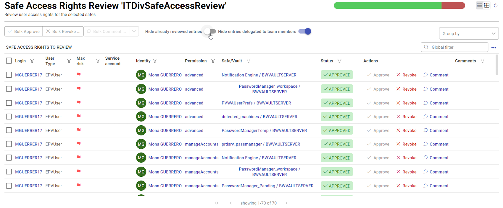

You can reassign entries to your peers through the contextual menu. In order to do so, you have to select the entries you want to reassign and pick *Ask for help to*. The "ask for help to" button is active if in the campaign configuration you have select the option "Enable Self delegation"

Please consult the [Reassigning entries](#reassigning-entries) chapter for more information about reassigning entries.

Finally, you can declare that you are not the reviewer for some entries. In order to do so, you have to select the entries you want to reassign and pick *I am not the reviewer*.
Those entries will be removed from your list, the campaign owner will be able to identify those entries through the management interface (as their review status wil be "to reassign") and reassign them as needed.

## Management Interface functionalities

The management interface helps you to manage ongoing campaign and to browse through finalized campaigns.

The following actions are allowed on an ongoing campaign:

- Send notification to the reviewers
- Pause / resume a campaign
- Import review status from an excel spreadsheet
- Finalize the campaign

The following actions are allowed once a campaign is finalized:

- Download the compliance report

You can also browse inside a campaign to access its details, display a planning of all the campaigns and delete a campaign.

> **Note:** Deleting a campaign will remove **all** information associated with this campaign, including review information and remediation information. This cannot be undone. You should use this with caution.

### Campaign detail page

The campaign detail page gives you a real-time view of your campaign progress.
Through this page you can access to a series of KPIs

- review perimeter 
- Nb of applications to review
- Nb of reviewers
- Reviewed entries so far
- Actions identities so far
- Statistics around the nb of entries to review per reviewer (percentile, min, max, ...)
- Completion ratio
- Decision synthesis
- Campaign activity
- Backlog
- ...

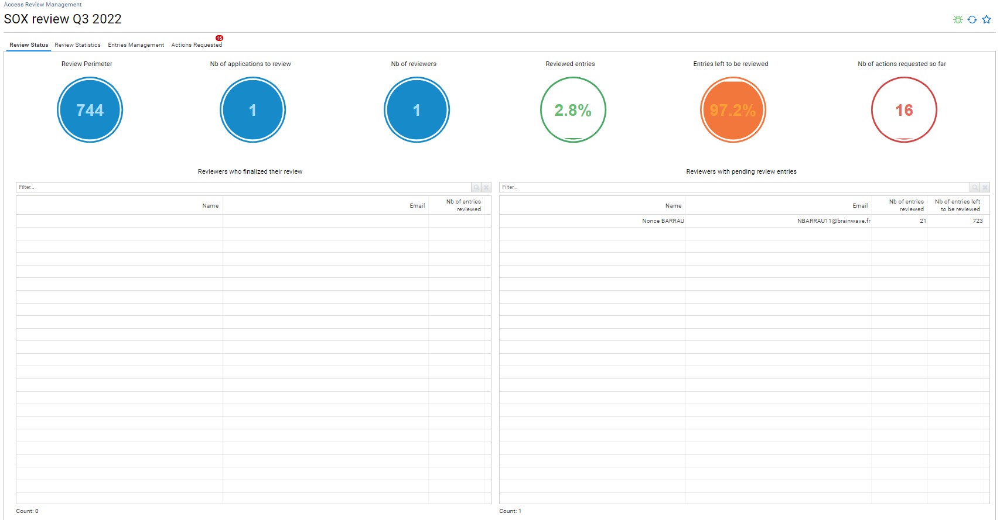

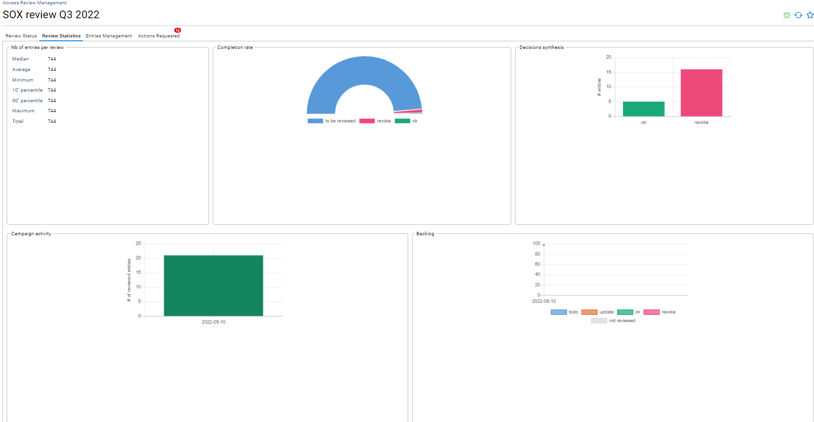

You can also access to a real time view of the entries being reviewed with filtering/grouping/export capabilities and identity/permission context as well as a real time view of the actions identified so far with filtering/grouping/export capabilities and identity/permission context

As an administrator, as long as the campaign is not finalized, you can perform bulk review operations, reset current review status (status, comment and reassignment) and reassign review entries

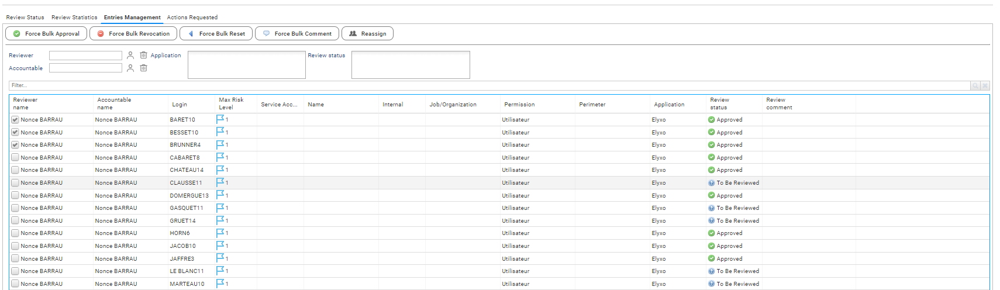

> **Note:** Due to performance constraints, you cannot perform bulk operations of you have more than 10.000 entries displayed in the list. If this is the case, consider using search bar to reduce the number of items displayed in the table.

> **Note:** Due to a technical constraint, you cannot reset review status on more than than 1.000 entries at once.

The last tab gives you a view of the remediation decision taken so far, keep in mind that a reviewer can still change is mind until the campaign is finalized. As a result, those decisions are temporary and are not considered as actionable remediations until the campaign is finalized.

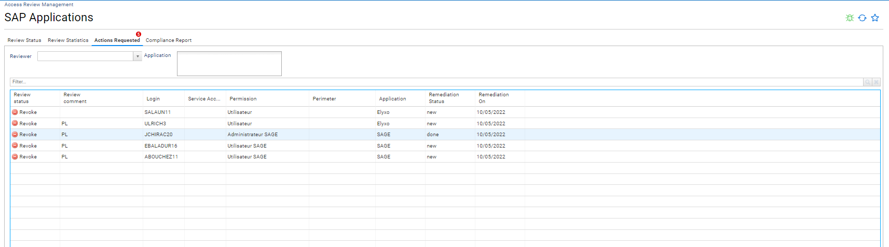

## Remediation Interface functionalities

The remediation interface helps you to manage remediation decisions taken during the review process.  

This interface presents a unified view of **all** remediations. Through this page you can access to a series of KPIs

- Total nb of remediation
- Nb of pending remediation (ready to start)
- Nb of active remediation
- Nb of active remediation > 7 days
- Nb of remediation done
- Nb of remediation cancelled
- Remediation velocity
- Active remediation status
- ...

You can also access a real time view of the entries being remediated with filtering/grouping/export capabilities and identity/permission context.

As an administrator, you can perform bulk operations on the remediations. You can also send notification to the **application technical owners**

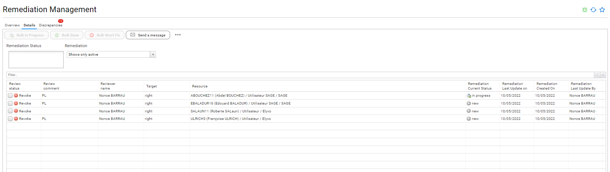

Finally, if discrepancies are found, they are displayed in a dedicated tab.

> **Note** A discrepancy corresponds to a case where an entry has been marked as to be revoked, has been successfully remediated (remediation finalized with a closed status "Done") and yet is detected as still active upon data refresh.

### Configuring the remediation strategy

You can select for each individual application and each individual repository the remediation strategy that you want to apply.  

To do so, access the *Remediation Strategy Management* page under *Settings/system*.

In this page, you can:  

- Declare third party ITSMs for remediation
- Declare third party RPA for remediation
- Assign a remediation strategy for each individual repository
- Assign a remediation strategy for each individual application

#### Declaring a new third party ITSM or RPA

The last tab helps you declare a third party ITSM for remediations. For the moment only ServiceNow and Jira Cloud are supported off-the-shelf.

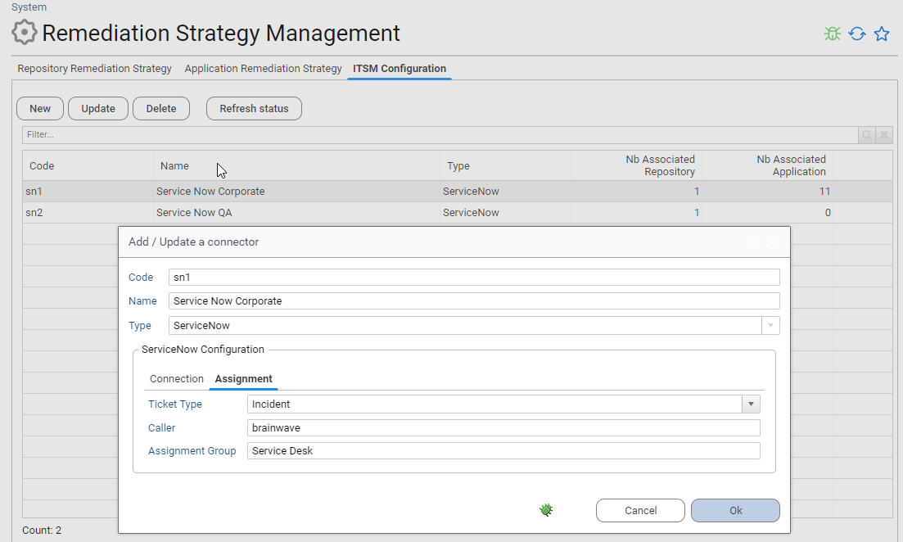

In order to add a new third party ITSM, you **MUST** provide:  

- the URL endpoint
- the account login used to connect to the ITSM
- the account password used to connect to ITSM
You also **SHOULD** provide additional information related to the ITSM such as
- The caller name (ServiceNow user id)
- The assignment group (for ServiceNow)

Please note that both the caller and the assignment group will be resolved when creating a ticket, by searching them in the ServiceNow database. Therefore, you **must** avoid any typo here.

Note that you can declare the same endpoint several time. This can be useful if you want for instance assign remediation actions to different *assignment groups* depending on the target system (repository or application)

Declaring a new RPA is done by selecting "Mail notification" in the list.
A mail will be sent for **each** individual remediation. The purpose of this mail is to be analyzed by a robot (either an ITSM or a RPA to automate actions upon reception).

#### Assigning a remediation strategy to a repository or an application

You can assign a remediation strategy for each individual repository and application:

* Repository remediation strategies will be used for accounts related reviews
* Application remediation strategies will be used for access rights related reviews  

By default, if no remediation strategy is assigned, an *embedded* remediation strategy will be used.

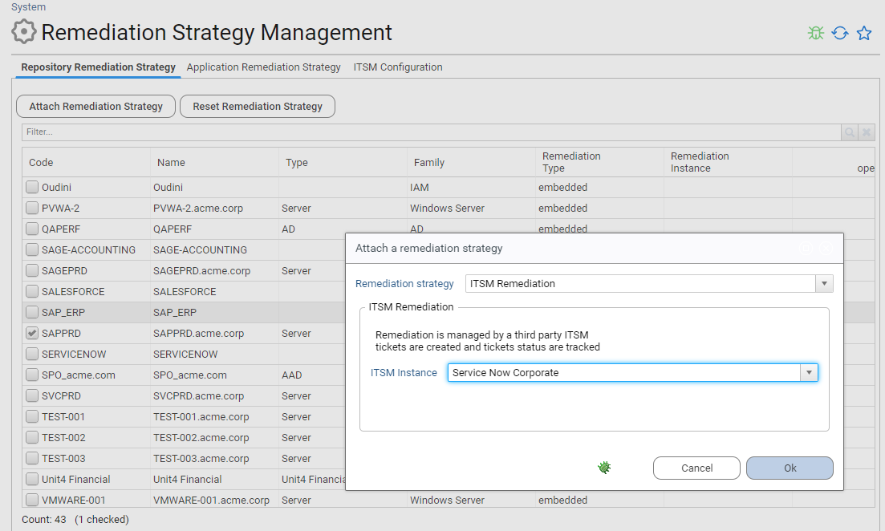

> **Important:**  
> - You cannot change a remediation strategy if you have pending remediation actions.
> - You cannot remove an ITSM definition if it is associated with a repository or an application

### Launching pending remediation

Once a review is finalized, remediations are automatically created based on the target systems review strategies.

These remediations are assigned special state called *pending* (corresponding to an *init* status). These remediations are visible in the remediation interface but are not launched yet. This gives you a final chance to review what changes will be done in the target system.  

This is the case for **any kind** of remediation, regardless of the remediation strategy.

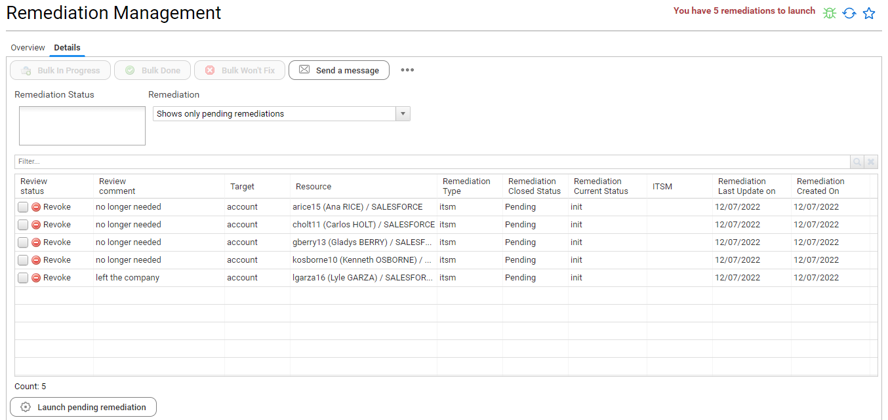

You can manually mark those remediations if needed (done / won't fix).  

Once you are comfortable with the list of remediation actions to perform, you can launch them using the *Launch pending remediation* button. This will populate the *action requested tab* for technical owners for embedded remediation scenario and will automatically create ITSM tickets for ITSM scenario.

Note that for ITSM scenario, RadiantOne Identity Analytics adopts a consolidation strategy: The product will consolidate all requested changes for each target system and will create a single ticket per target system. This allows to avoid situations where after the execution of an access review campaign thousand of tickets are automatically created in the ITSM. 

All requested changes are presented as an attachment to the ticket.

RadiantOne Identity Analytics will retrieve the ITSM ticket number as well as its current status.

### Refreshing ITSM tickets status

You can manually refresh the status of all active ITSM tickets through the menu.

Note that even though a remediation is managed through an ITSM, you can still manually force its status with the "Bulk in progress", "Bulk done" and "Bulk won't fix" buttons.  

As "Bulk done" and "Bulk won't fix" will move the selected remediations to a finalized state. RadiantOne Identity Analytics will no longer query ServiceNow to update the ticket status. 

This is not the case for "Bulk in progress". You should mark an ITSM ticket as "In Progress" only if you want retrieve the latest ITSM status and that this remediation was previously marked as "finalized".

## Users notification

The administrator can send emails to the stakeholders both from the *Access Review Management* interface and the *Remediation Management* interface.

### Access Review Notification

Access review notification are sent from the *Access Review Management* interface on a campaign per campaign basis. 

You have to select on an-going campaign and click on *Send a message* to send a notification.

Notification are sent to the current *responsible* reviewers (consult [Reassigning entries](#reassigning-entries) to understand the difference between accountable and responsible)

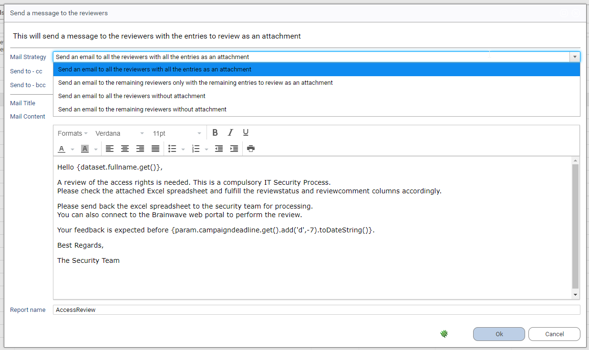

The *Mail strategy* will help you to handle all typical use cases:

- initial notification
- gentle reminder
- offline review

You can personalize both the mail title and mail content.

Some dynamic variables are available for your convenience:

- reviewer employee number as a String: *{dataset.hrcode.get()}*
- reviewer fullname as a String: *{dataset.fullname.get()}*
- reviewer email address as a String: *{dataset.mail.get()}*
- reviewer direct line manager employee number as a String: *{dataset.linemanagerhrcode.get()}*
- reviewer direct line manager fullname as a String: *{dataset.linemanagerfullname.get()}*
- reviewer direct line manager email address as a String: *{dataset.linemanagermail.get()}*
- campaign title as a String: *{param.campaignname.get()}*
- campaign description as a String: *{param.campaigndescription.get()}*
- campaign priority as a String: *{param.campaignpriority.get()}*
- campaign deadline as a Date: *{param.campaigndeadline.get()}*
- attached report name as a String: *{param.reportname.get()}*
- emailcc as a String: *{param.emailcc.get()}*
- emailbcc as a String: *{param.emailbcc.get()}*

Content is rich text (html based).

### Embedded Remediation Notification

Remediation notification are sent from the *Remediation Management* interface for all pending remediation regardless of the campaigns.

Notification are sent to **all** application **technical owners**, it means that if you have several application owners for a given application they all will receive a notification

**Note** If you filter the *Remediation Management* interface for a given campaign through *Advanced Filters*, notification will only be sent to *application technical owners* associated with this campaign for *embedded remediation* only

You can personalize both the mail title and mail content.

Some dynamic variables are available for your convenience:

- technical owner employee number as a String: *{dataset.hrcode.get()}*
- technical owner fullname as a String: *{dataset.fullname.get()}*
- technical owner email address as a String: *{dataset.mail.get()}*
- technical owner direct line manager employee number as a String: *{dataset.linemanagerhrcode.get()}*
- technical owner direct line manager fullname as a String: *{dataset.linemanagerfullname.get()}*
- technical owner direct line manager email address as a String: *{dataset.linemanagermail.get()}*
- campaign title as a String if filtering is enabled: *{param.campaignname.get()}*
- campaign description as a String if filtering is enabled: *{param.campaigndescription.get()}*
- campaign priority as a String if filtering is enabled: *{param.campaignpriority.get()}*
- campaign deadline as a Date if filtering is enabled: *{param.campaigndeadline.get()}*
- emailcc as a String: *{param.emailcc.get()}*
- emailbcc as a String: *{param.emailbcc.get()}*
- Nb of pending remediations as a Number: *{param.nb.get()}*

Content is rich text (html based).

## Incremental review

RadiantOne Identity Analytics supports incremental review scenarios where entries status and comments can be pre-filled based on their latest review status.
You can activate this feature through the campaign configuration

In order for a previous status to be considered valid, it must both:

- have been validated in the configured window timeframe (reviewed in the last X days)
- in case of user account, does not have any account owner characteristics changed as compared when it has been reviewed (organisation, job title, internal status)

By default, those entries are considered reviewed and won't appear in the end user review page **unless** they configure their interface to display **all** entries currently being reviewed.

## Offline review

RadiantOne Identity Analytics allows for hybrid review scenario where reviewers can both perform online and offline reviews.
Offline reviews are operated through excel spreadsheet sent to the reviewers through a notification.

The reviewer can fulfill the excel spreadsheet and send it back to the Identity Analytics administrator, the Identity Analytics administrator can then import this file in the Identity Analytics platform to fulfill the review status and review comment accordingly.

You can only import excel spreadsheet on *ongoing* campaigns.

> **Note** When importing an excel file, **all** reviewed entries will be written, regardless of their current review status in the Identity Analytics platform. It means that if a reviewer has started to review some entries through the user interface and later send an excel spreadsheet, the excel spreadsheet will overwrite the former statuses.

## Reassigning entries

Each entry to review has a reviewer. RACI principles, as a result each entry has both a **R**esponsible and an **A**ccountable.
Only the **R**esponsible reviews the entries. By default, when a campaign is initialized, both fields contain the same value: The reviewer computed during the initialization phase.

One can reassign entries to another individual. As RACI principles are enforced, only the **R**esponsible information is updated.
At the end of the review, it means that you can identify which entries have been reassigned by comparing those two fields. It is visible in the management interface:

As you can see here, the first four entries have been reassigned to Tara BAKER, although Christopher COOPER remains accountable for those entries. A small icon is also displayed to highlight the fact that those entries have been reassigned.

> **Note** When you force a review status through the Review Management interface, it will automatically declare you as **R**esponsible for the entries.

At the end of the review, when the campaign is finalized the compliance report will highlight the reassignments by indicating who is **R**esponsible and who is **A**ccountable for the entries.

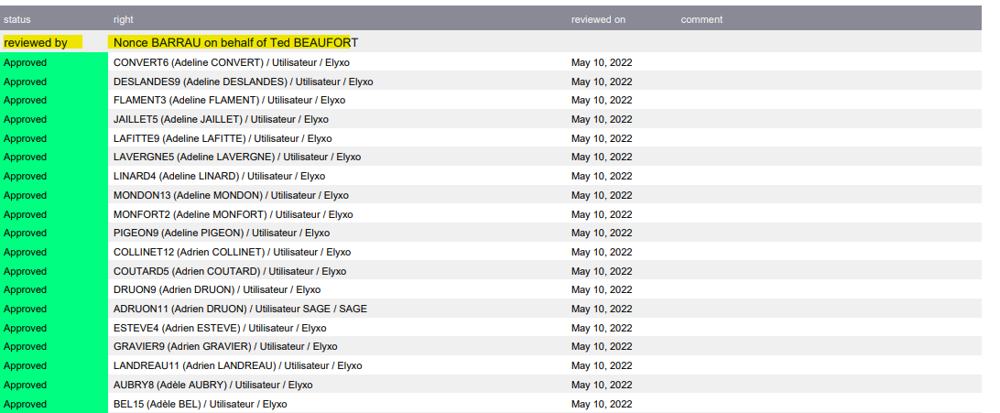

A reviewer can also reassign entries through the review interface. This self-service reassignment is limited as such:

- An entry to review as a line manager can only be reassigned to a team member
- An entry to review as an application owner can only be reassigned to the others *application business owners* 
- One cannot review himself
- An entry to review as the *default reviewer* cannot be reassigned
- When you reassign several entries at once, the reassignment rule **must** be consistent (you cannot reassign in a single click entries to review as a line manager and entries to review as an application owner)

In case of doubt, you can display the *Reviewer Origin* column in the review table.

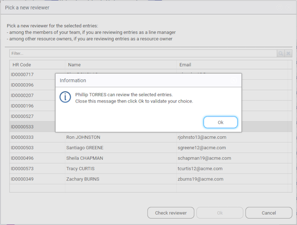

## Compliance report versus Management interface

It is crucial to understand the behavior of the solution when data is updated.

Let's consider this use case:

You are launching a campaign and configure it for 1 month, nevertheless, you still update your identity ledger data on a weekly basis as the solution is also used by internal control people on a weekly basis for ITGC purposes.  

You can end up in a situation where some changes will occur within your initial access certification perimeter:

- some access rights are removed
- some accounts are disabled
- some accounts are deleted
- some permissions are deleted
- management information changes
- reviewers are disabled
- reviewers are removed

RadiantOne Identity Analytics considers the initial review perimeter (the one displayed during the campaign launch) as the one to be reviewed.
As a result, RadiantOne Identity Analytics access certification will automatically adapt its content based on those changes with the following rules:

- if an account or a permission is deleted, the access right no longer need to be reviewed, it is automatically marked as revoked
- if a right/account is disabled, the access right still needs to be reviewed
- if a reviewer (responsible) is removed, the corresponding line will appear in red in the management interface

At the end of the review, it also means that the management interface (review and remediation) lines corresponding to deleted objects (accounts / permissions) won't appear anymore.

If you want to prove to your auditors that you have reviewed 100% of your perimeter, you will have to present the **compliance report** as it will always present 100% of the entries

This information is also presented in the last tab of the campaign management interface. You can use this tab if you want to search for entries or export those information in a form of a CSV file (right click on the "ungrouped" table for such purpose)

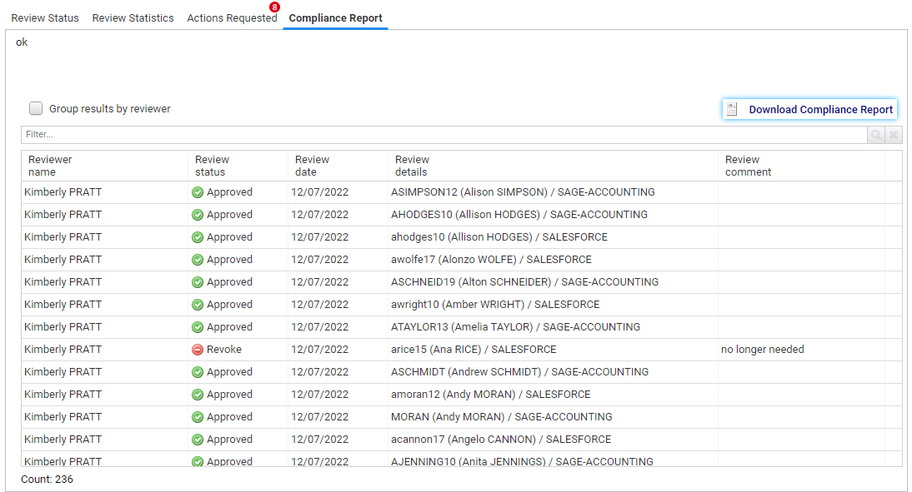

## Discrepancies

RadiantOne Identity Analytics automatically detects remediation discrepancies.

A discrepancies occurs when a remediation fails: The access rights has been marked as remediated successfully, but when fresh data is loaded in RadiantOne Identity Analytics this access right still exists in the target system. 

Discrepancies are accessible in the *Remediation Management*. Discrepancies are also identified as control defects (REM02 - remediation ticket closed and access right not removed)

