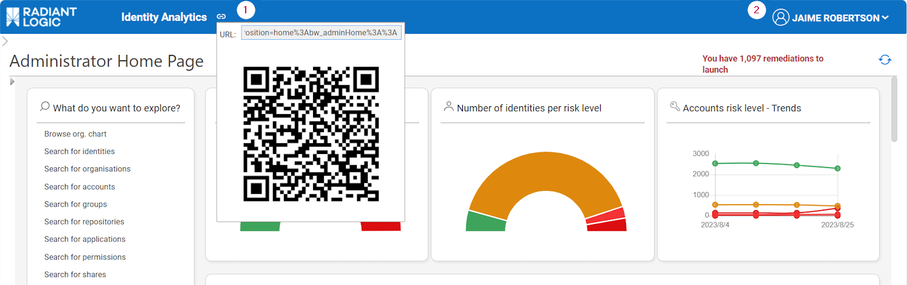
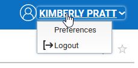
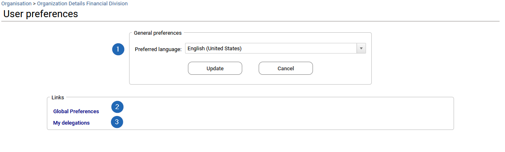
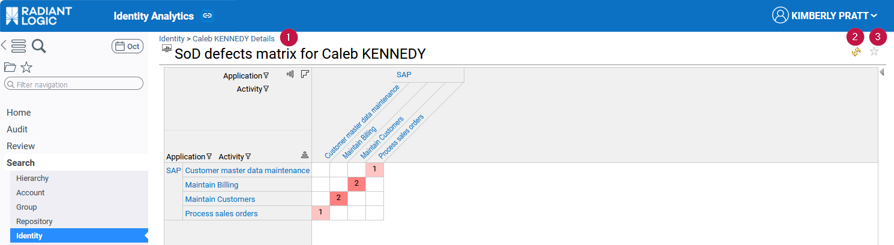
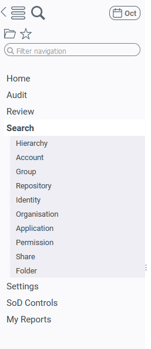
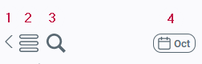
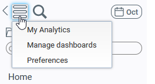
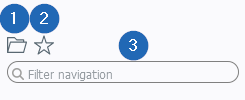
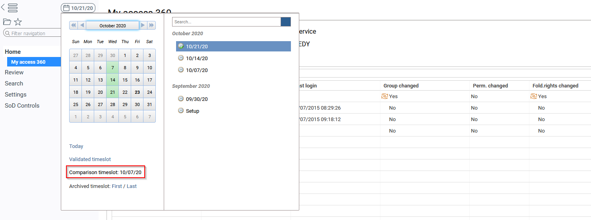

# Identity Analytics Enduser Guide

This document describes the core concepts of the Identity Analytics Platform (IAP) interfaces and dashboards.

It focuses on Identity Analytics end‑user interface concepts and navigation. For installation and configuration details, refer to the IAP Integrator Guide.

For a more general introduction to RadiantOne Identity Analytics and the configuration of the solution, refer to the full documentation:
[https://developer.radiantlogic.com](https://developer.radiantlogic.com)

## General principles

Starting with Identity Analytics version Braille, the solution includes a dedicated web experience called the Identity Analytics Platform (IAP). The Identity Analytics Platform replaces the former Brainwave GRC web portal.

The main difference is that IAP provides a series of off‑the‑shelf analytics, reports, and controls to deliver more value to end users.

IAP is also under active development at RadiantLogic. By deploying IAP, end users benefit from extensive out‑of‑the‑box capabilities as well as regular updates and improvements.

## Manifesto

IAP has been built with a set of general principles in mind:

- **FAST:** Results within 5 seconds, metadata powered.
- **EFFICIENT:** All answers are 3 clicks away.
- **CONSISTENT:** Same navigation and presentation logic.
- **SIMPLE** yet **POWERFUL:** Intuitive UX, rich analytics.
- **RICH:** All concepts are leveraged; details are accessible when needed.
- **TEMPORAL:** All UIs include temporal analysis.
- **SECURITY BY DESIGN:** You cannot see more than what is needed based on your management responsibilities.
- **EXTENSIBLE:** Easy to extend through “Tags”.

## General web portal navigation features

This section describes the general navigation principles of the web portal.  
By default, a header and a left‑hand menu bar are provided to help end users browse through the information.

These header and menu elements are usually customized to match the company’s branding (colors, logo). Additional menu categories and pages may appear to cover specific requirements or to expose new mashup dashboards created by end users.

All screenshots in this document show the default web portal display and do not reflect the specific customizations that may have been implemented in your Identity Analytics project.

### Header

The header provides a QR code and URL generator for the current page (**1**). This allows the end user to directly share a link to the report or dashboard being displayed with stakeholders.  
On the right side of the header, the name of the connected end user appears (**2**).

Clicking the connected end‑user name opens a menu that provides options to log out or access the user preferences page.

### User preferences page

This page allows users to change the preferred language (**1**) and other global preferences, such as choosing to display deleted items by default in all “changes” columns in tables.  

To do so, from the User preferences page, the end user can click on **Global preferences** (**2**) in the “Links” section and set **Include removed items in table trends** to “Yes”.  
See the [Time navigation and changes](#time-navigation-and-changes) section for more information about changes.

In the same “Links” section, clicking on **My delegations** (**3**) opens the delegation management page. This page allows the end user to delegate some of their roles to a colleague for a given period and document the reason for this delegation.

### Top of pages options

At the top of pages, a breadcrumb trail (**1**) shows the navigation path and the display context of the current page. On the right, an icon allows users to refresh the page (**2**) when changes have been made, and a star icon (**3**) lets them add it to their favorites.  

When a page is added to favorites, the related shortcut becomes available from the menu bar in the list of favorites. See the next “Menu bar” section for more details.

### Menu bar

On the left side, the menu bar allows users to browse through the different pages available in the web portal.

At the top of the menu bar, the first icon (**1**) collapses the menu bar to free the full width of the web browser.

A second icon (**2**) opens the options menu:

This menu provides access to:

- The **My Analytics** page, which allows users to create queries on any entities (identities, organizations, groups, permissions, shares, folders, repositories). This shortcut is visible only for users with administrator or auditor roles. See [How to save search results and build your own report](./04-search-pages#how-to-save-search-results-and-build-your-own-report) for more information about this page.
- The **Manage dashboards** page, used to manage mashup dashboards created by the end user or colleagues. This is visible only for users with administrator or auditor roles.
- The **Preferences** dashboard, accessible by any user.

A third magnifier icon (**3**) provides direct access to the **My Analytics** dashboard.  

A fourth icon (**4**) allows navigation through timeslots. See [Time navigation and changes](#time-navigation-and-changes) for more details.

Below these icons, additional options are provided:

- The folder icon (**1**), selected by default, shows the list of categories and pages in the menu bar.
- The star icon (**2**) switches to the list of favorites (pages the end user has added to favorites).
- A search field (**3**) filters the content of the menu bar (the pages list).

By default, all end users have access to the **Home** category, which contains their Access360 home page, named **My 360° Access**. See the [Access 360](./02-access360#access-360) section for more details.

Users with additional roles, such as designer, auditor, or administrator, may also have access to the following categories:

- **Audit**, including the **My Analytics** page to build queries and start creating dashboards (see above).
- **My Reports**, an empty category provided by default to store mashup dashboards created by the end user or shared by colleagues.
- **Settings**, containing administration interfaces such as **Manage dashboards**, **System**, and the documentation.
- **Review**, which contains the review campaign management pages and is available if you have the appropriate license.

### Time navigation and changes

All tables in Access 360 and the Detail pages include a **changes** column that shows the status of an item in the selected timeslot (data upload) compared with a comparison timeslot.

The comparison timeslot is either the previous timeslot (by default) or the previous **reference timeslot** when references are used. This column indicates whether each entry is unchanged, new, or updated compared with the comparison date.

The end user can also display removed entries when needed. This feature is disabled by default to avoid confusion. To enable removed entries, the user must edit their preferences by clicking their name in the header → **Preferences**.

As a general rule, comparison is based on:

- Existence of the element in the comparison timeslot.
- Cardinality of sub‑elements (if any), such as number of permissions, groups, accounts, identities, and so on.

Comparison is **not** performed attribute by attribute. For example, if an account attribute such as *password never expires* is updated, it will **not** appear as an updated entry in the **changes** column.

To see which timeslot is used for comparison, the end user can open the **timeslot selection** dialog (calendar) available at the upper left of the portal. Using this interface, they can also navigate to previous timeslots to analyze past situations. Shortcuts are provided to make navigation easier, such as **Today**, **Validated timeslot**, and **First/Last archived timeslot**.

For more information about this feature and how to change the comparison timeslot, see [Comparison timeslot](./07-customization#how-to-configure-the-comparison-timeslot).

