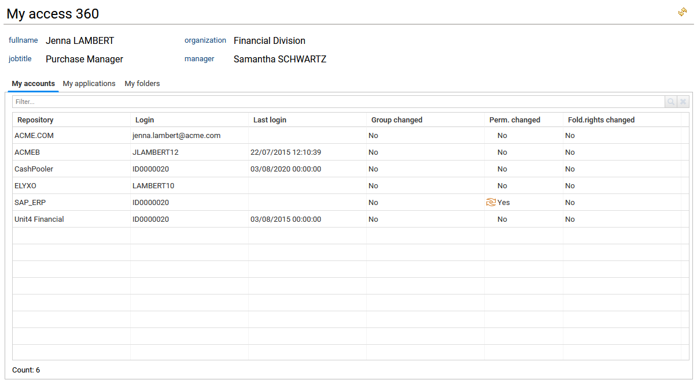
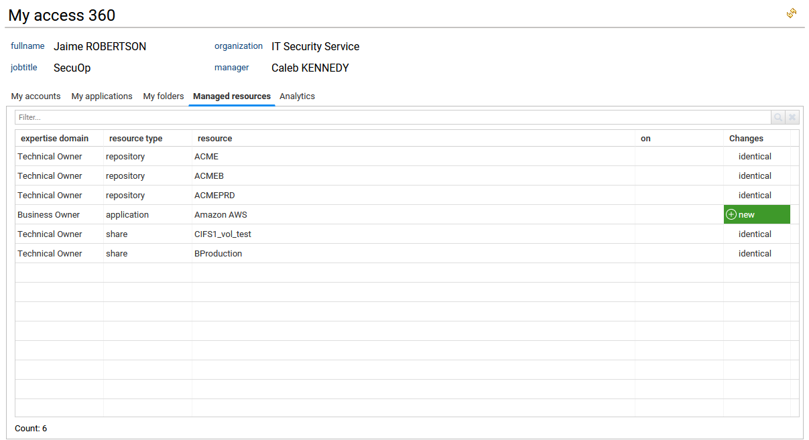
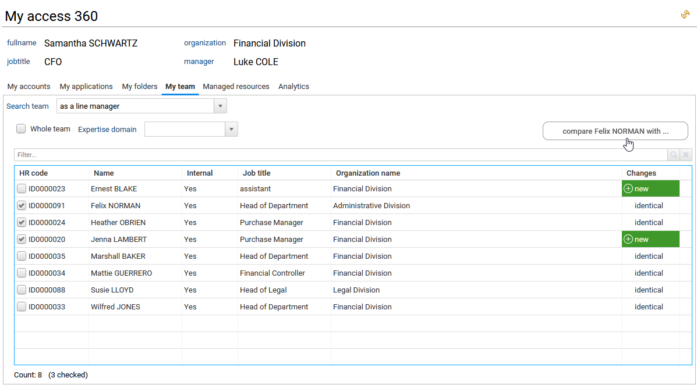

# Access 360

Access 360 is the first page displayed when an end user signs in to the Identity Analytics portal. Its purpose is to provide a quick overview of all access information related to that user: **who they are**, their **task list**, and **what they can access**. It also includes, when relevant, resource management information for users who are application owners, organization managers, shared folder owners, and similar roles.

For most end users, **Access 360** is the only accessible page. As a result, they do not have access to search pages, and drill‑down is only available through the Access 360 interface in order to enforce the **least privilege** principle.

In this case, the left menu remains empty, because only functional administrators, technical administrators, and review campaign managers see additional entries such as **Search**, **Review**, **Settings**, and others. However, if mashup dashboard features are enabled, end users may see additional menu entries on the left.

When tasks are assigned to end users (for example, during an access review campaign), they will find the list of these tasks and their submission dates directly in the first Access 360 tab: **My tasks**.

Depending on the user’s scope of responsibilities, the interface will display more or fewer tabs. The sections below describe the tabs by responsibility type.

## For standard users

For standard users without specific responsibilities over resources or organizations consolidated in RadiantOne Identity Analytics, the Access 360 interface presents an overview of their **accounts**, **applications**, and **folders**.

- In the **My accounts** tab, users see the list of accounts they own, with indicators showing changes related to groups, permissions, and folder rights. These changes are evaluated during the data loading process by comparing the current situation with the previous timeslot.

  

- In the **My applications** tab, the first table lists all applications accessible to the signed‑in user. Selecting an application populates a second table on the right with the related profiles, roles, or permissions that grant that identity access to the application.  
  The right‑hand table is configurable so users can add columns, for example to display the sensitivity level and sensitivity reason for each permission. For more information, see [How to configure tables, columns and export data](./07-customization#standard-tables).

- In the **My folders** tab, users see folder paths and related simplified ACLs for folders they can access. This tab is only available if the appropriate license is enabled (Booster for Data Governance / Unstructured Data).  
  By default, only folders with direct ACLs are shown, not subfolders inheriting permissions. Users can uncheck **Display only folders with ACLs** to view the full list of folders.  
  A **Share family** column indicates the type of unstructured data (for example: SharedFolders (NTFS, CIFS), Microsoft 365 (OneDrive, SharePoint Online, Exchange Online), and others).  
  A set of filters (comboboxes) lets users narrow down the content by share family, specific share, and desired folder depth.

## For resources owners

Resource owners see the same tabs as standard users, plus an additional **Managed resources** tab and an **Analytics** tab.

- In the **Managed resources** tab, the owner finds the list of resources they are responsible for. These resources can be of various types, such as applications, shared folders, shares, roles, permissions, accounts, repositories, groups, and more.

  As the owner, clicking a resource or resource type opens the corresponding resource detail page to analyze and investigate access to that resource. See the [Detail pages](./03-detail-pages#detail-pages) section for more information.

  

- In the **Analytics** tab, all analytics reports available to the resource owner are listed. These analytics can range from simple reports to more advanced management interfaces and are always restricted to the owner’s scope.

  The complete list of analytics reports for any resource type is available from the administration page and documented. See [Analytics reports](./07-customization#how-to-list-all-the-available-analytics-reports-and-their-description) for details.

## For organisation and line managers

Managers see the same tabs as standard users, plus two additional tabs: **My team** and **Analytics**.

- In the **My team** tab, managers can view the list of identities they are responsible for.  
  A combobox allows them to choose which team to display: the team where they act as an **organization manager** or the one where they are a **line manager**.  
  A **Whole team** checkbox lets them include all identities in sub‑departments or sub‑organizations.  
  When viewing the team “as a line manager,” managers can also filter identities by **expertise domain**.  
  They can compare one selected identity with one or more others from the same table. For more information, see [How to compare identities, accounts, permissions or groups with each others](./07-customization#how-to-compare-identities-accounts-permissions-or-groups-with-each-others).  
  Managers can click the identity name or HR code to open the identity detail page and analyze access granted to that identity. See the [Identity details](./03-detail-pages#identities-details-page) section for more information.

  

- In the **Analytics** tab, all analytics reports available to organization or line managers are listed. As with resource owners, these can be simple reports or advanced management interfaces and are restricted to the manager’s scope of responsibilities.

  The complete list of analytics reports for any resource is available from the administration page and documented. See [Analytics reports](./07-customization#how-to-list-all-the-available-analytics-reports-and-their-description) for more details.
