# Detail pages

All detail pages follow the same navigation pattern.  

Each detail page provides a 360° view of the selected entity, organized into a series of tabs. Identity Analytics Services or Platform dynamically precomputes the content of these tabs and automatically hides any tab that is empty or not relevant in the current context. This greatly simplifies navigation, but it can be confusing at first. As a general rule, if a tab is not visible, it is because its content is empty.  

IAS/IAP enforce the **security by design** principle. As a result, the end user cannot navigate away from a detail page through uncontrolled links. When additional context is needed, it is displayed in a dialog box, and dialog boxes can be nested if necessary.  

Context information is available through hyperlinks located in widgets (tables, pivot tables, buttons, and so on).  

Most components (tables and pivot tables) are configurable so that the end user can choose which columns to display and in which order. Users can also export table or pivot table content to Excel format. To do this, right‑click the widget. For more information on table customization, see [How to configure tables, columns and export data](./07-customization#standard-tables).  

## Detail pages main tabs

The following main tabs are available for each resource type:  

- **Details tab** (first tab) shows general information about the selected entity.  
- **Security Model tab** (second tab, optional) shows computed business activities and the *theoretical* access rights for the entity, for example access granted through a ticketing system or an IAM solution. Comparing these theoretical rights with the actual rights in target applications helps identify overallocated access. Because business activities are the preferred way to perform SoD checks, they **must** be loaded if you want to configure SoD controls.  
- **Access tab** (third tab, optional) shows the *actual* access rights correlated from the various data sources (that is, the access rights RadiantOne Identity Analytics has found for this entity on the loaded systems).  
- **Controls tab** (fourth tab) lists all control defects detected for this entity.  
- **Analytics tab** (fifth tab) lists all analytics available for this entity, from simple reports to more advanced management interfaces.  
- **Decision history** (last tab, optional) shows all decisions recorded for this entity, such as access review outcomes or updates made through IAS/IAP (for example, account reconciliation, classification changes, or management information updates).  

## Organisation details page

The organisation details page helps end users identify and mitigate risky situations within their teams. It provides an overview of each organisation’s characteristics and allows risk‑based investigation of members and their access to applications, infrastructure, and data.

In all sub‑tabs of the organisation details page, as in any table in IAP, the end user can configure and add columns and KPIs by right‑clicking the table and selecting **Configure**. For more information on table customization, see [How to configure tables, columns and export data](./07-customization#standard-tables).

When relevant, the end user can also include all sub‑organisations of the selected organisation by using the **only this organisation** checkbox to adjust the filter.

### Details tab

This tab presents general information about the selected organisation through four sub‑tabs:

- In the **Organisation** sub‑tab, key KPIs and management information about the organisation are displayed. For more details about Risk rank, Max risk level, number of identities at risk, and percentage of identities at risk, see the [Risk ranking and risk analysis](./05-kpi#computed-kpis) section.

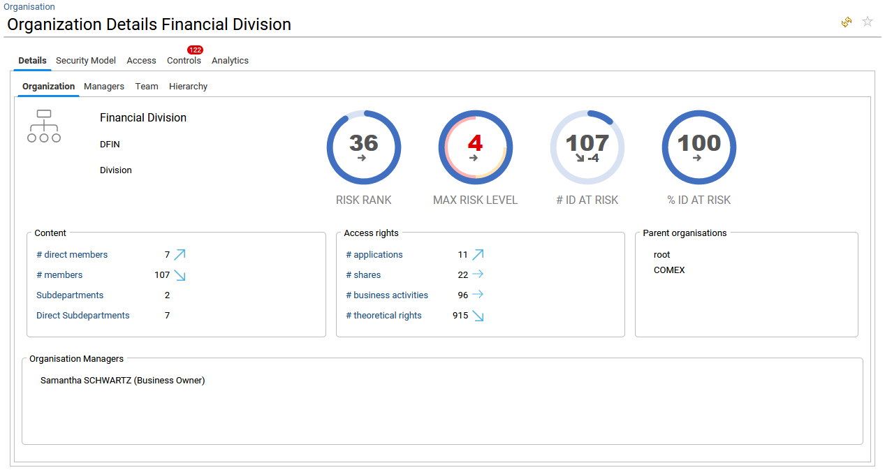

- In the **Managers** sub‑tab, the list of the organisation’s managers is displayed.  
  When the end user is a **functional or technical administrator** (roles `functionaladmin`, `technicaladmin`), they can add a new organisation manager, configure delegations, delete an organisation manager, and access the audit trail of manager updates by using the three icons on the right side of the table.  

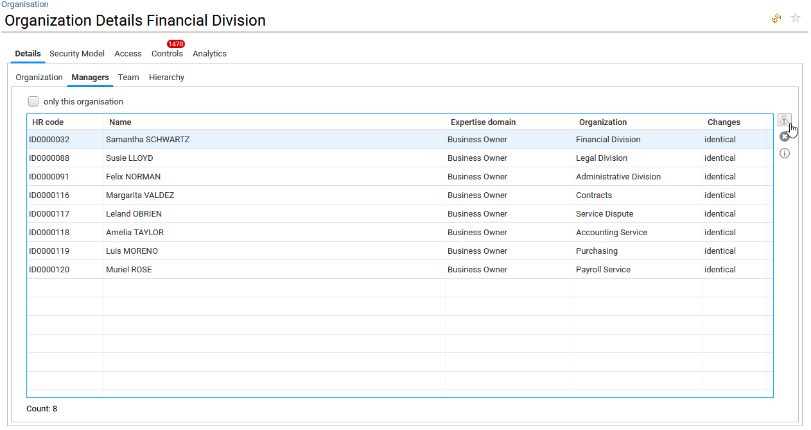

- In the **Team** sub‑tab, the list of team members is displayed.  
  The end user can choose to include inactive identities in this table.  
  They can also compare team members based on their access at application, permission, account, group, share, and folder levels by selecting two or more identities and clicking the **Compare** button. For more information, see [How to compare identities, accounts, permissions or groups](./07-customization#how-to-compare-identities-accounts-permissions-or-groups-with-each-others).  
  The end user can click an identity’s name or HR code to open the related identity detail window.  

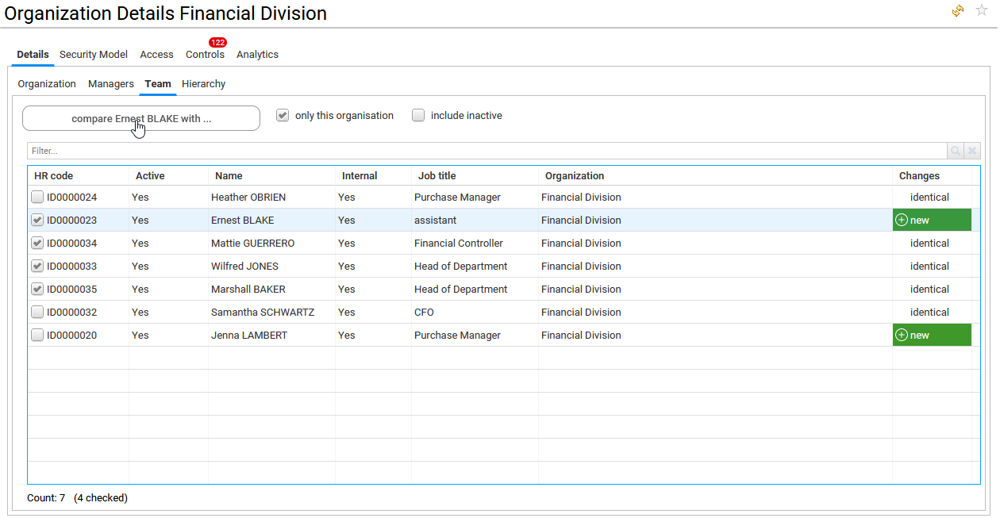

- In the **Hierarchy** sub‑tab, a graphical representation of the organisation chart is displayed.

### Security Model tab

This optional tab presents the computed business activities and the *theoretical* access rights associated with the selected organisation, for example access granted through a ticketing system or an IAM system. Comparing these theoretical rights with the actual rights in target applications helps identify overallocated access.

- In the **Business Activities** sub‑tab, the list of business activities accessible to one or more team members is displayed. When control defects such as SoD issues are detected for a business activity, an orange icon is shown in the first column by default.  
  The end user can click the business activity name to open its detail window.  
  This sub‑tab requires the **Booster for ERP/SoD** license.

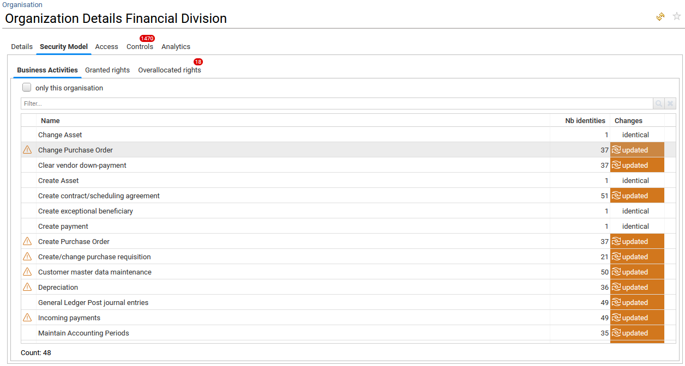

- In the **Granted rights** sub‑tab, the end user can view all roles granted by applications.  
  They can click the permission, role, or profile name to open the corresponding detail window.  
  This sub‑tab requires the **Booster for IAM** or **ERP/SoD** license.  

- In the **Overallocated rights** sub‑tab, the end user can view the list of permissions and accounts that are overallocated compared to the theoretical rights loaded in Identity Analytics.  
  They can click the identity name or HR code to open the related identity detail window.  
  This sub‑tab requires the **Booster for IAM** license.  

### Access tab

This optional tab presents the *actual* access rights correlated from the various data sources (that is, the rights RadiantOne Identity Analytics has found for the selected organisation on the loaded systems).  

- In the **Accounts** sub‑tab, a table lists all accounts belonging to team members.  
  Clicking the login opens the account detail window.  

- In the **Applications** sub‑tab, a table lists all applications accessible to any member of the team.  
  Clicking the application code or application name opens the application detail window.  

- In the **Permissions** sub‑tab, a table lists applications and permissions accessible to any team member.  
  Clicking the permission code or name opens the permission detail window, and clicking the application name opens the application detail window.  

- In the **Access rights** sub‑tab, a table lists account‑permission combinations accessible to team members.  
  Clicking the identity name opens the identity detail window.  
  Clicking the permission code or name opens the permission detail window, and clicking the application name opens the application detail window.  

- In the **Folders** sub‑tab, a table lists folder rights (simplified ACLs), paths, and related shares accessible to team members. This sub‑tab is available only if the end user has the appropriate license (Booster for Data Governance / Unstructured Data).  
  By default, only folders with direct ACLs are displayed, not subfolders with inherited permissions. The end user can clear **Display only folders with ACLs** to show the full list of folders.  
  A **Share family** column indicates the type of unstructured data, such as SharedFolders (NTFS, CIFS), Microsoft 365 (OneDrive, SharePoint Online, Exchange Online), and others.  
  Filters (comboboxes) are available to select a specific share family and/or share and to control the folder depth.  
  Clicking a value in the **Rights** column opens the rights definition (legend) window.  
  Clicking a folder path in the **Path** column opens the folder detail window.  

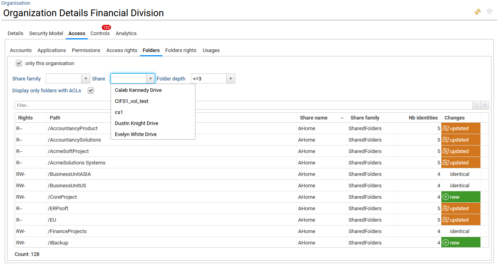

- In the **Folders rights** sub‑tab, a table lists account‑folder rights accessible to team members. This sub‑tab is also available only with the Booster for Data Governance / Unstructured Data license.  
  The options at the top of the table are the same as in the **Folders** sub‑tab.  
  Additionally, the end user can click an account login to open the account detail window.  

- In the **Usages** sub‑tab, a table lists activities when logs have been aggregated and consolidated as usages during the data collection phase.  

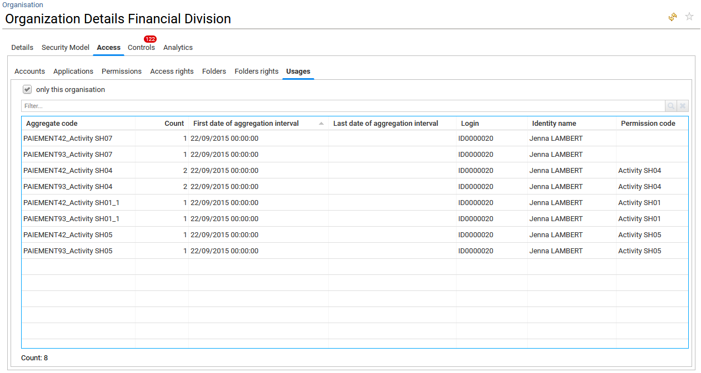

### Controls tab

This tab lists all control defects detected for the selected organisation.  
Selecting **Show selected control defect risks details** displays the control and risk descriptions, as well as suggested mitigation actions, at the bottom of the page.  
Clicking a control name opens the control detail window.  

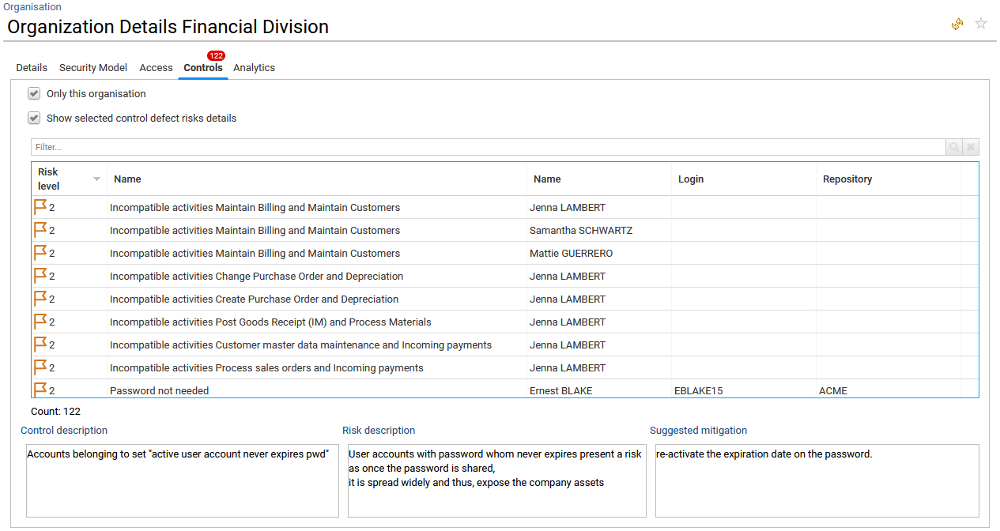 

### Analytics tab

This tab lists all analytics available for the selected organisation, from simple reports to more advanced management interfaces.  
These analytics help explain how access has been granted through the organisation’s members by providing application, role, permission, and data access analysis reports, cross‑table and peer group analysis capabilities, SoD defect matrix analysis, and a timeline of changes that have occurred in the past (**Organisation timeline**).  

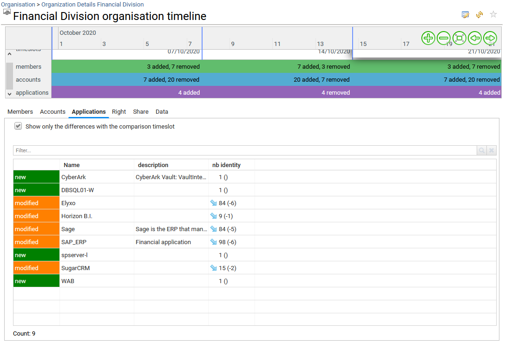 

The full list of analytics reports for any resource is available from the administration page and documented. For more details, see [Analytics reports](./07-customization#how-to-list-all-the-available-analytics-reports-and-their-description).

### Decision history

This optional tab shows all decisions recorded for this organisation, such as access review decisions or entity updates made through IAS/IAP (for example, account reconciliation, classification updates, or management information changes).  
At the top of the table, the end user can filter entries by status (for example **ok**, **update**, **revoke**, **remove**, **add**, **not reviewed**).  

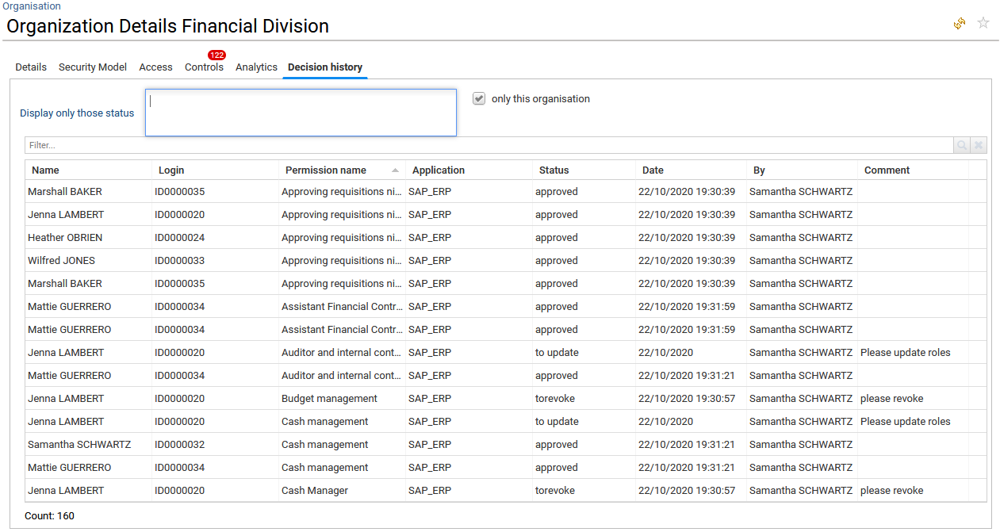

## Identities details page

The identity details page helps end users identify and mitigate risky situations affecting a specific identity. It provides an overview of each identity’s characteristics and enables risk‑based investigation of their access to applications, infrastructure, and data.  

In all sub‑tabs of the identity details page, as in any table in IAS/IAP, the end user can configure and add columns and KPIs by right‑clicking the table and selecting **Configure**. For more information on table customization, see [How to configure tables, columns and export data](./07-customization#standard-tables).  

### Details tab

This tab presents general information about the selected identity.  

Depending on the identity’s responsibilities, different sub‑tabs are displayed:  

- For a standard user, the end user can access the **Identity**, **Position**, and **Colleagues** sub‑tabs.  
- For a resource owner, an additional **Managed resources** sub‑tab is available.  
- For an organisation manager or line manager, one or two additional sub‑tabs are available: **Team** (for line and/or organisation managers) and **Managed organisations** (for organisation managers).  

- In the **Identity** sub‑tab, key KPIs and information about the selected identity are displayed. For more details about Risk rank, Max risk level, and number of risks, see the [Risk ranking and risk scoring](./05-kpi#computed-kpis) section.  

  When the end user is a **functional or technical administrator** (roles `functionaladmin`, `technicaladmin`), they can add a new manager for the selected identity, delete a manager, and access the manager updates audit trail by using the three icons on the right side of the **Direct operational manager** section.  

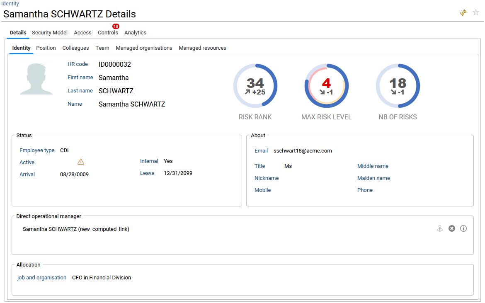

- In the **Position** sub‑tab, the end user can view the organisation hierarchy to which the identity belongs. This table is configurable, and additional columns such as organisation code and short name can be displayed.  

- In the **Colleagues** sub‑tab, the end user can list identities working under the same manager or in the same team. They can also include identities from sub‑organisations by selecting **all colleagues** in the combobox.  
  The end user can click an identity’s name or HR code to open the related identity detail window.  

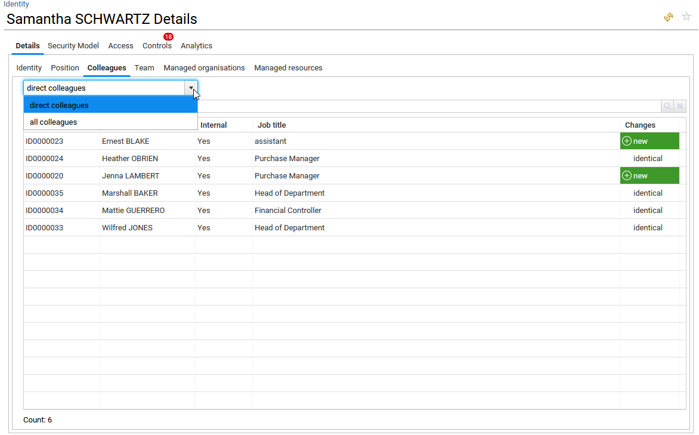

- In the **Team** sub‑tab, when the selected identity is a line and/or organisation manager, the end user can view the list of identities for whom this manager is responsible.  
  A combobox lets the user choose which team to display: the one managed as an organisation manager or the one managed as a line manager.  
  A **Whole team** checkbox includes identities from sub‑departments or sub‑organisations.  
  When viewing the team “as a line manager”, the end user can also filter identities by expertise domain.  
  They can compare one identity with one or more others in the same table. For more information, see [How to compare identities, accounts, permissions or groups](./07-customization#how-to-compare-identities-accounts-permissions-or-groups-with-each-others).  
  The end user can click an identity’s name or HR code to open the related identity detail window.  

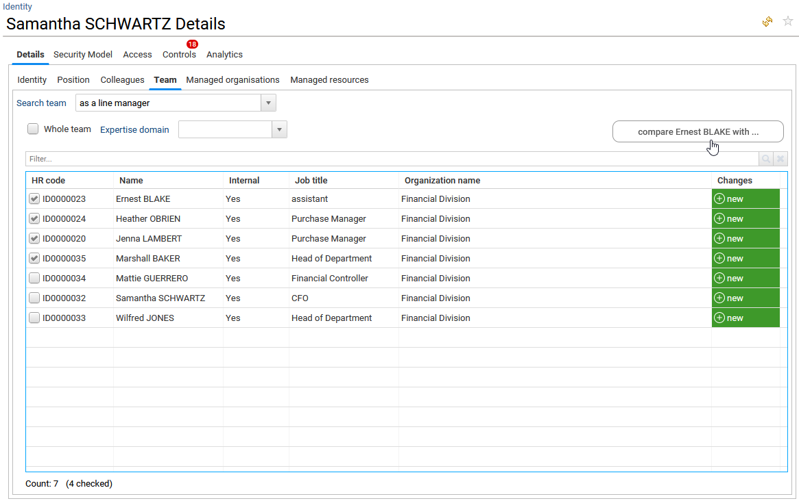

- In the **Managed organisations** sub‑tab, when the selected identity is an organisation manager, the end user can view the list of managed organisations and the related expertise domains.  
  They can click an organisation’s short name or name to open the organisation detail window.  

- In the **Managed resources** sub‑tab, when the selected identity is a resource owner, the end user can view the list of managed resources, which can include applications, shared folders, shares, roles, permissions, accounts, repositories, groups, and more.  

### Security Model tab

This optional tab presents the computed business activities and the *theoretical* access rights associated with the selected identity, for example access granted through a ticketing system or an IAM system. Comparing these theoretical rights with the actual rights in target applications helps identify overallocated access.  

- In the **Business Activities** sub‑tab, the list of business activities accessible by the identity is displayed. When control defects such as SoD issues are detected for a business activity, an orange icon is shown in the first column by default.  
  The end user can click the business activity name to open its detail window.  
  This sub‑tab requires the **Booster for ERP/SoD** license.  

- In the **Granted rights** sub‑tab, the end user can view all roles granted by applications.  
  They can click the permission, role, or profile code or name to open the corresponding detail window.  
  This sub‑tab requires the **Booster for IAM** or **ERP/SoD** license.  

- In the **Overallocated rights** sub‑tab, the end user can view the list of permissions that are overallocated compared to the theoretical rights loaded in Identity Analytics.  
  This sub‑tab requires the **Booster for IAM** license.  

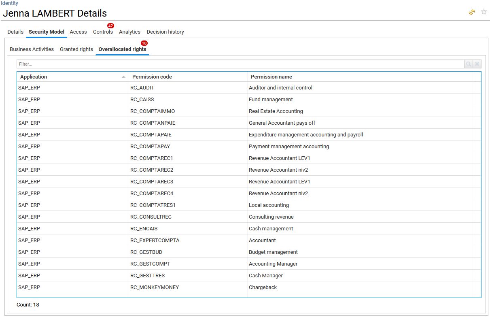

### Access tab

This optional tab presents the *actual* access rights correlated from the various data sources (that is, the rights Identity Analytics has found for the selected identity on the loaded systems).  

- In the **Accounts** sub‑tab, a table lists all accounts belonging to the selected identity.  
  Clicking the login opens the account detail window.  

- In the **Applications** sub‑tab, the first table lists applications accessible by the selected identity. Selecting an application populates a second table on the right with the related profiles, roles, or permissions that grant access to that application.  
  The right‑hand table is configurable so that the end user can add columns, for example to display the sensitivity level and sensitivity reason for each permission.  

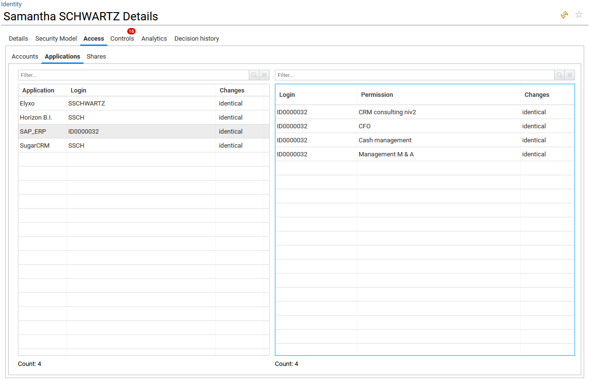

- In the **Shares** sub‑tab, a table lists folder paths accessible by the selected identity, along with share and rights (simplified ACLs) details. This sub‑tab is available only if the end user has the appropriate license (Booster for Data Governance / Unstructured Data).  
  By default, only folders with direct ACLs are displayed, not subfolders with inherited permissions. The end user can clear **Display only folders with ACLs** to show the full list of folders.  
  A **Share family** column indicates the type of unstructured data, such as SharedFolders (NTFS, CIFS), Microsoft 365 (OneDrive, SharePoint Online, Exchange Online), and others.  
  Filters (comboboxes) are available to select a specific share family and/or share and to control the folder depth.  
  Clicking a value in the **Rights** column opens the rights definition (legend) window.  
  Clicking a folder path in the **Path** column opens the folder detail window and allows further investigation of rights (simplified ACLs) and related groups.  
  For more information about ACLs, see [ACLs definition](./06-acl#acls-definitions).  

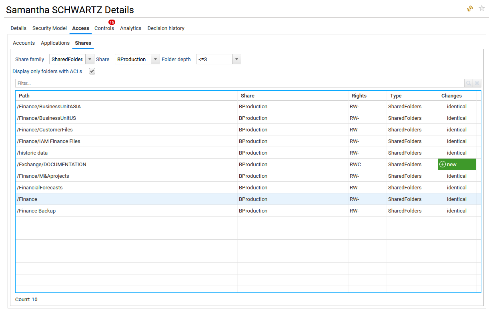

- In the **Usages** sub‑tab, a table lists activities when logs have been aggregated and consolidated in Identity Analytics as usages during the data collection phase.  

### Controls tab

This tab lists all control defects detected for the selected identity.  
Selecting **Show selected control defect risks details** displays the control and risk descriptions and the suggested mitigation actions at the bottom of the page.  
Clicking a control name opens the control detail window.  

### Analytics tab

This tab lists all analytics available for the selected identity, from simple reports to more advanced management interfaces.  
It helps explain how access has been granted to the identity by providing application, role, permission, and data access analysis reports, SoD defect matrix analysis, a timeline of past changes (**Identity timeline**), and a graphical 360° view of the identity’s access.  

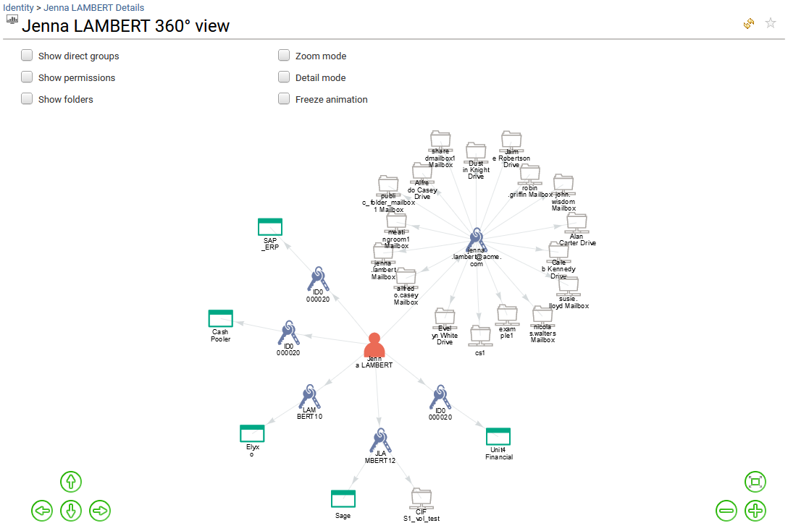  

Analytics reports for resources owned by the identity are also available here.  
The full list of analytics reports for any resource is available from the administration page and documented. For more details, see [Analytics reports](./07-customization#how-to-list-all-the-available-analytics-reports-and-their-description).  

### Decision history

This optional tab shows all decisions recorded for this identity, such as access review decisions or identity updates made through IAS/IAP.  
At the top of the table, the end user can filter entries by status (for example **ok**, **update**, **revoke**, **not reviewed**, and others) using checkboxes.  

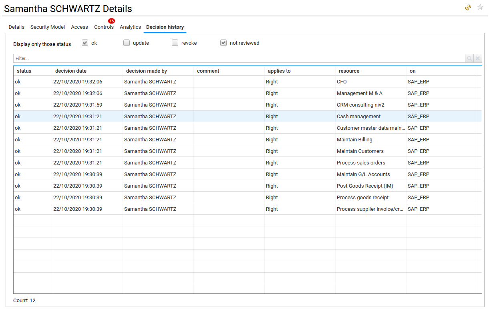

## Repositories

The repository details page helps end users identify and mitigate risky situations within account and group repositories. It provides an overview of each repository’s characteristics and enables risk‑based investigation of accounts, their owners, and their access to applications, infrastructure, and data.

In all sub‑tabs of the repository details page, as in any table in IAS/IAP, the end user can configure and add columns and KPIs by right‑clicking the table and selecting **Configure**. For more information on table customization, see [How to configure tables, columns and export data](./07-customization#standard-tables).  

### Details tab

This tab presents general information about the selected repository through three sub‑tabs:  

- In the **Repository** sub‑tab, key KPIs and management information about the repository are displayed. For more details about Risk rank, Max risk level, and number of risks, see the [Risk ranking and risk analysis](./05-kpi#computed-kpis) section.  
  When the end user is a **functional or technical administrator** (roles `functionaladmin`, `technicaladmin`), they can add a new manager, delete a manager, and access the manager updates audit trail by using the three icons on the right side of the **Managers** section.  

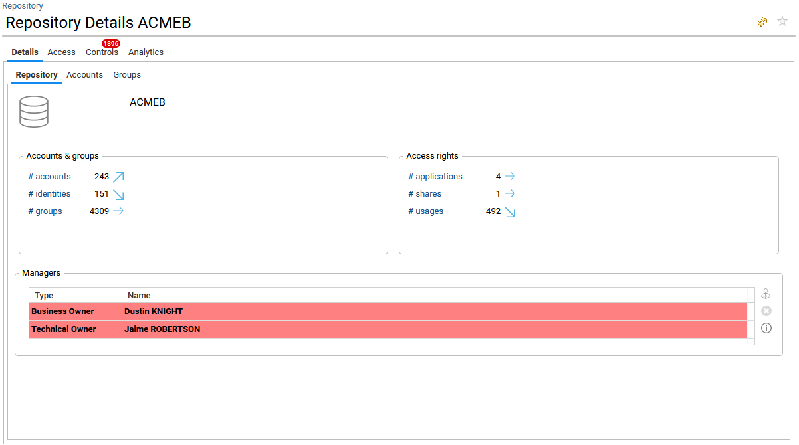

- In the **Accounts** sub‑tab, a table lists all accounts available in the repository.  
  The end user can compare accounts based on their access at application, permission, group, share, and folder levels by selecting two or more accounts and clicking the **Compare** button. For more information, see [How to compare identities, accounts, permissions or groups](./07-customization#how-to-compare-identities-accounts-permissions-or-groups-with-each-others).  
  The end user can click the login or username to open the related account detail window.  
  By default, only enabled accounts are listed. The end user can clear **Hide disabled accounts** to include disabled accounts.  

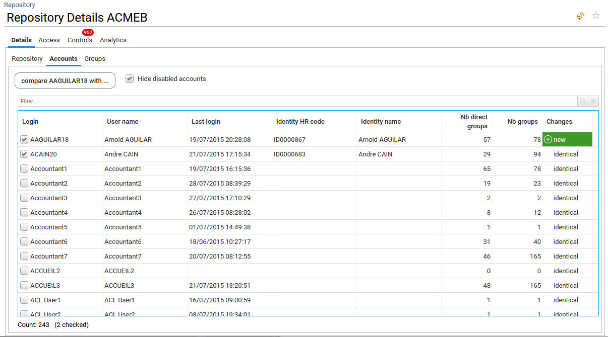

- In the **Groups** sub‑tab, a table lists all groups available in the repository.  
  The end user can compare groups based on their members (accounts) by selecting two or more groups and clicking the **Compare** button. For more information, see [How to compare identities, accounts, permissions or groups](./07-customization#how-to-compare-identities-accounts-permissions-or-groups-with-each-others).  
  The end user can click a group name to open the related group detail window.  
  A combobox at the top of the table allows displaying only direct groups, direct and indirect groups, or the group hierarchy with account counts.  

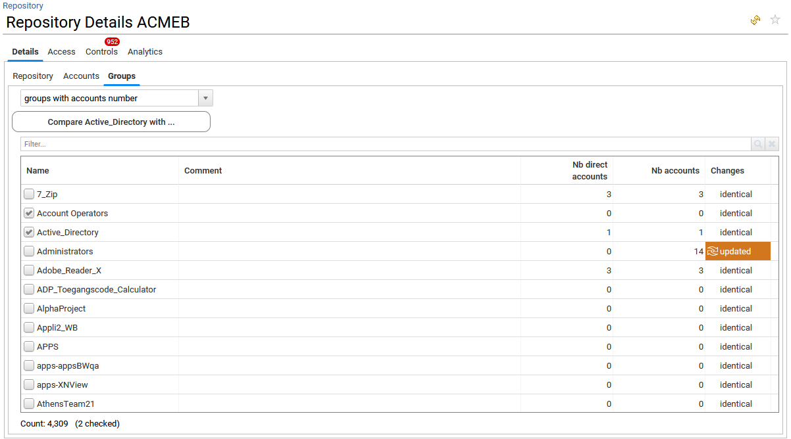

### Access tab

This optional tab presents the *actual* access rights correlated from the various data sources (that is, the rights Identity Analytics has found for the selected repository on the loaded systems).  

- In the **Applications** sub‑tab, a table lists applications accessible by accounts in the repository, along with permission, account, and identity details.  
  The end user can click a permission name or code to open the permission detail window.  

- In the **Shares** sub‑tab, a table lists folders accessible by the repository’s accounts, with share, rights (simplified ACLs), and account details. This sub‑tab is available only if the end user has the appropriate license (Booster for Data Governance / Unstructured Data).  
  By default, only folders with direct ACLs are displayed, not subfolders with inherited permissions. The end user can clear **Display only folders with ACLs** to show the full list of folders.  
  A **Share family** column indicates the type of unstructured data, such as SharedFolders (NTFS, CIFS), Microsoft 365 (OneDrive, SharePoint Online, Exchange Online), and others.  
  Filters (comboboxes) are available to select a specific share family and/or share and to control the folder depth.  
  Clicking a value in the **Rights** column opens the rights definition (legend) window.  
  Clicking a folder name in the **Folder** column opens the folder detail window and allows investigation of rights (simplified ACLs) and related groups.  
  For more information about ACLs, see [ACLs definition](./06-acl#acls-definitions).  

### Controls tab

This tab lists all control defects detected for the selected repository.  
Selecting **Show selected control defect risks details** displays the control and risk descriptions and the suggested mitigation actions at the bottom of the page.  
Clicking a control name opens the control detail window.  

### Analytics tab

This tab lists all analytics available for the selected repository, from simple reports to more advanced management interfaces.  
These analytics help improve data quality (for example, similar groups analysis), support reconciliation and reduce orphaned accounts (orphaned account reconciliation management), and provide a timeline of repository changes (**Repository timeline**).  

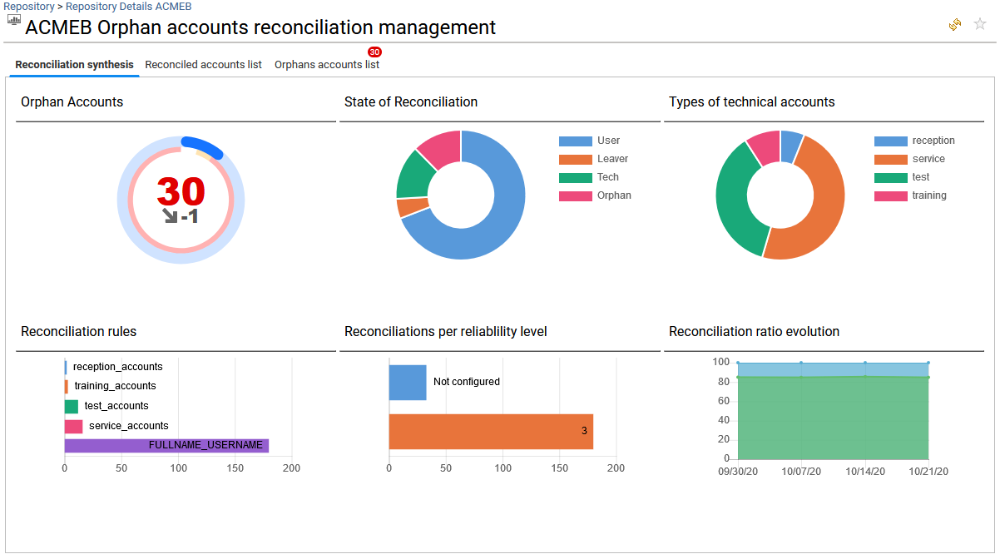

The full list of analytics reports for any resource is available from the administration page and documented. For more details, see [Analytics reports](./07-customization#how-to-list-all-the-available-analytics-reports-and-their-description).

### Decision history

This optional tab shows all decisions recorded for this repository, such as access review decisions or reconciliation and account updates made through IAS/IAP.  
At the top of the table, the end user can filter entries by status (for example **reconciled-user**, **create**, **ok**, **update**, **revoke**, **not reviewed**, and others) using a combobox.  

## Accounts

The account details page helps end users identify and mitigate risky situations affecting a specific account. It provides an overview of each account’s characteristics and enables risk‑based investigation of its access to applications, infrastructure, and data.  

In all sub‑tabs of the account details page, as in any table in IAS/IAP, the end user can configure and add columns and KPIs by right‑clicking the table and selecting **Configure**. For more information on table customization, see [How to configure tables, columns and export data](./07-customization#standard-tables).  

### Details tab

This tab presents general information about the selected account through three sub‑tabs:  

- In the **Account** sub‑tab, key KPIs and owner information about the account are displayed. For more details about Risk rank, Max risk level, and number of risks, see the [Risk ranking and risk analysis](./05-kpi#computed-kpis) section.  

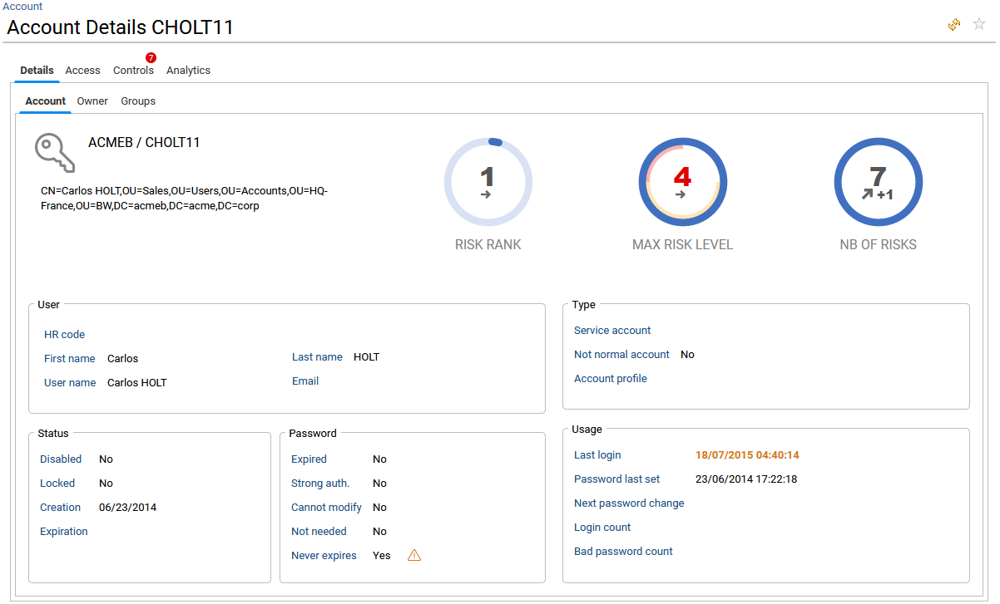

- In the **Owner** sub‑tab, HR information about the account’s owner is displayed, such as job title, organisation, manager, and employment status (for example, whether the owner is still working for the company).  

  When the end user is a **functional or technical administrator** (roles `functionaladmin`, `technicaladmin`), they can manage the account’s owner (reconcile the account with an identity). Four icons on the right side of the **Owner** section allow them to delete the reconciliation, set a new owner, mark the owner as having left the company, or mark the account as having no owner (technical or service account).  

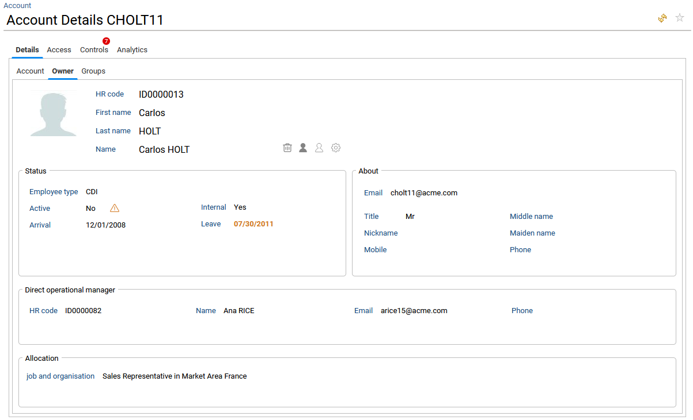

- In the **Groups** sub‑tab, a table lists groups associated with the account.  
  The end user can click a group name to open the group detail window.  
  A combobox at the top of the table allows displaying only direct groups, direct and indirect groups, or the group hierarchy.  

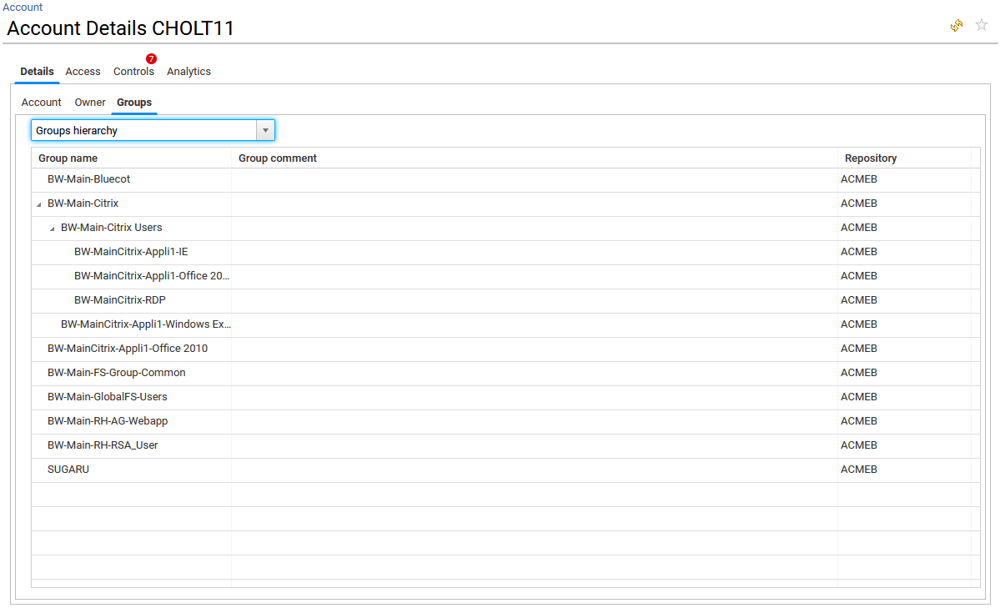

### Security Model tab

This optional tab presents the computed business activities and the *theoretical* access rights associated with the selected account, for example access granted through a ticketing system or an IAM system. Comparing these theoretical rights with the actual rights in target applications helps identify overallocated access.  

- In the **Business Activities** sub‑tab, the list of business activities accessible by the account is displayed. When control defects such as SoD issues are detected for a business activity, an orange icon is shown in the first column by default.  
  The end user can click the business activity name to open its detail window.  
  This sub‑tab requires the **Booster for ERP/SoD** license.  

- In the **Granted rights** sub‑tab, the end user can view all roles granted by applications.  
  They can click the permission, role, or profile code or name to open the corresponding detail window.  
  This sub‑tab requires the **Booster for IAM** or **ERP/SoD** license.  

- In the **Overallocated rights** sub‑tab, the end user can view the list of permissions, roles, or profiles that are overallocated compared to the theoretical rights loaded in RadiantOne Identity Analytics.  
  This sub‑tab requires the **Booster for IAM** license.  

### Access tab

This optional tab presents the *actual* access rights correlated from the various data sources (that is, the rights RadiantOne Identity Analytics has found for the selected account on the loaded systems).  

- In the **Applications** sub‑tab, a table lists profiles, roles, and permissions along with their related applications that are accessible by the account.  
  A combobox at the top of the table allows listing all permissions accessible by the account or filtering by directly assigned rights, directly assigned not through a group, or showing the permission hierarchy.  
  Clicking a permission name in the **Name** column opens the permission detail window.  

- In the **Shares** sub‑tab, a table lists folder paths accessible by the account, along with share and rights (simplified ACLs) details. This sub‑tab is available only if the end user has the appropriate license (Booster for Data Governance / Unstructured Data).  
  By default, only folders with direct ACLs are displayed, not subfolders with inherited permissions. The end user can clear **Display only folders with ACLs** to show the full list of folders.  
  A **Share family** column indicates the type of unstructured data, such as SharedFolders (NTFS, CIFS), Microsoft 365 (OneDrive, SharePoint Online, Exchange Online), and others.  
  Filters (comboboxes) are available to select a specific share family and/or share and to control the folder depth.  
  Clicking a value in the **Rights** column opens the rights definition (legend) window.  
  Clicking a folder path in the **Path** column opens the folder detail window and allows investigation of rights (simplified ACLs) and related groups.  
  For more information about ACLs, see [ACLs definition](./06-acl#acls-definitions).  

- In the **Usages** sub‑tab, a table lists activities when logs have been aggregated and consolidated in Identity Analytics as usages during the data collection phase.  

### Controls tab

This tab lists all control defects detected for the selected account.  
Selecting **Show selected control defect risks details** displays the control and risk descriptions and the suggested mitigation actions at the bottom of the page.  
Clicking a control name opens the control detail window.  

### Analytics tab

This tab lists all analytics available for the selected account, from simple reports to more advanced management interfaces.  
It helps explain the account’s access by providing graphical 360° views of group membership and permissions, and a timeline of changes that have occurred in the past (**Account timeline**).  

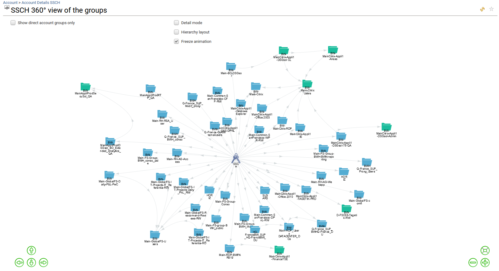

The full list of analytics reports for any resource is available from the administration page and documented. For more details, see [Analytics reports](./07-customization#how-to-list-all-the-available-analytics-reports-and-their-description).

### Decision history

This optional tab shows all decisions recorded for this account, such as access review decisions or reconciliation and account updates made through IAS/IAP.  
At the top of the table, the end user can filter entries by status (for example **ok**, **update**, **revoke**, **not reviewed**, and others) using a combobox.

## Groups

The group details page helps end users identify and mitigate risky situations within groups. It provides an overview of each group’s characteristics and supports risk‑based analysis of groups, their members and owners, and the access they provide to applications, infrastructure, and data.  

In all sub‑tabs of the group details page, as in any table in IAS/IAP, the end user can configure and add columns and KPIs by right‑clicking the table and selecting **Configure**. For more information, see [How to configure tables, columns and export data](./07-customization#standard-tables).  

### Details tab

This tab presents general information about the selected group through four sub‑tabs:  

- In the **Group** sub‑tab, key KPIs, owner information, and hierarchy details about the group are displayed.  
  When the end user is a **functional or technical administrator** (roles `functionaladmin`, `technicaladmin`), they can add new managers for the group, delete existing managers, and access the manager updates audit trail by using the three icons on the right side of the **Managers** section.  

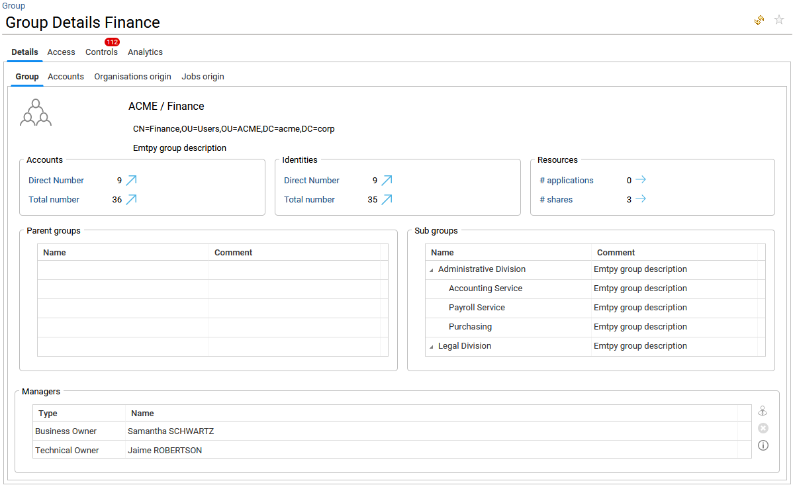

- In the **Accounts** sub‑tab, a table lists accounts belonging to the group, along with the related identity when the account is reconciled.  
  The end user can click the login or username to open the account detail window.  
  A combobox at the top of the table allows switching between direct accounts (**Accounts**), direct and indirect accounts (**All accounts**), or a double‑table view of the group hierarchy and related accounts (**subgroups hierarchy**).  

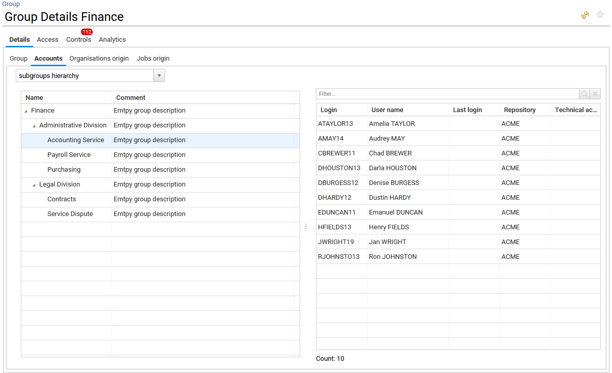  

- The **Organisations origin** sub‑tab provides a graphical overview of how group members are distributed across the company’s organisations.

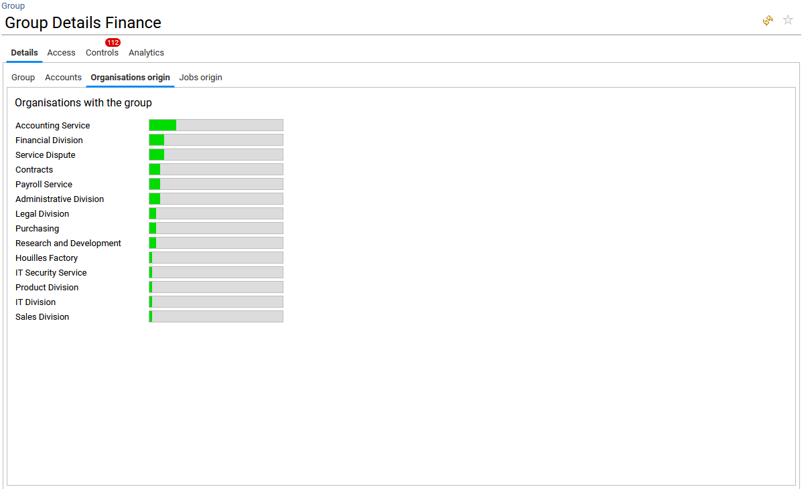  

- The **Jobs origin** sub‑tab provides a graphical overview of how group members are distributed across job functions.

### Access tab

This optional tab presents the *actual* access rights correlated from the various data sources (that is, the rights RadiantOne Identity Analytics has found for the selected group on the loaded systems).  

- In the **Applications** sub‑tab, a table lists profiles, roles, permissions, and accounts, along with the related applications accessible via the group.  
  Clicking a permission name in the **Name** column opens the permission detail window.

- In the **Shares** sub‑tab, a table lists folder paths accessible by the group, with share and rights (simplified ACL) details. This sub‑tab is available only if the end user has the appropriate license (Booster for Data Governance / Unstructured Data).  
  A combobox filter allows the user to choose the desired folder depth.  
  Clicking a value in the **Rights** column opens the rights definition (legend) window.  
  Clicking a folder path in the **Path** column opens the folder detail window, allowing further investigation of access rights (simplified ACLs).  
  For more information about ACLs, see [ACLs definition](./06-acl#acls-definitions).  

- In the **Usages** sub‑tab, a table lists activities when logs have been aggregated and consolidated in RadiantOne Identity Analytics as usages during the data collection phase.

### Controls tab

This tab lists all control defects detected for accounts that are members of the selected group, as well as for the group itself.  
Selecting **Show selected control defect risks details** displays the control and risk descriptions and the suggested mitigation actions at the bottom of the page.  
Clicking a control name opens the control detail window.  

### Analytics tab

This tab lists all analytics available for the selected group, from simple reports to more advanced management interfaces.  
It helps explain the group’s hierarchy and the access it grants by providing, for example, a graphical 360° view of groups, self‑service cross‑table analysis, and a **Group timeline** for tracking changes over time.

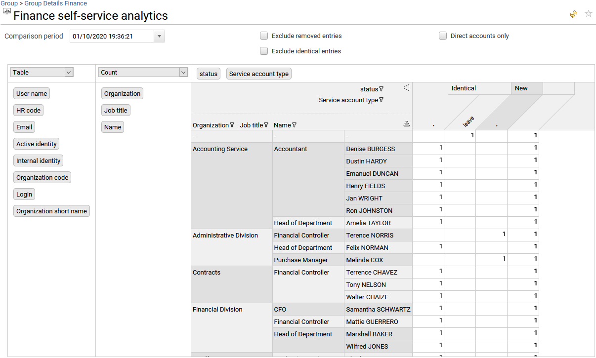

The full list of analytics reports for any resource is available from the administration page and documented. For more details, see [Analytics reports](./07-customization#how-to-list-all-the-available-analytics-reports-and-their-description).  

### Decision history

This optional tab shows all decisions recorded for this group, such as access review decisions or reconciliation and account updates made through IAS/IAP.  
At the top of the table, the end user can filter entries by status (for example **ok**, **update**, **revoke**, **not reviewed**, and others) using a combobox.  

## Application

The application details page helps end users identify and mitigate risky situations within applications. It provides an overview of each application’s characteristics and supports risk‑based analysis of access rights and profiles/permissions, along with related accounts and their owners.

In all sub‑tabs of the application details page, as in any table in IAS/IAP, the end user can configure and add columns and KPIs by right‑clicking the table and selecting **Configure**. For more information, see [How to configure tables, columns and export data](./07-customization#standard-tables).  

### Details tab

This tab presents general information about the selected application through three sub‑tabs:  

- In the **Application** sub‑tab, key KPIs and management information about the application are displayed. For more details, see [Computed KPIs](./05-kpi#computed-kpis).  

  When the end user is a **functional or technical administrator** (roles `functionaladmin`, `technicaladmin`), they can update the application’s classification status and description using the pen icon in the upper right corner. This helps prioritize high‑risk applications during investigations and reviews.  
  They can also add a new manager for the application, delete a manager, and access the manager updates audit trail via the three icons on the right side of the **Managers** section.  

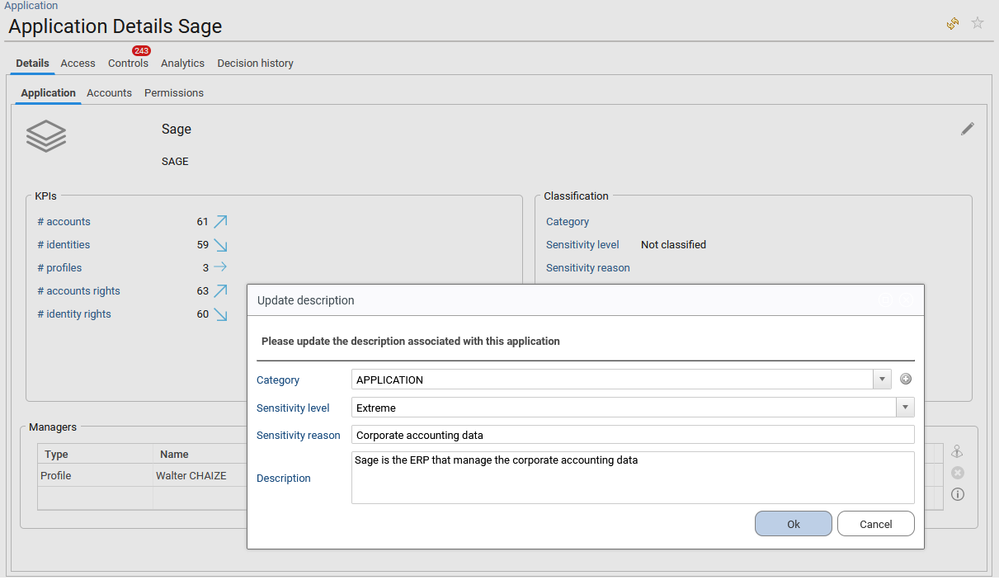

- In the **Accounts** sub‑tab, a table lists accounts in the application.  
  The end user can compare accounts based on their access at application, permission, group, share, and folder levels by selecting two or more accounts and clicking the **Compare** button. For more information, see [How to compare identities, accounts, permissions or groups](./07-customization#how-to-compare-identities-accounts-permissions-or-groups-with-each-others).  
  They can also click the login or username to open the account detail window.  

- In the **Permissions** sub‑tab, a table lists permissions that grant access to the application. When control defects such as SoD issues are detected for a permission or role, an orange icon appears in the first column by default.  
  A combobox at the top of the table allows listing all permissions or only those of type profile/role.  
  The end user can compare roles/permissions based on their account memberships by selecting two or more permissions and clicking the **Compare** button. For more details, see [How to compare identities, accounts, permissions or groups](./07-customization#how-to-compare-identities-accounts-permissions-or-groups-with-each-others).  
  Clicking a permission code or name opens the permission detail window, and clicking the application name opens the application detail window.  

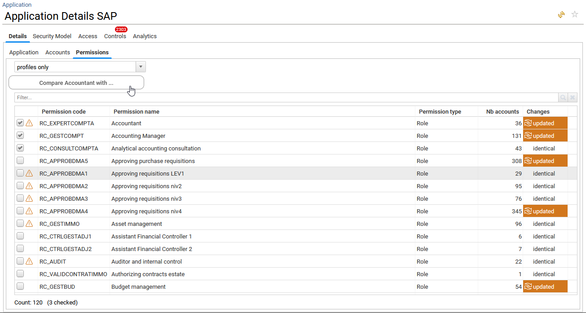

### Security Model tab  

This optional tab presents the computed business activities and the *theoretical* access rights associated with the selected application, for example access granted through a ticketing system or an IAM system. Comparing these theoretical rights with the actual rights in the target application helps identify overallocated access.

- In the **Business Activities** sub‑tab, the list of business activities accessible through the application is displayed. When control defects such as SoD issues are detected for a business activity, an orange icon appears in the first column by default. The end user can click the business activity name to open its detail window.  
  This sub‑tab requires the **Booster for ERP/SoD** license.  

- In the **Granted rights** sub‑tab, the end user can view all roles granted by the application. They can click the permission, role, or profile code or name to open the corresponding detail window.  
  This sub‑tab requires the **Booster for IAM** or **ERP/SoD** license.  

- In the **Overallocated rights** sub‑tab, the end user can view permissions, roles, or profiles that are overallocated compared to the theoretical rights loaded in RadiantOne Identity Analytics. They can click an identity name or HR code to open the related identity detail window.  
  This sub‑tab requires the **Booster for IAM** license.  

### Access tab

This optional tab presents the *actual* access rights correlated from the various data sources (that is, the rights RadiantOne Identity Analytics has found for the application and the loaded identities, accounts, and groups).  

- In the **Access rights** sub‑tab, a table lists accounts and identities, along with the permissions that grant access to the application.  
  Clicking the login or account username opens the account detail window.  

- The **Organisations origin** sub‑tab provides a graphical overview of how identities with access to the application are distributed across the company’s organisations.  

- The **Jobs origin** sub‑tab provides a graphical overview of how identities with access to the application are distributed across job functions.  

- In the **Permission usage** sub‑tab, a graphical view shows how user activities in the application are distributed across permissions. This is available when logs have been aggregated and consolidated in RadiantOne Identity Analytics as usages during the data collection phase.  

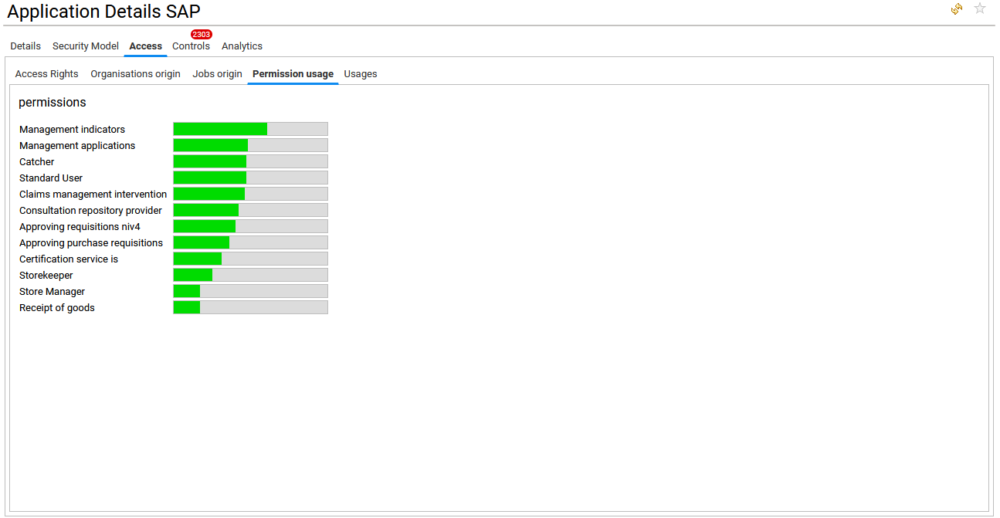

- In the **Usages** sub‑tab, a table lists activities when logs have been aggregated and consolidated in Identity Analytics as usages during the data collection phase.

### Controls tab

This tab lists all control defects detected for the selected application, including related accounts and identities.  
Selecting **Show selected control defect risks details** displays the control and risk descriptions and the suggested mitigation actions at the bottom of the page.  
Clicking a control name opens the control detail window.  

### Analytics tab

This tab lists all analytics available for the selected application, from simple reports to more advanced management interfaces.  
It helps explain how access has been granted to the application by providing, for example, a **Permissions map** (graphical view of permission assignments), cross‑table analysis (**access analysis** with peer group analytics and **self‑service analytics**), **Similar profiles analytics** to rationalize roles and profiles, and an **Application timeline** to track changes over time.

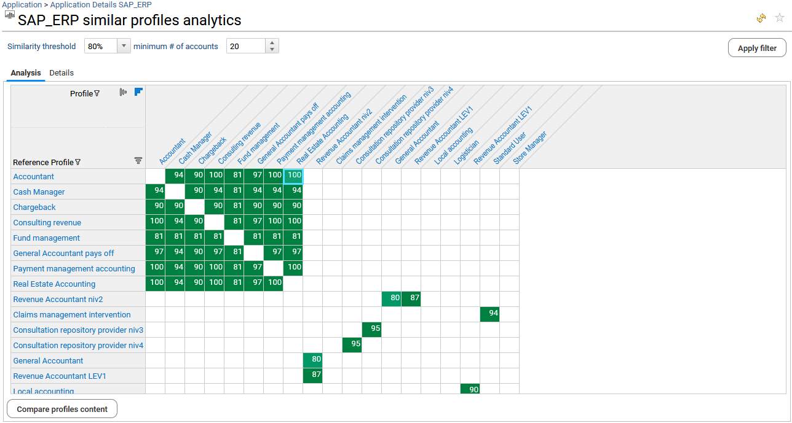

The full list of analytics reports for any resource is available from the administration page and documented. For more details, see [Analytics reports](./07-customization#how-to-list-all-the-available-analytics-reports-and-their-description).  

### Decision history

This optional tab shows all decisions recorded for this application, such as access review decisions and information updated through IAS/IAP (for example, application owners, sensitivity level, description, and more).  
At the top of the table, the end user can filter entries by status (for example **ok**, **update**, **revoke**, **not reviewed**, and others) using a combobox.  

## Permission

The permission details page helps end users identify and mitigate risky situations related to permissions. It provides an overview of each permission’s characteristics and supports risk‑based analysis of access rights, sub‑permissions, and associated accounts and owners.

In all sub‑tabs of the permission details page, as in any table in IAS/IAP, the end user can configure and add columns and KPIs by right‑clicking the table and selecting **Configure**. For more information, see [How to configure tables, columns and export data](./07-customization#standard-tables).  

### Details tab  

This tab presents general information about the selected permission through two sub‑tabs:  

- In the **Permission** sub‑tab, key KPIs and management information about the permission are displayed. For more details about the computed indicators, see [Computed KPIs](./05-kpi#computed-kpis).  
  When the end user is a **functional or technical administrator** (roles `functionaladmin`, `technicaladmin`), they can update the permission’s classification status and description using the pen icon in the upper right corner. This helps prioritize high‑risk permissions during investigations, reviews, and role mining.  
  They can also add new managers for the permission, delete managers, and access the manager updates audit trail via the three icons on the right side of the **Managers** section.  

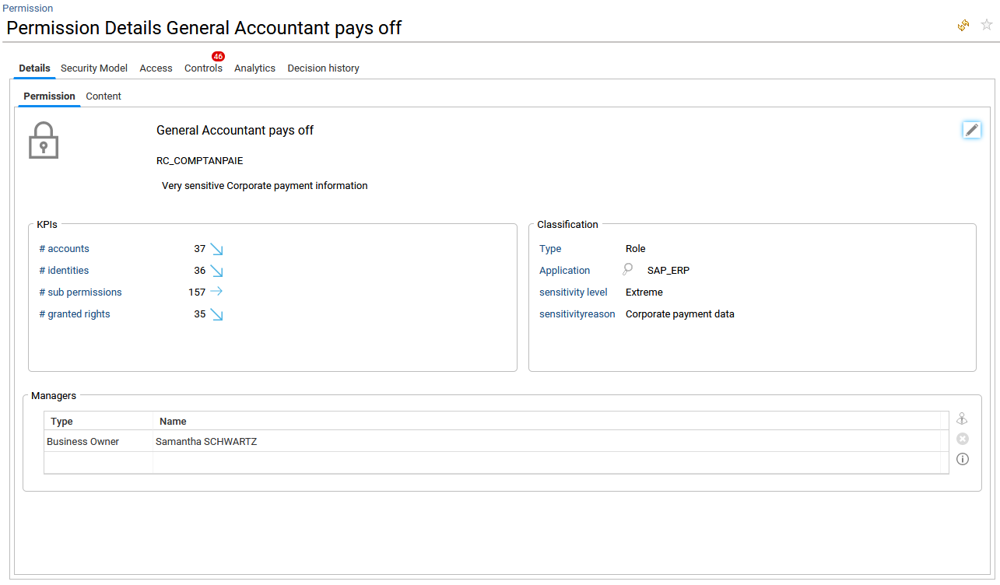

- In the **Content** sub‑tab, a hierarchical view lists sub‑permissions and fine‑grained permissions. Clicking a sub‑permission code or name opens its detail window.

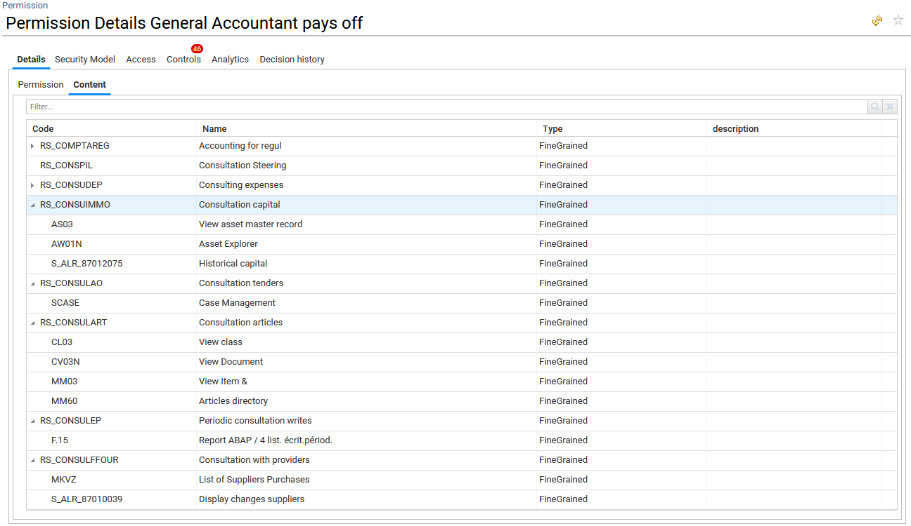

### Security Model tab  

This optional tab presents the *theoretical* access rights associated with the selected permission, for example access granted through a ticketing system or an IAM system. Comparing these theoretical rights with the actual rights in the environment helps identify overallocated access.

- In the **Granted rights** sub‑tab, the end user can view identities that **should** have access to the permission or role according to theoretical rights. They can click an identity name or HR code to open the identity detail window.  
  This sub‑tab requires the **Booster for IAM** or **ERP/SoD** license.  

- In the **Overallocated rights** sub‑tab, the end user can view identities that have overallocated rights compared to the theoretical rights loaded in RadiantOne Identity Analytics.  
  This sub‑tab requires the **Booster for IAM** license.  

- In the **Core model SoD problems** sub‑tab, the end user can view SoD issues directly related to the selected permission or role. These are “core model” SoD issues because the role itself, by definition, provides access to incompatible activities. The table lists pairs of incompatible business activities and their associated risk level.  
  Clicking a business activity name opens its detail page so the user can review its definition and understand why it is provided by the permission.  
  This sub‑tab requires the **Booster for ERP/SoD** license.  

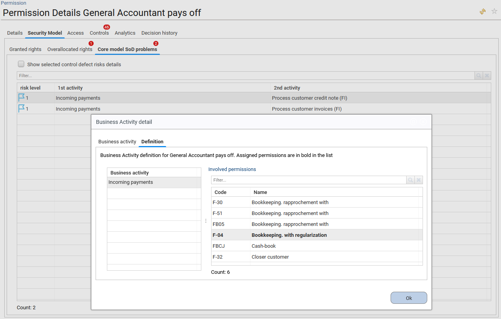

### Access tab

This optional tab presents the *actual* access rights correlated from the various data sources (that is, the rights RadiantOne Identity Analytics has found for the selected permission and the loaded identities and accounts).  

- In the **Accounts** sub‑tab, a table lists accounts and identities that have access to the permission. Clicking the login or account username opens the account detail window.  

- The **Organisations origin** sub‑tab provides a graphical overview of how identities with access to the permission are distributed across the company’s organisations.  

- The **Jobs origin** sub‑tab provides a graphical overview of how identities with access to the permission are distributed across job functions.  

### Controls tab

This tab lists all control defects detected for the selected permission, including related accounts and identities.  
Selecting **Show selected control defect risks details** displays the control and risk descriptions and the suggested mitigation actions at the bottom of the page.  
Clicking a control name opens the control detail window.  

### Analytics tab

This tab lists all analytics available for the selected permission, from simple reports to more advanced management interfaces.  

It helps explain the permission’s hierarchy and the access it grants by providing, for example, a graphical 360° view of sub‑permissions, self‑service cross‑table analysis, and a **Permission timeline** to track changes over time.

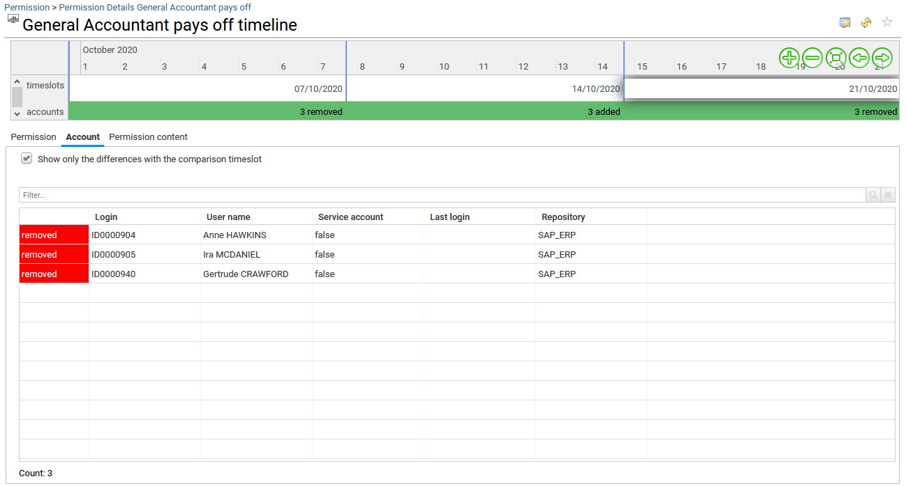

The full list of analytics reports for any resource is available from the administration page and documented. For more details, see [Analytics reports](./07-customization#how-to-list-all-the-available-analytics-reports-and-their-description).  

### Decision history

This optional tab shows all decisions recorded for this permission, such as access review decisions and information updated through IAS/IAP (for example, permission owners, sensitivity level, description, and more).  
At the top of the table, the end user can filter entries by status (for example **ok**, **update**, **revoke**, **not reviewed**, and others) using a combobox.  

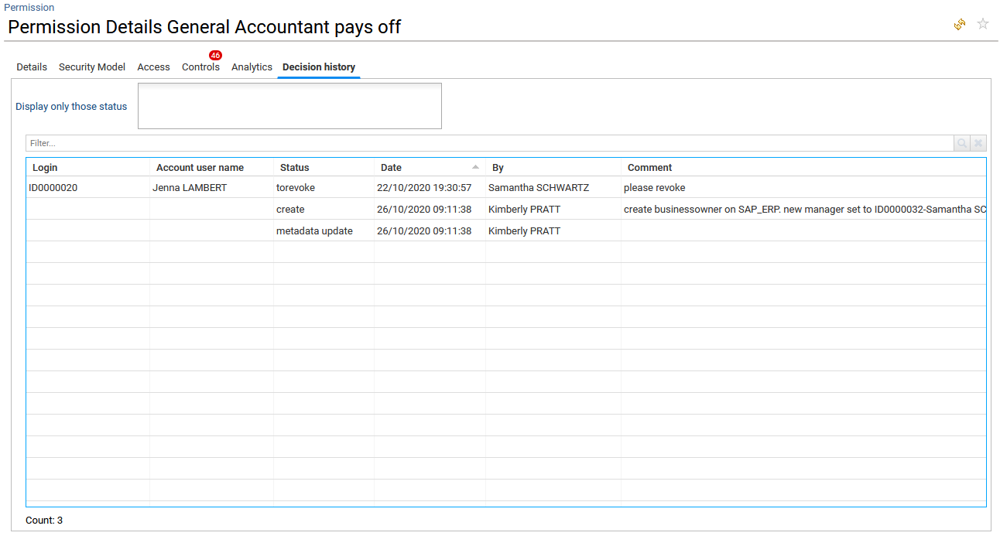

## Share

The share details page is available only if the end user has the appropriate license (Booster for Data Governance / Unstructured Data).  
It helps end users identify and mitigate risky situations within shares by providing an overview of each share’s characteristics and supporting risk‑based analysis of access rights and groups, along with related accounts and owners.  

In all sub‑tabs of the share details page, as in any table in IAS/IAP, the end user can configure and add columns and KPIs by right‑clicking the table and selecting **Configure**. For more information, see [How to configure tables, columns and export data](./07-customization#standard-tables).  

### Details tab

This tab presents general information about the selected share through three sub‑tabs:  

- In the **Share** sub‑tab, key KPIs and management information about the share are displayed. For more details about the computed indicators, see [Computed KPIs](./05-kpi#computed-kpis).  
  When the end user is a **functional or technical administrator** (roles `functionaladmin`, `technicaladmin`), they can update the share’s classification status and description using the pen icon in the upper right corner. This helps prioritize high‑risk shares during investigations and reviews.  
  They can also add new managers for the share, delete managers, and access the manager updates audit trail via the three icons on the right side of the **Managers** section.  

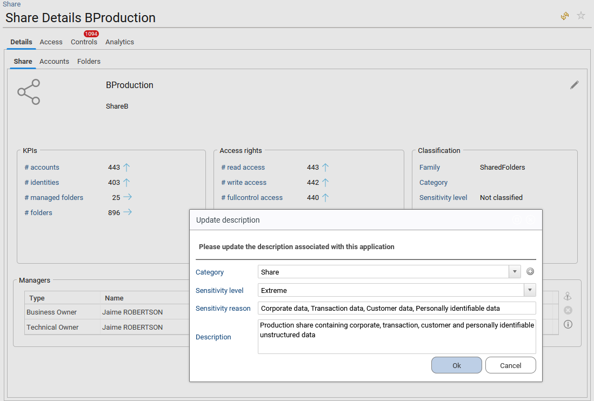  

- In the **Accounts** sub‑tab, a table lists accounts (and reconciled identities when available) that have access to the share.  
  The end user can compare accounts based on their folder‑level access by selecting two or more accounts and clicking the **Compare** button. For more information, see [How to compare identities, accounts, permissions or groups](./07-customization#how-to-compare-identities-accounts-permissions-or-groups-with-each-others).  
  They can also click the login or username to open the account detail window.  

- In the **Folders** sub‑tab, a table lists folders within the share.  
  A combobox at the top of the table allows listing all folders or showing the folder hierarchy.  
  When listing all folders, the end user can compare accounts and their related access rights by selecting two or more folders and clicking the **Compare** button. For more details, see [How to compare identities, accounts, permissions or groups](./07-customization#how-to-compare-identities-accounts-permissions-or-groups-with-each-others).  
  Clicking a folder path or name opens the folder detail window.  

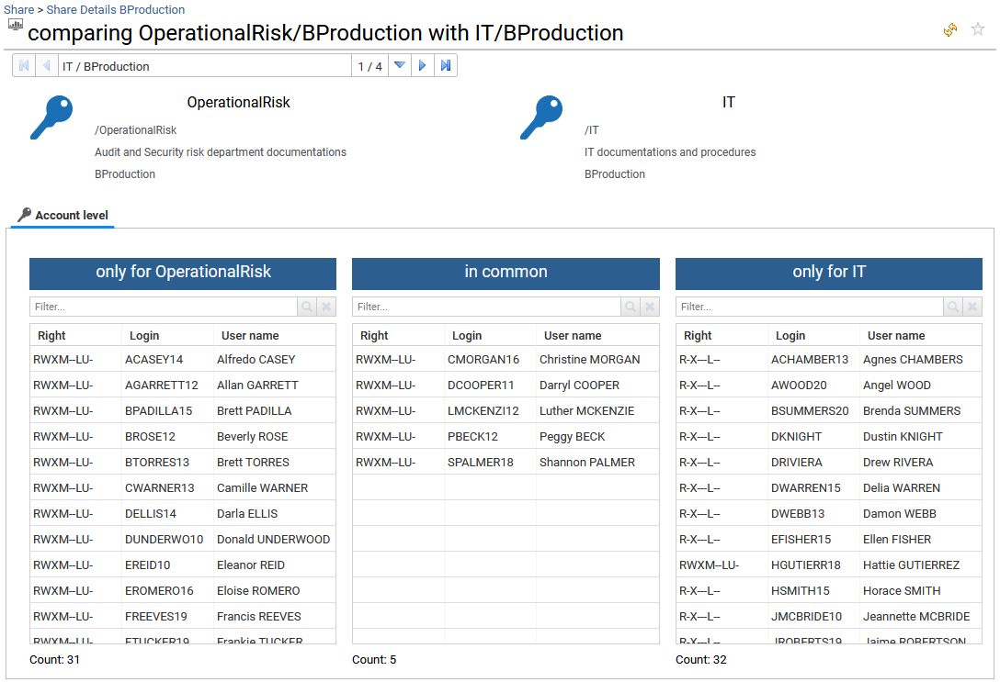  

### Access tab

This optional tab presents the *actual* access rights correlated from the various data sources (that is, the rights RadiantOne Identity Analytics has found for the share and the loaded identities, accounts, and groups).  

- In the **Access rights** sub‑tab, a table lists folders within the share along with accounts, identities, and their access rights (simplified ACLs).  
  By default, only folders with direct ACLs are displayed, not subfolders with inherited permissions. The end user can clear **Display only folders with ACLs** to show the full list of folders.  
  A combobox filter lets the user select the desired folder depth.  
  Clicking the login or account username opens the account detail window.  
  Clicking a value in the **Rights** column opens the rights definition (legend) window.  
  For more information about ACLs, see [ACLs definition](./06-acl#acls-definitions).  

- The **Organisations origin** sub‑tab provides a graphical overview of how identities with access to the share’s content are distributed across the company’s organisations.  

- The **Jobs origin** sub‑tab provides a graphical overview of how identities with access to the share’s content are distributed across job functions.  

- In the **Usages** sub‑tab, a table lists activities when logs have been aggregated and consolidated in RadiantOne Identity Analytics as usages during the data collection phase.  

### Controls tab

This tab lists all control defects detected for the selected share, including related accounts and identities.  
Selecting **Show selected control defect risks details** displays the control and risk descriptions and the suggested mitigation actions at the bottom of the page.  
Clicking a control name opens the control detail window.  

### Analytics tab

This tab lists all analytics available for the selected share, from simple reports to more advanced management interfaces.  
It helps explain how access has been granted to the share by providing, for example, cross‑table analyses such as **access analysis** (with peer group analytics) and **self‑service analytics**.

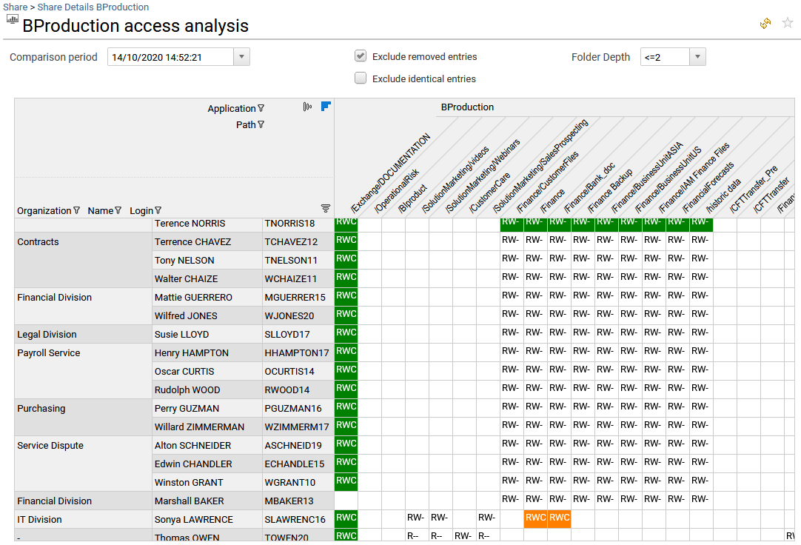

The full list of analytics reports for any resource is available from the administration page and documented. For more details, see [Analytics reports](./07-customization#how-to-list-all-the-available-analytics-reports-and-their-description).  

### Decision history

This optional tab shows all decisions recorded for this share, such as access review decisions and information updated through IAS/IAP (for example, share owners, sensitivity level, description, and more).  
At the top of the table, the end user can filter entries by status (for example **ok**, **update**, **revoke**, **not reviewed**, and others) using a combobox.  

## Folder

The folder details page is available only if the end user has the appropriate license (Booster for Data Governance / Unstructured Data).  
It helps end users identify and mitigate risky situations within shared folders by providing an overview of each folder’s characteristics and supporting risk‑based analysis of access rights and groups, along with related accounts and owners.  

In all sub‑tabs of the folder details page, as in any table in IAP, the end user can configure and add columns and KPIs by right‑clicking the table and selecting **Configure**. For more information, see [How to configure tables, columns and export data](./07-customization#standard-tables).  

### Details tab

This tab presents general information about the selected folder through two sub‑tabs:  

- In the **Folder** sub‑tab, key KPIs and management information about the folder are displayed. For more details about the computed indicators, see [Computed KPIs](./05-kpi#computed-kpis).  
  When the end user is a **functional or technical administrator** (roles `functionaladmin`, `technicaladmin`), they can update the share’s classification status and description using the pen icon in the upper right corner. This helps prioritize high‑risk shares during investigations and reviews.  
  They can also add new managers for the share, delete managers, and access the manager updates audit trail via the three icons on the right side of the **Managers** section.  
  Clicking the magnifier icon next to the share name in the **Details & Classification** section opens the share detail window.  

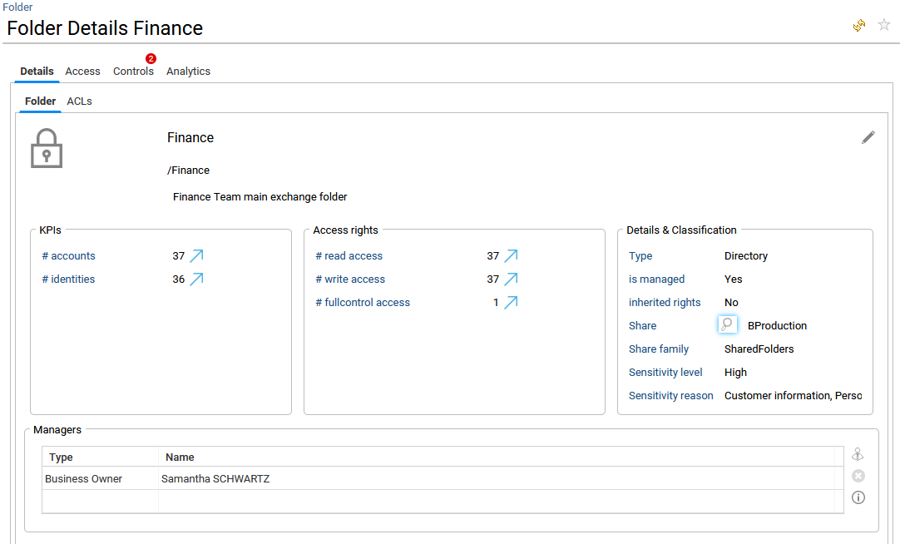  

- In the **ACLs** sub‑tab, two sections list ACLs set at group level and at account level. This helps the end user understand how access rights are granted through group hierarchies and detect quality issues when rights are granted directly to accounts.  

  In the **ACLs at a group level** section, clicking an ACL row in the first table displays the related group hierarchy in the **Selected ACL group details** section. Selecting a group there shows its member accounts (and, when available, their owners) on the right. Clicking an account login opens the account detail window.

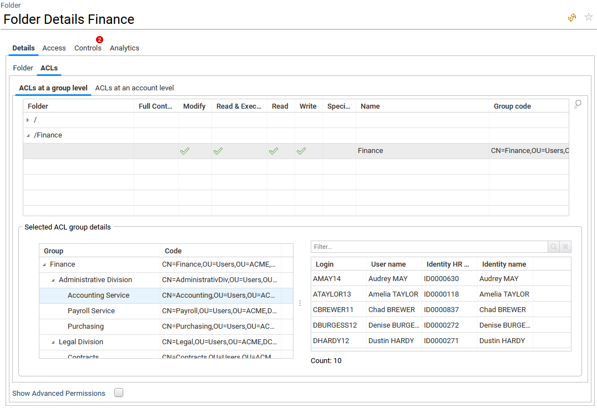 

  In the **ACLs at an account level** section, clicking the second magnifier icon on the right side of the table opens the account detail window.

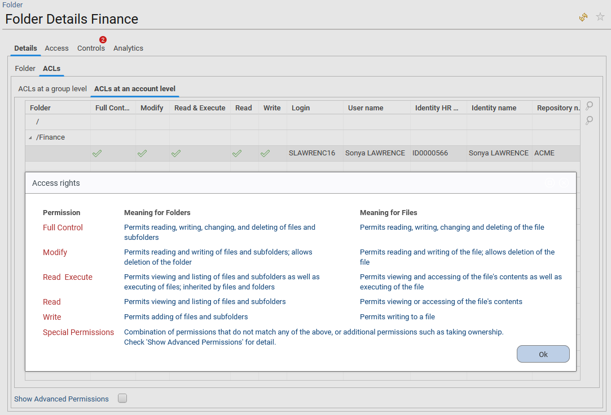

  In both sections, clicking the first magnifier icon on the right side of the table displays the definition of the ACLs in the table.  
  The end user can switch from basic to advanced ACLs by selecting **Show Advanced Permissions** at the bottom of the table, then using the magnifier to display advanced ACL definitions as well. For more information about ACLs, see [ACLs definition](./06-acl#acls-definitions).  

### Access tab

This optional tab presents the *actual* access rights correlated from the various data sources (that is, the rights RadiantOne Identity Analytics has found for the folder and the loaded identities, accounts, and groups).  

- In the **Accounts** sub‑tab, a table lists accounts that have access to the folder, along with reconciled identities and rights (simplified ACLs).  
  Clicking the login or account username opens the account detail window.  
  Clicking a value in the **Rights** column opens the rights definition (legend) window.  
  For more information about ACLs, see [ACLs definition](./06-acl#acls-definitions).  

- The **Organisations origin** sub‑tab provides a graphical overview of how identities with access to the folder are distributed across the company’s organisations.  

- The **Jobs origin** sub‑tab provides a graphical overview of how identities with access to the folder are distributed across job functions.  

- In the **Usages** sub‑tab, a table lists activities when logs have been aggregated and consolidated in RadiantOne Identity Analytics as usages during the data collection phase.  

### Controls tab

This tab lists all control defects detected for the selected folder, including related accounts and identities.  
Selecting **Show selected control defect risks details** displays the control and risk descriptions and the suggested mitigation actions at the bottom of the page.  
Clicking a control name opens the control detail window.  

### Analytics tab

This tab lists all analytics available for the selected folder, from simple reports to more advanced management interfaces.  
It helps explain how access has been granted to the folder by providing, for example, self‑service cross‑table analytics.  

The full list of analytics reports for any resource is available from the administration page and documented. For more details, see [Analytics reports](./07-customization#how-to-list-all-the-available-analytics-reports-and-their-description).  

### Decision history

This optional tab shows all decisions recorded for this folder, such as access review decisions and information updated through IAS/IAP (for example, folder owners, sensitivity level, description, and more).  
At the top of the table, the end user can filter entries by status (for example **ok**, **update**, **revoke**, **not reviewed**, and others) using a combobox.
