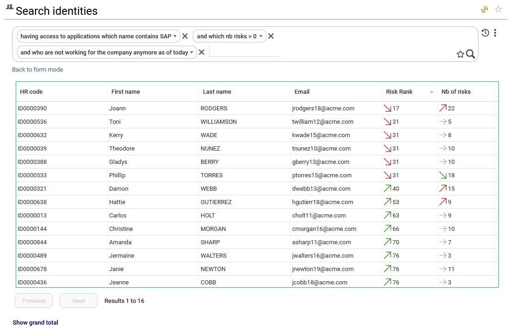
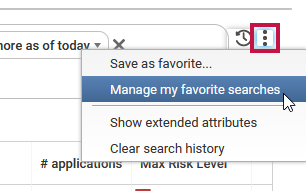
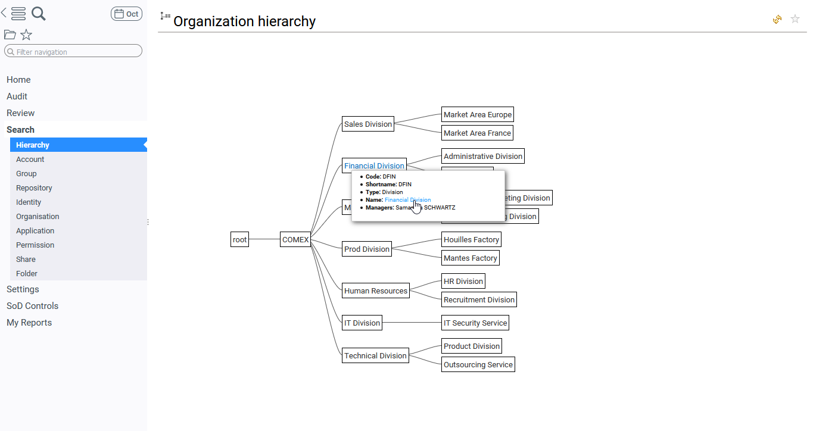
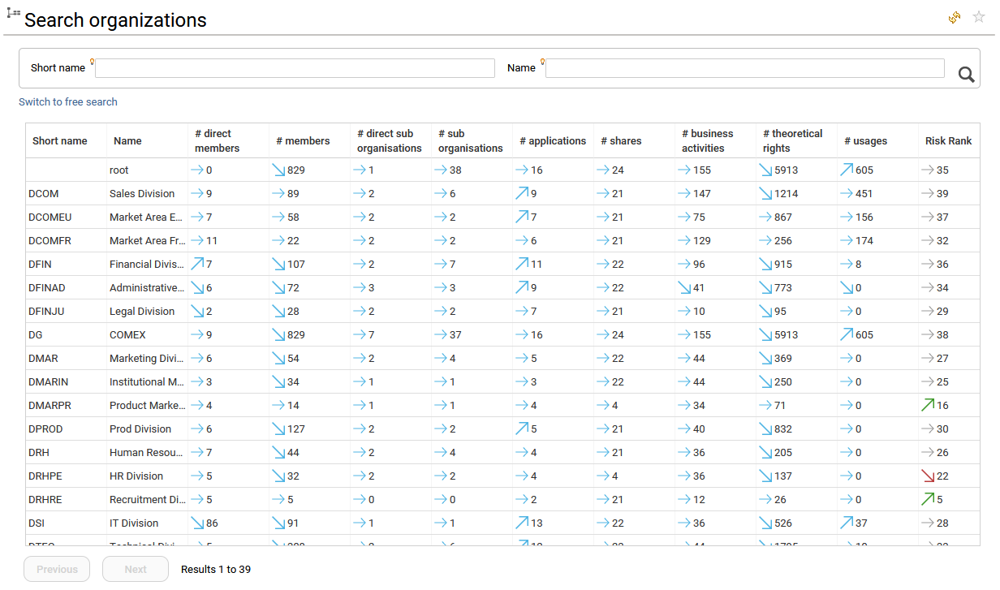
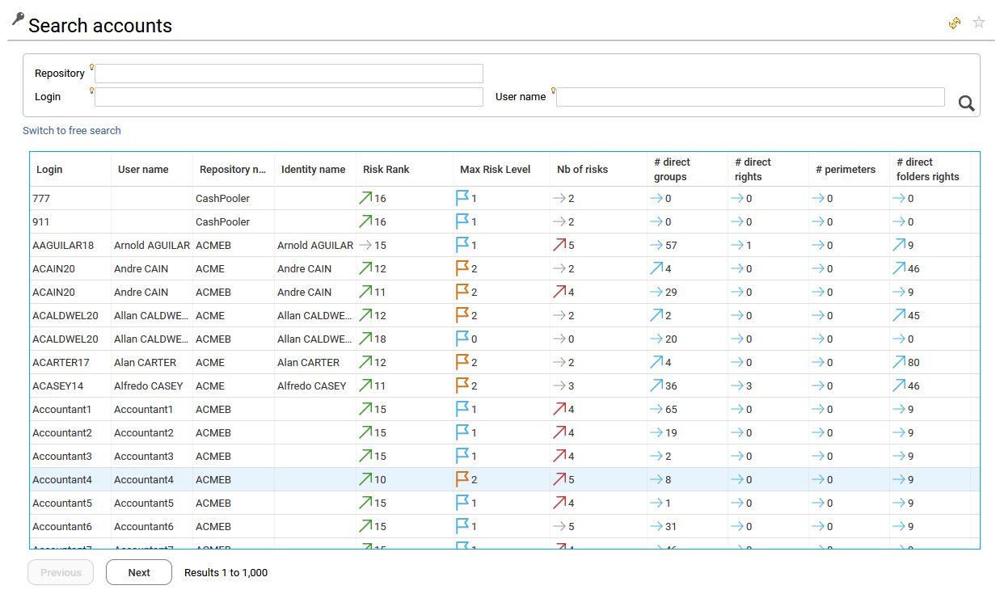
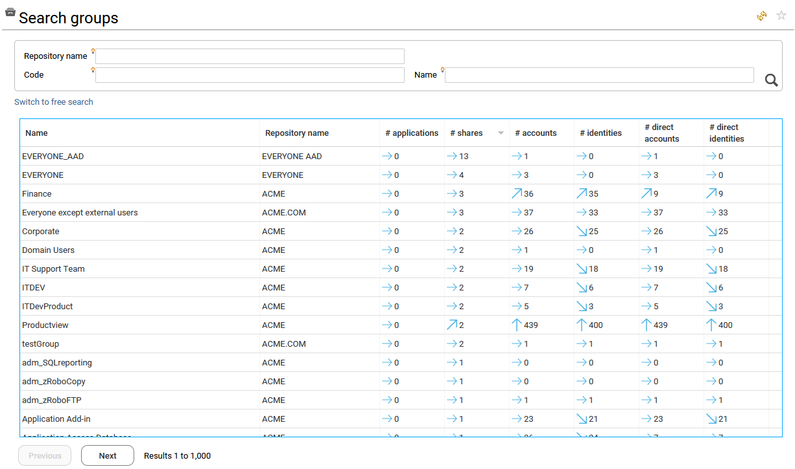
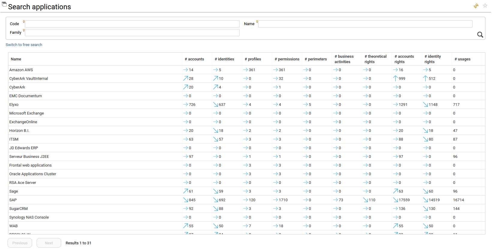
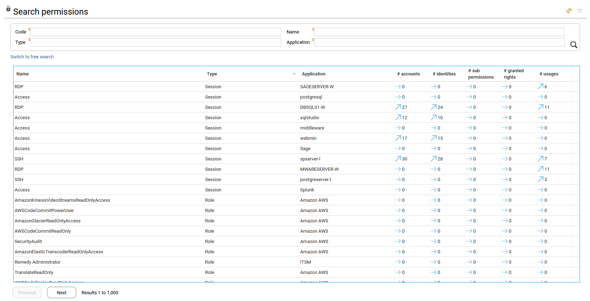
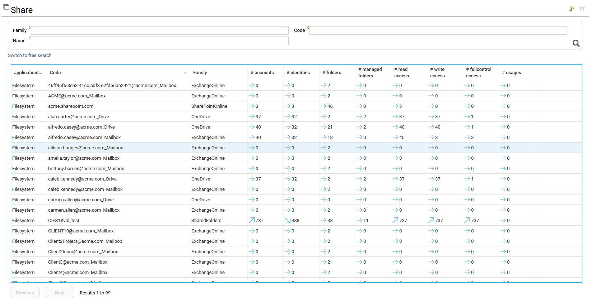

# Search pages

These pages are made available through the menu on the left, in section **Search**, and are provided per entity (Account, Group, Identity, organisation and more). The goal of the Search page is to provide the ability to investigate on any of these entities, to create search functions and to build your own mashup dashboards.

By default, only `functionaladmin`, `auditor` and `technicaladmin` have access to the search page in order to enforce the **least privilege principle**.  

Tons of KPIs are pre-computed and attached to the entities, most of them are available in the search pages, thus facilitating analysis from the search results:  
  
- empty groups  
- groups with the most accounts  
- groups with the less accounts  
- accounts with the most groups  
- accounts with the less groups  
- ...

Right click on the search table and select "configure" to show/hide the KPIs. 

The KPIs are part of the datamodel, as a result you can leverage those KPIs in your search functions, in your access reviews or in your custom reports.

Please consult the ["Computed KPIs"](#computed-kpis) of this documentation for futher information regarding those KPIs.

## How to apply filter in search pages  
Clicking on the magnifier upper right will list all the organisations, or will filter the result when the "form mode" or the "free search" mode have been used on top of the table.
The "form mode" is the default filter which consist of a form to fill in with the search criteria.  

To use the "free search" mode, the end-user can click on "switch to free search", and then enter his criteria requested for the entity. This mode allows to build more complex queries using any attributes (including pre-computed KPIs) of the entities and relationships between entities. It helps the end-user to build its query by listing step by step all the options that are available to make the search filter more precise.

Here are a few examples on organisations and on identities: 

In the two copyscreens below, the end-user is building his search criteria to list organisations from the finance division with identities having left the company and having members with access to SAP  

  

  

In the copyscreen below, the end-user lists the result of his search criteria on identities having access to SAP, having identified risks and having left the company 

  

The end-user can sort the data in any columns that contains KPIs in ascending or descending order, by clicking on the header of the column. As in the example on identities where the Risk Rank column has been sorted to find the most risky identity first.  

## How to save search results and build your own report  

Once the end-user has built its query and obtain a result from the search page, he is able to save the query as favorite by clicking on the star icon available on the right side, so that he can use it to build new dashboard or update the existing ones. That way, all the saved queries are made available from the mashup dahsboard interfaces.

  

Once queries are saved, the end-user can list them with the history of queries by clicking on the clock icon.

 

Clicking on the "options" icon will provide additional capabilities such as manage the favorites, make additional attributes available to the "free search" mode and clear the search history.  

  

When selecting "manage my favorite searches", the end-user is able to Rename, Share and Delete the saved queries by clicking on the related buttons. 

 

If he choses to share a selected query, he can share it either with individuals picked from the list of all identities or with all identities having a specific role, such as functional admin, technical admin, auditor or any role defined in the Identity Analytics project.  

 

Once the end-user has saved his queries, he can use them to create or update his own mashup dashboards. 
When adding and creating a new widget in a mashup dashboard he can select them. 
In the menu on the left, he can also reach the page Audit > My Analytics to start creating a new reports.  
In this page the same features are available as in the search pages to create new queries, saved them, use the already existing/saved queries. The only difference is that he needs to select first the entity on which he wants to create a new query.  
By clicking on the pen on the right side of the table, the end-user can then build its own table and select the attributes he wants to display by columns. 
Once done, clicking on the button "Save as..." bottom right will allow him to save it as a new mashup dahboard.

 

Finally, the end-user will benefit from all the advanced features of mashup dashboard to enrich his newly created dashboard and to share it with others.

 

Please refer to the online [general documentation on dashboards](https://developer.radiantlogic.com/) to know more about how to install and use them.

## How to apply Analytics on search results

Starting with IAS/IAP 1.1 Analytics are accessible through the search pages in order to perform analysis on search results. Depending on your role, you can access to those analytics.

For instance: 
- You search for 'VIP identities' and you want to access to a report displaying their access rights and what changed since a given data
- You search for orphan AD accounts and you want to list their groups

Those analytics are available through the contextual menu located at the lower right part of the search screen.

When you click on this menu entry, all the available analytics are presented:

When you click on a given analytics, it is displayed as usual but with a subtle difference: The search query itself is passed to the Analytics, as a result, **this analytics can be safely bookmarked in the favorites**

## Search pages per entity  

### Hierarchy search page 

The Hierarchy search page allows to investigate on organisations by starting from the organisation chart.
Clicking on an organisation will zoom on it and display the sub departements.
By hovering the mouse over an organisation, a tooltip appears and allows you to go to the detail page of the selected organisation by clicking on its name.

### organisation search page 
The organisation search page allows to list, filter and build queries on organisations loaded in RadiantOne Identity Analytics. 

The following computed KPIs are made available for organisations in the search page by default:  

| **attribute name**   | **description**                           |
| :------------------- | :---------------------------------------- |
| nbdirectmembers      | nb direct identity                        |
| nbtotalmembers       | nb total identity                         |
| riskrank             | risk rank                                 |
| maxrisklevel         | max risk level                            |
| nbidentityrisks      | nb identities with risks                  |
| nbidentityrisksratio | nb identities with risks as a percentage  |
| nbbusinessactivity   | nb business activity                      |
| nbtheoretical        | nb theoretical rights                     |
| nbapplication        | nb applications (Profile)                 |
| nshare               | nbshare (Filesystem)                      |
| nbdirectsuborg       | nb of direct sub-organisations            |
| nbsuborg             | nb of sub-organisations (direct+indirect) |
| nbusage              | nb of usages found                        |

### Identity search page 

The Identities search page allows to list, filter and build queries on identities loaded in Identity Analytics. 

The following computed KPIs are made available for Identities in the search page by default:  

| **attribute name** | **description**                              |
| :----------------- | :------------------------------------------- |
| nbrisks            | nb problems                                  |
| maxrisklevel       | max risk level                               |
| riskrank           | risk rank                                    |
| nbbusinessactivity | nb business activity                         |
| nbtheoretical      | nb theoretical rights                        |
| nbapplication      | nb applications (Profile)                    |
| nshare             | nbshare (Filesystem)                         |
| nbusage            | nb of usages found                           |

### Repository search page 

The Repositories search page allows to list, filter and build queries on repositories loaded in Identity Analytics. 

The following computed KPIs are made available for Repositories by default:  
  
| **attribute name**    | **description**                                       |
| :-------------------- | :---------------------------------------------------- |
| nbgroup               | nb groups                                             |
| nbaccount             | nb active accounts                                    |
| nbidentity            | nb identities with active accounts                    |
| nbdirectaccountright  | nb direct rights with active accounts                 |
| nbdirectidentityright | nb direct rights with identities with active accounts |
| nbapplication         | nb applications (Profile)                             |
| nshare                | nbshare (Filesystem)                                  |
| nbusage               | nb of usages found                                    |
  

### Account search page 

The Accounts search page allows to list, filter and build queries on accounts loaded in Identity Analytics. 

The following computed KPIs are made available for Accounts by default:  

| **attribute name**       | **description**                                   |
| :----------------------- | :------------------------------------------------ |
| nbrisks                  | nb problems                                       |
| maxrisklevel             | max risk level                                    |
| riskrank                 | risk rank                                         |
| nbdirectgroup            | nb direct groups                                  |
| nbdirectright            | nb direct rights                                  |
| nbperimeter              | nb perimeters used in the application             |
| nbdirectfolderrights     | nb of direct folder rights                        |

### Group search page

The Groups search page allows to list, filter and build queries on groups loaded in Identity Analytics. 

The following computed KPIs are made available for Groups by default: 

| **attribute name**   | **description**                           |
| :------------------- | :---------------------------------------- |
| nbaccount            | nb active accounts                        |
| nbidentity           | nb identities with active accounts        |
| nbdirectaccount      | nb direct active accounts                 |
| nbdirectidentity     | nb identities with active direct accounts |
| nbapplication        | nb applications (Profile)                 |
| nshare               | nbshare (Filesystem)                      |

### Application search page

The Applications search page allows to list, filter and build queries on applications loaded in Identity Analytics. 

The following computed KPIs are made available for Applications by default: 

| **attribute name**    | **description**                                       |
| :-------------------- | :---------------------------------------------------- |
| nbaccount             | nb active accounts                                    |
| nbidentity            | nb identities with active accounts                    |
| nbdirectaccountright  | nb direct rights with active accounts                 |
| nbdirectidentityright | nb direct rights with identities with active accounts |
| nbbusinessactivity    | nb business activity                                  |
| nbprofile             | nb profile                                            |
| nbpermission          | nb permission                                         |
| nbtheoretical         | nb theoretical rights                                 |
| nbperimeter           | nb perimeters used in the application                 |
| nbusage               | nb of usages found                                    |

### Permission search page

The Permissions search page allows to list, filter and build queries on permissions loaded in RadiantOne Identity Analytics. 

The following computed KPIs are made available for Permissions by default: 

| **attribute name**  | **description**                               |
| :------------------ | :-------------------------------------------- |
| nbaccount           | nb active accounts                            |
| nbidentity          | nb identities with active accounts            |
| nbsubpermission     | nb sub permissions                            |
| nbtheoretical       | nb theoretical rights                         |
| nbusage             | nb of usages found                            |

### Share search page

The Share search page allows to list, filter and build queries on shares loaded in Identity Analytics. 

The following computed KPIs are made available for Shares by default: 

| **attribute name**    | **description**                                       |
| :-------------------- | :---------------------------------------------------- |
| nbaccount             | nb active accounts                                    |
| nbidentity            | nb identities with active accounts                    |
| nbusage               | nb of usages found                                    |
| nbreadaccess          | nb read access                                        |
| nbwriteaccess         | nb write access                                       |
| nbfullcontrolaccess   | nb full controll access                               |
| nbfolder              | nb folder                                             |
| nbmanagedfolder       | nb managed folder                                     |

### Folder search page

The Folder search page allows to list, filter and build queries on folders loaded in RadiantOne Identity Analytics. 

The following computed KPIs are made available for Folders by default: 
  
| **attribute name**  | **description**                               |
| :------------------ | :-------------------------------------------- |
| nbaccount           | nb active accounts                            |
| nbidentity          | nb identities with active accounts            |
| nbusage             | nb of usages found                            |
| nbreadaccess        | nb read access                                |
| nbwriteaccess       | nb write access                               |
| nbfullcontrolaccess | nb full controll access                       |

