# Search pages

Search pages are accessible from the **Search** section of the left‑hand menu and are available per entity (account, group, identity, organisation, and others). Their purpose is to let users investigate these entities, define search criteria, and build their own mashup dashboards.

By default, only users with the `functionaladmin`, `auditor`, or `technicaladmin` roles can access search pages, in order to enforce the **least privilege** principle.  

Many KPIs are precomputed and attached to entities. Most of them are available on search pages to simplify analysis directly from search results, for example:

- Empty groups  
- Groups with the most accounts  
- Groups with the fewest accounts  
- Accounts with the most groups  
- Accounts with the fewest groups  
- …  

Right‑click the search result table and select **Configure** to show or hide KPIs.  

Because these KPIs are part of the data model, you can reuse them in search functions, access reviews, and custom reports.  

For more information about KPIs, see [Computed KPIs](./05-kpi#computed-kpis).

## How to apply filters in search pages  

Clicking the magnifier icon in the upper‑right corner runs the search: it either lists all entities or filters results based on the **form mode** or **free search** criteria defined above the table.  

- **Form mode** is the default filter mode and presents a form where you fill in search criteria.  
- To use **free search**, click **Switch to free search**, then enter your criteria. Free search lets you build more complex queries using any entity attribute (including precomputed KPIs) and relationships between entities. It guides you step by step through the available options to refine your filter.  

Examples for organisations and identities:

- In the first two screenshots below, the user builds a query to list organisations in the finance division where:  
  - Some identities have left the company, and  
  - Members have access to SAP.  

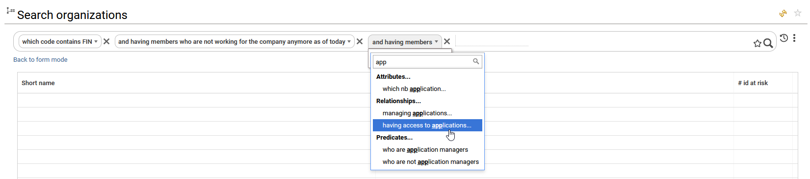  

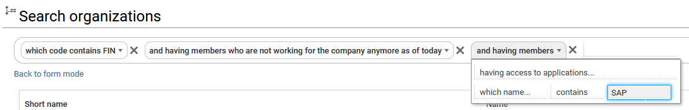  

- In the screenshot below, the user lists identities that:  
  - Have access to SAP,  
  - Have identified risks, and  
  - Have left the company.  

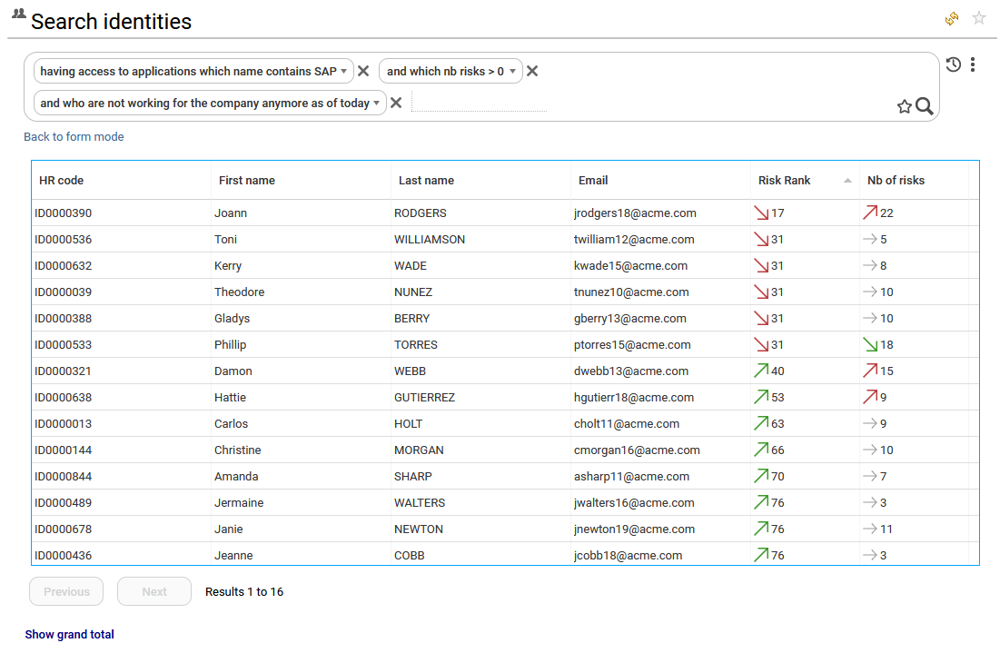  

The end user can sort any KPI column in ascending or descending order by clicking the column header. In the identities example, the **Risk rank** column is sorted to show the most risky identities first.  

## How to save search results and build your own report  

After building a query and viewing results on a search page, the end user can save the query as a **favorite** by clicking the star icon on the right. Saved queries can then be used to build new dashboards or update existing ones, and are available in mashup dashboard interfaces.

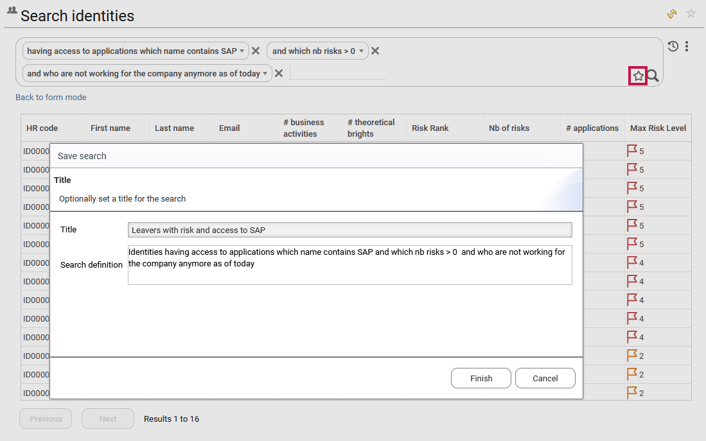  

Once queries are saved, the end user can view them along with query history by clicking the clock icon.

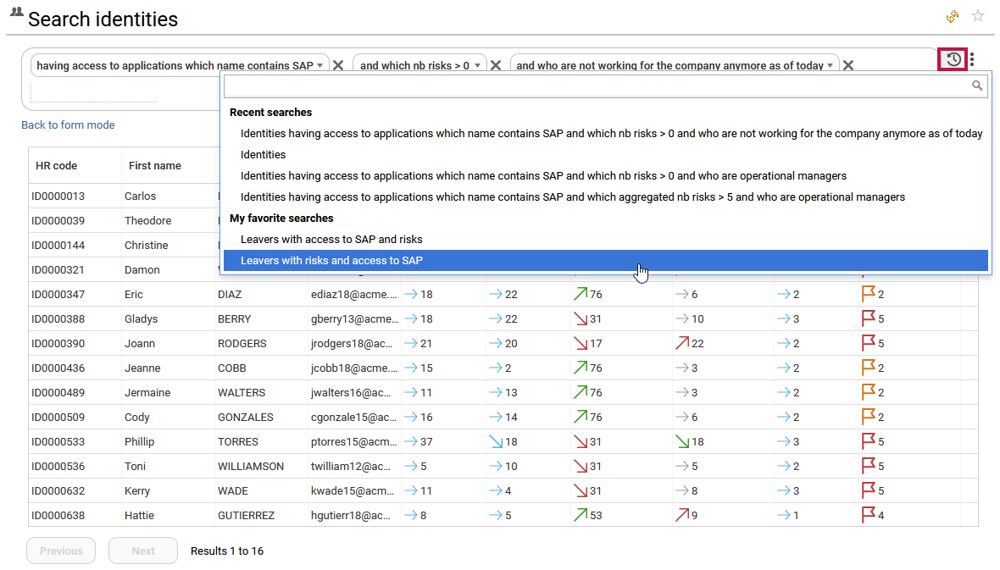  

Clicking the **Options** icon opens additional features such as managing favorites, exposing more attributes to free search, and clearing the search history.  

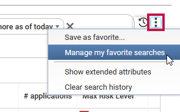  

When selecting **Manage my favorite searches**, the end user can rename, share, and delete saved queries using the corresponding buttons.  

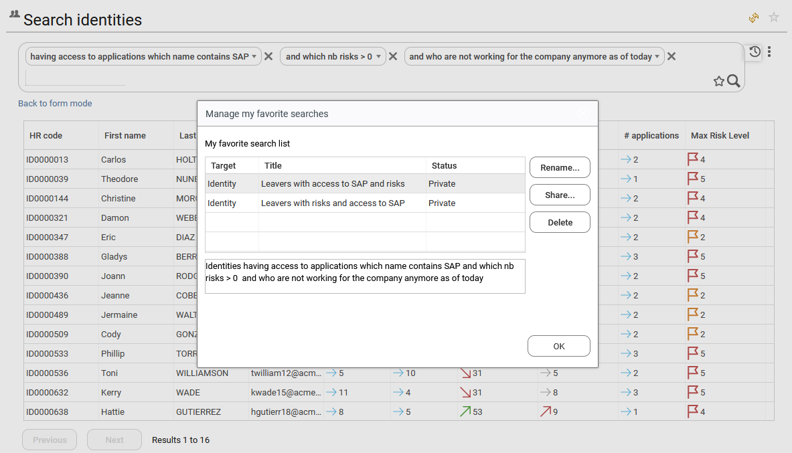  

When sharing a query, it can be shared either with specific identities or with all identities that have a given role, such as **functional admin**, **technical admin**, **auditor**, or any role defined in the Identity Analytics project.  

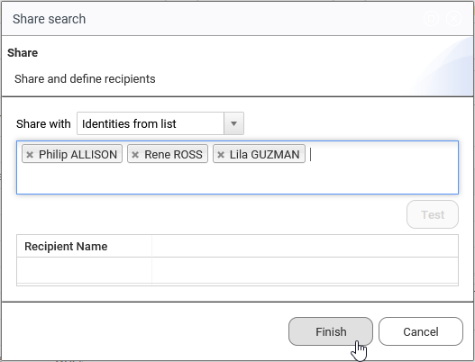

Saved queries can be used to create or update mashup dashboards. When adding a new widget to a mashup dashboard, the end user can select one of these saved queries.  

From the left‑hand menu, they can also go to **Audit → My Analytics** to start creating new reports. This page offers the same capabilities as search pages for creating, saving, and reusing queries, with one difference: the user must first select the entity on which the query will be built.  

By clicking the pen icon on the right side of the table, the end user can design a custom table and choose which attributes to display as columns.  

When finished, clicking **Save as…** in the lower‑right corner saves the configuration as a new mashup dashboard.

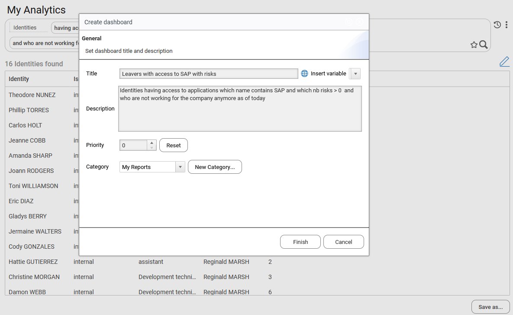  

The end user then benefits from all advanced mashup dashboard features to enhance the new dashboard and share it with others.

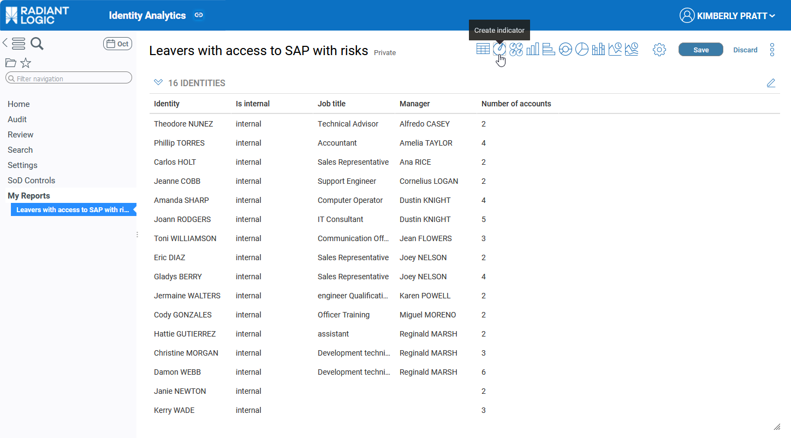  

For more information on installing and using dashboards, see the online [general documentation on dashboards](https://developer.radiantlogic.com/).

## How to apply analytics on search results

Starting with IAS/IAP 1.1, analytics can be launched directly from search pages to analyze search results. Availability depends on the user’s role.

For example:

- You search for **VIP identities** and want a report that shows their access rights and what changed since a given date.  
- You search for orphan AD accounts and want to list their groups.  

These analytics are available from the contextual menu at the lower‑right corner of the search screen.

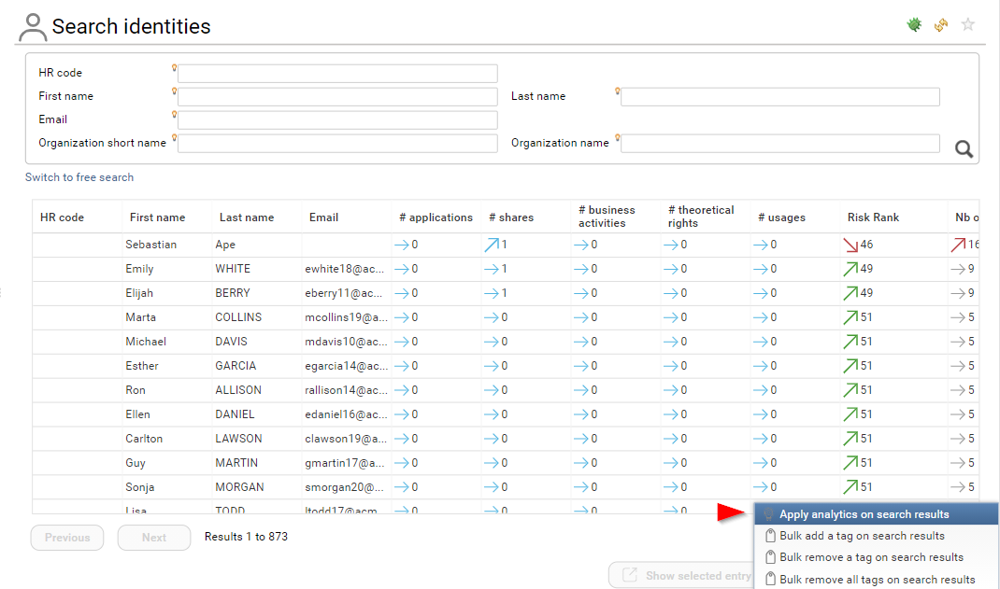

Clicking this menu entry displays all available analytics:

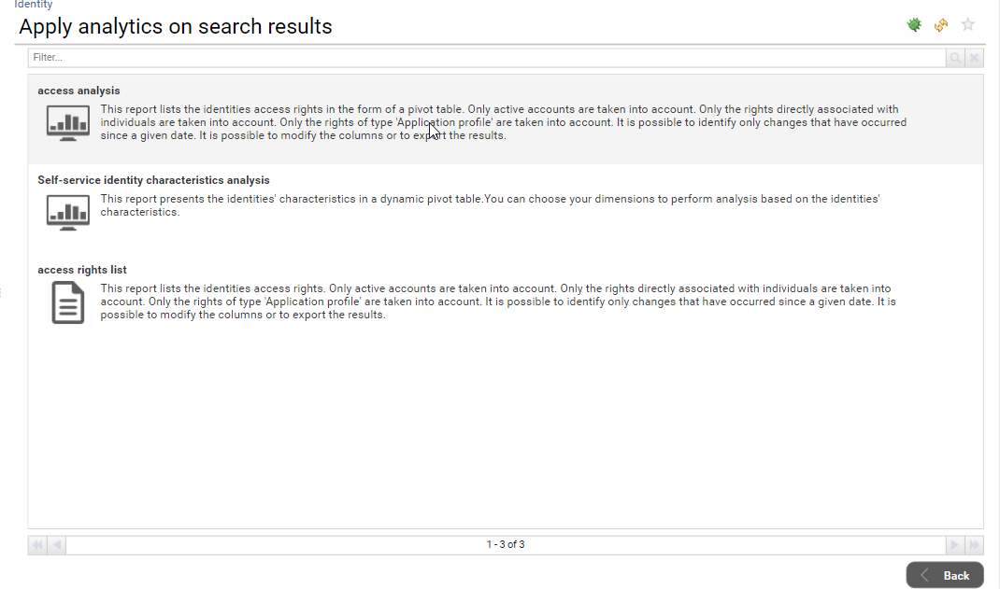

When you launch an analytic from this menu, it opens as usual but with one key difference: the search query is passed to the analytic. As a result, **you can safely bookmark this analytic in your favorites**, and it will always reflect the underlying search.

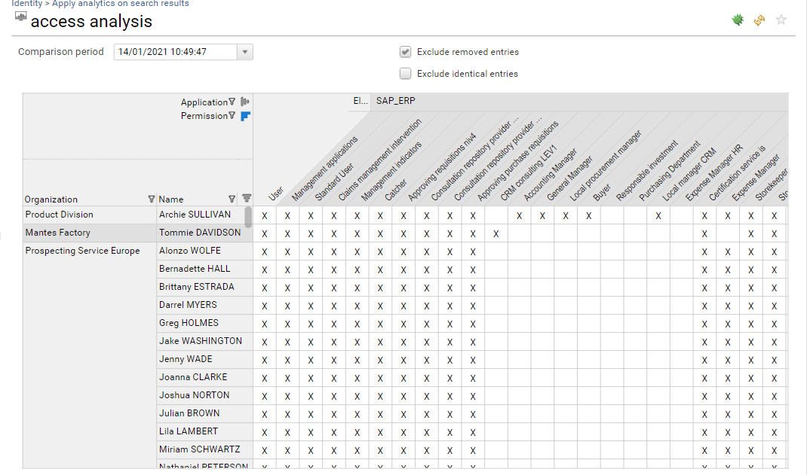

## Search pages per entity  

### Hierarchy search page  

The **Hierarchy** search page lets you explore organisations starting from the organisation chart.  
Clicking an organisation zooms into that node and displays its sub‑departments.  
Hovering over an organisation opens a tooltip that includes a link to the organisation detail page. Clicking the organisation name opens that page.

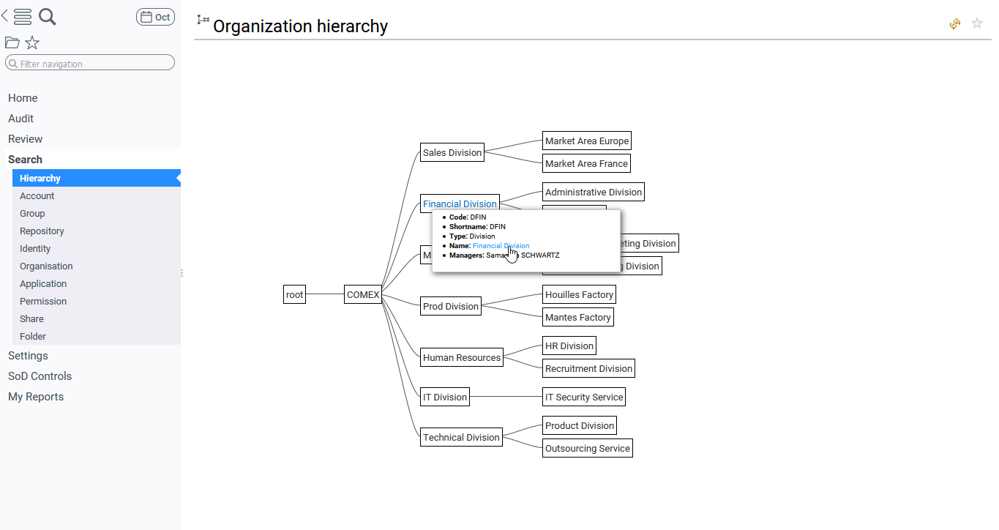

### Organisation search page

The **Organisation** search page lets you list, filter, and build queries on organisations loaded in RadiantOne Identity Analytics.  

The following computed KPIs are available by default:

| **attribute name**   | **description**                           |
| :------------------- | :---------------------------------------- |
| nbdirectmembers      | Number of direct identities               |
| nbtotalmembers       | Total number of identities                |
| riskrank             | Risk rank                                 |
| maxrisklevel         | Maximum risk level                        |
| nbidentityrisks      | Number of identities with risks           |
| nbidentityrisksratio | Percentage of identities with risks       |
| nbbusinessactivity   | Number of business activities             |
| nbtheoretical        | Number of theoretical rights              |
| nbapplication        | Number of applications (profile)          |
| nshare               | Number of shares (filesystem)             |
| nbdirectsuborg       | Number of direct sub‑organisations        |
| nbsuborg             | Number of sub‑organisations (direct+ind.) |
| nbusage              | Number of usages found                    |

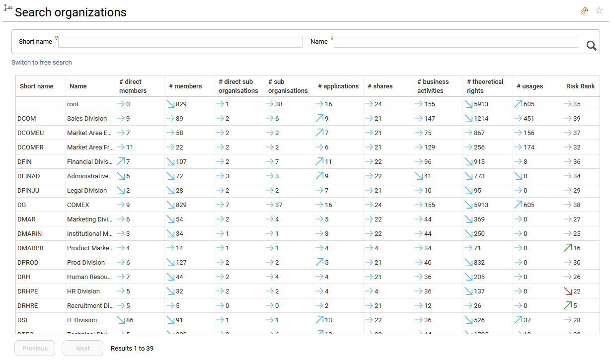

### Identity search page  

The **Identities** search page lets you list, filter, and build queries on identities loaded in Identity Analytics.  

The following computed KPIs are available by default:

| **attribute name** | **description**                    |
| :----------------- | :--------------------------------- |
| nbrisks            | Number of issues                   |
| maxrisklevel       | Maximum risk level                 |
| riskrank           | Risk rank                          |
| nbbusinessactivity | Number of business activities      |
| nbtheoretical      | Number of theoretical rights       |
| nbapplication      | Number of applications (profile)   |
| nshare             | Number of shares (filesystem)      |
| nbusage            | Number of usages found             |

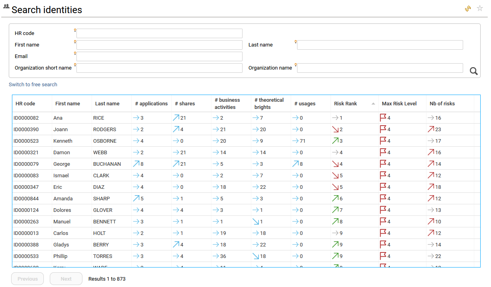

### Repository search page  

The **Repositories** search page lets you list, filter, and build queries on repositories loaded in Identity Analytics.  

The following computed KPIs are available by default:

| **attribute name**    | **description**                                       |
| :-------------------- | :---------------------------------------------------- |
| nbgroup               | Number of groups                                     |
| nbaccount             | Number of active accounts                            |
| nbidentity            | Number of identities with active accounts            |
| nbdirectaccountright  | Number of direct rights with active accounts         |
| nbdirectidentityright | Number of direct rights with identities with active accounts |
| nbapplication         | Number of applications (profile)                     |
| nshare                | Number of shares (filesystem)                        |
| nbusage               | Number of usages found                               |
  
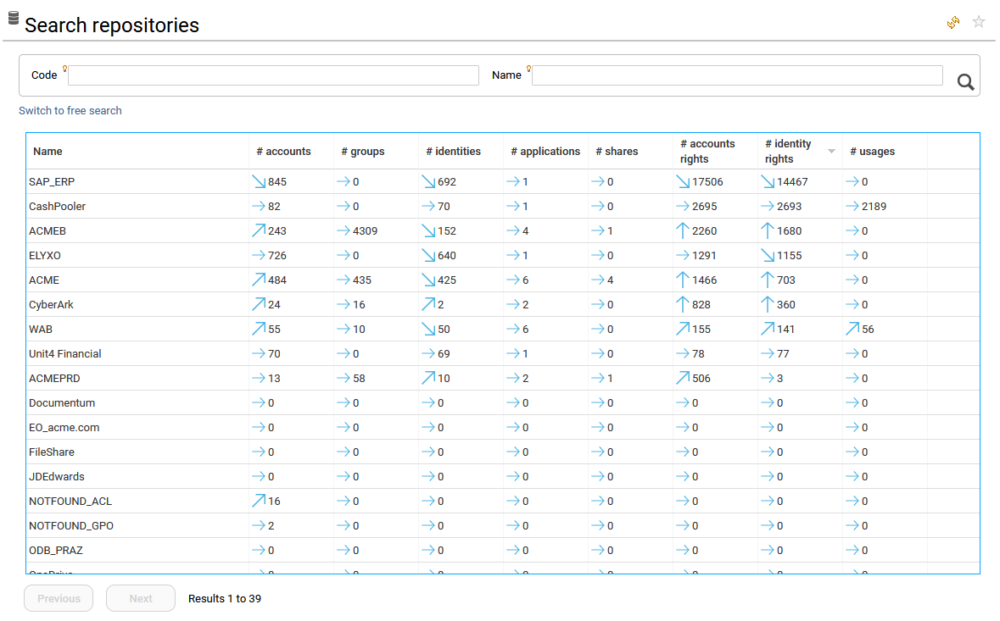

### Account search page  

The **Accounts** search page lets you list, filter, and build queries on accounts loaded in Identity Analytics.  

The following computed KPIs are available by default:

| **attribute name**       | **description**                        |
| :----------------------- | :------------------------------------- |
| nbrisks                  | Number of issues                       |
| maxrisklevel             | Maximum risk level                     |
| riskrank                 | Risk rank                              |
| nbdirectgroup            | Number of direct groups                |
| nbdirectright            | Number of direct rights                |
| nbperimeter              | Number of perimeters used in the application |
| nbdirectfolderrights     | Number of direct folder rights         |

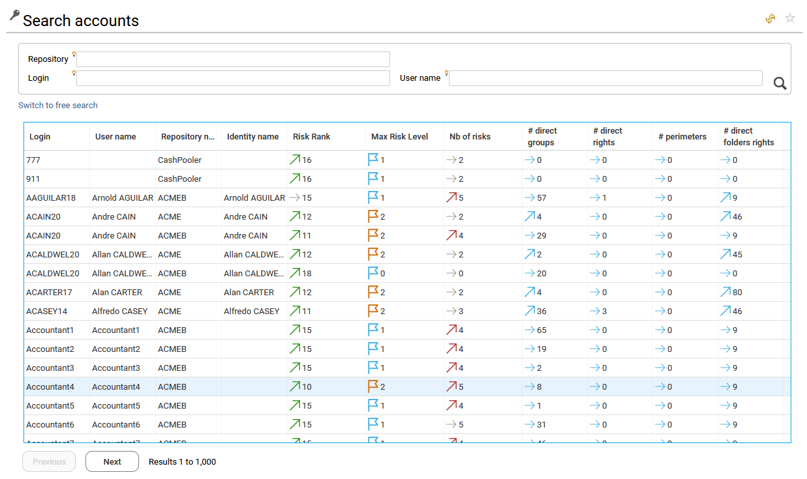

### Group search page

The **Groups** search page lets you list, filter, and build queries on groups loaded in Identity Analytics.  

The following computed KPIs are available by default:

| **attribute name**   | **description**                           |
| :------------------- | :---------------------------------------- |
| nbaccount            | Number of active accounts                 |
| nbidentity           | Number of identities with active accounts |
| nbdirectaccount      | Number of direct active accounts          |
| nbdirectidentity     | Number of identities with active direct accounts |
| nbapplication        | Number of applications (profile)          |
| nshare               | Number of shares (filesystem)             |

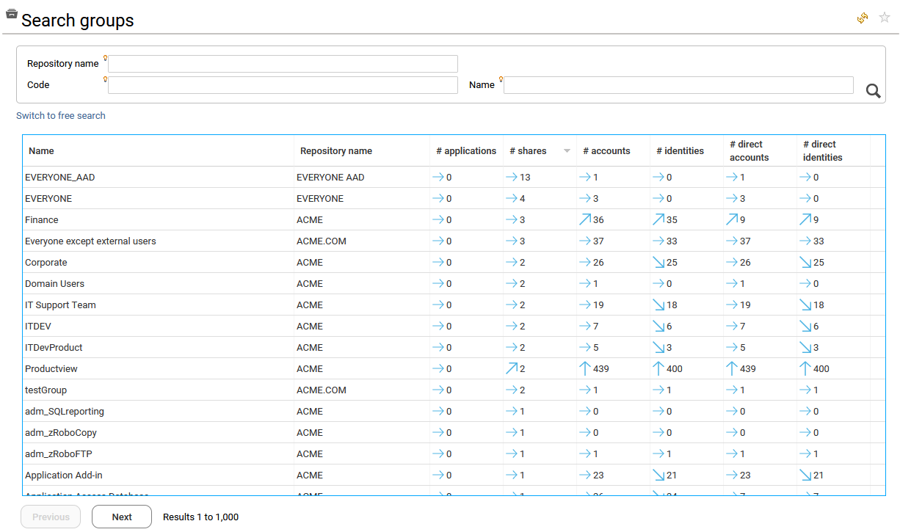

### Application search page

The **Applications** search page lets you list, filter, and build queries on applications loaded in Identity Analytics.  

The following computed KPIs are available by default:

| **attribute name**    | **description**                                       |
| :-------------------- | :---------------------------------------------------- |
| nbaccount             | Number of active accounts                             |
| nbidentity            | Number of identities with active accounts             |
| nbdirectaccountright  | Number of direct rights with active accounts          |
| nbdirectidentityright | Number of direct rights with identities with active accounts |
| nbbusinessactivity    | Number of business activities                         |
| nbprofile             | Number of profiles                                    |
| nbpermission          | Number of permissions                                 |
| nbtheoretical         | Number of theoretical rights                          |
| nbperimeter           | Number of perimeters used in the application          |
| nbusage               | Number of usages found                                |

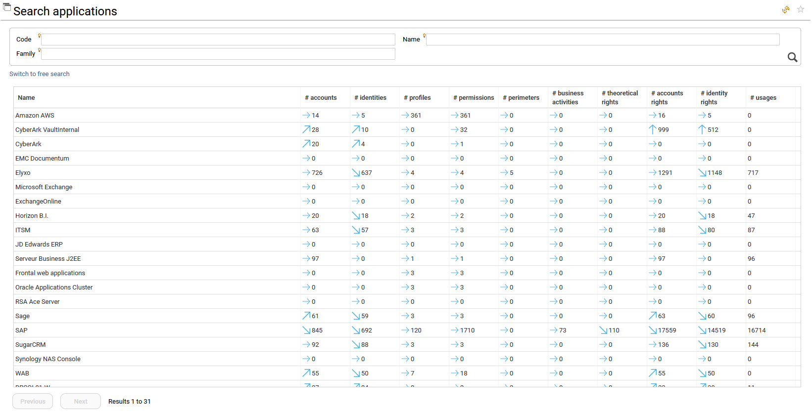

### Permission search page

The **Permissions** search page lets you list, filter, and build queries on permissions loaded in RadiantOne Identity Analytics.  

The following computed KPIs are available by default:

| **attribute name**  | **description**                       |
| :------------------ | :------------------------------------ |
| nbaccount           | Number of active accounts             |
| nbidentity          | Number of identities with active accounts |
| nbsubpermission     | Number of sub‑permissions             |
| nbtheoretical       | Number of theoretical rights          |
| nbusage             | Number of usages found                |

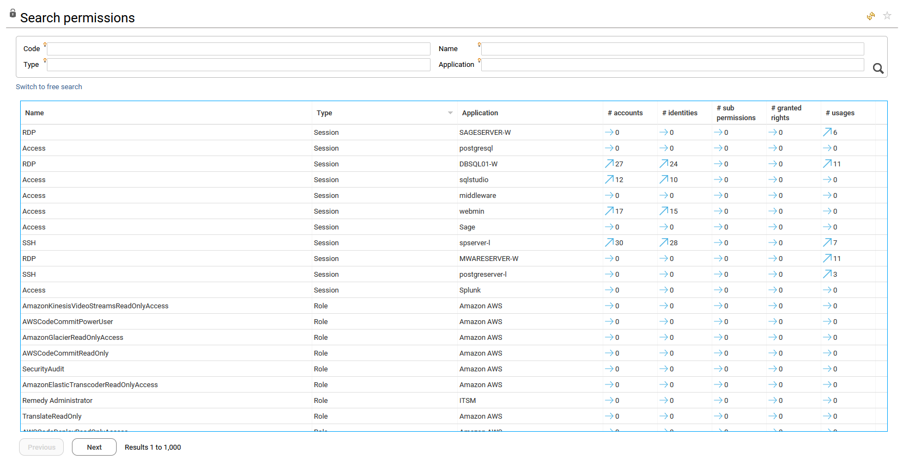

### Share search page

The **Share** search page lets you list, filter, and build queries on shares loaded in Identity Analytics.  

The following computed KPIs are available by default:

| **attribute name**    | **description**                      |
| :-------------------- | :----------------------------------- |
| nbaccount             | Number of active accounts            |
| nbidentity            | Number of identities with active accounts |
| nbusage               | Number of usages found               |
| nbreadaccess          | Number of read accesses              |
| nbwriteaccess         | Number of write accesses             |
| nbfullcontrolaccess   | Number of full control accesses      |
| nbfolder              | Number of folders                    |
| nbmanagedfolder       | Number of managed folders            |

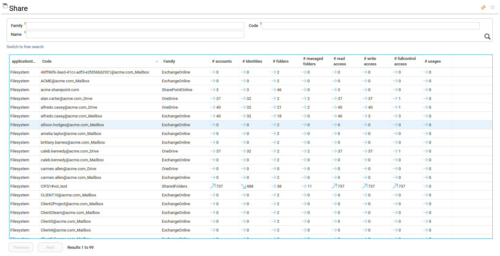

### Folder search page

The **Folder** search page lets you list, filter, and build queries on folders loaded in RadiantOne Identity Analytics.  

The following computed KPIs are available by default:

| **attribute name**  | **description**                       |
| :------------------ | :------------------------------------ |
| nbaccount           | Number of active accounts             |
| nbidentity          | Number of identities with active accounts |
| nbusage             | Number of usages found                |
| nbreadaccess        | Number of read accesses               |
| nbwriteaccess       | Number of write accesses              |
| nbfullcontrolaccess | Number of full control accesses       |

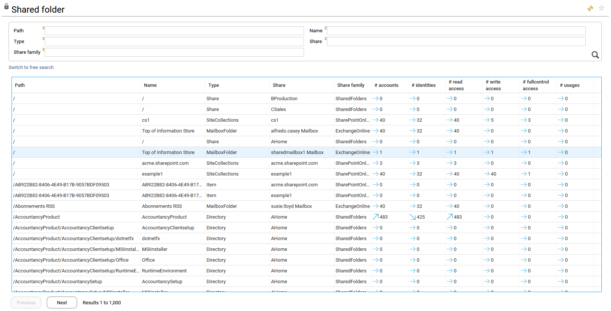
