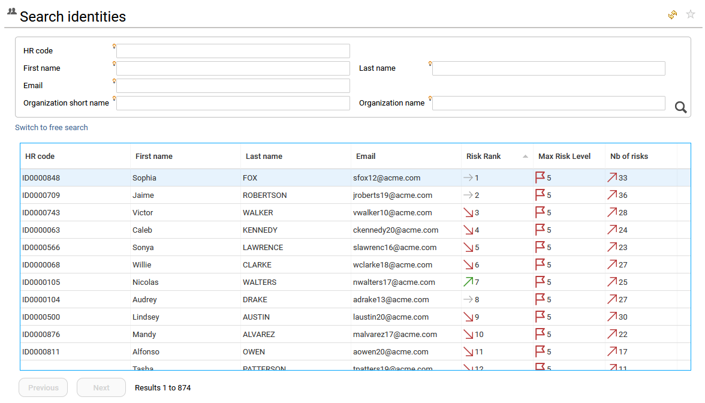

# Computed KPIs  

KPIs are automatically computed during the data loading process using the **Metadata** technical feature. These KPIs are then surfaced across search pages, detail pages, and in some cases analytics reports.

## Risk ranking and risk analysis

A core feature of IAS/IAP is to provide risk assessment and risk ranking to help end users identify the riskiest situations and mitigate those risks.

Three pre‑calculated KPIs are available at organisation, identity, and account level:

- Total number of risks  
- Maximum risk level  
- Risk rank  

Together, these three KPIs give the end user a clear view of the risk level of each resource and support comparison and prioritization. These KPIs are computed during data upload.  

### Risk rank  

Risk scoring and risk ranking are based on control results and help identify where issues are located and how they evolve over time. To see all controls available in your project and used for risk calculation, refer to [How to list all the available controls](./07-customization#advanced-feature-how-to-list-all-the-available-controls-their-description-and-manage-their-execution).  

Risk scoring is based on an aggregated score of discrepancies on the entity, weighted by each control’s risk level.  
From this score, a risk ranking is automatically computed. The higher the rank, the worse the situation (for example, the account ranked **#1** is the most risky account in the company).  

Entities with exactly the same risk score share the same rank, which is why the end user may see **ex aequo** rankings. For more details on how risk rank is computed, see the *Identity Analytics Integration Guide*, section *IAS/IAP UX principles > UI Content Principles > Risk scoring & Risk ranking*.  

Ranking is particularly useful to reorder entries from a risk‑based perspective. Risk information is available both on search pages and on detail pages.  

### Number of risks and maximum risk level  

In addition to the risk rank, the end user can look at the **number of risks** associated with an entity. This helps interpret the overall context.  

As in the example below, one entity (Jaime ROBERTSON) may have more risks, but with lower severity, resulting in a higher (less critical) rank than another entity (Sophia FOX) that has fewer but more severe control defects.

## Other computed KPIs  

Additional KPIs are automatically computed during data loading to simplify analysis and to provide metrics and trends for entities. These KPIs are exposed as **extended attributes** on entities. Because they are part of the data model, they can be used in user interfaces (such as search pages) and in custom reports or analytics.

Here is a summary of the available computed KPIs:

---

- **Attribute name:** `nbdirectmembers`
- **Description:** Number direct identity
- **Entity:** Organisation

---

- **Attribute name:** `nbtotalmembers`
- **Description:** nb total identity
- **Entity:** Organisation

---

- **Attribute name:** `nbrisks`
- **Description:** nb problems
- **Entity:** Account, Identity

---

- **Attribute name:** `maxrisklevel`
- **Description:** max risk level
- **Entity:** Account, Identity

---

- **Attribute name:** `riskscore`
- **Description:** risk score
- **Entity:** Account, Identity, Organisation

---

- **Attribute name:** `riskrank`
- **Description:** risk rank
- **Entity:** Account, Identity, Organisation

---

- **Attribute name:** `aggnbrisks`
- **Description:** aggregated nb problems
- **Entity:** Identity

---

- **Attribute name:** `aggmaxrisklevel`
- **Description:** aggregated max risk level
- **Entity:** Identity, Organisation

---

- **Attribute name:** `aggriskscore`
- **Description:** aggregated risk score
- **Entity:** Identity, Organisation

---

- **Attribute name:** `aggriskrank`
- **Description:** aggregated risk rank
- **Entity:** Identity

---

- **Attribute name:** `nbgroup`
- **Description:** nb groups
- **Entity:** Identity, Repository

---

- **Attribute name:** `nbdirectgroup`
- **Description:** nb direct groups
- **Entity:** Identity

---

- **Attribute name:** `nbaccount`
- **Description:** nb active accounts
- **Entity:** Permission, Application, Group, Repository

---

- **Attribute name:** `nbidentity`
- **Description:** nb identities with active accounts
- **Entity:** Permission, Application, Group, Repository

---

- **Attribute name:** `nbdirectaccount`
- **Description:** nb direct active accounts
- **Entity:** Group

---

- **Attribute name:** `nbdirectidentity`
- **Description:** nb identities with active direct accounts
- **Entity:** Group

---

- **Attribute name:** `nbdirectaccountright`
- **Description:** nb direct rights with active accounts
- **Entity:** Application, Repository

---

- **Attribute name:** `nbdirectidentityright`
- **Description:** nb direct rights with identities with active accounts
- **Entity:** Application, Repository

---

- **Attribute name:** `nbidentityrisks`
- **Description:** nb identities with risks
- **Entity:** Organisation

---

- **Attribute name:** `nbidentityrisksratio`
- **Description:** nb identities with risks as a percentage
- **Entity:** Organisation

---

- **Attribute name:** `nbdirectrole`
- **Description:** nb direct permission of type role per application
- **Entity:** Account

---

- **Attribute name:** `nbbusinessactivity`
- **Description:** nb business activity
- **Entity:** Account, Identity, Organisation, Application

---

- **Attribute name:** `nbprofile`
- **Description:** nb profile
- **Entity:** Application

---

- **Attribute name:** `nbpermission`
- **Description:** nb permission
- **Entity:** Application

---

- **Attribute name:** `nbsubpermission`
- **Description:** nb sub permissions
- **Entity:** Permission

---

- **Attribute name:** `nbtheoretical`
- **Description:** nb theoretical rights
- **Entity:** Account, Identity, Organisation, Permission, Application

---

- **Attribute name:** `nbdirectright`
- **Description:** nb rights (total)
- **Entity:** Account

---

- **Attribute name:** `nbright`
- **Description:** nb direct rights
- **Entity:** Account

---

- **Attribute name:** `nbapplication`
- **Description:** nb applications (Profile)
- **Entity:** Identity, Organisation, Group, Repository

---

- **Attribute name:** `nshare`
- **Description:** nbshare (Filesystem)
- **Entity:** Identity, Organisation, Group, Repository

---

- **Attribute name:** `isroot`
- **Description:** is business activity a root business activity
- **Entity:** Permission

---

- **Attribute name:** `nbperimeter`
- **Description:** nb perimeters used in the application
- **Entity:** Account, Identity, Organisation, Application

---

- **Attribute name:** `nbdirectsuborg`
- **Description:** nb of direct sub-organisations
- **Entity:** Organisation

---

- **Attribute name:** `nbsuborg`
- **Description:** nb of sub-organisations (direct+indirect)
- **Entity:** Organisation

---

- **Attribute name:** `depth`
- **Description:** depth level
- **Entity:** Organisation

---

- **Attribute name:** `nbusage`
- **Description:** nb of usages found
- **Entity:** Account, Identity, Permission, Application, Repository

---

- **Attribute name:** `nbreadaccess`
- **Description:** nb read access  
- **Entity:** Permission, Application

---

- **Attribute name:** `nbwriteaccess`
- **Description:** nb write access
- **Entity:** Permission, Application

---

- **Attribute name:** `nbfullcontrolaccess`
- **Description:** nb full controll access
- **Entity:**  Permission, Application

---

- **Attribute name:** `nbfolder`
- **Description:** nb folder
- **Entity:** Application

---

- **Attribute name:** `nbmanagedfolder`
- **Description:** nb managed folder
- **Entity:** Application

---

- **Attribute name:** `joborg`
- **Description:** jobs and organisations (aggregated string)
- **Entity:** Identity

---

- **Attribute name:** `orgpath`
- **Description:** organisation path (aggregated org shortname)
- **Entity:** Identity

---
