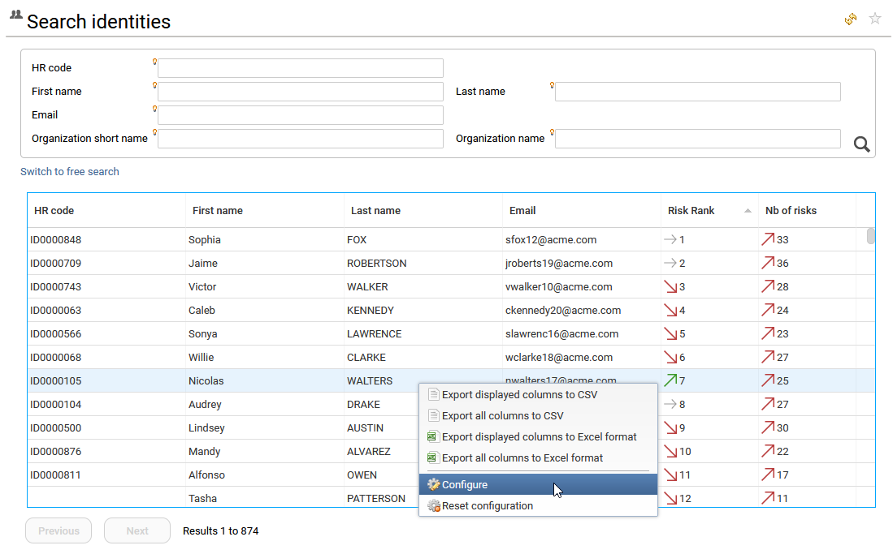
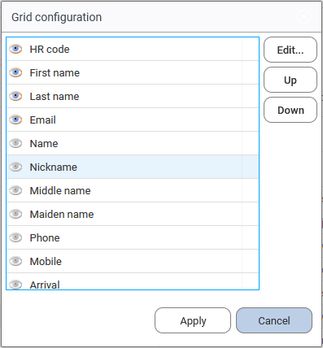
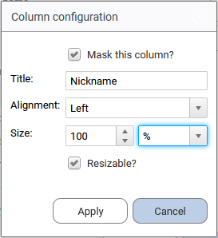
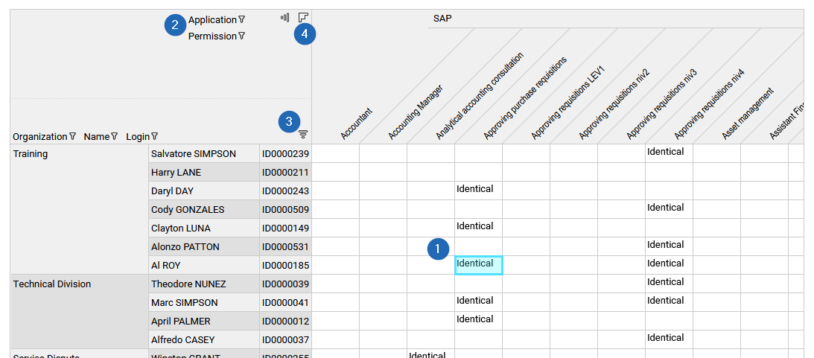
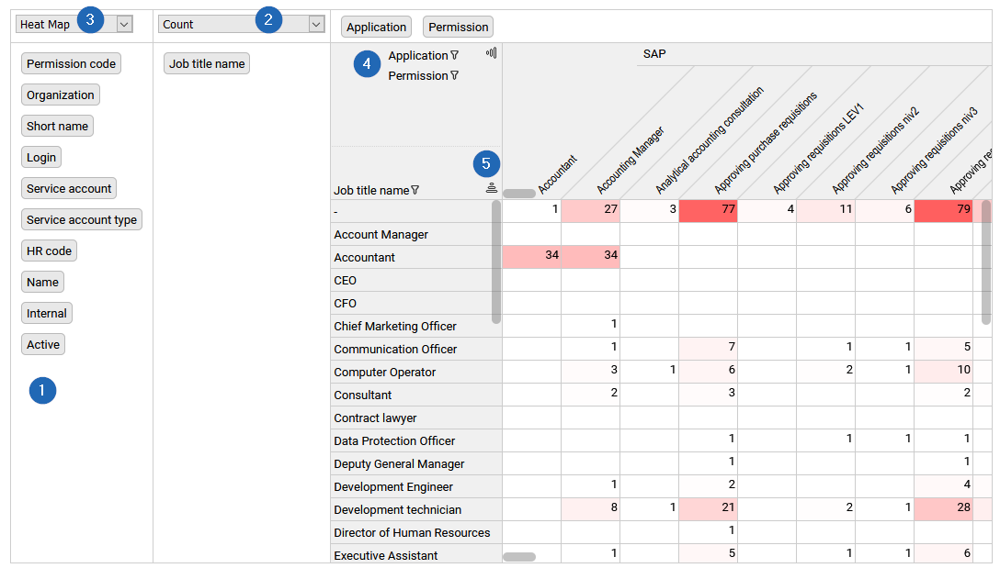
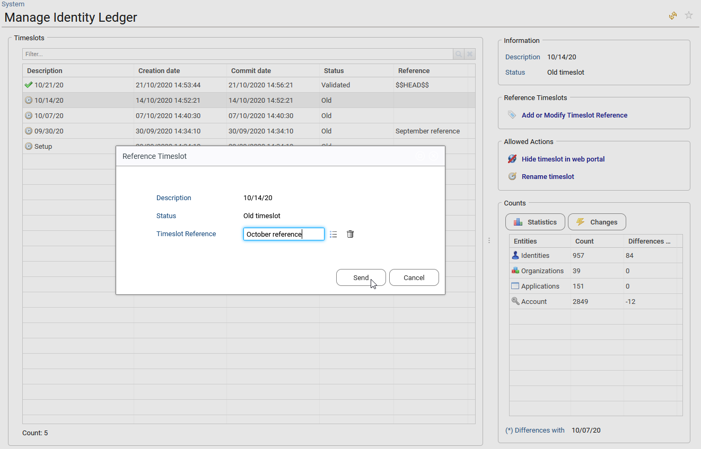
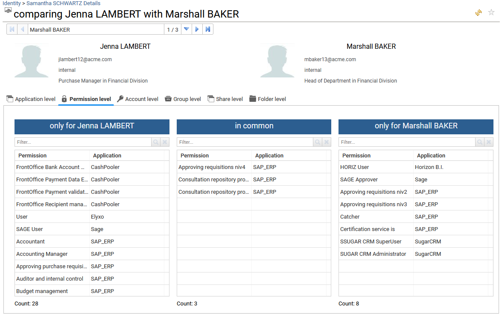
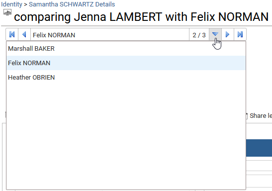
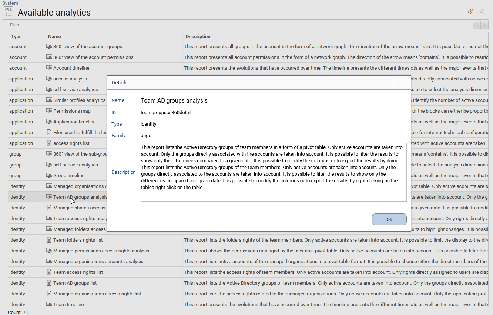
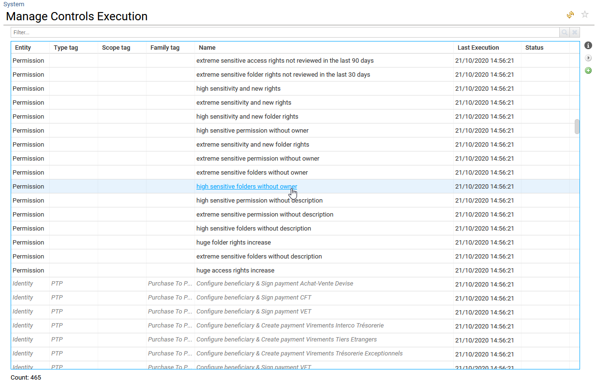

# Customization

## How to configure tables, columns and export data

### Standard tables

Right‑clicking a table in Identity Analytics lets you export and configure its content.  

  

- **Export displayed columns to CSV / Excel**: exports only the visible columns to a CSV or Excel file. Hidden columns are ignored.  
- **Export all columns to CSV / Excel**: exports all columns (visible and hidden) to a CSV or Excel file.  
- **Reset configuration**: restores the default column configuration.  
- **Configure**: lets you show or hide columns, resize them, and change their headers.  

When using **Configure**, you can hide or display a column by clicking the “eye” icon to the left of its header. The **Up** and **Down** buttons on the right let you reorder columns.  

{ width=40% }  

The **Edit…** button lets you customize the selected column:

- Hide the column  
- Change the header  
- Adjust alignment of the column content  
- Set the column width (in % or px)  
- Enable or disable column resizing  

### Cross tables

A cross table is a two‑way table that displays aggregated information in rows and columns (dimensions). Its purpose is to visualize relationships between dimensions and to present large datasets in a condensed format. Cross tables are generally used in analytics reports.  

Two types of cross tables are available by default: **standard** and **self‑service**.  
Right‑clicking the table content allows you to export the full cross table. In Excel, panes remain frozen so you can easily work with and share the data.  

- **Standard cross tables**  
  - The end user can select a cell (**1**) and trigger actions (such as displaying a message, updating a detail panel, or navigating to another page) when configured. This is especially used in SoD analytics reports.  
  - They can filter row and column header values by clicking the header (**2**) and applying a filter.  
  - They can sort row and column header values by clicking the sort icon (**3**).  
  - An option allows cluster sorting of cross‑table cells using an **advanced classification algorithm**. This helps work with peer groups. To activate it, click the icon (**4**) in the upper‑left corner.  

- **Self‑service cross tables**  
  - The end user can build and organize the cross table as needed by dragging available dimensions (**1**) to rows or columns.  
  - They can select the measure to use from the list of available measures (**2**) and choose an aggregation function (for example, count, sum, maximum, average).  
  - They can choose how to display aggregated data: figures, bar charts, or heatmaps (**3**).  
  - As with standard cross tables, they can filter dimensions by clicking the row or column header (**4**) and sort header values using the sort icon (**5**).  

## How to configure the comparison timeslot  

The end user can define a **comparison timeslot** that is used to evaluate changes between the current dataset (timeslot) and an older **reference timeslot**. By default, the comparison timeslot is the previous dataset.  

All these evaluations are computed during data upload (the execution plan). If the end user changes the reference timeslot, the new reference is used for subsequent data loads only. Marking an historical timeslot as a reference has no impact on data that has already been loaded.  

To modify the reference timeslot, the end user must open the **Identity Ledger Manager** from the administration page:  
**Settings → System → Manage Identity Ledger**.  

This action requires the **technical admin** role (`technicaladmin`).  

By default, the current timeslot is always a temporary reference timeslot of type `$$HEAD$$`. It is replaced by the next current timeslot when new data is loaded.  
If the user wants to keep it as a reference, they must rename `$$HEAD$$` to another value.  

If several reference timeslots are renamed, the **last renamed reference timeslot** is used as the comparison timeslot for future data loads.  

## How to compare identities, accounts, permissions or groups  

In most tables on detail pages, the end user can compare resources with one another. Examples:

- In the **Team** tab of organisation and identity (manager) detail pages, they can **compare a selected identity** with others in the list.  
- In the **Accounts** sub‑tab of repository, application, and share detail pages, they can **compare a selected account** with others.  
- In the **Groups** tab of the repository detail page, they can **compare a selected group** with others.  
- In the **Permissions** tab of the application detail page, they can **compare a selected permission** with others.  
- In the **Folders** sub‑tab of the share detail page, they can **compare a selected folder** with others.  

The first selected identity, group, permission, or account is used as the baseline and is compared with all other selected items.

- For **identities** and **accounts**, comparison is performed per resource type with respect to the comparison timeslot (see previous section) at application, permission, group, share, and folder level. Share and folder levels require the **Booster for Data Governance / Unstructured Data** license.  
  When comparing identities, account repositories are also compared.  

- For **groups**, comparison focuses on group members (accounts).  
- For **permissions**, comparison focuses on accounts that have access.  

In the comparison dashboard, the end user can switch the comparison target (identity, account, or group) using the widget at the top of the page.  

## How to list all available analytics reports and their description

Analytics range from simple reports to advanced management interfaces.  

The full list of analytics reports for any resource is available from the administration page:  
**Settings → System → Available analytics**.  

From this list, the end user can:

- Click a report name to view more details.  
- Add columns by right‑clicking and selecting **Configure**.  

Access to this page requires the **technical admin** role (`technicaladmin`).  

## Advanced feature: how to list all controls, view their description, and manage execution  

IAS/IAP include hundreds of controls used across the interfaces and to compute risk KPIs.  

The full list of controls is available from the administration page:  
**Settings → System → Available analytics**.  

This list is built by scanning the controls available in your project, so all controls must be part of the RadiantOne Identity Analytics project to be visible and executable.  

Using the buttons on the right side of the table, you can:

- Display details for the selected control.  
- Re‑execute the selected control on the current timeslot.  
- Execute controls that are **not** included in the execution plan (data loading process) on the current timeslot.  

This is particularly useful when, for example, you:

- Set new account owners (reconciliation).  
- Mark technical accounts.  
- Update sensitivity status or ownership.  

You can use this interface to recompute related controls after these attributes are changed or the reconciliation status is improved.  

Some controls are displayed in *italics*. This means either:

- The corresponding control file cannot be found in the project, or  
- The user cannot execute the control because it is generated automatically during data load (for example, SoD controls created from an SoD matrix).  

All controls executed during data loading are used to compute the **Risk rank** and **risk score**.
