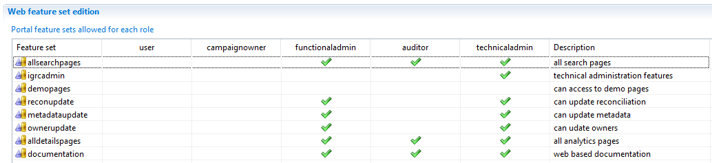
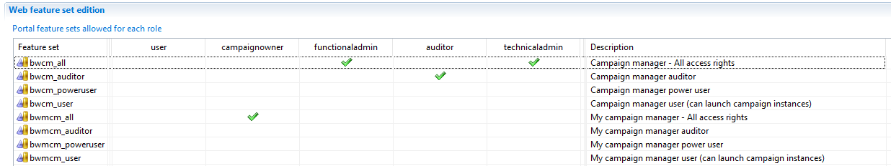

# Web portal roles

This page focuses on how web portal roles control what users can see and do in the Identity Analytics Platform (IAP), from basic self‑service access (Access 360) to advanced administration, auditing, and dashboard development.

Configuration of authentication and authorization is outside the scope of this guide. For details on the underlying security model or how to integrate with external identity providers (such as Active Directory or SAML), refer to the Installation and deployment documentation.
[Installation and deployment](../../../descartes/igrc-platform/installation-and-deployment/03-brainwaves-web-portal/)

Several roles are available to restrict the end-users capabilities in IAP.
Those roles are summarized here:

Several roles are available to control what end users can do in IAP.  
These roles are summarized below:

## user

This is the basic role that a user **must** have to access IAP.  
It grants access to **Access 360**, which provides an overview of the user’s identity, task list, and entitlements (what they can access).

## functionaladmin

The **functionaladmin** role is assigned in addition to the **user** role to grant full access to the **Identity Ledger**.  

With this role, a user can:

- Access all information through search views.  
- Browse controls.  
- Access selected configuration interfaces (for example, audit logs).  
- Use the **Campaign Manager** to configure and manage campaigns.  
- Update both **classification** and **ownership** information.

## auditor

The **auditor** role is also assigned on top of the **user** role to grant full access to the **Identity Ledger**.  

With this role, a user can:

- Access all information through search views.  
- Browse controls.  
- Access selected configuration interfaces (such as audit logs).  
- Use the **Campaign Manager**.

All access for the **auditor** role is **read‑only**.

## technicaladmin

The **technicaladmin** role is assigned on top of the **user** role.  

It includes all capabilities of the **functionaladmin** role, plus additional technical administration features, such as **Identity Ledger** management (for example, activating or hiding timeslots).

## developer

Users with the **developer** role are responsible for the **technical implementation** of mashup dashboards.  
They can create dashboards and store them as files in the Git project.  

This role cannot be used when IDA is deployed in a **SaaS EOC** environment.

## designer

The **designer** role can create mashup dashboards and store them in the **database**, but cannot save them as files in the project.  
Designers also cannot edit or modify dashboards that have already been saved in the project.  

By default, the **technicaladmin** and **functionaladmin** roles include the same features as the **designer** role, but not the **developer** role.

## Dynamic roles and management information

Some roles are computed dynamically by RadiantOne Identity Analytics based on information stored in the **Identity Ledger**.  
You do not need to assign these roles manually.

- **campaignowner**: This role is granted on top of the **user** role when a person is defined as the **owner** of at least one campaign in the Identity Ledger.  
  Users with this role have access to a **restricted version** of the Campaign Manager, limited to launching and managing their own campaigns.

There are no static roles that directly represent user characteristics such as **line manager**, **organization manager**, or **resource owner**.  
These characteristics are derived dynamically from the Identity Ledger.  

This means a user with only the **user** role may still see information beyond their own identity if they are identified as a manager or owner in the data.  

As a general rule, when a user has only the **user** role, they cannot see any information beyond their **managed resources**, which enforces the **least privilege** principle.

Keep this behavior in mind when configuring custom or ad‑hoc reports for users.
Have a better intro
Here’s an improved intro you can drop in:

Configuration of authentication and authorization is outside the scope of this guide. Instead, this page focuses on how web portal roles control what users can see and do in the Identity Analytics Platform (IAP), from basic self‑service access (Access 360) to advanced administration, auditing, and dashboard development. For details on the underlying security model or how to integrate with external identity providers (such as Active Directory or SAML), refer to the Installation and deployment documentation.

