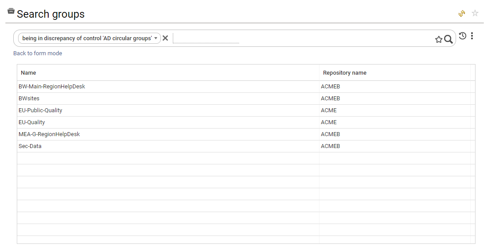

# Available Controls

IAP comes with more than 100 off-the-shelf controls. These controls identify problems related to:

- Data quality
- Security policy violation
- Compliance gaps such as access certification
- Discrepancies through peer group and predictive analysis

These controls are part of the data model and are presented in each detail pane. They are also used to compute risk scores. You can use them in your own dashboards, reports, reviews and analytics. You can also search for errors through the search pages. (You will have to switch to "free search" and enable "show extended attributes" to do this.)

Here is an extract of the available controls in IAP. Please consult "Settings &rarr; System &rarr; Manage Controls Execution" for an updated list of the controls available in your instance.  

Note that the Booster for PAM and Booster for AD functions, now integrated into Identity Analytics, also come with additional predefined controls which are listed at the end of this page. Please go to [Booster for AD](#ad-booster-controls) or [PAM Booster Controls](#pam-booster-controls) sections for the control details.  
  
## Standard Controls  
  
---

- **Control ID:** `ACC_01`
- **Entity:** Account
- **Name:** Unused account
- **Description** Unused accounts are defined as accounts that have not been used for at least 90 days or those that have never been used at all.
- **Risk Level:** 1
- **Risk description:** Unused accounts are, by definition, no longer monitored by their respective owners. These accounts can be hacked and used by an insider to impersonate an individual while engaging in fraudulent activity. Accounts can be unused if the account owner is no longer using the service, if the account owner is a contractor who no longer works for the company, or if the account is a test/service account that is no longer being used.
- **Remediation:** Monitor the account's last login date. If the last login date is greater than 60 days (or if the account has never been used), notify the manager of the account owner to disable or delete it. The account owner's manager is in charge of enforcing the security policy within his scope of responsibility.

---

- **Control ID:** `ACC_02`
- **Entity:** Account
- **Name:** Orphaned account
- **Description** Active accounts identified as orphaned.
- **Risk Level:** 1
- **Risk description:** Orphaned accounts are neither assigned to an individual nor tracked as a service account. Therefore, they can be used by insiders, outliers or hackers to steal data or engage in rogue transactions.
- **Remediation:** Reconcile the account or disable it if it is no longer being used.

---

- **Control ID:** `ACC_03`
- **Entity:** Account
- **Name:** Active account whose owner has left the company.
- **Description** An active account belonging to an identity who has left the company.
- **Risk Level:** 4
- **Risk description:** Accounts must be terminated upon the departure of their owner. Otherwise they can be used by a third party (insider, hacker) to compromise data or steal information.
- **Remediation:** Verify that the owner has left the company and disable the account immediately.

---

- **Control ID:** `ACC_04`
- **Entity:** Account
- **Name:** Password never expires
- **Description** User account with a password that never expires.
- **Risk Level:** 2
- **Risk description:** User accounts with a password that never expires present a risk because once a password is shared, it can spread rapidly, exposing the assets of the company.
- **Remediation:** Reactivate the password's expiration date.

---

- **Control ID:** `ACC_05`
- **Entity:** Account
- **Name:** Password never expires - technical account
- **Description** Technical account with a password that never expires.
- **Risk Level:** 1
- **Risk description:** Technical/service accounts with a password that never expires present a risk because once a password is shared, it can spread rapidly, exposing the assets of the company.
- **Remediation:** Change the password on a regular basis or use a PAM solution to hide the password from users.

---

- **Control ID:** `ACC_06`
- **Entity:** Account
- **Name:** Password never expires - orphan account
- **Description** Orphaned account with a password that never expires.
- **Risk Level:** 2
- **Risk description:** Accounts with a password that never expires present a risk because once the password is shared, it can spread rapidly, exposing the assets of the company.
- **Remediation:** Reactivate the password's expiration date.

---

- **Control ID:** `ACC_07`
- **Entity:** Account
- **Name:** User password is too old.
- **Description** Active user account with a password that has not been changed in the last 90 days.
- **Risk Level:** 1
- **Risk description:** Passwords must be changed on a regular basis to comply with security policies and mitigate account-hacking risk.
- **Remediation:** For user accounts, verify whether or not the account is still being used. If not, disabled it. Otherwise, check the password policy and reactivate the password expiration policy.

---

- **Control ID:** `ACC_08`
- **Entity:** Account
- **Name:** Abnormal login attempts
- **Description** More than 20 unsuccessful login attempts have been detected on this account.
- **Risk Level:** 4
- **Risk description:** A high number of unsuccessful login attempts have been detected on this account. Someone (or a bot) may be attempting to hack into this account.
- **Remediation:** Contact the account owner to investigate. Check account security (password strength) and enable MFA, if needed.

---

- **Control ID:** `ACC_09`
- **Entity:** Account
- **Name:** Password not needed
- **Description** Password is not needed to connect.
- **Risk Level:** 2
- **Risk description:** This account can be used without a password which can lead to security problems depending on the type of account.
- **Remediation:** Reactivate authentication for this account.

---

- **Control ID:** `ACC_10`
- **Entity:** Account
- **Name:** User password cannot be changed
- **Description** User cannot change their password.
- **Risk Level:** 2
- **Risk description:** User accounts with a password that never expires or cannot be changed present a risk because once the password is shared, it can spread rapidly, exposing the assets of the company.
- **Remediation:** Reactivate the password update capability for this account.

---

- **Control ID:** `ACC_11`
- **Entity:** Account
- **Name:** Locked account
- **Description** The account is locked.
- **Risk Level:** 1
- **Risk description:** Locked accounts need to be monitored because they can correspond to former users accounts with unsuccessful login attempts.
- **Remediation:** Disable the account if it is no longer needed.

---

- **Control ID:** `ACC_12`
- **Entity:** Account
- **Name:** No user name
- **Description** The account does not have a username, only a login.
- **Risk Level:** 1
- **Risk description:** Accounts should be documented to help with auditing.
- **Remediation:** Enrich the account information.

---

- **Control ID:** `ACC_13`
- **Entity:** Account
- **Name:** Username inconsistency
- **Description** The account last name does not match with the account owner's last name.
- **Risk Level:** 1
- **Risk description:** This account could have been reassigned which can lead to security issues if the account permissions have not been updated accordingly.
- **Remediation:** Review account permissions.

---

- **Control ID:** `ACC_14`
- **Entity:** Account
- **Name:** Technical account without a manager
- **Description** A technical account without an account manager.
- **Risk Level:** 1
- **Risk description:** These are technical/service accounts that are not associated with an account owner. However, these accounts have sensitive access rights and, as a result, they should be associated with an account manager or business owner who is responsible for reviewing accounts and their permissions on a regular basis.
- **Remediation:** Assign a business owner to this account.

---

- **Control ID:** `ACC_15`
- **Entity:** Account
- **Name:** Extremely sensitive permissions
- **Description** An account with a permission sensitivity level that is set to Extreme (4).
- **Risk Level:** 2
- **Risk description:** Accounts granting "extreme sensitivity" access rights should be carefully monitored.
- **Remediation:** Verify that this account is not a standard user account. Review the account on a regular basis. Monitor account access.

---

- **Control ID:** `ACC_16`
- **Entity:** Account
- **Name:** Sensitive permissions
- **Description** An account with a permission sensitivity level that is set to High (3).
- **Risk Level:** 1
- **Risk description:** Accounts granting "high sensitivity" access rights should be carefully monitored.
- **Remediation:** Verify that this account is not a standard user account. Review the account on a regular basis. Monitor account access.

---

- **Control ID:** `ACC_17`
- **Entity:** Right
- **Name:** Overallocated right
- **Description** The access right is not found in the "granted rights" list.
- **Risk Level:** 2
- **Risk description:** Overallocated rights means that access rights have been given to individuals without following a formal approval process. This can be due to an IT administrative error or direct system update. Because these rights are not approved, they can lead to fraud or data-leakage risk.
- **Remediation:** Review the access right and remove it if it is not necessary. Update the table of granted rights.

---

- **Control ID:** `ACC_18`
- **Entity:** Right
- **Name:** Atypical access right
- **Description** Based on the analysis of an organizational peer group, this access right appears to be atypical.
- **Risk Level:** 1
- **Risk description:** Atypical access rights need to be monitored because they can correspond to stale access rights (access rights not removed when an individual moves from one department to another).
- **Remediation:** Review the access right and remove it if it is not necessary.

---

- **Control ID:** `ACC_19`
- **Entity:** Right
- **Name:** Atypical new access right
- **Description** Based on the analysis of an organizational peer group, this new access right appears to be atypical.
- **Risk Level:** 3
- **Risk description:** Atypical new access rights need to be monitored because they correspond to new access rights for an individual who appears unusual in the organizational context. It could be an IT error.
- **Remediation:** Review the access right and remove it if it is not necessary.

---

- **Control ID:** `ACC_20`
- **Entity:** Right
- **Name:** Atypical access right next to a position update
- **Description** Based on the analysis of an organizational peer group, this access right appears to be atypical.
- **Risk Level:** 2
- **Risk description:** Atypical access rights need to be monitored because they are unusual in the organizational context and the account user position just changed (organization). It could be a leftover access right.
- **Remediation:** Review the access right and remove it if it is not necessary.

---

- **Control ID:** `ACC_21`
- **Entity:** Account
- **Name:** Access to extremely sensitive folders
- **Description** An account with folders whose sensitivity level is set to Extreme (4).
- **Risk Level:** 2
- **Risk description:** Accounts granting "extreme sensitivity" access rights should be carefully monitored.
- **Remediation:** Verify that this account is not a standard user account. Review the account on a regular basis. Monitor account access.

---

- **Control ID:** `ACC_22`
- **Entity:** Account
- **Name:** Access to sensitive folders
- **Description** An account with folders whose sensitivity level is set to High (3).
- **Risk Level:** 1
- **Risk description:** Accounts granting "high sensitivity" access rights should be carefully monitored.
- **Remediation:** Verify that this account is not a standard user account. Review the account on a regular basis. Monitor account access.

---

- **Control ID:** `ACC_24`
- **Entity:** Right
- **Name:** Atypical folder right
- **Description** Based on the analysis of an organizational peer group, this access right appears to be atypical.
- **Risk Level:** 1
- **Risk description:** Atypical access rights need to be monitored because they can correspond to stale access rights (access rights not removed when an individual moves from one department to another).
- **Remediation:** Review the access right and remove it if it is not necessary.

---

- **Control ID:** `ACC_25`
- **Entity:** Right
- **Name:** Atypical new folder right
- **Description** Based on the analysis of an organizational peer group, this new access right appears to be atypical.
- **Risk Level:** 3
- **Risk description:** Atypical new access rights need to be monitored because they correspond to new access rights for an individual which seem unusual in the organizational context and the account user's position just changed (organization). It could be an IT error.
- **Remediation:** Review the access right and remove it if it is not necessary.

---

- **Control ID:** `ACC_26`
- **Entity:** Right
- **Name:** Atypical folder right next to a position update
- **Description** Based on the analysis of an organizational peer group, this access right appears to be atypical.
- **Risk Level:** 2
- **Risk description:** Atypical access rights need to be monitored because they seem unusual in the organizational context and the account user's position just changed (organization). It could be a leftover access right.
- **Remediation:** Review the access right and remove it if it is not necessary.

---

- **Control ID:** `ACC_27`
- **Entity:** Account
- **Name:** Reactivated user account
- **Description** A disabled account has been reactivated and the account is reconciled to an active identity.
- **Risk Level:** 1
- **Risk description:** Reactivated user accounts must be checked because they can be used by an insider to gain control of some systems if these accounts still have permissions.
- **Remediation:** Review the account. Is the account owner returning from a long-term absence?  Is he a contractor?  

---

- **Control ID:** `ACC_28`
- **Entity:** Account
- **Name:** Reactivated user account with inactive identity
- **Description** A disabled account has been reactivated and the account is reconciled to an inactive identity.
- **Risk Level:** 3
- **Risk description:** Reactivated users accounts must be checked because they can be used by an insider to gain control of some systems if these accounts still have permissions. The identity is marked as inactive which means that the account owner is no longer part of the company.
- **Remediation:** Review the account. Is the account owner returning from a long-term absence. Is he a contractor?  

---

- **Control ID:** `ACC_29`
- **Entity:** Account
- **Name:** Reactivated leaver account
- **Description** A disabled account has been reactivated and the account is marked as being associated with a person who has left the company (leaver).
- **Risk Level:** 3
- **Risk description:** Reactivated user accounts for whom the account owner is marked as no longer being part of the company must be checked because they can be used by an insider to gain control of some systems if these accounts still have permissions.
- **Remediation:** Review the account. Did the account owner return to the company? If this is the case, notify the HR department to update the HR repository.

---

- **Control ID:** `ACC_30`
- **Entity:** Account
- **Name:** Reactivated technical account
- **Description** A disabled account has been reactivated and account is marked as a technical account.
- **Risk Level:** 2
- **Risk description:** Reactivated technical accounts must be checked because they provide elevated privileges and can be used by an insider to gain control of some systems.
- **Remediation:** Review the reason for the reactivation of the technical account with the account manager.

---

- **Control ID:** `ACC_31`
- **Entity:** Account
- **Name:** Reactivated orphaned account
- **Description** A disabled account has been reactivated and the account is orphaned.
- **Risk Level:** 3
- **Risk description:** Reactivated orphaned accounts have no reason to be reactivated because they can be used by an insider to gain control of some systems.
- **Remediation:** Reconcile the account and review the reason for reactivation with the account owner/manager.

---

- **Control ID:** `ACC_32`
- **Entity:** Account
- **Name:** An active leaver account used after the account owner's departure date (inactive user).
- **Description** The account is active, but owner is inactive. The last connection date is more recent than the date of departure.
- **Risk Level:** 4
- **Risk description:** This account should have been revoked because the account owner has left the company. However, it appears that this account is still being used. Either the account password has been shared or the account has been hacked.
- **Remediation:** Investigate by analyzing the account logs and disable the account.

---

- **Control ID:** `ACC_33`
- **Entity:** Account
- **Name:** Active leaver account used after the account owner's departure date (leaver)
- **Description** The account is active but the owner has left th company. The last connection date is more recent than the date of departure.
- **Risk Level:** 4
- **Risk description:** This account should have been revoked because the account owner has left the company. However, it appears that the account is still being used. Either the account password has been shared or the account has been hacked.
- **Remediation:** Investigate by analyzing the account logs and disable the account.

---

- **Control ID:** `ACC_34`
- **Entity:** Account
- **Name:** Revoked leaver account used after the account owner's departure date (inactive user)
- **Description** The account is disabled and the owner is inactive. The last connection date is more recent than the date of departure.
- **Risk Level:** 2
- **Risk description:** This account has been revoked because the account owner has left the company. However, it appears that this account has been used after the account owner's departure date.
- **Remediation:** Investigate by analyzing the account logs.

---

- **Control ID:** `ACC_35`
- **Entity:** Account
- **Name:** Revoked leaver account used after the account owner's departure date (leaver)
- **Description** The account is disabled and the owner has left the company. The last connection date is more recent than the departure date.
- **Risk Level:** 2
- **Risk description:** This account has been revoked because the account owner left the company. However, it appears that this account has been used after account owner's departure date.
- **Remediation:** Investigate by analyzing the account logs.

---

- **Control ID:** `ACC_36`
- **Entity:** Account
- **Name:** Account not used since its creation
- **Description** The account creation date is the same as the account's last login date.
- **Risk Level:** 1
- **Risk description:** It seems that this account is not being used. It could be that this account was a test account, used only once, then forgotten.
- **Remediation:** Investigate and disable the account.

---

- **Control ID:** `ACC_37`
- **Entity:** Account
- **Name:** User with no department manager
- **Description** The account is reconciled to an identity that belongs to a department with no active manager known.
- **Risk Level:** 0
- **Risk description:** The absence of a known active department manager could be an issue. If a company plans to delegate user account controls to department managers, this account won't be included in the control plan KPIs.
- **Remediation:** Review your organizational tree and assign all departments to active managers.

---

- **Control ID:** `ACC_38`
- **Entity:** Account
- **Name:** Identity with multiple active accounts in the same repository
- **Description** Several accounts from the same repository are reconciled with the same identity.
- **Risk Level:** 2
- **Risk description:** Having multiple accounts in the same repository is a bad practice. It can be a way to evade Segregation of Duties (SoD) controls. Unless the user has several accounts for very good reasons (for instance an admin account, and a standard user account), those accounts should be merged.
- **Remediation:** Verify that the user holds these accounts for good reasons. Otherwise consider merging the accounts and their respective permissions.

---

- **Control ID:** `ACC_39`
- **Entity:** Account
- **Name:** Identity with multiple accounts in the same application
- **Description** Several accounts from the same application are reconciled with the same identity.
- **Risk Level:** 2
- **Risk description:** Having multiple accounts in the same application is a bad practice. It can be a way to evade Segregation of Duties (SoD) controls. Unless the user has several accounts for very good reasons (for instance an admin account, and a standard user account), those accounts should be merged.
- **Remediation:** Verify that the user holds these accounts for good reasons. Otherwise consider merging the accounts and their respective permissions.

---

- **Control ID:** `ACC_40`
- **Entity:** Account
- **Name:** Inactive account whose owner left the company at least 2 years ago
- **Description** This account is inactive, and is reconciled to a user who left the company at least 2 years ago.
- **Risk Level:** 1
- **Risk description:** Repositories should be cleaned up on a regular basis to avoid accounts sprawl on the systems. Inactive users accounts should be deleted after a quarantine period.
- **Remediation:** Delete this account.

---

- **Control ID:** `ACC_41`
- **Entity:** Account
- **Name:** AD or Azure account created more than 7 days after the identity's start date
- **Description** This AD or Azure Account was created more than 7 days after the identity's start date.
- **Risk Level:** 1
- **Risk description:** Some repositories, such as AD or Azure, are associated with the identity lifecycle. If the account is created more than 7 days after the identity's start date, it could highlight the fact that the on-boarding process is not efficient.
- **Remediation:** Verify if the account repository is associated with the identity lifecycle. If investigate why it took so long to create the account.

---

- **Control ID:** `GROUP_01`
- **Entity:** Group
- **Name:** Group is empty
- **Description** The group does not contain any accounts.
- **Risk Level:** 0
- **Risk description:** Empty groups should be removed if they are no longer being used to improve repository quality.
- **Remediation:** Verify that the group is still being used. If not, delete it.

---

- **Control ID:** `GROUP_02`
- **Entity:** Group
- **Name:** Group only contains deactivated accounts
- **Description** All the accounts in the group are deactivated.
- **Risk Level:** 0
- **Risk description:** Legacy groups should be removed if they are no longer being used to improve repository quality.
- **Remediation:** Verify if the group is still being used. If not, delete it.

---

- **Control ID:** `GROUP_03`
- **Entity:** Group
- **Name:** Group contains circular references
- **Description** Circular references are detected in the subgroups.
- **Risk Level:** 2
- **Risk description:** Circular references in subgroups can cause application outages (if they manage to retrieve all account subgroups without detecting circular references).
- **Remediation:** Solve the circular reference issue.

---

- **Control ID:** `GROUP_04`
- **Entity:** Group
- **Name:** Public group
- **Description** The group contains all (100%) of the active accounts.
- **Risk Level:** 0
- **Risk description:** The public group should be reviewed on a regular basis to ensure that it does not provide access to sensitive information.
- **Remediation:** Review group usage and permissions.

---

- **Control ID:** `GROUP_05`
- **Entity:** Group
- **Name:** Group is almost public
- **Description** The group contains 90% of the active accounts.
- **Risk Level:** 0
- **Risk description:** The public group should be reviewed on a regular basis to ensure that it does not provide access to sensitive information.
- **Remediation:** Review group usage and permissions.

---

- **Control ID:** `GROUP_06`
- **Entity:** Group
- **Name:** High sensitivity group owner left
- **Description** The manager of a highly sensitive group is inactive.
- **Risk Level:** 1
- **Risk description:** Sensitive groups must have an owner. Otherwise, they are not managed or reviewed.
- **Remediation:** Assign a manager to the group.

---

- **Control ID:** `GROUP_07`
- **Entity:** Group
- **Name:** High sensitivity group without owner
- **Description** No manager is found for a highly sensitive group.
- **Risk Level:** 1
- **Risk description:** Sensitive groups must have an owner. Otherwise, they are not managed or reviewed.
- **Remediation:** Assign a manager to the group.

---

- **Control ID:** `GROUP_08`
- **Entity:** Group
- **Name:** Extreme sensitivity group owner left
- **Description** The manager of an extremely sensitive group is inactive.
- **Risk Level:** 2
- **Risk description:** Sensitive groups must have a owner. Otherwise, they are not managed or reviewed.
- **Remediation:** Assign a manager to the group.

---

- **Control ID:** `GROUP_09`
- **Entity:** Group
- **Name:** Extreme sensitivity group without owner
- **Description** No manager is found for an extremely sensitive group.
- **Risk Level:** 2
- **Risk description:** Sensitive groups must have a owner. Otherwise, they are not managed or reviewed.
- **Remediation:** Assign a manager to the group.

---

- **Control ID:** `GROUP_10`
- **Entity:** Group
- **Name:** High sensitivity group owner is a contractor
- **Description** The manager of a highly sensitive group is a contractor.
- **Risk Level:** 0
- **Risk description:** Sensitive resources should not be managed by contractors.
- **Remediation:** Verify that this is a normal situation.

---

- **Control ID:** `GROUP_11`
- **Entity:** Group
- **Name:** Extreme sensitivity group owner is a contractor
- **Description** The manager of an extremely sensitive group is a contractor.
- **Risk Level:** 0
- **Risk description:** Sensitive resources should not be managed by contractors.
- **Remediation:** Verify that this is a normal situation.

---

- **Control ID:** `GROUP_12`
- **Entity:** Group
- **Name:** Highly sensitive group and new accounts
- **Description** New accounts within a highly sensitive group are found.
- **Risk Level:** 2
- **Risk description:** Sensitive group changes must be reviewed in order to mitigate IT errors and hacking attempts.
- **Remediation:** Review group changes.

---

- **Control ID:** `GROUP_13`
- **Entity:** Group
- **Name:** Extremely sensitive group and new accounts
- **Description** New accounts within an extremely sensitive group are found.
- **Risk Level:** 3
- **Risk description:** Sensitive group changes must be reviewed in order to mitigate IT errors and hacking attempts.
- **Remediation:** Review group changes.

---

- **Control ID:** `GROUP_14`
- **Entity:** Group
- **Name:** High sensitivity group without description
- **Description** The description field of a highly sensitive group is empty.
- **Risk Level:** 1
- **Risk description:** Sensitive groups must be documented.
- **Remediation:** Update the group description.

---

- **Control ID:** `GROUP_15`
- **Entity:** Group
- **Name:** Extreme sensitivity group without description
- **Description** The description field of an extremely sensitive group is empty.
- **Risk Level:** 1
- **Risk description:** Sensitive groups must be documented.
- **Remediation:** Update the group description.

---

- **Control ID:** `GROUP_16`
- **Entity:** Group
- **Name:** No group description
- **Description** The description field of a group is empty.
- **Risk Level:** 0
- **Risk description:** Groups should be documented.
- **Remediation:** Update the group description.

---

- **Control ID:** `GROUP_17`
- **Entity:** Group
- **Name:** No group sensitivity level
- **Description** The group sensitivity level is empty.
- **Risk Level:** 0
- **Risk description:** Groups should have a sensitivity level set in order to identify the applicable security policy.
- **Remediation:** Update the group sensitivity level.

---

- **Control ID:** `GROUP_18`
- **Entity:** Group
- **Name:** Public group grants access to highly sensitive permissions
- **Description** The permission sensitivity level is set at 3.
- **Risk Level:** 2
- **Risk description:** Sensitive information should not be public.
- **Remediation:** Review the group configuration and membership.

---

- **Control ID:** `GROUP_19`
- **Entity:** Group
- **Name:** Public group grants access to extremely sensitive permissions
- **Description** The permission sensitivity level is set at 4.
- **Risk Level:** 3
- **Risk description:** Sensitive information should not be public.
- **Remediation:** Review the group configuration and membership.

---

- **Control ID:** `GROUP_20`
- **Entity:** Group
- **Name:** Public group grants access to highly sensitive folders
- **Description** A public group grants access to highly sensitive folders and the permission sensitivity level is set at 3.
- **Risk Level:** 2
- **Risk description:** Sensitive information should not be public.
- **Remediation:** Review the group configuration and membership.

---

- **Control ID:** `GROUP_21`
- **Entity:** Group
- **Name:** Public group grants access to extremely sensitive folders
- **Description** A public group grants access to extremely sensitive folders and the permission sensitivity level is set a 4.
- **Risk Level:** 3
- **Risk description:** Sensitive information should not be public.
- **Remediation:** Review the group configuration and membership.

---

- **Control ID:** `GROUP_22`
- **Entity:** Group
- **Name:** Semi-public group grants access to highly sensitive permissions
- **Description** A semi-public group grants access to highly sensitive permissions and the permission sensitivity level is set at 3.
- **Risk Level:** 2
- **Risk description:** Sensitive information should not be public.
- **Remediation:** Review the group configuration and membership.

---

- **Control ID:** `GROUP_23`
- **Entity:** Group
- **Name:** Semi-public group grants access to extremely sensitive permissions
- **Description** A semi-public group grants access to extremely sensitive permissions and the permission sensitivity level is set at 4.
- **Risk Level:** 3
- **Risk description:** Sensitive information should not be public.
- **Remediation:** Review the group configuration and membership.

---

- **Control ID:** `GROUP_24`
- **Entity:** Group
- **Name:** Semi-public group grants access to highly sensitive folders
- **Description** A semi-public group grants access to highly sensitive folders and the permission sensitivity level is set at 3.
- **Risk Level:** 2
- **Risk description:** Sensitive information should not be public.
- **Remediation:** Review the group configuration and membership.

---

- **Control ID:** `GROUP_25`
- **Entity:** Group
- **Name:** Semi-public group grants access to extremely sensitive folders
- **Description** A semi-public group grants access to extremely sensitive folders and the permission sensitivity level is set at 4.
- **Risk Level:** 3
- **Risk description:** Sensitive information should not be public.
- **Remediation:** Review the group configuration and membership.

---

- **Control ID:** `GROUP_26`
- **Entity:** Group
- **Name:** High sensitivity and new accounts
- **Description** A highly sensitive group with new accounts.
- **Risk Level:** 1
- **Risk description:** Highly sensitive groups should be carefully monitored for account changes because these groups can lead to continuity, fraud or data-leakage risk.
- **Remediation:** Perform a review of the changes.

---

- **Control ID:** `GROUP_27`
- **Entity:** Group
- **Name:** Extreme sensitivity and new accounts
- **Description** An extremely sensitive group with new accounts
- **Risk Level:** 2
- **Risk description:** Extremely sensitive groups should be carefully monitored for account changes because these groups can lead to continuity, fraud or data-leakage risk.
- **Remediation:** Perform a review of the changes.

---

- **Control ID:** `GROUP_34`
- **Entity:** Group
- **Name:** Significant increase in group members
- **Description** The number of group members has increased by more than 1000 since the last analysis.
- **Risk Level:** 1
- **Risk description:** Significant changes regarding access rights can be caused by operational IT errors.
- **Remediation:** Review the change.

---

- **Control ID:** `GROUP_35`
- **Entity:** Group
- **Name:** Local server group with direct domain user account
- **Description** A local server group directly includes Active Directory domain active user accounts.
- **Risk Level:** 2
- **Risk description:** Local server groups are difficult to manage because most of the time one must connect to the server to manage the group content. Therefore, as a best practice, it is suggested that Active Directory domain accounts should not be directly added to these groups. This is because there is a high probability that one will forget to remove those memberships when necessary.
- **Remediation:** Create an Active Directory group with the same content and add the Active Directory group in this local server group. As a result, it will be possible to administer the local group content from Active Directory.

---

- **Control ID:** `GROUP_36`
- **Entity:** Group
- **Name:** Local server user group contains public access
- **Description** The local user group (sid S-1-5-32-545) contains public Active Directory domain access.
- **Risk Level:** 2
- **Risk description:** The local user group contains all the Active Directory domain accounts meaning that, unless overridden by a GPO, anyone can open a session locally on this server.
- **Remediation:** Verify that a GPO has been configured to prevent login by unauthorized users. As a best practice, create a group on the Active Directory domain and include this group as a subgroup of the local group in order to centrally manage who can open a session on this server.

---

- **Control ID:** `GROUP_37`
- **Entity:** Group
- **Name:** Local server remote desktop user group contains public access
- **Description** Local remote desktop user group (sid S-1-5-32-555) contains public Active Directory domain access.
- **Risk Level:** 3
- **Risk description:** The local remote desktop user group contains all the Active Directory domain accounts meaning that, unless overridden by a GPO, anyone can open a session locally on this server.
- **Remediation:** Verify that a GPO has been configured to prevent login by unauthorized users. As a best practice, create a group on the Active Directory domain and include this group as a subgroup of the local group in order to centrally manage who can open a session on this server.

---

- **Control ID:** `GROUP_38`
- **Entity:** Group
- **Name:** Local server remote management user group contains public access
- **Description** The local remote management user group (sid S-1-5-32-580) contains public Active Directory domain access.
- **Risk Level:** 3
- **Risk description:** The local remote management user group contains all the Active Directory domain accounts meaning that, unless overridden by a GPO, anyone can remotely execute PowerShell commands on this server.
- **Remediation:** Verify that a GPO has been configured to prevent login by unauthorized users. As a best practice, create a group on the Active Directory domain and include this group as a subgroup of the local group in order to centrally manage who can execute PowerShell commands on this server.

---

- **Control ID:** `GROUP_39`
- **Entity:** Group
- **Name:** Local server administrator group contains public access
- **Description** The local administrator group (sid S-1-5-32-544) contains public Active Directory domain access.
- **Risk Level:** 4
- **Risk description:** The local administrator group contains all Active Directory domain accounts meaning that, unless overridden by a GPO, anyone can open a session as a local administrator on this server.
- **Remediation:** Verify that a GPO has been configured to prevent login by unauthorized users. As a best practice, create a group on the Active Directory domain and include this group as a subgroup of the local group in order to centrally manage who can open a session as an administrator on this server.

---

- **Control ID:** `GROUP_40`
- **Entity:** Group
- **Name:** Local server power user group contains public access
- **Description** The local power user group (sid S-1-5-32-547) contains public Active Directory domain access.
- **Risk Level:** 3
- **Risk description:** The local power user group contains all the Active Directory domain accounts meaning that, unless overridden by a GPO, anyone can open a session as a power user on this server and create local accounts.
- **Remediation:** Verify that a GPO has been configured to prevent login by unauthorized users. As a best practice, create a group on the Active Directory domain and include this group as a subgroup of the local group in order to centrally manage who can open a session as a power user on this server.

---

- **Control ID:** `HR_01`
- **Entity:** Identity
- **Name:** No employee number
- **Description** The HR Code is empty.
- **Risk Level:** 1
- **Risk description:** Having unique employee numbers is a good practice because it helps with audits and account reconciliation processes by avoiding issues with duplicate names.
- **Remediation:** Consider entering an employee number if one exists.

---

- **Control ID:** `HR_02`
- **Entity:** Identity
- **Name:** No email found
- **Description** No email is found.
- **Risk Level:** 1
- **Risk description:** No interactions are possible without a valid email address, as in the example of self-certification.
- **Remediation:** Enter a valid email address.

---

- **Control ID:** `HR_03`
- **Entity:** Identity
- **Name:** Resource owner without email
- **Description** No email is found and the identity is a resource owner.
- **Risk Level:** 3
- **Risk description:** Resource owners have many security interactions, including approvals, recertification, level 1 control, etc. Without an email, security processes will not be able to reach this resource owner.
- **Remediation:** Enter a valid email address.

---

- **Control ID:** `HR_04`
- **Entity:** Identity
- **Name:** Department manager without email
- **Description** No email is found and the identity is a department manager.
- **Risk Level:** 3
- **Risk description:** Department managers have many security interactions, including approvals, recertification, level 1 control, etc. Without an email, security processes will not be able to reach this resource owner.
- **Remediation:** Enter a valid email address.

---

- **Control ID:** `HR_05`
- **Entity:** Identity
- **Name:** Team leader without email
- **Description** No email is found and the identity is a team leader.
- **Risk Level:** 3
- **Risk description:** Team leaders have many security interactions, including approvals, recertification, level 1 control, etc. Without an email, security processes will not be able to reach this resource owner.
- **Remediation:** Enter a valid email address.

---

- **Control ID:** `HR_06`
- **Entity:** Identity
- **Name:** Inactive identity
- **Description** The identity is active but all its accounts are either inactive or have not been used in the last 90 days.
- **Risk Level:** 1
- **Risk description:** The identity is active but all of its accounts are either inactive or have not been used in the last 90 days. This identity may have left the company.
- **Remediation:** Notify the HR department.

---

- **Control ID:** `HR_07`
- **Entity:** Identity
- **Name:** Phantom identity
- **Description** The identity is active but no accounts have been found.
- **Risk Level:** 1
- **Risk description:** The identity is active but no accounts have been found. This identity may have left the company.
- **Remediation:** Notify the HR department.

---

- **Control ID:** `HR_08`
- **Entity:** Identity
- **Name:** Contractor without end date
- **Description** An active identity, marked as a contractor, does not have an end date.
- **Risk Level:** 1
- **Risk description:** Contractors should have an end date to help with account revocation.
- **Remediation:** Add an end date.

---

- **Control ID:** `HR_09`
- **Entity:** Identity
- **Name:** Contractor with past-due end date and no active accounts
- **Description** An active identity, marked as as a contractor, has an outdated end date.
- **Risk Level:** 1
- **Risk description:** Contractors should be monitored carefully, especially during the off-boarding process.
- **Remediation:** Validate with the contractor manager.

---

- **Control ID:** `HR_10`
- **Entity:** Identity
- **Name:** Contractor with past-due end date and active accounts
- **Description** An active identity, marked as as a contractor, has an outdated end date but retains active accounts.
- **Risk Level:** 3
- **Risk description:** Contractors should be monitored carefully, especially during the off-boarding process. It could be that this identity has left the company but still has active accounts.
- **Remediation:** Validate with the contractor manager.

---

- **Control ID:** `HR_11`
- **Entity:** Identity
- **Name:** Employee without manager
- **Description** An active, internal identity has no direct manager.
- **Risk Level:** 1
- **Risk description:** All employees must have an assigned manager.
- **Remediation:** Assign this employee to a manager.

---

- **Control ID:** `HR_12`
- **Entity:** Identity
- **Name:** Contractor without manager
- **Description** An active, external identity, has no direct manager.
- **Risk Level:** 2
- **Risk description:** All contractors must have an assigned manager.
- **Remediation:** Assign this contractor to a manager.

---

- **Control ID:** `HR_13`
- **Entity:** Identity
- **Name:** Employee whose manager left the company
- **Description** An active, internal identity, has an inactive direct manager.
- **Risk Level:** 1
- **Risk description:** Employees must have a manager.
- **Remediation:** Assign this employee to a manager.

---

- **Control ID:** `HR_14`
- **Entity:** Identity
- **Name:** Contractor whose manager left the company
- **Description** An active, external identity has an inactive direct manager.
- **Risk Level:** 2
- **Risk description:** Contractors must have a manager.
- **Remediation:** Assign this contractor to a manager.

---

- **Control ID:** `HR_15`
- **Entity:** Identity
- **Name:** Employee with a contractor as a manager
- **Description** An active, internal identity has an external direct manager.
- **Risk Level:** 1
- **Risk description:** Employees must not be managed by a contactor, as this is an HR risk.
- **Remediation:** Verify the data quality of the HR source and solve the issue with the HR department.

---

- **Control ID:** `HR_16`
- **Entity:** Identity
- **Name:** Identity is its own manager
- **Description**  The identity is its own manager
- **Risk Level:** 2
- **Risk description:** This identity is its own manager. When access reviews are launched, this person will be assigned the review for their own entitlements. This should be avoided, and may point to HR data quality issues.
- **Remediation:** Reassign this identity to another manager.

---

- **Control ID:** `HR_17`
- **Entity:** Identity
- **Name:** Contractor leaving within the next 30 days
- **Description**  This contractor's departure date is coming the next 30 days
- **Risk Level:** 0
- **Risk description:** This contractor will leave the company within the next 30 days. The manager should verify if the contractor's end date is accurate. Upon departure, all the contractor's accesses will be disabled.
- **Remediation:** Verify the contractor's departure date with their manager.

---

- **Control ID:** `HR_18`
- **Entity:** Identity
- **Name:** Identity with namesakes
- **Description**  Multiple identities have identical first and last names (namesakes)
- **Risk Level:** 1
- **Risk description:** Namesakes must be carefully managed. They may be both a symptom of bad HR data quality, and a trigger for access rights provisioning mistakes.
- **Remediation:** Verify if this is a real namesake or a data quality issue. Identify possible unique identification attributes (employee number, for instance).

---

- **Control ID:** `HR_19`
- **Entity:** Identity
- **Name:** Identities with the same email address
- **Description**  Multiple identities have the same email address.
- **Risk Level:** 2
- **Risk description:** Several identities have the same email address. This may point to duplicated identities OR data quality issues in the HR system. This must be solved as it breaks all logical access control policies.
- **Remediation:** Investigate and solve the issue (deduplicate identities, or update one email address in the HR system)

---

- **Control ID:** `HR_20`
- **Entity:** Identity
- **Name:** Identity with multiple active accounts in the same repository
- **Description**  This identity holds several active accounts in a repository.
- **Risk Level:** 2
- **Risk description:** Having multiple accounts in the same repository is a bad practice. It can be a way to evade Segregation of Duties (SoD) controls. Unless the user has several accounts for very good reasons (for instance an admin account, and a standard user account), those accounts should be merged.
- **Remediation:** Verify that the user holds these accounts for good reasons. Otherwise consider merging the accounts and their respective permissions.

---

- **Control ID:** `HR_21`
- **Entity:** Identity
- **Name:** Identity with multiple active accounts in the same application
- **Description** This identity holds several active accounts in an application.
- **Risk Level:** 2
- **Risk description:** Having multiple accounts in the same application is a bad practice. It can be a way to evade Segregation of Duties (SoD) controls. Unless the user has several accounts for very good reasons (for instance an admin account, and a standard user account), those accounts should be merged.
- **Remediation:** Verify that the user holds these accounts for good reasons. Otherwise consider merging the accounts and their respective permissions.

---

- **Control ID:** `PERM_01`
- **Entity:** Permission
- **Name:** High sensitivity and new rights
- **Description** A highly sensitive permission has new access rights (active accounts added or removed).
- **Risk Level:** 1
- **Risk description:** Highly sensitive permissions should be carefully monitored for access right changes because these permissions can lead to continuity, fraud and data-leakage risk.
- **Remediation:** Perform a review of the changes.

---

- **Control ID:** `PERM_02`
- **Entity:** Permission
- **Name:** Extreme sensitivity and new rights
- **Description** An extremely sensitive permission has new access rights (active accounts added or removed).
- **Risk Level:** 2
- **Risk description:** Extremely sensitive permissions should be carefully monitored for access right changes because these permissions can lead to continuity, fraud and data-leakage risk.
- **Remediation:** Perform a review of the changes.

---

- **Control ID:** `PERM_03`
- **Entity:** Permission
- **Name:** High sensitivity and new folder rights
- **Description** Highly sensitive folders have new access rights (active accounts added or removed).
- **Risk Level:** 1
- **Risk description:** Highly sensitive folders should be carefully monitored for access right changes because these permissions can lead to continuity, fraud and data-leakage risk.
- **Remediation:** Perform a review of the changes.

---

- **Control ID:** `PERM_04`
- **Entity:** Permission
- **Name:** Extreme sensitivity and new folder rights
- **Description** Extremely sensitive folders have new access rights (active accounts added or removed).
- **Risk Level:** 2
- **Risk description:** Extremely sensitive folders should be carefully monitored for access right changes because these permissions can lead to continuity, fraud and data-leakage risk.
- **Remediation:** Perform a review of the changes.

---

- **Control ID:** `PERM_05`
- **Entity:** Permission
- **Name:** Highly sensitive permission without owner
- **Description** A highly sensitive permission has no owner.
- **Risk Level:** 1
- **Risk description:** A highly sensitive permission should have an owner and should be reviewed by the owner on a regular basis.
- **Remediation:** Assign an owner and request that he review the rights.

---

- **Control ID:** `PERM_06`
- **Entity:** Permission
- **Name:** Extremely sensitive permission without owner
- **Description** An extremely sensitive permission has no owner.
- **Risk Level:** 2
- **Risk description:** An extremely sensitive permission should have an owner and should be reviewed by the owner on a regular basis.
- **Remediation:** Assign an owner and request that he review the rights.

---

- **Control ID:** `PERM_07`
- **Entity:** Permission
- **Name:** Highly sensitive folders without owner
- **Description** Highly sensitive folders have no owner.
- **Risk Level:** 1
- **Risk description:** Highly sensitive folders should have an owner and should be reviewed by the owner on a regular basis.
- **Remediation:** Assign an owner and request that he review the rights.

---

- **Control ID:** `PERM_08`
- **Entity:** Permission
- **Name:** Extremely sensitive folders without owner
- **Description** Extremely sensitive folders have no owner.
- **Risk Level:** 2
- **Risk description:** Extremely sensitive folders should have an owner and should be reviewed by the owner on a regular basis.
- **Remediation:** Assign an owner and request that he review the rights.

---

- **Control ID:** `PERM_09`
- **Entity:** Permission
- **Name:** Highly sensitive permission without description
- **Description** Highly sensitive permission with an empty description field.
- **Risk Level:** 1
- **Risk description:** Highly sensitive permissions must be documented to help with  analysis and audits.
- **Remediation:** Fill in the description field.

---

- **Control ID:** `PERM_10`
- **Entity:** Permission
- **Name:** Extremely sensitive permission without description
- **Description** Extremely sensitive permission with an empty description field.
- **Risk Level:** 1
- **Risk description:** Extremely sensitive permissions must be documented to help with analysis and audits.
- **Remediation:** Fill in the description field.

---

- **Control ID:** `PERM_11`
- **Entity:** Permission
- **Name:** Highly sensitive folders without description
- **Description** Highly sensitive folders with an empty description field.
- **Risk Level:** 1
- **Risk description:** Highly sensitive folders must be documented to help with  analysis and audits.
- **Remediation:** Fill in the description field.

---

- **Control ID:** `PERM_12`
- **Entity:** Permission
- **Name:** Extremely sensitive folders without description
- **Description** Extremely sensitive folders with an empty description field.
- **Risk Level:** 1
- **Risk description:** Extremely sensitive folders must be documented to help with analysis and audits.
- **Remediation:** Fill in the description field.

---

- **Control ID:** `PERM_13`
- **Entity:** Permission
- **Name:** Significant increase in folder rights
- **Description** The increase in folder rights since the last analysis is greater than 100.
- **Risk Level:** 1
- **Risk description:** Significant changes with regards to folder rights can be caused by operational IT errors.
- **Remediation:** Review the change(s).

---

- **Control ID:** `PERM_14`
- **Entity:** Permission
- **Name:** Significant increase in access rights
- **Description** The increase in access rights since the last analysis is greater than 100.
- **Risk Level:** 1
- **Risk description:** Significant changes with regards to access rights can be caused by operational IT errors.
- **Remediation:** Review the change(s).

---

- **Control ID:** `PERM_15`
- **Entity:** Permission
- **Name:** Local share with AD domain account ACLs
- **Description** Local share permission ('/') contains direct active account access through ACLs.
- **Risk Level:** 2
- **Risk description:** Active Directory domain accounts should not be allowed to directly access local server shares because this is a local, server per server, configuration. There is a high risk of residual access rights.
- **Remediation:** A group in Active Directory should be referenced instead of a shared ACL. Centrally manage the access rights through Active Directory's group membership.

---

- **Control ID:** `QA_01`
- **Entity:** Application
- **Name:** Application without owner
- **Description** The application has no assigned owner.
- **Risk Level:** 1
- **Risk description:** Applications without owners are not managed or reviewed which could lead to increased fraud and data leakage risk.
- **Remediation:** Assign an owner to this application.

---

- **Control ID:** `QA_02`
- **Entity:** Organization
- **Name:** Organization without owner
- **Description** The organization does not have an assigned owner.
- **Risk Level:** 1
- **Risk description:** Organizations without owners are not managed or reviewed which could lead to increased fraud and data leakage risk.
- **Remediation:** Assign an owner to this organization.

---

- **Control ID:** `QA_03`
- **Entity:** Application
- **Name:** Application owner left the company
- **Description** The application owner has left the company.
- **Risk Level:** 1
- **Risk description:** Applications without owners are not managed or reviewed which could lead to increased fraud and data leakage risk.
- **Remediation:** Assign an owner to this application.

---

- **Control ID:** `QA_04`
- **Entity:** Organization
- **Name:** Organization owner left the company
- **Description** The organization owner has left the company.
- **Risk Level:** 1
- **Risk description:** Organizations without owners are not managed or reviewed which could lead to increased fraud and data leakage risk.
- **Remediation:** Assign an owner to this organization.

---

- **Control ID:** `QA_05`
- **Entity:** Application
- **Name:** Sensitive application owner is a contractor
- **Description** The owner is a contractor and the application sensitivity level is greater than 2.
- **Risk Level:** 0
- **Risk description:** Sensitive applications should not be managed by contractors.
- **Remediation:** Verify that this is a normal situation.

---

- **Control ID:** `QA_06`
- **Entity:** Organization
- **Name:** Organization owner is a contractor
- **Description** The organization owner is a contractor.
- **Risk Level:** 0
- **Risk description:** Organizations should not be managed by contractors.
- **Remediation:** Verify that this is a normal situation.

---

- **Control ID:** `QA_07`
- **Entity:** Organization
- **Name:** Orphaned organization
- **Description** The organization is orphaned.
- **Risk Level:** 1
- **Risk description:** This can be a data quality problem or a RadiantOne Identity Analytics connector error.
- **Remediation:** Verify that the data has been loaded properly into RadiantOne Identity Analytics. Partial data loading leads to partial analysis. If this is not the case, check with the HR department to correct this organization.

---

- **Control ID:** `QA_08`
- **Entity:** Organization
- **Name:** Empty organization
- **Description** The organization is empty.
- **Risk Level:** 1
- **Risk description:** This can be a data quality problem or a RadiantOne Identity Analytics connector error.
- **Remediation:** Verify that the data has been loaded properly into RadiantOne Identity Analytics. Partial data loading leads to partial analysis. If this is not the case, check with the HR department to correct this organization.

---

- **Control ID:** `QA_09`
- **Entity:** Application
- **Name:** No application description
- **Description** The application description is empty.
- **Risk Level:** 0
- **Risk description:** An application description should always be provided to help with analysis and audits.
- **Remediation:** Fill in the application description field.

---

- **Control ID:** `QA_10`
- **Entity:** Share
- **Name:** No share description
- **Description** The share description is empty.
- **Risk Level:** 0
- **Risk description:** A share application should always be provided to help with analysis and audits.
- **Remediation:** Fill in the share description field.

---

- **Control ID:** `QA_11`
- **Entity:** Application
- **Name:** No sensitivity level set for the application
- **Description** The application sensitivity level is empty.
- **Risk Level:** 0
- **Risk description:** The application sensitivity level should always be provided to help with analysis and audits.
- **Remediation:** Fill in the application sensitivity level field.

---

- **Control ID:** `QA_12`
- **Entity:** Share
- **Name:** No sensitivity level set for the share
- **Description** The share sensitivity level is empty.
- **Risk Level:** 0
- **Risk description:** The share sensitivity level should always be provided to help with analysis and audits.
- **Remediation:** Fill in the share sensitivity level field.

---

- **Control ID:** `QA_13`
- **Entity:** Permission
- **Name:** No sensitivity level set for the permission
- **Description** The permission sensitivity level is empty.
- **Risk Level:** 0
- **Risk description:** The permission sensitivity level should always be provided to help with analysis and audits.
- **Remediation:** Fill in the permissions sensitivity level field.

---

- **Control ID:** `QA_14`
- **Entity:** Permission
- **Name:** No sensitivity level set for the folder
- **Description** The folder sensitivity level is empty.
- **Risk Level:** 0
- **Risk description:** The folder sensitivity level should always be provided to help with analysis and audits.
- **Remediation:** Fill in the folder sensitivity level field.

---

- **Control ID:** `QA_15`
- **Entity:** Permission
- **Name:** No permission description
- **Description** The permission description field is empty and the sensitivity level is less than 3.
- **Risk Level:** 0
- **Risk description:** A permission description should always be provided to help with analysis and audits.
- **Remediation:** Fill in the permission description field.

---

- **Control ID:** `QA_16`
- **Entity:** Permission
- **Name:** No folder description
- **Description** The folder description field is empty, an ACL is associated, and the sensitivity level is less than 3.
- **Risk Level:** 0
- **Risk description:** A folder description should always be provided to help with analysis and audits.
- **Remediation:** Fill in the folder description field.

---

- **Control ID:** `REM_01`
- **Entity:** Account
- **Name:** Account not revoked
- **Description** A decision have been made to revoke this account and a remediation process has been implemented. Although the remediation process states that the account has been revoked, the account is still active in the system at the time of data loading.
- **Risk Level:** 3
- **Risk description:** A discrepancy between the remediation process (theoretical view of the situation) and the actual situation in the system can lead to fraud and data-leakage risk.
- **Remediation:** Revoke the account and investigate to understand why this error occurred using the "Decision History" tab on the Account Detail page.

---

- **Control ID:** `REM_02`
- **Entity:** Right
- **Name:** Access right not removed
- **Description** A decision has been made to revoke this access right and a remediation process has been implemented. Although the remediation process states that the access right has been revoked, the access right is still active in the system at the time of data loading.
- **Risk Level:** 3
- **Risk description:** A discrepancy between the remediation process (theoretical view of the situation) and the actual situation in the system can lead to fraud and data-leakage risk.
- **Remediation:** Revoke the access right and investigate to understand why this error occurred using the "Decision History" tab on the Application Detail page.

---

- **Control ID:** `REM_03`
- **Entity:** Right
- **Name:** Folder right not removed
- **Description** A decision have been made to revoke this folder right and a remediation process has been implemented. Although the remediation process states that the folder right has been revoked, the account is still active in the system at the time of data loading.
- **Risk Level:** 3
- **Risk description:** A discrepancy between the remediation process (theoretical view of the situation) and the actual situation in the system can lead to fraud and data-leakage risk.
- **Remediation:** Revoke the folder right and investigate to understand why this error occurred using the "Decision History" tab on the Share Detail page.

---

- **Control ID:** `REM_04`
- **Entity:** Identity
- **Name:** Identity not revoked
- **Description** A decision has been made to revoke this identity and a remediation process has been implemented. Although the remediation process states that the identity has been revoked, the account is still active in the system at the time of data loading.
- **Risk Level:** 3
- **Risk description:** A discrepancy between the remediation process (theoretical view of the situation) and the actual situation in the systems can lead to fraud and data-leakage risk.
- **Remediation:** Revoke the identity and investigate to understand why this error occurred using the Identity Detail page.

---

- **Control ID:** `REV_01`
- **Entity:** Account
- **Name:** Account not reviewed in the last 365 days
- **Description** The account has not been reviewed in the last 365 days.
- **Risk Level:** 1
- **Risk description:** Accounts should be reviewed on a regular basis to comply with security policy constraints.
- **Remediation:** Perform a review.

---

- **Control ID:** `REV_02`
- **Entity:** Right
- **Name:** Access rights not reviewed in the last 365 days
- **Description** The access rights have not been reviewed in the last 365 days.
- **Risk Level:** 1
- **Risk description:** Access rights should be reviewed on a regular basis to comply with security policy constraints.
- **Remediation:** Perform a review.

---

- **Control ID:** `REV_03`
- **Entity:** Right
- **Name:** Folder rights not reviewed in the last 365 days
- **Description** Folder fights have not been reviewed in the last 365 days.
- **Risk Level:** 1
- **Risk description:** Folder rights should be reviewed on a regular basis to comply with security policy constraints.
- **Remediation:** Perform a review.

---

- **Control ID:** `REV_04`
- **Entity:** Application
- **Name:** Application not reviewed in the last 365 days
- **Description** The application has not reviewed in the last 365 days.
- **Risk Level:** 1
- **Risk description:** Applications should be reviewed on a regular basis to comply with security policy constraints.
- **Remediation:** Perform a review.

---

- **Control ID:** `REV_05`
- **Entity:** Share
- **Name:** Share not reviewed in the last 365 days
- **Description** The share has not been reviewed in the last 365 days.
- **Risk Level:** 1
- **Risk description:** Shares should be reviewed on a regular basis to comply with security policy constraints.
- **Remediation:** Perform a review.

---

- **Control ID:** `REV_06`
- **Entity:** Identity
- **Name:** Identity not reviewed in the last 365 days
- **Description** The identity has not been reviewed in the last 365 days.
- **Risk Level:** 1
- **Risk description:** Identities should be reviewed on a regular basis to comply with security policy constraints.
- **Remediation:** Perform a review.

---

- **Control ID:** `REV_07`
- **Entity:** Organization
- **Name:** Organization not reviewed in the last 365 days
- **Description** The organization has not been reviewed in the last 365 days.
- **Risk Level:** 1
- **Risk description:** Organizations should be reviewed on a regular basis to comply with security policy constraints.
- **Remediation:** Perform a review  

---

- **Control ID:** `REV_08`
- **Entity:** Permission
- **Name:** Permission not reviewed in the last 365 days
- **Description** The permission has not been reviewed in the last 365 days.
- **Risk Level:** 1
- **Risk description:** Permissions should be reviewed on a regular basis to comply with security policy constraints.
- **Remediation:** Perform a review.

---

- **Control ID:** `REV_09`
- **Entity:** Folder
- **Name:** Folder not reviewed in the last 365 days
- **Description** The folder has not been reviewed in the last 365 days.
- **Risk Level:** 1
- **Risk description:** Folders should be reviewed on a regular basis to comply with security policy constraints.
- **Remediation:** Perform a review.

---

- **Control ID:** `REV_10`
- **Entity:** Group
- **Name:** Group not reviewed in the last 365 days
- **Description** The group has not been reviewed in the last 365 days.
- **Risk Level:** 1
- **Risk description:** Groups should be reviewed on a regular basis to comply with security policy constraints.
- **Remediation:** Perform a review.

---

- **Control ID:** `REV_11`
- **Entity:** Group membership
- **Name:** Group membership not reviewed in the last 365 days
- **Description** Group membership has not been reviewed in the last 365 days.
- **Risk Level:** 1
- **Risk description:** Group membership should be reviewed on a regular basis to comply with security policy constraints.
- **Remediation:** Perform a review.

---

- **Control ID:** `REV_12`
- **Entity:** Right
- **Name:** Highly sensitive access rights not reviewed in the last 90 days
- **Description** Highly sensitive access rights have not been reviewed in the last 90 days and the sensitivity level is set at 3.
- **Risk Level:** 1
- **Risk description:** Highly sensitive access rights should be reviewed on a regular basis to comply with security policy constraints.
- **Remediation:** Perform a review.

---

- **Control ID:** `REV_13`
- **Entity:** Right
- **Name:** Highly sensitive folder rights not reviewed in the last 90 days
- **Description** Highly sensitive folder rights have not been reviewed in the last 90 days and the sensitivity level is set at 3.
- **Risk Level:** 1
- **Risk description:** Highly sensitive folder rights should be reviewed on a regular basis to comply with security policy constraints.
- **Remediation:** Perform a review.

---

- **Control ID:** `REV_14`
- **Entity:** Group membership
- **Name:** Highly sensitive group membership not reviewed in the last 90 days
- **Description** Highly sensitive group membership has not been reviewed in the last 90 days.
- **Risk Level:** 1
- **Risk description:** Group membership should be reviewed on a regular basis to comply with security policy constraints.
- **Remediation:** Perform a review.

---

- **Control ID:** `REV_15`
- **Entity:** Right
- **Name:** Extremely sensitive access rights not reviewed in the last 30 days
- **Description** Extremely sensitive access rights have not been reviewed in the last 30 days and the sensitivity level is set at 4.
- **Risk Level:** 1
- **Risk description:** Extremely sensitive access rights should be reviewed on a regular basis to comply with security policy constraints.
- **Remediation:** Perform a review.
  
---  
  
- **Control ID:** `REV_16`
- **Entity:** Right
- **Name:** Extremely sensitive folder rights not reviewed in the last 30 days
- **Description** Extremely sensitive folder rights have not been reviewed in the last 30 days and the sensitivity level is set at 4.
- **Risk Level:** 1
- **Risk description:** Extremely sensitive folder rights should be reviewed on a regular basis to comply with security policy constraints.
- **Remediation:** Perform a review.
  
---  
  
## ad booster controls  

By installing the AD Booster add-on available on our Marketplace: [bw_ad_schema](https://marketplace.radiantlogic.com/package/bw_ad_schema/), you can extract information about privilege access rights in AD (DIT ACL) and benefit from additional controls on the accounts that can administer AD itself. These controls are listed in this section.
  
---  

- **Control ID:** `ad_account_editadmin`
- **Control Type:** access
- **Entity:** Account
- **Description:** AD privileged accounts that can edit UAC
- **Risk Description:** "Those accounts can change Active Directory User Account control attributes administration scope and therefore grant some accounts the privilege to override default password policies, re-enable accounts, unlock accounts, ...
This privilege should be carefully granted as if this account is compromised, it can be used to create lateral movements for an attacker by, for instance, re-enabling privileged dormant accounts."
- **Remediation:** "Double-check if the account owner attributes are aligned with this privilege. In the case of a service account, double check that this privilege is part of the actions normally performed by this service account. If it is not the case, remove this privilege from this account."
  
---  
  
- **Control ID:** `ad_account_resetpass`
- **Control Type:** access
- **Entity:** Account
- **Name:** AD privileged accounts that can reset password 
- **Risk Level:** 3
- **Risk Description:** "Those accounts can reset Active Directory accounts password.
This privilege should be carefully granted as if this account is compromised, it can be used to steal legitimate dormant accounts to perform lateral movements."
- **Remediation:** "Double-check if the account owner attributes are aligned with this privilege. In the case of a service account, double check that this privilege is part of the actions normally performed by this service account. If it is not the case, remove this privilege from this account."

---

- **Control ID:** `ad_account_usercontrol`
- **Control Type:** access
- **Entity:** Account
- **Name:** AD privileged accounts that can change UAC
- **Risk Level:** 3
- **Risk Description:** "Those accounts can change Active Directory User Account control attributes and therefore override default password policies, re-enable accounts, unlock accounts, ...
This privilege should be carefully granted as if this account is compromised, it can be used to create lateral movements for an attacker by, for instance, re-enabling privileged dormant accounts."
- **Remediation:** "Double-check if the account owner attributes are aligned with this privilege. In the case of a service account, double check that this privilege is part of the actions normally performed by this service account. If it is not the case, remove this privilege from this account."

---

- **Control ID:** `ad_admin_rights`
- **Control Type:** access
- **Entity:** Account
- **Name:** AD privileges accounts
- **Risk Level:** 3
- **Risk Description:** "Those accounts can change Active Directory User Account control attributes administration scope and therefore grant some accounts the privilege to override default password policies, re-enable accounts, unlock accounts, ...
This privilege should be carefully granted as if this account is compromised, it can be used to create lateral movements for an attacker by, for instance, re-enabling privileged dormant accounts."
- **Remediation:** "Double-check if the account owner attributes are aligned with this privilege. In the case of a service account, double check that this privilege is part of the actions normally performed by this service account. If it is not the case, remove this privilege from this account."

---

- **Control ID:** `ad_account_disabled`
- **Control Type:** ad quality controls
- **Entity:** Account
- **Name:** AD disabled account
- **Description:** Disabled account
- **Risk Level:** 0
- **Risk Description:** Disabled accounts should be deleted after a given period are they can still pose security problems if Active Directory is compromised: Those accounts, which are no longer monitored, could be reactivated and used by an attacker.
- **Remediation:** Delete those accounts after a given period (12 months)

---

- **Control ID:** `ad_account_inactive`
- **Control Type:** ad quality controls
- **Entity:** Account
- **Name:** AD inactive account
- **Description:** Unused accounts are defined as accounts who have not been used since at least 90 days or accounts who have never been used.
- **Risk Level:** 1
- **Risk Description:** "Unused accounts are by definition no longer monitored by their respective owners. Those accounts can hacked and used by an insider to impersonate an individual while doing a fraud. Accounts can be unused if the account owner is no longer using the service, if the account owner is a contractor no longer working for the company, the account is a test/service account no longer used."
- **Remediation:** "Monitor account last login date. If the last login date is longer than 60 days (or if the account has never been used) notify the manager of the account owner for disabling/deleting action. The account owner manager is accountable for the applying the security policy within his perimeter."
  
---  
  
- **Control ID:** `ad_account_orphan`  
- **Control Type:** ad quality controls  
- **Entity:** Account   
- **Name:** AD orphan active accounts  
- **Description:** active accounts identified as orphan  
- **Risk Level:** 1  
- **Risk Description:** "Orphan accounts are nor assigned to an individual, nor tracked as a service account. Therefore, they can be used by insiders, outliers or hackers to steal data or issue rogue transactions"  
- **Remediation:** reconcile the account, disable it if it is no longer used.  
  
---  
  
- **Control ID:** `ad_service_account`  
- **Control Type:** ad quality controls  
- **Entity:** Account  
- **Name:** AD service account  
- **Description:** Service account  
- **Risk Level:** 0  
- **Risk Description:** Service accounts / No-owners should be carefully managed and revoked when no longer used as most of the time they override default security policies (password, expiration, ...).  
- **Remediation:** Review this account on a regular basis  
  
---  
  
- **Control ID:** `ad_account_leaver`  
- **Control Type:** ad risk controls  
- **Entity:** Account  
- **Name:** AD leaver's active account  
- **Description:** active account belonging to an identity who left the company  
- **Risk Level:** 4  
- **Risk Description:** Accounts must be terminated upon their owner departure, otherwise they can be used by a third party (insider, hacker) to compromise the data or steal information.  
- **Remediation:** Double check if the owner left the company and disable the account immediatly  
  
---  
  
- **Control ID:** `ad_account_passnoexpire`
- **Control Type:** ad risk controls
- **Entity:** Account
- **Name:** AD active accounts for which the password cannot expire
- **Description:** User account with never expiring password
- **Risk Level:** 2
- **Risk Description:** "User accounts with password whom never expires present a risk as once the password is shared, it is spread widely and thus, expose the company assets"
- **Remediation:** Re-activate the expiration date on the password.

---

- **Control ID:** `ad_account_passnotchanged`
- **Control Type:** ad risk controls
- **Entity:** Account
- **Name:** AD account whose password has not changed
- **Description:** Active user accounts with password not changed in the last 90 days
- **Risk Level:** 1
- **Risk Description:** Passwords must be changed on a regular basis to comply with security policies and mitigate account hacking risks.
- **Remediation:** For user accounts: Check if the account is still used, if not disabled it. Otherwise, check password policy and reactivate password expiration policy.

---  

- **Control ID:** `ad_account_passnotrequired`
- **Control Type:** ad risk controls
- **Entity:** Account
- **Name:** AD active accounts without a password required
- **Description:** Password is not needed to connect
- **Risk Level:** 2
- **Risk Description:** This account can be used without any password, is can lead to security problem depending on the context of the account.
- **Remediation:** Reactivate authentication for this account

---

- **Control ID:** `gpo_rights_to`
- **Control Type:** gpo restricted
- **Entity:** Account
- **Name:** gpo rights to
- **Risk Level:** 4

---

- **Control ID:** `grp_Account_Operators`
- **Control Type:** ad security group controls
- **Entity:** Account
- **Name:** Account Operators
- **Risk Level:** 1
- **Risk Description:** "The Account Operators group grants limited account creation privileges to a user. Members of this group can create and modify most types of accounts, including those of users, local groups, and global groups, and members can log in locally to domain controllers.
Members of the Account Operators group cannot manage the Administrator user account, the user accounts of administrators, or the Administrators, Server Operators, Account Operators, Backup Operators, or Print Operators groups. Members of this group cannot modify user rights.
By default, this built-in group has no members, and it can create and manage users and groups in the domain, including its own membership and that of the Server Operators group. This group is considered a service administrator group because it can modify Server Operators, which in turn can modify domain controller settings. As a best practice, leave the membership of this group empty, and do not use it for any delegated administration. This group cannot be renamed, deleted, or moved." 
- **Remediation:** Remove all existing members

---

- **Control ID:** `grp_Backup_Operators`
- **Control Type:** ad security group controls
- **Entity:** Account
- **Name:** Backup Operators
- **Risk Level:** 1
- **Risk Description:** Members of the Backup Operators group can back up and restore all files on a computer, regardless of the permissions that protect those files. Backup Operators also can log on to and shut down the computer. This group cannot be renamed, deleted, or moved. By default, this built-in group has no members, and it can perform backup and restore operations on domain controllers. Its membership can be modified by the following groups: default service Administrators, Domain Admins in the domain, or Enterprise Admins. It cannot modify the membership of any administrative groups. While members of this group cannot change server settings or modify the configuration of the directory, they do have the permissions needed to replace files (including operating system files) on domain controllers. Because of this, members of this group are considered service administrators.
- **Remediation:** "Double-check if the account owner attributes are aligned with this privilege. In the case of a service account, double check that this privilege is part of the actions normally performed by this service account. If it is not the case, remove this privilege from this account."

---

- **Control ID:** `grp_Domain_Admins`
- **Control Type:** ad security group controls
- **Entity:** Account
- **Name:** Domain Admins
- **Risk Level:** 1
- **Risk Description:** "Members of the Domain Admins security group are authorized to administer the domain. By default, the Domain Admins group is a member of the Administrators group on all computers that have joined a domain, including the domain controllers. The Domain Admins group is the default owner of any object that is created in Active Directory for the domain by any member of the group. If members of the group create other objects, such as files, the default owner is the Administrators group.   
The Domain Admins group controls access to all domain controllers in a domain, and it can modify the membership of all administrative accounts in the domain. Membership can be modified by members of the service administrator groups in its domain (Administrators and Domain Admins), and by members of the Enterprise Admins group. This is considered a service administrator account because its members have full access to the domain controllers in a domain."   
- **Remediation:** "Double-check if the account owner attributes are aligned with this privilege. In the case of a service account, double check that this privilege is part of the actions normally performed by this service account. If it is not the case, remove this privilege from this account."

---

- **Control ID:** `grp_Server_Operators`
- **Control Type:** ad security group controls
- **Entity:** Account
- **Name:** Server Operators
- **Risk Level:** 1
- **Risk Description:** "Members in the Server Operators group can administer domain servers. This group exists only on domain controllers. By default, the group has no members. Memebers of the Server Operators group can sign in to a server interactively, create and delete network shared resources, start and stop services, back up and restore files, format the hard disk drive of the computer, and shut down the computer. This group cannot be renamed, deleted, or moved.
By default, this built-in group has no members, and it has access to server configuration options on domain controllers. Its membership is controlled by the service administrator groups, Administrators and Domain Admins, in the domain, and the Enterprise Admins group. Members in this group cannot change any administrative group memberships. This is considered a service administrator account because its members have physical access to domain controllers, they can perform maintenance tasks (such as backup and restore), and they have the ability to change binaries that are installed on the domain controllers. Note the default user rights in the following table."
- **Remediation:** Remove all existing members

---

- **Control ID:** `ad_local_admin`
- **Control Type:** gpo restricted
- **Entity:** Account
- **Name:** AD accounts with local administration rights
- **Risk Level:** 4

---

- **Control ID:** `ad_localadm_computers`
- **Control Type:** gpo restricted
- **Entity:** Account
- **Name:** AD local admin computers
- **Risk Level:** 0

---

- **Control ID:** `ad_account_disabled_noou`
- **Control Type:** quality
- **Entity:** Account
- **Name:** AD disabled accounts not in OU
- **Risk Level:** 2

---

- **Control ID:** `ad_account_reconciled_enabled`
- **Control Type:** quality
- **Entity:** Account
- **Name:** AD enabled reconciled accounts
- **Risk Level:** 1

---

- **Control ID:** `ad_acl_id_notfound`
- **Control Type:** quality
- **Entity:** Account
- **Name:** ad_acl_id_notfound
- **Risk Level:** 3

---

- **Control ID:** `ad_group_cyclic`
- **Control Type:** quality
- **Entity:** Group
- **Name:** AD circular groups
- **Risk Level:** 3

---

- **Control ID:** `ad_group_disabled`
- **Control Type:** quality
- **Entity:** Group
- **Name:** AD groups with only disabled accounts
- **Risk Level:** 2

---

- **Control ID:** `ad_group_empty`
- **Control Type:** quality
- **Entity:** Group
- **Name:** AD empty groups
- **Risk Level:** 2

---

- **Control ID:** `ad_account_srvpassnotrequired`
- **Control Type:** risk
- **Entity:** Account
- **Name:** AD active service accounts whithout a password required
- **Risk Level:** 5

---

- **Control ID:** `ad_group_public`
- **Control Type:** risk
- **Entity:** Group
- **Name:** AD public groups
- **Risk Level:** 4

---

- **Control ID:** `ad_group_threshold`
- **Control Type:** risk
- **Entity:** Account
- **Name:** AD Group Threshold
- **Description:** Count every accounts in the AD domain
- **Risk Level:** 0
- **Risk Description:** Metrics for other controls to be compared with

---

- **Control ID:** `grp_Access_Control_Assistance_Operators`
- **Control Type:** security groups
- **Entity:** Account
- **Name:** Access Control Assistance Operators
- **Risk Level:** 0
- **Risk Description:** Members of this group can remotely query authorization attributes and permissions for resources on the computer.

---

- **Control ID:** `grp_Administrators`
- **Control Type:** security groups
- **Entity:** Account
- **Name:** Administrators
- **Risk Level:** 0
- **Risk Description:** Members of the Administrators group have complete and unrestricted access to the computer, or if the computer is promoted to a domain controller, members have unrestricted access to the domain.
- **Remediation:** The Administrators group has built-in capabilities that give its members full control over the system. This group cannot be renamed, deleted, or moved. This built-in group controls access to all the domain controllers in its domain, and it can change the membership of all administrative groups.
Membership can be modified by members of the following groups: the default service Administrators, Domain Admins in the domain, or Enterprise Admins. This group has the special privilege to take ownership of any object in the directory or any resource on a domain controller. This account is considered a service administrator group because its members have full access to the domain controllers in the domain.

---

- **Control ID:** `grp_Cert_Publishers`
- **Control Type:** security groups
- **Entity:** Account
- **Name:** Cert Publishers
- **Risk Level:** 0
- **Risk Description:** Members of the Cert Publishers group are authorized to publish certificates for User objects in Active Directory.

---

- **Control ID:** `grp_Certificate_Service_DCOM_Access`
- **Control Type:** security groups
- **Entity:** Account
- **Name:** Certificate Service DCOM Access
- **Risk Level:** 0
- **Risk Description:** Members of this group are allowed to connect to certification authorities in the enterprise.

---

- **Control ID:** `grp_Cloneable_Domain_Controllers`
- **Control Type:** security groups
- **Entity:** Account
- **Name:** Cloneable Domain Controllers
- **Risk Level:** 0
- **Risk Description:** Members of the Cloneable Domain Controllers group that are domain controllers may be cloned. In Windows Server 2012 R2 and Windows Server 2012, you can deploy domain controllers by copying an existing virtual domain controller. In a virtual environment, you no longer have to repeatedly deploy a server image that is prepared by using sysprep.exe, promote the server to a domain controller, and then complete additional configuration requirements for deploying each domain controller (including adding the virtual domain controller to this security group).

---

- **Control ID:** `grp_Cryptographic_Operators`
- **Control Type:** security groups
- **Entity:** Account
- **Name:** Cryptographic Operators
- **Risk Level:** 0
- **Risk Description:** Members of this group are authorized to perform cryptographic operations. This security group was added in Windows Vista Service Pack 1 (SP1) to configure Windows Firewall for IPsec in Common Criteria mode.

---

- **Control ID:** `grp_Denied_RODC_Password_Replication_Group`
- **Control Type:** security groups
- **Entity:** Account
- **Name:** Denied RODC Password Replication Group
- **Risk Level:** 0
- **Risk Description:** "Members of the Denied RODC Password Replication group cannot have their passwords replicated to any Read-only domain controller.
The purpose of this security group is to manage a RODC password replication policy. This group contains a variety of high-privilege accounts and security groups. The Denied RODC Password Replication Group supersedes the Allowed RODC Password Replication Group."

---

- **Control ID:** `grp_Distributed_COM_Users`
- **Control Type:** security groups
- **Entity:** Account
- **Name:** Distributed COM Users
- **Risk Level:** 0
- **Risk Description:** Members of the Distributed COM Users group are allowed to launch, activate, and use Distributed COM objects on the computer. Microsoft Component Object Model (COM) is a platform-independent, distributed, object-oriented system for creating binary software components that can interact. Distributed Component Object Model (DCOM) allows applications to be distributed across locations that make the most sense to you and to the application. This group appears as a SID until the domain controller is made the primary domain controller and it holds the operations master role (also known as flexible single master operations or FSMO).

---

- **Control ID:** `grp_DnsAdmins`
- **Control Type:** security groups
- **Entity:** Account
- **Name:** DnsAdmins
- **Risk Level:** 0
- **Risk Description:** Members of DNSAdmins group have access to network DNS information. The default permissions are as follows: Allow: Read, Write, Create All Child objects, Delete Child objects, Special Permissions.

---

- **Control ID:** `grp_DnsUpdateProxy`
- **Control Type:** security groups
- **Entity:** Account
- **Name:** DnsUpdateProxy
- **Risk Level:** 0
- **Risk Description:** "Members of the DnsUpdateProxy group are DNS clients. They are permitted to perform dynamic updates on behalf of other clients (such as DHCP servers). A DNS server can develop stale resource records when a DHCP server is configured to dynamically register host (A) and pointer (PTR) resource records on behalf of DHCP clients by using dynamic update. Adding clients to this security group mitigates this scenario.
However, to protect against unsecured records or to permit members of the DnsUpdateProxy group to register records in zones that allow only secured dynamic updates, you must create a dedicated user account and configure DHCP servers to perform DNS dynamic updates by using the credentials of this account (user name, password, and domain). Multiple DHCP servers can use the credentials of one dedicated user account."

---

- **Control ID:** `grp_Domain_Computers`
- **Control Type:** security groups
- **Entity:** Account
- **Name:** Domain Computers
- **Risk Level:** 0
- **Risk Description:** This group can include all computers and servers that have joined the domain, excluding domain controllers. By default, any computer account that is created automatically becomes a member of this group.

---

- **Control ID:** `grp_Domain_Controllers`
- **Control Type:** security groups
- **Entity:** Account
- **Name:** Domain Controllers
- **Risk Level:** 0
- **Risk Description:** The Domain Controllers group can include all domain controllers in the domain. New domain controllers are automatically added to this group.

---

- **Control ID:** `grp_Domain_Guests`
- **Control Type:** security groups
- **Entity:** Account
- **Name:** Domain Guests
- **Risk Level:** 0
- **Risk Description:** The Domain Guests group includes the domain’s built-in Guest account. When members of this group sign in as local guests on a domain-joined computer, a domain profile is created on the local computer.

---

- **Control ID:** `grp_Enterprise_Admins`
- **Control Type:** security groups
- **Entity:** Account
- **Name:** Enterprise Admins
- **Risk Level:** 0
- **Risk Description:** "The Enterprise Admins group exists only in the root domain of an Active Directory forest of domains. It is a Universal group if the domain is in native mode; it is a Global group if the domain is in mixed mode. Members of this group are authorized to make forest-wide changes in Active Directory, such as adding child domains.
By default, the only member of the group is the Administrator account for the forest root domain. This group is automatically added to the Administrators group in every domain in the forest, and it provides complete access for configuring all domain controllers. Members in this group can modify the membership of all administrative groups. Membership can be modified only by the default service administrator groups in the root domain. This is considered a service administrator account."

---

- **Control ID:** `grp_Enterprise_Read_Only_Domain_Controllers`
- **Control Type:** security groups
- **Entity:** Account
- **Name:** Enterprise Read-Only Domain Controllers
- **Risk Level:** 0
- **Risk Description:** "Members of this group are Read-Only Domain Controllers in the enterprise. Except for account passwords, a Read-only domain controller holds all the Active Directory objects and attributes that a writable domain controller holds. However, changes cannot be made to the database that is stored on the Read-only domain controller. Changes must be made on a writable domain controller and then replicated to the Read-only domain controller.
Read-only domain controllers address some of the issues that are commonly found in branch offices. These locations might not have a domain controller. Or, they might have a writable domain controller, but not the physical security, network bandwidth, or local expertise to support it."

---

- **Control ID:** `grp_Event_Log_Readers`
- **Control Type:** security groups
- **Entity:** Account
- **Name:** Event Log Readers
- **Risk Level:** 0
- **Risk Description:** Members of this group can read event logs from local computers. The group is created when the server is promoted to a domain controller.

---

- **Control ID:** `grp_Hyper_V_Administrators`
- **Control Type:** security groups
- **Entity:** Account
- **Name:** Hyper-V Administrators
- **Risk Level:** 0
- **Risk Description:** Members of the Hyper-V Administrators group have complete and unrestricted access to all the features in Hyper-V. Adding members to this group helps reduce the number of members required in the Administrators group, and further separates access.

---

- **Control ID:** `grp_IIS_IUSRS`
- **Control Type:** security groups
- **Entity:** Account
- **Name:** IIS_IUSRS
- **Risk Level:** 0
- **Risk Description:** IIS_IUSRS is a built-in group that is used by Internet Information Services beginning with IIS 7.0. A built-in account and group are guaranteed by the operating system to always have a unique SID. IIS 7.0 replaces the IUSR_MachineName account and the IIS_WPG group with the IIS_IUSRS group to ensure that the actual names that are used by the new account and group will never be localized. For example, regardless of the language of the Windows operating system that you install, the IIS account name will always be IUSR, and the group name will be IIS_IUSRS.

---

- **Control ID:** `grp_Incoming_Forest_Trust_Builders`
- **Control Type:** security groups
- **Entity:** Account
- **Name:** Incoming Forest Trust Builders
- **Risk Level:** 0
- **Risk Description:** "Members of the Incoming Forest Trust Builders group can create incoming, one-way trusts to this forest. Active Directory provides security across multiple domains or forests through domain and forest trust relationships. Before authentication can occur across trusts, Windows must determine whether the domain being requested by a user, computer, or service has a trust relationship with the logon domain of the requesting account.
To make this determination, the Windows security system computes a trust path between the domain controller for the server that receives the request and a domain controller in the domain of the requesting account. A secured channel extends to other Active Directory domains through interdomain trust relationships. This secured channel is used to obtain and verify security information, including security identifiers (SIDs) for users and groups."

---

- **Control ID:** `grp_Network_Configuration_Operators`
- **Control Type:** security groups
- **Entity:** Account
- **Name:** Network Configuration Operators
- **Risk Level:** 0
- **Risk Description:** "Members of the Network Configuration Operators group can have the following administrative privileges to manage configuration of networking features:
Modify the Transmission Control Protocol/Internet Protocol (TCP/IP) properties for a local area network (LAN) connection, which includes the IP address, the subnet mask, the default gateway, and the name servers.
Rename the LAN connections or remote access connections that are available to all the users.
Enable or disable a LAN connection.
Modify the properties of all of remote access connections of users.
Delete all the remote access connections of users.
Rename all the remote access connections of users.
Issue ipconfig, ipconfig /release, or ipconfig /renew commands.
Enter the PIN unblock key (PUK) for mobile broadband devices that support a SIM card."

---

- **Control ID:** `grp_Performance_Log_Users`
- **Control Type:** security groups
- **Entity:** Account
- **Name:** Performance Log Users
- **Risk Level:** 0
- **Risk Description:** "Members of the Performance Log Users group can manage performance counters, logs, and alerts locally on the server and from remote clients without being a member of the Administrators group. Specifically, members of this security group:
Can use all the features that are available to the Performance Monitor Users group.
Can create and modify Data Collector Sets after the group is assigned the Log on as a batch job user right.
Cannot use the Windows Kernel Trace event provider in Data Collector Sets."

---

- **Control ID:** `grp_Performance_Monitor_Users`
- **Control Type:** security groups
- **Entity:** Account
- **Name:** Performance Monitor Users
- **Risk Level:** 0
- **Risk Description:** "Members of this group can monitor performance counters on domain controllers in the domain, locally and from remote clients, without being a member of the Administrators or Performance Log Users groups. The Windows Performance Monitor is a Microsoft Management Console (MMC) snap-in that provides tools for analyzing system performance. From a single console, you can monitor application and hardware performance, customize what data you want to collect in logs, define thresholds for alerts and automatic actions, generate reports, and view past performance data in a variety of ways.
Specifically, members of this security group:
Can use all the features that are available to the Users group.
Can view real-time performance data in Performance Monitor.
Can change the Performance Monitor display properties while viewing data.
Cannot create or modify Data Collector Sets."

---

- **Control ID:** `grp_Pre_Windows_2000_Compatible_Access`
- **Control Type:** security groups
- **Entity:** Account
- **Name:** Pre–Windows 2000 Compatible Access
- **Risk Level:** 0
- **Risk Description:** Members of the Pre–Windows 2000 Compatible Access group have Read access for all users and groups in the domain. This group is provided for backward compatibility for computers running Windows NT 4.0 and earlier. By default, the special identity group, Everyone, is a member of this group. Add users to this group only if they are running Windows NT 4.0 or earlier.

---

- **Control ID:** `grp_Print_Operators`
- **Control Type:** security groups
- **Entity:** Account
- **Name:** Print Operators
- **Risk Level:** 0
- **Risk Description:** "Members of this group can manage, create, share, and delete printers that are connected to domain controllers in the domain. They can also manage Active Directory printer objects in the domain. Members of this group can locally sign in to and shut down domain controllers in the domain.
This group has no default members. Because members of this group can load and unload device drivers on all domain controllers in the domain, add users with caution. This group cannot be renamed, deleted, or moved."

---

- **Control ID:** `grp_Protected_Users`
- **Control Type:** security groups
- **Entity:** Account
- **Name:** Protected Users
- **Risk Level:** 0
- **Risk Description:** "Members of the Protected Users group are afforded additional protection against the compromise of credentials during authentication processes.
This security group is designed as part of a strategy to effectively protect and manage credentials within the enterprise. Members of this group automatically have non-configurable protection applied to their accounts. Membership in the Protected Users group is meant to be restrictive and proactively secure by default. The only method to modify the protection for an account is to remove the account from the security group.
This domain-related, global group triggers non-configurable protection on devices and host computers running Windows Server 2012 R2 and Windows 8.1, and on domain controllers in domains with a primary domain controller running Windows Server 2012 R2. This greatly reduces the memory footprint of credentials when users sign in to computers on the network from a non-compromised computer.
Depending on the account’s domain functional level, members of the Protected Users group are further protected due to behavior changes in the authentication methods that are supported in Windows.
Members of the Protected Users group cannot authenticate by using the following Security Support Providers (SSPs): NTLM, Digest Authentication, or CredSSP. Passwords are not cached on a device running Windows 8.1, so the device fails to authenticate to a domain when the account is a member of the Protected User group.
The Kerberos protocol will not use the weaker DES or RC4 encryption types in the preauthentication process. This means that the domain must be configured to support at least the AES cipher suite.
The user’s account cannot be delegated with Kerberos constrained or unconstrained delegation. This means that former connections to other systems may fail if the user is a member of the Protected Users group.
The default Kerberos ticket-granting tickets (TGTs) lifetime setting of four hours is configurable by using Authentication Policies and Silos, which can be accessed through the Active Directory Administrative Center. This means that when four hours has passed, the user must authenticate again."

---

- **Control ID:** `grp_RAS_and_IAS_Servers`
- **Control Type:** security groups
- **Entity:** Account
- **Name:** RAS and IAS Servers
- **Risk Level:** 0
- **Risk Description:** Computers that are members of the RAS and IAS Servers group, when properly configured, are allowed to use remote access services. By default, this group has no members. Computers that are running the Routing and Remote Access service are added to the group automatically, such as IAS servers and Network Policy Servers. Members of this group have access to certain properties of User objects, such as Read Account Restrictions, Read Logon Information, and Read Remote Access Information.

---

- **Control ID:** `grp_RDS_Endpoint_Servers`  
- **Control Type:** security groups  
- **Entity:** Account  
- **Name:** RDS Endpoint Servers  
- **Risk Level:** 0  
- **Risk Description:** Servers that are members in the RDS Endpoint Servers group can run virtual machines and host sessions where user RemoteApp programs and personal virtual desktops run. This group needs to be populated on servers running RD Connection Broker. Session Host servers and RD Virtualization Host servers used in the deployment need to be in this group.  
  
---  
  
- **Control ID:** `grp_RDS_Management_Servers`  
- **Control Type:** security groups  
- **Entity:** Account  
- **Name:** RDS Management Servers  
- **Risk Level:** 0  
- **Risk Description:** Servers that are members in the RDS Management Servers group can be used to perform routine administrative actions on servers running Remote Desktop Services. This group needs to be populated on all servers in a Remote Desktop Services deployment. The servers running the RDS Central Management service must be included in this group.  
  
---  
  
- **Control ID:** `grp_RDS_Remote_Access_Servers`
- **Control Type:** security groups
- **Entity:** Account
- **Name:** RDS Remote Access Servers
- **Risk Level:** 0
- **Risk Description:** Servers in the RDS Remote Access Servers group provide users with access to RemoteApp programs and personal virtual desktops. In Internet facing deployments, these servers are typically deployed in an edge network. This group needs to be populated on servers running RD Connection Broker. RD Gateway servers and RD Web Access servers that are used in the deployment need to be in this group.

---

- **Control ID:** `grp_Read_Only_Domain_Controllers`
- **Control Type:** security groups
- **Entity:** Account
- **Name:** Read-Only Domain Controllers
- **Risk Level:** 0
- **Risk Description:** "This group is comprised of the Read-only domain controllers in the domain. A Read-only domain controller makes it possible for organizations to easily deploy a domain controller in scenarios where physical security cannot be guaranteed, such as branch office locations, or in scenarios where local storage of all domain passwords is considered a primary threat, such as in an extranet or in an application-facing role.
Because administration of a Read-only domain controller can be delegated to a domain user or security group, an Read-only domain controller is well suited for a site that should not have a user who is a member of the Domain Admins group. A Read-only domain controller encompasses the following functionality:
Read-only AD DS database
Unidirectional replication
Credential caching
Administrator role separation
Read-only Domain Name System (DNS)"

---

- **Control ID:** `grp_Remote_Desktop_Users`
- **Control Type:** security groups
- **Entity:** Account
- **Name:** Remote Desktop Users
- **Risk Level:** 0
- **Risk Description:** The Remote Desktop Users group on an RD Session Host server is used to grant users and groups permissions to remotely connect to an RD Session Host server. This group cannot be renamed, deleted, or moved. It appears as a SID until the domain controller is made the primary domain controller and it holds the operations master role (also known as flexible single master operations or FSMO).

---

- **Control ID:** `grp_Remote_Management_Users`
- **Control Type:** security groups
- **Entity:** Account
- **Name:** Remote Management Users
- **Risk Level:** 0
- **Risk Description:** "Members of the Remote Management Users group can access WMI resources over management protocols (such as WS-Management via the Windows Remote Management service). This applies only to WMI namespaces that grant access to the user.
The Remote Management Users group is generally used to allow users to manage servers through the Server Manager console, whereas the WinRMRemoteWMIUsers_ group is allows remotely running Windows PowerShell commands."

---

- **Control ID:** `grp_Replicator`
- **Control Type:** security groups
- **Entity:** Account
- **Name:** Replicator
- **Risk Level:** 0
- **Risk Description:** Computers that are members of the Replicator group support file replication in a domain. Windows Server operating systems use the File Replication service (FRS) to replicate system policies and logon scripts stored in the System Volume (SYSVOL). Each domain controller keeps a copy of SYSVOL for network clients to access. FRS can also replicate data for the Distributed File System (DFS), synchronizing the content of each member in a replica set as defined by DFS. FRS can copy and maintain shared files and folders on multiple servers simultaneously. When changes occur, content is synchronized immediately within sites and by a schedule between sites.

---

- **Control ID:** `grp_Schema_Admins`
- **Control Type:** security groups
- **Entity:** Account
- **Name:** Schema Admins
- **Risk Level:** 0
- **Risk Description:** "Members of the Schema Admins group can modify the Active Directory schema. This group exists only in the root domain of an Active Directory forest of domains. It is a Universal group if the domain is in native mode; it is a Global group if the domain is in mixed mode.
The group is authorized to make schema changes in Active Directory. By default, the only member of the group is the Administrator account for the forest root domain. This group has full administrative access to the schema.
The membership of this group can be modified by any of the service administrator groups in the root domain. This is considered a service administrator account because its members can modify the schema, which governs the structure and content of the entire directory."

---

- **Control ID:** `grp_Terminal_Server_License_Servers`
- **Control Type:** security groups
- **Entity:** Account
- **Name:** Terminal Server License Servers
- **Risk Level:** 0
- **Risk Description:** Members of the Terminal Server License Servers group can update user accounts in Active Directory with information about license issuance. This is used to track and report TS Per User CAL usage. A TS Per User CAL gives one user the right to access a Terminal Server from an unlimited number of client computers or devices. This group appears as a SID until the domain controller is made the primary domain controller and it holds the operations master role (also known as flexible single master operations or FSMO).

---

- **Control ID:** `grp_Windows_Authorization_Access_Group`
- **Control Type:** security groups
- **Entity:** Account
- **Name:** Windows Authorization Access Group
- **Risk Level:** 0
- **Risk Description:** Members of this group have access to the computed token GroupsGlobalAndUniversal attribute on User objects. Some applications have features that read the token-groups-global-and-universal (TGGAU) attribute on user account objects or on computer account objects in Active Directory Domain Services. Some Win32 functions make it easier to read the TGGAU attribute. Applications that read this attribute or that call an API (referred to as a function) that reads this attribute do not succeed if the calling security context does not have access to the attribute. This group appears as a SID until the domain controller is made the primary domain controller and it holds the operations master role (also known as flexible single master operations or FSMO).

---

- **Control ID:** `grp_WinRMRemoteWMIUsers`
- **Control Type:** security groups
- **Entity:** Account
- **Name:** WinRMRemoteWMIUsers_
- **Risk Level:** 0
- **Risk Description:** "In Windows 8 and in Windows Server 2012, a Share tab was added to the Advanced Security Settings user interface. This tab displays the security properties of a remote file share. To view this information, you must have the following permissions and memberships, as appropriate for the version of Windows Server that the file server is running.
The WinRMRemoteWMIUsers_ group applies to versions of the Windows Server operating system listed in the Active Directory default security groups by operating system version.
If the file share is hosted on a server that is running a supported version of the operating system:
You must be a member of the WinRMRemoteWMIUsers__ group or the BUILTIN Administrators group.
You must have Read permissions to the file share.
If the file share is hosted on a server that is running a version of Windows Server that is earlier than Windows Server 2012:
You must be a member of the BUILTIN Administrators group.
You must have Read permissions to the file share.
In Windows Server 2012, the Access Denied Assistance functionality adds the Authenticated Users group to the local WinRMRemoteWMIUsers__ group. Therefore, when the Access Denied Assistance functionality is enabled, all authenticated users who have Read permissions to the file share can view the file share permissions."
  
---  
  
- **Control ID:** `grpAllowed_RODC_Password_Replication_Group`  
- **Control Type:** security groups  
- **Entity:** Account  
- **Name:** Allowed RODC Password Replication Group  
- **Risk Level:** 0  
- **Risk Description:** The purpose of this security group is to manage a RODC password replication policy. This group has no members by default, and it results in the condition that new Read-only domain controllers do not cache user credentials. The Denied RODC Password Replication Group group contains a variety of high-privilege accounts and security groups. The Denied RODC Password Replication group supersedes the Allowed RODC Password Replication group.  
  
---  
  
- **Control ID:** `grpDomain_Users`  
- **Control Type:** security groups  
- **Entity:** Account  
- **Name:** Domain Users  
- **Risk Level:** 0  
- **Risk Description:** "The Domain Users group includes all user accounts in a domain. When you create a user account in a domain, it is automatically added to this group.  
By default, any user account that is created in the domain automatically becomes a member of this group. This group can be used to represent all users in the domain. For example, if you want all domain users to have access to a printer, you can assign permissions for the printer to this group (or add the Domain Users group to a local group on the print server that has permissions for the printer)."  
  
---  
  
- **Control ID:** `grpGroup_Policy_Creators_Owners`  
- **Control Type:** security groups  
- **Entity:** Account  
- **Name:** Group Policy Creators Owners  
- **Risk Level:** 0  
- **Risk Description:** This group is authorized to create, edit, or delete Group Policy Objects in the domain. By default, the only member of the group is Administrator.  

---

# pam booster controls  

When activating the "Booster for PAM designed for CyberArk" feature in the technical configuration of the Identity Analytics project, the following addition controls are executed:  
  
---  
  
- **Control ID:** `CA_SAFE_ACCOUNT03`  
- **Control Type:** risk  
- **Entity:** Account  
- **Resource Type:** Safe  
- **Name:** CA_SAFE_ACCOUNT03_leaver_access  
- **Description:** Active user accounts for which the owner has departed and have access to a safe.  
- **Risk Level:** 4  
- **Risk Description:** User accounts must be terminated upon their owner's departure or risk being used by a third party (insider, hacker) to compromise the data or steal information.  
- **Remediation:** Verify that the owner has left the company and immediately disable the account.  
  
---  
  
- **Control ID:** `CA_VAULT_ACCOUNT03`  
- **Control Type:** risk  
- **Entity:** Account  
- **Resource Type:** Vault
- **Name:**  CA_VAULT_ACCOUNT03_leaver_access
- **Description:** Active user accounts for which the owner has departed and have access to a vault
- **Risk Level:** 4
- **Risk Description:** Accounts must be terminated upon their owner's departure or risk being used by a third party (insider, hacker) to compromise the data or steal information.
- **Remediation:** Verify that the owner left the company and immediately disable the account.
  
---  
  
- **Control ID:** `CA_SAFE_ACCOUNT06`
- **Control Type:** risk
- **Entity:** Account
- **Resource Type:** Safe
- **Name:**  CA_SAFE_ACCOUNT06_contractor_noexp_admin
- **Description:** Contractors with no expiration date that can manage a safe
- **Risk Level:** 4
- **Risk Description:** Contractor user accounts should have an expiration date to facilitate account revocation.
- **Remediation:** Add an expiration date to the contractor user account.
  
---  
   
- **Control ID:** `CA_SAFE_ACCOUNT02`
- **Control Type:** risk
- **Entity:** Account
- **Resource Type:** Safe
- **Name:**  CA_SAFE_ACCOUNT02_contractor_noexp_access
- **Description:** Contractors without an expiration date that can access a safe
- **Risk Level:** 4
- **Risk Description:** Contractor user accounts should have an expiration date to faciliate account revocation.
- **Remediation:** Add an expiration date to the contractor user account.
  
---  
  
- **Control ID:** `CA_VAULT_ACCOUNT02`
- **Control Type:** risk
- **Entity:** Account
- **Resource Type:** Vault
- **Name:**  CA_VAULT_ACCOUNT02_contractor_noexp_access
- **Description:** Contractors without an expiration date that can access a vault
- **Risk Level:** 4
- **Risk Description:** Contractor user accounts should have an expiration date to faciliate account revocation.
- **Remediation:** Add an expiration date to the contractor user account.
  
---    
  
- **Control ID:** `CA_SAFE_ASSET01`
- **Control Type:** risk
- **Entity:** Asset
- **Resource Type:** Credential
- **Name:**  CA_SAFE_ASSET01_nocpm
- **Description:** CyberArk credentials for which automatic password rotation is disabled
- **Risk Level:** 3
- **Risk Description:** End users can still bypass CyberArk to use these privileged accounts because the password is not automatically changed by the CyberArk CPM.
- **Remediation:** Contact the resource owner and the CyberArk team about activating CPM on these privileged accounts.
  
---    
    
- **Control ID:** `CA_SAFE_ACCOUNT08`
- **Control Type:** risk
- **Entity:** Account
- **Resource Type:** Safe
- **Name:**  CA_SAFE_ACCOUNT08_SOD_accountadmin_accountusage
- **Description:** Users that can both manage the safe and use its contents
- **Risk Level:** 3
- **Risk Description:** User accounts should not be able to both manage and use the contents in order to conform with the principles of segregation of duties.
- **Remediation:** Re-assign the user'a access rights to conform with the principles of segregation of duties.

---

- **Control ID:** `CA_SAFE_ACCOUNT05`
- **Control Type:** risk
- **Entity:** Account
- **Resource Type:** Safe
- **Name:**  CA_SAFE_ACCOUNT05_noexp_adminaccess
- **Description:** Users with no expiration date that can manage a safe
- **Risk Level:** 3
- **Risk Description:** User accounts that can manage a CyberArk safe should have an expiration date to facilitate account revocation.
- **Remediation:** Add an expiration date to the user account that can administer a CyberArk safe.

---
   
- **Control ID:** `CA_SAFE_ACCOUNT09`
- **Control Type:** risk
- **Entity:** Account
- **Resource Type:** Safe
- **Name:**  CA_SAFE_ACCOUNT09_SOD_vaultadmin_accountusage
- **Description:** Users with both access to the vault and access to a safe inside the vault
- **Risk Level:** 3
- **Risk Description:** User accounts should not be able to manage a vault, access a safe and use the contents in order to conform with the principles of segregation of duties.
- **Remediation:** Re-assign the user's access rights to conform with the principles of segregation of duties.
   
--- 
   
- **Control ID:** `CA_SAFE_ACCOUNT07`
- **Control Type:** risk
- **Entity:** Account
- **Resource Type:** Safe
- **Name:**  CA_SAFE_ACCOUNT07_directrights_access
- **Description:** Users that have at least one direct permission to a safe
- **Risk Level:** 2
- **Risk Description:** All access rights to a safe should be provided to user accounts through groups. Discretionary access should be avoided to ensure proper user access management.
- **Remediation:** Remove the direct rights and use groups to grant access.
   
---  

- **Control ID:** `CA_VAULT_ACCOUNT06`
- **Control Type:** risk
- **Entity:** Account
- **Resource Type:** Vault
- **Name:**  CA_VAULT_ACCOUNT06_directrights_access
- **Description:** Users that have at least one direct permission to a vault
- **Risk Level:** 2
- **Risk Description:** All access rights to a vault should be provided to user accounts through groups. Discretionary access should be avoided to ensure proper user access management.
- **Remediation:** Remove direct rights and use groups to grant access.
   
---  
    
- **Control ID:** `CA_VAULT_ACCOUNT05`
- **Control Type:** risk
- **Entity:** Account
- **Resource Type:** Vault
- **Name:**  CA_VAULT_ACCOUNT05_noexp_access
- **Description:** Users without an expiration date that have access to a vault
- **Risk Level:** 2
- **Risk Description:** Users that can access a CyberArk vault should have an expiration date to facilitate account revocation.
- **Remediation:** Add an expiration date to the account that can access a CyberArk vault.
   
---  
   
- **Control ID:** `CA_VAULT_ACCOUNT07`
- **Control Type:** risk
- **Entity:** Account
- **Resource Type:** Vault
- **Name:**  CA_VAULT_ACCOUNT07_SOD_admin_audit
- **Description:** Users that can both audit and administer the same vault
- **Risk Level:** 2
- **Risk Description:** Users should not be able to both audit and manage a vault in order to conform to the principles of segregation of duties.
- **Remediation:** Re-assign the user's access rights to conform with the principles of segregation of duties.
   
---  
   
- **Control ID:** `CA_VAULT_ACCOUNT08`
- **Control Type:** risk
- **Entity:** Account
- **Resource Type:** Vault
- **Name:**  CA_VAULT_ACCOUNT08_SOD_backup_restore
- **Description:** Users that can both back up and restore the same vault
- **Risk Level:** 2
- **Risk Description:** Users should not be able to both back up and restore the same vault in order to conform with the principles of segregation of duties.
- **Remediation:** Re-assign the user's access rights to conform with the principles of segregation of duties.
   
---   
   
- **Control ID:** `CA_SAFE_ACCOUNT04`
- **Control Type:** risk
- **Entity:** Account
- **Resource Type:** Safe
- **Name:**  CA_SAFE_ACCOUNT04_orphan_accounts_access
- **Description:** Orphaned accounts with access to a safe
- **Risk Level:** 2
- **Risk Description:** Orphaned accounts are no longer assigned to an individual or tracked as a service or technical account. They can be used by insiders, outliers or hackers to steal data or issue rogue transactions.
- **Remediation:** If relevant, immediately assign the account to an individual, document it as a technical/service account or disable it if it is no longer being used.
   
---   
   
- **Control ID:** `CA_VAULT_ACCOUNT04`
- **Control Type:** risk
- **Entity:** Account
- **Resource Type:** Vault
- **Name:**  CA_VAULT_ACCOUNT04_orphan_accounts_access
- **Description:** Orphaned accounts with access to a vault
- **Risk Level:** 2
- **Risk Description:** Orphaned accounts are no longer assigned to an individual or tracked as a service or technical account. They can be used by insiders, outliers or hackers to steal data or issue rogue transactions.
- **Remediation:** If relevant, immediately assign the account to an individual, document it as technical/service account or disable it if it is no longer being used.
   
---   
   
- **Control ID:** `CA_SAFE_ACCOUNT11`
- **Control Type:** quality
- **Entity:** Account
- **Resource Type:** Safe
- **Name:**  CA_SAFE_ACCOUNT11_accounts_dormant
- **Description:** Unused user accounts giving access to a safe
- **Risk Level:** 1
- **Risk Description:** Unused user accounts are no longer being monitored by their respective owners.  They can be hacked and used by an insider to impersonate an individual and commit fraud. Accounts are considered unused if its owner is no longer using the service,  if its owner is a contractor no longer working for the company, or if the account is a test/service account no longer being used.
- **Remediation:** Monitor the last login date of the account. If it is greater than 180 days, or if the account has never been used, notify the manager of the account owner in order to disable or delete it.  The account owner manager is accountable for the applying the security policy within his perimeter.
   
---
   
- **Control ID:** `CA_SAFE_ACCOUNT13`
- **Control Type:** quality
- **Entity:** Account
- **Resource Type:** Safe
- **Name:**  CA_SAFE_ACCOUNT13_service
- **Description:** Technical/service accounts giving access to a safe
- **Risk Level:** 1
- **Risk Description:** Service or technical accounts with access to a safe should be identified and reviewed.
- **Remediation:** Review service or technical accounts and check the legitimacy of the access to the vault.
   
---   
   
- **Control ID:** `CA_VAULT_ACCOUNT11`
- **Control Type:** quality
- **Entity:** Account
- **Resource Type:** Vault
- **Name:**  CA_VAULT_ACCOUNT11_accounts_dormant
- **Description:** Unused user accounts giving access to a vault
- **Risk Level:** 1
- **Risk Description:** Unused user accounts are no longer being monitored by their respective owners.  They can be hacked and used by an insider to impersonate an individual and commit fraud. Accounts are considered unused if its owner is no longer using the service,  if its owner is a contractor no longer working for the company, or if the account is a test/service account no longer being used.
- **Remediation:** Monitor the last login date of the account. If it is greater than 180 days, or if the account has never been used, notify the manager of the account owner in order to disable or delete it. The account owner manager is accountable for applying the security policy within his perimeter.
   
---   
   
- **Control ID:** `CA_VAULT_ACCOUNT13`
- **Control Type:** quality
- **Entity:** Account
- **Resource Type:** Vault
- **Name:**  CA_VAULT_ACCOUNT13_service
- **Description:** Technical/service accounts giving access to a vault
- **Risk Level:** 1
- **Risk Description:** Service or technical accounts with access to a vault should be identified and reviewed.
- **Remediation:** Review service or technical accounts and check the legitimacy of the access to the vault.
   
---   
   
- **Control ID:** `CA_SAFE_ACCOUNT01`
- **Control Type:** risk
- **Entity:** Account
- **Resource Type:** Safe
- **Name:**  CA_SAFE_ACCOUNT01_contractor_access
- **Description:** Contractors that can access a safe
- **Risk Level:** 1
- **Risk Description:** Contractor user accounts with access to a safe should be identified and reviewed.
- **Remediation:** Review contractor user accounts and check the legitimacy of their access to a safe.
   
---   
   
- **Control ID:** `CA_VAULT_ACCOUNT01`
- **Control Type:** risk
- **Entity:** Account
- **Resource Type:** Vault
- **Name:**  CA_VAULT_ACCOUNT01_contractor_access
- **Description:** Contractors that can access a vault
- **Risk Level:** 1
- **Risk Description:** Contractor user accounts with access to a vault should be identified and reviewed.
- **Remediation:** Review contractor user accounts and check the legitimacy of the access to a vault.
   
---   
   
- **Control ID:** `CA_SAFE_ACCOUNT12`
- **Control Type:** quality
- **Entity:** Account
- **Resource Type:** Safe
- **Name:**  CA_SAFE_ACCOUNT12_disabled_accounts_access
- **Description:** Disabled user accounts giving access to a safe
- **Risk Level:** 1
- **Risk Description:** Legacy user accounts which are very old can be removed to improve repository quality.
- **Remediation:** Remove very old disabled accounts.
   
---   
   
- **Control ID:** `CA_VAULT_ACCOUNT12`
- **Control Type:** quality
- **Entity:** Account
- **Resource Type:** Vault
- **Name:**  CA_VAULT_ACCOUNT12_disabled_accounts_access
- **Description:** Disabled user accounts giving access to a vault
- **Risk Level:** 1
- **Risk Description:** Legacy user accounts can be removed if they are very old to improve repository quality.
- **Remediation:** Remove very old disabled accounts.
   
---   
   
- **Control ID:** `CA_SAFE01`
- **Control Type:** quality
- **Entity:** Application
- **Resource Type:** Safe
- **Name:**  CA_SAFE01_safe_empty
- **Description:** The safe is empty
- **Risk Level:** 0
   
---   
   
- **Control ID:** `CA_SAFE_GROUP01`
- **Control Type:** quality
- **Entity:** Group
- **Resource Type:** Safe
- **Name:**  CA_SAFE_GROUP01_group_empty
- **Description:** Empty groups giving access to a safe
- **Risk Level:** 0
- **Risk Description:** Empty groups should be removed if they are no longer being used to improve repository quality.
- **Remediation:** Verify that the group is still being used, and if not, delete it.
   
---   
   
- **Control ID:** `CA_SAFE_GROUP04`
- **Control Type:** quality
- **Entity:** Group
- **Resource Type:** Safe
- **Name:**  CA_SAFE_GROUP04_one_account
- **Description:** Groups with only one account giving access to a safe
- **Risk Level:** 0
- **Risk Description:** Legacy groups should be removed if they are no longer being used to improve repository quality.
- **Remediation:** Verify that the group is still being used, and if not, delete it.
   
---   
   
- **Control ID:** `CA_SAFE_GROUP03`
- **Control Type:** quality
- **Entity:** Group
- **Resource Type:** Safe
- **Name:**  CA_SAFE_GROUP03_one_group
- **Description:** Groups with only one group giving access to a safe
- **Risk Level:** 0
- **Risk Description:** Legacy groups should be removed if they are no longer being used to improve repository quality.
- **Remediation:** Verify that the group is still being used, and if not, delete it.
   
---   
   
- **Control ID:** `CA_VAULT_GROUP01`
- **Control Type:** quality
- **Entity:** Group
- **Resource Type:** Vault
- **Name:**  CA_VAULT_GROUP01_group_empty
- **Description:** Empty groups giving access to a vault
- **Risk Level:** 0
- **Risk Description:** Empty groups should be removed if they are no longer used to improve repository quality.
- **Remediation:** Verify that the group is still being used, and if not, delete it.
   
---   
   
- **Control ID:** `CA_SAFE_GROUP02`
- **Control Type:** quality
- **Entity:** Group
- **Resource Type:** Safe
- **Name:**  CA_SAFE_GROUP02_disabled_accounts
- **Description:** Groups with only disabled accounts giving access to a safe
- **Risk Level:** 0
- **Risk Description:** Legacy groups should be removed if they are no longer being used to improve repository quality.
- **Remediation:** Verify that the group is still being used, and if not, delete it.
   
---   
   
- **Control ID:** `CA_VAULT_GROUP02`
- **Control Type:** quality
- **Entity:** Group
- **Resource Type:** Vault
- **Name:**  CA_VAULT_GROUP02_disabled_accounts
- **Description:** Groups with only disabled accounts giving access to a vault
- **Risk Level:** 0
- **Risk Description:** Legacy groups should be removed if they are no longer used to improve repository quality.
- **Remediation:** Verify that the group is still being used, and if not, delete it.
   
---   

- **Control ID:** `CA_VAULT_GROUP04`
- **Control Type:** quality
- **Entity:** Group
- **Resource Type:** Vault
- **Name:**  CA_VAULT_GROUP04_one_account
- **Description:** Groups with only one account giving access to a vault
- **Risk Level:** 0
- **Risk Description:** Verify that the group is still being used, and if not, delete it.
- **Remediation:** Verify that the group is still being used, and if not, delete it.
   
---   
   
- **Control ID:** `CA_VAULT_GROUP03`
- **Control Type:** quality
- **Entity:** Group
- **Resource Type:** Vault
- **Name:**  CA_VAULT_GROUP03_one_group
- **Description:** Groups with only one group giving access to a vault
- **Risk Level:** 0
- **Risk Description:** Verify that the group is still being used, and if not, delete it.
- **Remediation:** Verify that the group is still being used, and if not, delete it.
   
---   
    
- **Control ID:** `CA_SAFE02`
- **Control Type:** quality
- **Entity:** Application
- **Resource Type:** Safe
- **Name:**  CA_SAFE02_safe_no_access
- **Description:** Safe accounts and groups giving no access
- **Risk Level:** 0
   
---    
   