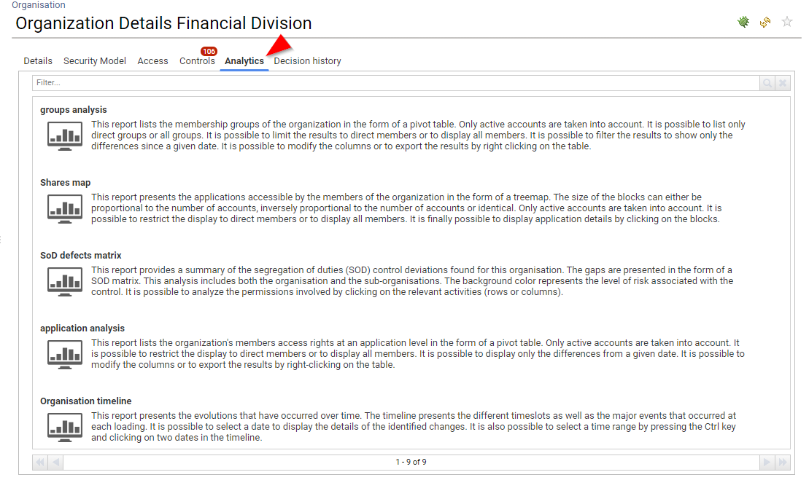
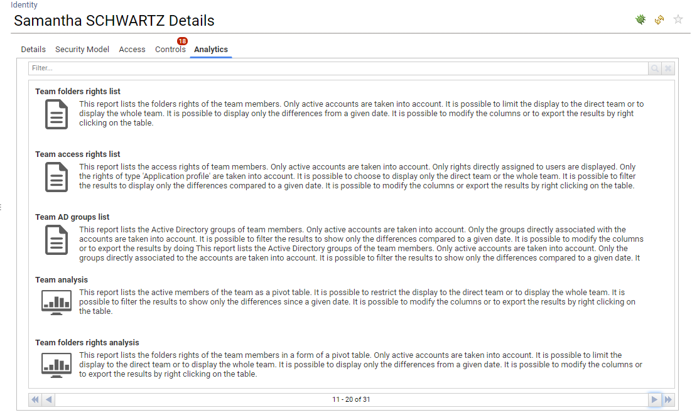
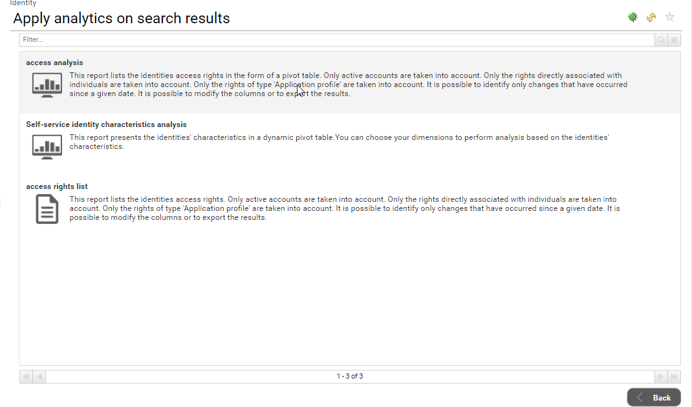
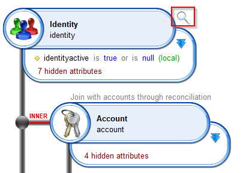
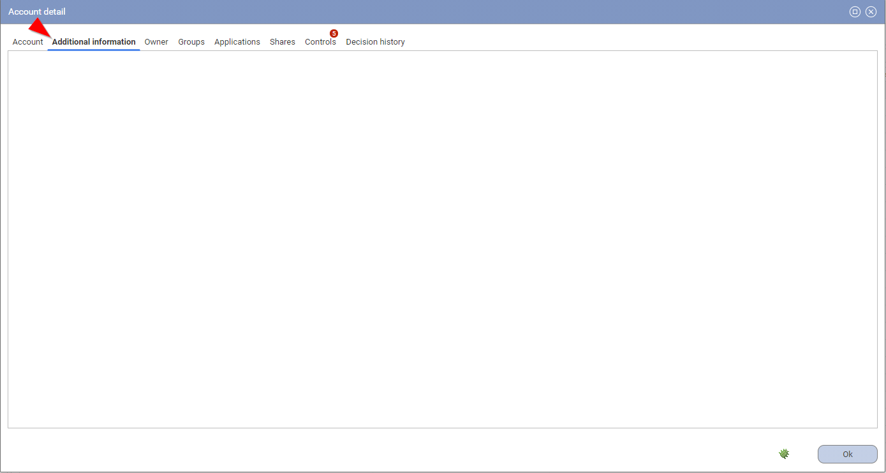
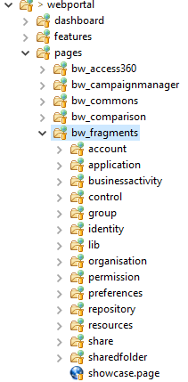
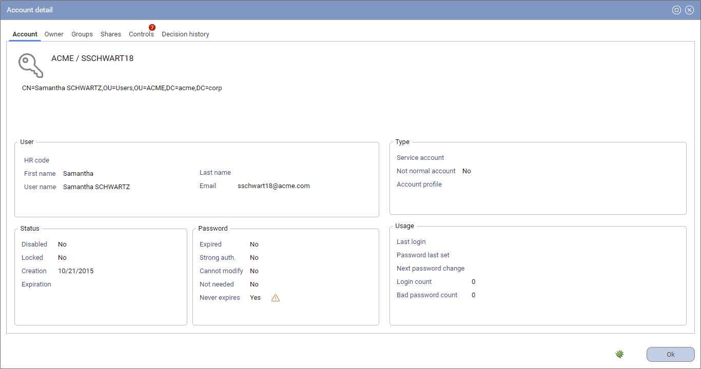

# Adding Analytics

IAP embeds a flexible framework in order to facilitate the inclusion of custom analytics.

## User section of Access360

### Custom analytics associated to a management position

You can configure custom analytics in the user section of Access360. Those analytics will appear among the others in the Analytics tab. Those customs analytics **MUST** be associated with the current user management characteristics, in a way that they will only appear if the current user corresponds to those management characteristics (line manager, application manager, ...).


In order to add custom analytics, you have to create a Pages with the following constraints:

- A parameter named `uid` which will receive the uid of the current user
- A Tag determining when to display this custom analytics for the end user

Here is a description of the Tags:

| Tag                     | Reports for                             |
| ----------------------- | --------------------------------------- |
| myteam\_access360       | Line managers (computed manager link)   |
| myapp\_access360        | Application managers (business owners)  |
| myaccount\_access360    | Account owners                          |
| myfolder\_access360     | Folder managers (business owners)       |
| mypermission\_access360 | Permission managers (business owners)   |
| myrepository\_access360 | Repository managers (business owners)   |
| myshare\_access360      | Share managers (business owners)        |
| mygroup\_access360      | Group managers (business owners)        |
| myorg\_access360        | Organisation managers (business owners) |

Here is an example to add a custom analytics for end users being application manager:

```pages  
myanalytics_app = Page {
	title: 'my custom analytics for app manager'
	description:'description of my custom analytics for app manager'
	tags: "myapp_access360" priority 1
	icon: "16/details/analytics_16.png" large-icon: "48/details/analytics_48.png"

    uid = Parameter { type: String hidden: True }

	// TODO: Your content here
}
```

Keep in mind that the `feature:` property will help you to show or hide your custom analytics depending on the user roles if needed

### Custom analytics for end users

You can configure custom analytics for end-users in the user section of Access360. Those analytics will appear among the others in the Analytics tab.


In order to add custom analytics or end user , you have to create a Pages with the following constraints:

- A parameter named `uid` which will receive the uid of the current user
- A Tag named `my_access360`

Here is an example to add a custom analytics for end users:

```pages  
myanalytics_app = Page {
	title: 'my custom analytics for all users'
	description:'description of my custom analytics for all users'
	tags: "my_access360" priority 1
	icon: "16/details/analytics_16.png" large-icon: "48/details/analytics_48.png"

    uid = Parameter { type: String hidden: True }

	// TODO: Your content here
}
```

Keep in mind that the `feature:` property will help you to show/hide your custom analytics depending on the user roles if needed

## Detail pane

### Custom analytics for a given entity

You can add your own custom analytics in the 'Analytics' section of the detail panes.



This method is the same as the one used in Ader version and 2017 version. You can consult the documentation for more information about this:  [Links to Reports and Pages from Detail Pages](https://documentation.brainwavegrc.com/latest/docs/igrc-platform/pages/new-webportal-features/link-to-reports-and-pages/)

Here is a quick description:
You need to create a Page with the following constraints:

- A parameter named `uid` which will receive the entity uid
- A Tag named `byuid`
- An optional Tag to specify the king of report, can be `browsing`, `analytics`, `review`, `mining`
- An optional Tag to specify if this is a printable version `printable`
- A Tag determining where to display this custom analytics

Here is a description of the Tags to specify where to display this custom analytics:

| Tag          | Reports for                                      |
| ------------ | ------------------------------------------------ |
| identity     | Identity analytics (for all identities)          |
| organisation | Organisation analytics (for all organisations)   |
| account      | Account analytics (for all accounts)             |
| group        | Group analytics (for all groups)                 |
| repository   | Repository analytics (for all repositories)      |
| application  | Application analytics (for all applications)     |
| permission   | Permission analytics (for all permissions)       |
| share        | Share analytics (for all shares)                 |
| sharedfolder | Shared folder analytics (for all shared folders) |

Here is an example to add a custom analytics in the application details Analytics pane for all applications:

```pages  
myanalyticspane_app = Page {
	title: 'my custom app analytics'
	description:'description of my custom app analytics'
	tags: "byuid", "analytics", "organisation"
	icon: "16/details/analytics_16.png" large-icon: "48/details/analytics_48.png"

    uid = Parameter { type: String hidden: True }

	// TODO: Your content here
}
```

### Custom analytics for a given repository type

You can add your own custom analytics in the 'Analytics' section of the detail panes for certain repository types.
This is very useful if for instance you want to deploy analytics for a given system such as Active Directory, Mainframes, ...


The way to configure those custom analytics is very similar to the upper section:

You need to create a Page with the following constraints:

- A parameter named `uid` which will receive the entity uid
- A Tag named `byuid`
- An optional Tag to specify the king of report, can be `browsing`, `analytics`, `review`, `mining`
- An optional Tag to specify if this is a printable version `printable`
- A Tag determining where to display this custom analytics
- **A Tag which contains the `type` fulfilled in the Identity Ledger for the repository**

Here is a description of the Tags to specify where to display this custom analytics:

| Tag             | Reports for                                          |
| --------------- | ---------------------------------------------------- |
| accountext      | Account analytics with repositorytype = Tag          |
| groupext        | Group analytics with repositorytype = Tag            |
| repositoryext   | Repository analytics with repositorytype = Tag       |

Here is an example to add a custom report for Repository detail pane **only for Active Directory repositories**
In order to do so, we assume that you have configured your collect line by setting the attribute `repositorytype=AD` in the corresponding repositories.

```pages  
myadanalyticspane = Page {
	title: 'my custom analytics for Active Directory'
	description:'description of my custom analytics for Active Directory'
	tags: "byuid", "browsing", "repositoryext", "AD"
	icon: "16/details/browsing_16.png" large-icon: "48/details/browsing_48.png"

    uid = Parameter { type: String hidden: True }

	// TODO: Your content here
}
```

### Custom analytics for a given entity family

You can add your own custom analytics in the 'Analytics' section of the detail panes for certain entity families.
This is very useful if for instance you want to deploy analytics for a given system such as Active Directory, SAP, ...


The way to configure those custom analytics is very similar to the upper section:

You need to create a Page with the following constraints:

- A parameter named `uid` which will receive the entity uid
- A Tag named `byuid`
- An optional Tag to specify the king of report, can be `browsing`, `analytics`, `review`, `mining`
- An optional Tag to specify if this is a printable version `printable`
- A Tag determining where to display this custom analytics
- **A Tag which contains the familytype fulfilled in the Identity Ledger in the application or the repository**

Here is a description of the Tags to specify where to display this custom analytics:

| Tag             | Reports for                                          |
| --------------- | ---------------------------------------------------- |
| accountext      | Account analytics with repositoryfamily = Tag        |
| groupext        | Group analytics with repositoryfamily = Tag          |
| repositoryext   | Repository analytics with repositoryfamily = Tag     |
| applicationext  | Application analytics with applicationfamily = Tag   |
| permissionext   | Permission analytics with applicationfamily = Tag    |
| shareext        | Share analytics with applicationfamily = Tag         |
| sharedfolderext | Shared folder analytics with applicationfamily = Tag |

Here is an example to add a custom report for Repository detail pane **only for Active Directory repositories**
In order to do so, we assume that you have configured your collect line by setting the attribute `repositoryfamily=AD` in the corresponding repositories.

```pages  
myadanalyticspane = Page {
	title: 'my custom analytics for Active Directory'
	description:'description of my custom analytics for Active Directory'
	tags: "byuid", "browsing", "repositoryext", "AD"
	icon: "16/details/browsing_16.png" large-icon: "48/details/browsing_48.png"

    uid = Parameter { type: String hidden: True }

	// TODO: Your content here
}
```

For repositories, as a best practice you should consider `repositorytype` as a main custom type and `repositoryfamily` as a sub custom type.
For instance if you load database accounts and groups in a `Repository`, you should fulfill your data as is:

- repositorytype = database
- repositoryfamily = SQL Server

### Custom identity analytics based on management position

You can add custom identity analytics based on the current identity management position (such as application manager, organisation manager, ...). This is very useful as it will avoid to provide empty analytics (such as direct team reports if the current identity is not a line manager).
This approach is very similar to the one used in the "User section of Access360".



You need to create a Page with the following constraints:

- A parameter named `uid` which will receive the entity uid
- A Tag named `byuid`
- An optional Tag to specify the king of report, can be `browsing`, `analytics`, `review`, `mining`
- An optional Tag to specify if this is a printable version `printable`
- A Tag determining where to display this custom analytics
- **A Tag determining the management information to enforce**

Here is a description of the Tags to specify where to display this custom analytics:

| Tag                               | Reports for                                  |
| --------------------------------- | -------------------------------------------- |
| identityext + applicationmanager  | Identity analytics for application managers  |
| identityext + assetmanager        | Identity analytics for asset managers        |
| identityext + groupmanager        | Identity analytics for group managers        |
| identityext + operationalmanager  | Identity analytics for operational managers  |
| identityext + organisationmanager | Identity analytics for organisation managers |
| identityext + permissionmanager   | Identity analytics for permission managers   |
| identityext + repositorymanager   | Identity analytics for repository managers   |
| identityext + sharemanager        | Identity analytics for share managers        |
| identityext + foldermanager       | Identity analytics for folder managers       |

Here is an example to add a custom analytics in the identity details Analytics pane for application managers:

```pages  
appaccessrights360detail = Page {
	title: $appaccessrights360NLS.title
	description:$appaccessrights360NLS.description
	tags: "identityext" priority 200, "byuid" , "browsing", "applicationmanager"
	icon: "16/details/browsing_16.png" large-icon: "48/details/browsing_48.png"

    uid = Parameter { type: String hidden: True }
}
```

### Best practice to publish custom analytics

When you create custom analytics for end users, you **SHOULD** make them available as well in the analytics pane of the corresponding identity. At the end of the day, it will facilitate level 1 support such as an individual calling the support line because he is confused about an analytics content. As an administrator or and auditor, you will be able to browse through the corresponding identity detail pane and to access the exact same analytics from the Analytics pane.

In order to do so, you should create your pages with the following pattern:

```pages  
myreport_admin = Page {
	title: "My analytics"
	icon: "16/details/browsing_16.png" large-icon: "48/details/browsing_48.png"
	description:"My analytics description"
	tags: "identityext" priority 200, "byuid" , "browsing", "applicationmanager"
	conditional-redirect: ConditionalRedirect {
		condition:BooleanPredicate(True)
		target:Page myreport with-current-parameters
	}

    uid = Parameter { type: String hidden: True }
}

myreport_enduser = Page {
	title: "My analytics"
	icon: "16/details/browsing_16.png" large-icon: "48/details/browsing_48.png"
	description:"My analytics description"
	tags: "myapp_access360" priority 1

	conditional-redirect: ConditionalRedirect {
		condition:BooleanPredicate(True)
		target:Page myreport with-current-parameters
	}

    uid = Parameter { type: String hidden: True }
}

myreport = Page {
	title: "My analytics"
	dynamic-title: "My analytics dynamic title"
	icon: "16/details/browsing_16.png" large-icon: "48/details/browsing_48.png"
	description:"My analytics description"
	
	/* Parameters here */
    uid = Parameter { type: String hidden: True }

	// your content here
}
```

If needed you will be able to add `feature:` on the `_admin` and `_enduser` pages to restrict the access depending on the user roles.

## Search pane

### Presentation

Starting with IAP 1.1 you can configure Analytics accessible through the search pages in order to perform analysis on search results.

For instance:  

- You search for 'VIP identities' and you want to access to a report displaying their access rights and what changed since a given data
- You search for orphan AD accounts and you want to list their groups

Until IAP 1.1 this was possible through a custom tag `byuids`, please consult [Managing analytics pages and reports](https://documentation.brainwavegrc.com/latest/docs/igrc-platform/pages/new-webportal-features/analytics-section/).

However, this feature had some limitations:

- It was only available when the number of search results was under 1000 elements
- It was sending the `uid` values instead of the search query, making it useless to bookmark the page as the search was not played against other timeslots.

For those reasons, `byuids` is now **DEPRECATED** and is no longer used in IAP.
If you want to provide analytics on search results, you **MUST** use the new method described here.

From an end user perspective, those analytics are available through the contextual menu located at the lower right part of the search screen.


When you click on this menu entry, all the available analytics are presented:



When you click on a given analytics, it is displayed as usual but with a subtle difference: The search query itself is passed to the Analytics, as a result, **this analytics can be safely bookmarked in the favorites**


### Configuration

In order to be able to access to the search analytics reports, you **must** have the corresponding security feature enabled.

Here is the list of the features:

- accountsearch_analytics
- applicationsearch_analytics
- identitysearch_analytics
- organisationsearch_analytics
- permissionsearch_analytics
- repositorysearch_analytics
- groupsearch_analytics
- sharesearch_analytics
- sharedfoldersearch_analytics

All those features are declared in `/webportal/features/bw_portaluar_base/searchpages.features`

By default, those features are associated with the `searchanalytics` featureset.

The `searchanalytics` featureset is associated by default to the following roles:

- functional administrator
- technical administrator
- auditor

> It means that even if you grant access to the search page to some users, they **won't be able** to access to those analytics until you grant them the right as well.

When the search page is displayed, depending on the number of search analytics pages found, the item can be grayed. (grayed if no analytics are found or if none of them are accessible to the current user )

> Remember that you can attach features to your Pages as well, as a result you can restrict the list of the search analytics depending on the roles of the current user

In the following example, although the Feature is enabled for the current user, no search analytics are available, as a result, the menu entry is grayed in the list


A last thing regarding the overall performances of this function:

As you can imagine, you can end up with situations where there is a tremendous amount of data to present (if you ask for instance to access to an analytics presenting ALL groups for 1,000,000 accounts)
In order to prevent those situations, this feature has been limited by default:

- A warning message is presented if the Analytics will be run on more than 1,000 entries
- An error message is presented to prevent running Analytics on more than 10,000 entries

As a best practice, you should refine your search results then.

You can override those default values at your own risks through the technical configuration of your project thanks to the following variables:

| Variable name                                 | Variable description                                                             |
|-----------------------------------------------|----------------------------------------------------------------------------------|
| search.identity.analyticswarningthreshold     | warns the user if the analytics will be launch on those number of search results |
| search.identity.analyticserrorthreshold       | prevent the user to run the analytics on those number of search results          |
| search.account.analyticswarningthreshold      | warns the user if the analytics will be launch on those number of search results |
| search.account.analyticserrorthreshold        | prevent the user to run the analytics on those number of search results          |
| search.organisation.analyticswarningthreshold | warns the user if the analytics will be launch on those number of search results |
| search.organisation.analyticserrorthreshold   | prevent the user to run the analytics on those number of search results          |
| search.repository.analyticswarningthreshold   | warns the user if the analytics will be launch on those number of search results |
| search.repository.analyticserrorthreshold     | prevent the user to run the analytics on those number of search results          |
| search.group.analyticswarningthreshold        | warns the user if the analytics will be launch on those number of search results |
| search.group.analyticserrorthreshold          | prevent the user to run the analytics on those number of search results          |
| search.application.analyticswarningthreshold  | warns the user if the analytics will be launch on those number of search results |
| search.application.analyticserrorthreshold    | prevent the user to run the analytics on those number of search results          |
| search.permission.analyticswarningthreshold   | warns the user if the analytics will be launch on those number of search results |
| search.permission.analyticserrorthreshold     | prevent the user to run the analytics on those number of search results          |
| search.share.analyticswarningthreshold        | warns the user if the analytics will be launch on those number of search results |
| search.share.analyticserrorthreshold          | prevent the user to run the analytics on those number of search results          |
| search.folder.analyticswarningthreshold       | warns the user if the analytics will be launch on those number of search results |
| search.folder.analyticserrorthreshold         | prevent the user to run the analytics on those number of search results          |

### Build your own search analytics

You can easily build your own search analytics, as with the rest of the analytics, they will be automatically discovered and added to the list thanks to their tags.

If you are looking for some implementation examples, the default search analytics are located in `/webportal/pages/bw_access360/searchanalytics/`

Here is a typical search analytics skeleton

```pages  
myOwnIdentitySearchAnalytics= Page {
 title: "My own identity analytics"
 description: "Description of my analytics"
 tags: "identity", "searchresults"
 icon: "16/details/browsing_16.png" large-icon: "48/details/browsing_48.png"
 
 /* Parameters here */
 search = SearchDefinition {
  entity: Identity
  simple-mode-rule: br_identity_simple_search
 }
  
 /* Variables here */

 /* Datasets and records here */
 mydata = Dataset {
  search: Search {
   view:myOwnIdentitySearchAnalyticsView
   definition:search
  }
 ...
```

As you can see, in order for a search analytics page to appear in the identity list it **must** contain two flags: `identity` and `searchresults`.

The first one specify the search page:

| Tag          | Search page                                      |
| ------------ | ------------------------------------------------ |
| identity     | Identity search page                             |
| organisation | Organisation search page                         |
| account      | Account search page                              |
| group        | Group search page                                |
| repository   | Repository search page                           |
| application  | Application search page                          |
| permission   | Permission search page                           |
| share        | Share search page                                |
| sharedfolder | Shared folder search page                        |

The page **must** contain a `search` parameter in the form of a [SearchDefinition](https://documentation.brainwavegrc.com/latest/docs/igrc-platform/pages/new-webportal-features/search-pages-and-navigation-system/).

Here are the prototypes for the different kind of search

#### Identity SearchDefinition

```pages  
 search = SearchDefinition {
  entity: Identity
  simple-mode-rule: br_identity_simple_search
 }
```

#### Organisation SearchDefinition

```pages  
 search = SearchDefinition {
  entity: Organisation
  simple-mode-rule: br_organisation_simple_search
 }
```

#### Account SearchDefinition

```pages  
 search = SearchDefinition {
  entity: Account
  simple-mode-rule: br_account_simple_search
 }
```

#### Group SearchDefinition

```pages  
 search = SearchDefinition {
  entity: Group
  simple-mode-rule: br_group_simple_search
 }
```

#### Repository SearchDefinition

```pages  
 search = SearchDefinition {
  entity: Repository
  simple-mode-rule: br_repository_simple_search
 }
```

#### Application SearchDefinition

```pages  
 search = SearchDefinition {
  entity: Application
  simple-mode-rule: br_application_simple_search
 }
```

#### Permission SearchDefinition

```pages  
 search = SearchDefinition {
  entity: Permission
  simple-mode-rule: br_permission_simple_search
 }
```

#### Share SearchDefinition

```pages  
 search = SearchDefinition {
  entity: Application
  simple-mode-rule: br_application_simple_search
 }
```

#### SharedFolder SearchDefinition

```pages  
 search = SearchDefinition {
  entity: Permission
  simple-mode-rule: br_sharedfolder_simple_search
 }
```

Your view **must** have the search definition anchor option activated, as seen in the following screenshot.



# Adding custom content in detail pages & dialog box

You can be in a situation where you have loaded custom information on entities (such as custom identity information or custom account information). Whatever the form (custom attributes or metadata), you will want to display this information in the user interfaces as well.  
In order to do so, you can enable "custom detail panes" in both the detail pages and the dialog box.
Once enabled, those detail panes will be displayed in the "standard" user interface:

In the detail pages:


In the dialog box:



In order to do so, you have to create your own content in predefined fragments. Those fragments are located in `/webportal/pages/bw_fragments/custom/` with one fragment per concept.


If you want to display custom content for a concept, you **MUST** modify the corresponding file to add your own content.

Here is the content of `accountExtendedDetails.page` file

```pages  
/**
 * Display the selected account details extended attributes
 * 
 * Parameters:
 * inuid the account uid
 * inenabled optional, boolean value, true to enable fragment (true by default)
 * outdisplay boolean value, true to display the fragment (false by default)
 */
fragmentAccountExtendedDetails = PageFragment {
	/* Parameters here */
		
	/* Variables here */
	inuid = Variable
	inenabled = Variable { multivalued:False type:Boolean initial:True }
	outdisplay = Variable { multivalued:False type:Boolean initial:False }

	// TODO: put your custom content here
}
```

As you can see, you will be provided the `uid` of the entity to display, you **MUST** set outdisplay to `True` if you want your panel to be displayed in the UIs. As this is a variable you can perform a dynamic check to select whether or not you want to display additional information, based for instance on the family type.

Here is an example where additional account information will be displayed only for 'Active Directory' and 'Top Secret' repository types, with dedicated content for each.

```pages  
fragmentAccountExtendedDetails = PageFragment {
	enter-event:StringCase(account.repository_repositoryfamily) { 
					when "AD" then [ Set True to outdisplay ] 
					when "TSS" then [ Set True to outdisplay ] 
					otherwise [ Set False to outdisplay ] 
				}
	/* Parameters here */
		
	/* Variables here */
	inuid = Variable
	inenabled = Variable { multivalued:False type:Boolean initial:True }
	outdisplay = Variable { multivalued:False type:Boolean initial:False }

	account = Record {
		view:bwf_accountDetail with inuid to uid
	}

	ConditionalGroup {
		StringCondition(account.repository_repositoryfamily) {
			when "AD" then [
				// TODO: put your custom AD content here
			]		
			when "TSS" then [
				// TODO: put your custom TSS content here
			]		
		}
	}
}
```

# Overriding detail pages

You can override the default details pages to provide custom content. For instance, if you have loaded a very specific application, you can consider that the default application detail page is not relevant/sufficient, you can in this case create your own detail page for this application and configure IAP in a way that it will display your detail page instead of the default one.

In order to override a default page, you **MUST** use the `Activity` functionality of Pages. Please refer to [RadiantOne Identity Analytics product documentation](https://developer.radiantlogic.com/) if you are not familiar with this functionality.

Starting with IAP, you can use the `discriminator` of the `Activity` to specify when to override the detail page.

Here is a list of the possibilities:

| Concept           | Discriminator (in priority order) |
| ----------------- | --------------------------------- |
| Account           | Repositoryfamily                  |
| Application       | Applicationfamily                 |
|                   | Applicationtype                   |
| Group             | Repositoryfamily                  |
| Permission        | Applicationfamily.permissiontype  |
|                   | \*.permissiontype                 |
|                   | Applicationfamily                 |
|                   | Applicationtype                   |
| Repository        | Repositoryfamily                  |

Here are some examples:

Dedicated account details and group details for Active Directory repositories:

```pages  
Activity {
	concept: Account
	kind: Detail
	discriminator: 'AD'
	to: Page myCustomAccountDetailPage
}
```

```pages  
Activity {
	concept: Group
	kind: Detail
	discriminator: 'AD'
	to: Page myCustomGroupDetailPage
}
```

Dedicated application details for windows servers loaded as applications (with 'server' loaded as applicationtype):

```pages  
Activity {
	concept: Application
	kind: Detail
	discriminator: 'server'
	to: Page myCustomServerDetailPage
}
```

Dedicated application details for SAP applications (with 'SAP' loaded as applicationfamily):

```pages  
Activity {
	concept: Application
	kind: Detail
	discriminator: 'SAP'
	to: Page myCustomSAPDetailPage
}
```

Dedicated permission details for SAP transactions loaded as permission (with applicationfamily='SAP' and permissiontype='transaction'):

```pages  
Activity {
	concept: Permission
	kind: Detail
	discriminator: 'SAP.transaction'
	to: Page myCustomPermissionDetailPage
}
```

As a best practice you are **NOT ALLOWED** to modify the default details pages. If you want to modify them, you should copy/paste them instead and to override them through the `Activity` functionality.

# Overriding detail dialog box

As with detail pages, you can override the default detail dialog boxes to provide custom content. For instance, if you have loaded a very specific application, you can consider that the default application detail dialog box is not relevant/sufficient, you can in this case create your own detail dialog box for this application and configure IAP in a way that it will display your detail dialog box instead of the default one.

In order to override a default dialog box, you **MUST** configure the dialog box content as a  `PageFragment`. Please refer to [RadiantOne Identity Analytics product documentation](https://developer.radiantlogic.com/) if you are not familiar with this functionality.

In order to override a default dialog box, you have to create a `PageFragment` whom name follows a naming convention.

| Concept           | Fragment base name                | Discriminator (in priority order) |
| ----------------- | --------------------------------- | --------------------------------- |
| Account           | bwf_accountDetailsFragment        | Repositoryfamily                  |
| Application       | bwf_applicationDetailsFragment    | Applicationfamily                 |
|                   |                                   | Applicationtype                   |
| Group             | bwf_groupDetailsFragment          | Repositoryfamily                  |
| Permission        | bwf_permissionDetailsFragment     | Applicationfamily.permissiontype  |
|                   | bwf_permissionDetailsFragment     | Applicationfamily                 |
|                   | bwf_permissionDetailsFragment     | Applicationtype                   |
| Repository        | bwf_repositoryDetailsFragment     | Repositoryfamily                  |
|                   |                                   | RepositoryType                    |

For instance, if you want to override the default dialog box for an `Application` of type `Filesystem` you have to create a fragment with the following name: `bwf_applicationDetailsFragmentFilesystem`

The best practive whenever you want to create your own dialog box is to start with the default one by copy/pasting its content in your fragment.

| Concept           | Default Fragment location                              |
| ----------------- | ---------------------------------------------------------------------------- |
| Account           | /webportal/pages/bw_fragments/account/details/accountDetails.page               |
| Group             | /webportal/pages/bw_fragments/group/details/groupDetails.page               |
| Repository        | /webportal/pages/bw_fragments/repository/details/repositoryDetails.page               |
| Application       | /webportal/pages/bw_fragments/application/details/applicationDetails.page               |
| Permission        | /webportal/pages/bw_fragments/permission/details/permissionDetails.page               |

If you are looking for some examples to start with, have a look at the following concepts which have been overriden:

| Concept           | Fragment location                              |
| ----------------- | ---------------------------------------------------------------------------- |
| Server           | /webportal/pages/bw_fragments/server/details/serverDetails.page               |
| IAM Role           | /webportal/pages/bw_fragments/iamrole/details/roleDetails.page               |
| Share           | /webportal/pages/bw_fragments/share/details/shareDetails.page               |
| Shared folder           | /webportal/pages/bw_fragments/sharedfolder/details/sharedfolderDetails.page               |

As a best practice you are **NOT ALLOWED** to modify the default dialog boxes. If you want to modify them, you should copy/paste them instead in your own fragment.

# Building your own page

## Fragments

IAP provides a framework which tremendously improves the way you can build your own reports and analytics.
One of the main aspects of this framework is the use of 'fragments' (see [Pages Fragments](https://documentation.brainwavegrc.com/latest/docs/igrc-platform/pages/page-fragments/) for more details about this functionality).  

More than 200 documented fragments are provided off-the-shelf.

For instance, here is a standard fragment to present identity details (fragmentIdentityFullDetails)


Those fragments are located in `/webportal/pages/bw_fragments/`

Fragments are located in subdirectories, based on their concept:



All fragments are documented, you can access to the corresponding fragment documentation through a mouse roll over the fragment. Hit F2 to open the help as a dialog box.


Standard dialog box are also provided to present entity details, those dialog box are located in `/webportal/pages/bw_fragments/[entity]/details/[entity]Details.page`, for instance: `/webportal/pages/bw_fragments/account/details/accountDetails.page`

Example of a dialog box to present a given account detail:



Those dialog box are documented, you can access to the corresponding fragment documentation through a mouse roll over the dialog box. Hit F2 to open the help as a dialog box.


As a best practice you **SHOULD** use those fragments and dialogbox whenever possible when you create custom reports and anaytics.

As a best practice you **ARE NOT ALLOWED** to modify/patch the standard fragments/dialogbox. If needed, you have to copy/paste them and create your own, most probably you will have to override the default pages (see next section). You can also add custom content in detail pages & dialog box (see next section).

## Librairies

IAP provide a series of librairies to facilitate Pages design. You **SHOULD** use those librairies.
Those libraries include:

- colors
- icons
- kpis framgnets
- mappings
- mixins
- nls
- styles
- templates

As a best practice, you **SHOULD** include librairies in your custom pages by copy/pasting the following bloc on the upper section of your page:

```pages  
import "/webportal/pages/bw_fragments/lib/mixins.page"
import "/webportal/pages/bw_fragments/lib/templates.page"
import "/webportal/pages/bw_fragments/lib/mappings.page"
import "/webportal/pages/bw_fragments/lib/styles.page"
import "/webportal/pages/bw_fragments/lib/icons.page"
import "/webportal/pages/bw_fragments/lib/nls.page"
import "/webportal/pages/bw_fragments/lib/colors.page"
import "/webportal/pages/bw_fragments/lib/kpis.page"
```

## Icons

Former .gif and .png icons are deprecated. A new set of svg icon is available in IAP. You **SHOULD** use those icons instead of the former gif and png icons.


Those icons are located in `reports/icons/bw_fragments/*`

For more information on how to use svg icons in Pages, you can consult the product documentation [SVG images](https://documentation.brainwavegrc.com/latest/docs/igrc-platform/pages/images-and-colors#svg-images)

What is very interesting with those svg icons is that you can dynamically configure their size and their color.

A series of `ImageMap` is available for your convenience in the following library file `/webportal/pages/bw_fragments/lib/icons.page`
In this library the icons have been declared in various size and colors with the following naming convention `[library]_[size]_[color]`. Instead of directly include the svg icons, you **SHOULD** point to an ImageMap instead.

Here is a simple example:

```pages  
Header {
	value:'My title with a 48px account logo'
	icon:%concept_48.account
}
```

## Colors

IAP colors are located in `/webportal/pages/bw_fragments/lib/colors.page`, you **SHOULD** use them instead of hardcoding your colors in your pages. If the color is not available you **SHOULD** reference a theme color instead of hardcoding your color

## IAP project files

For your information, IAP project files are located as such:

| Description | Location |
| ---------------------- | -------------------------------------------- |
| Detail pages | `webportal/pages/bw_portaluar_base/[entity]/details.page` |
| Search pages | `webportal/pages/bw_portaluar_base/[entity]/details.page` |
| Fragments | `webportal/pages/bw_fragments/[entity]/*` |
| Dialog box | `webportal/pages/bw_portaluar_base/[entity]/details/[entity]/Details.page` |
| HTML Widgets | `webportal/pages/bw_htmlwidgets/*` |
| IAP Librairies | `webportal/pages/bw_fragments/lib/*` |
| Legacy Librairies | `webportal/resources/*` |
| Legacy Librairies | `webportal/styles/*` |
| End user access360 analytics | `webportal/pages/bw_access360/reports/*` |
| Detail pages analytics | `webportal/pages/bw_access360/portalreports/*` |
| Controls | `webportal/controls/bw_standard_control/*` |
| Metadata | `webportal/metadata/bw_analytics/results/*` |
| Features | `webportal/features/bw_portaluar_base/portaluar.featuresets` |

# Configuring restricted search pages

By default, only `functionaladmin`, `auditor` and `technicaladmin` have access to all the search pages in order to enforce the **least privilege principle**
In very specific use case, you can be in a situation where you want to break the least privilege principle and to open the door for some business user by allowing them to perfom search on sub-perimeters of the Identity Ledger.

This is actually done through the standard search pages for application owners, repository owners and line managers. In this case, those search pages content are restricted to the owner perimeter. This is done thanks to dedicated standard dynamic roles with `perimeter'. See [features and roles](https://documentation.brainwavegrc.com/latest/docs/igrc-platform/pages/features-and-roles) for more information about how to configure roles and perimeters in your project.

At the end of the day, search pages are restricted as such using perimeters:

| Concept      | Perimeter restriction configuration (if any) |
| ------------ | -------------------------------------------- |
| Account      | Perimeter configured on Repository           |
| Application  | Perimeter configured on Application          |
| Group        | Perimeter configured on Repository           |
| Identity     | Perimeter configured on Identity             |
| Organisation | **No perimeter restriction**                 |
| Permission   | Perimeter configured on Application          |
| Repository   | Perimeter configured on Repository           |
| Share        | Perimeter configured on Application          |
| SharedFolder | Perimeter configured on Application          |

As you can see, **except for organisation**, you can also grant access to the search pages using custom roles if you have properly configured the `Perimeter` for a given user.
Most probably you will have to create custom menu entries which will point to the search pages you want to publish, See [RadiantOne Identity Analytics Product Documentation](https://developer.radiantlogic.com/) on how to configure your own menu entries. Search pages are located on `webportal/pages/bw_portaluar_base/[entity]/details.page`
