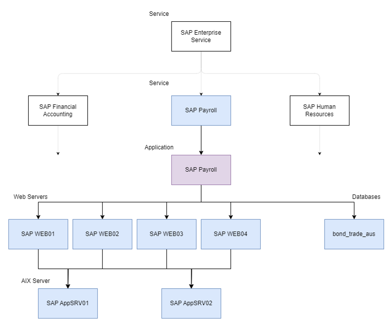
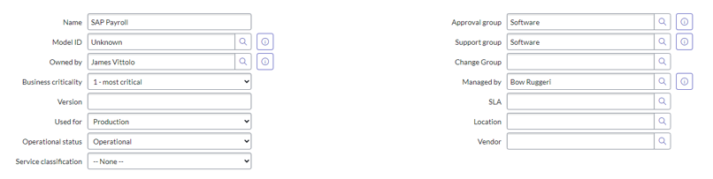
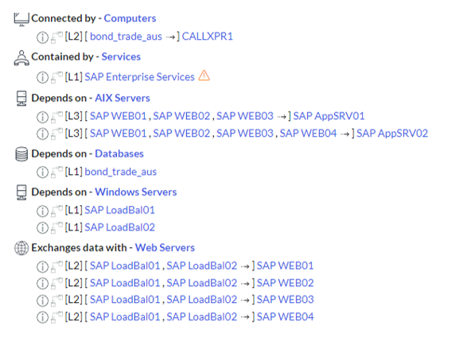
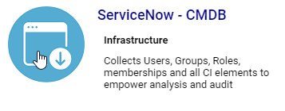
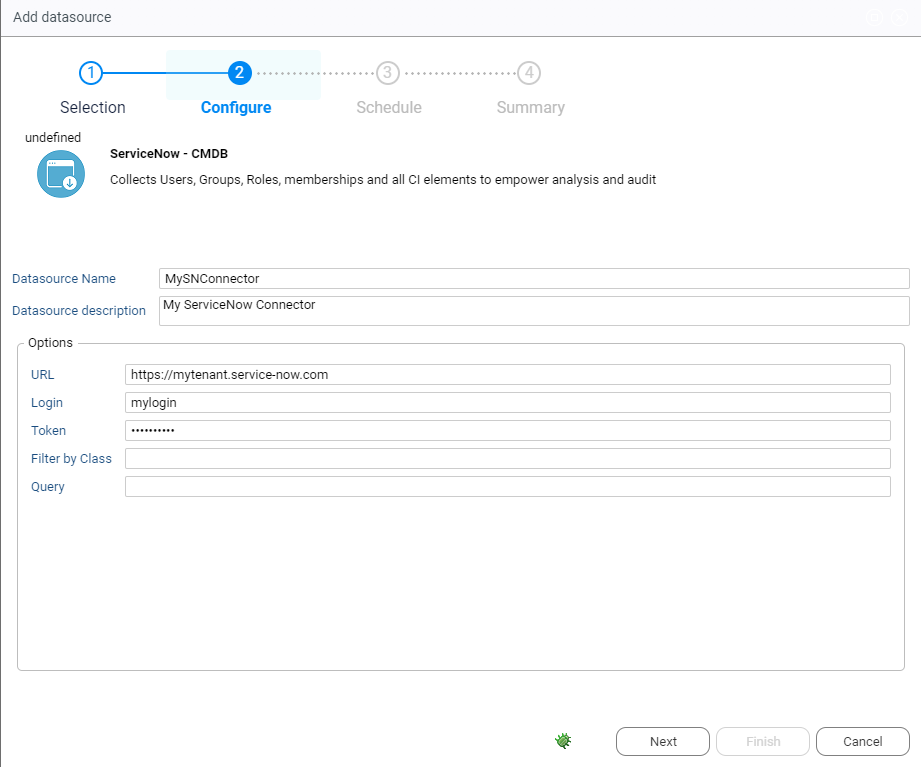
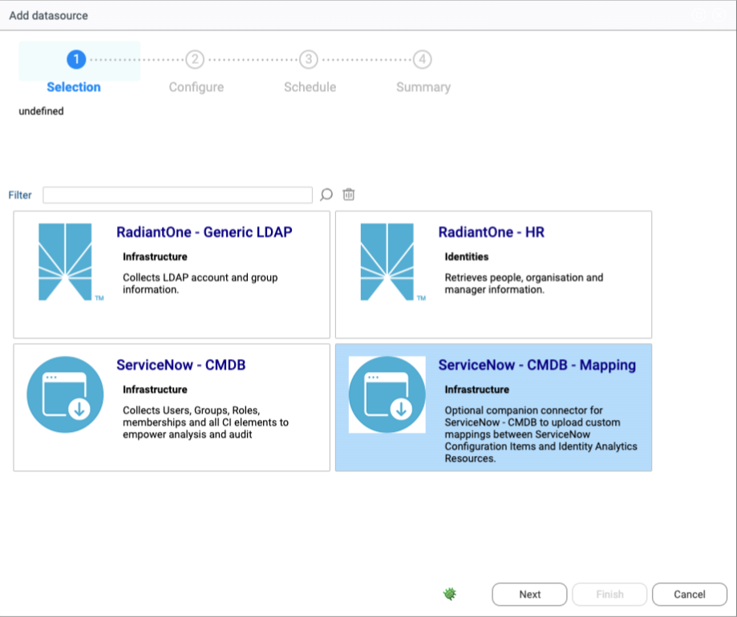
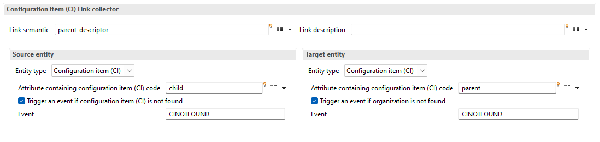
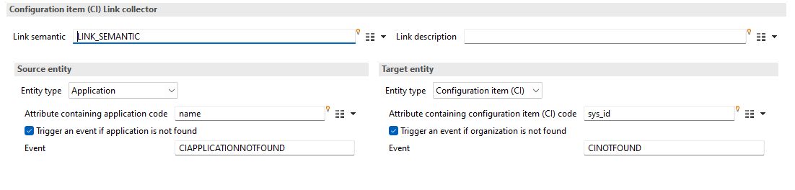
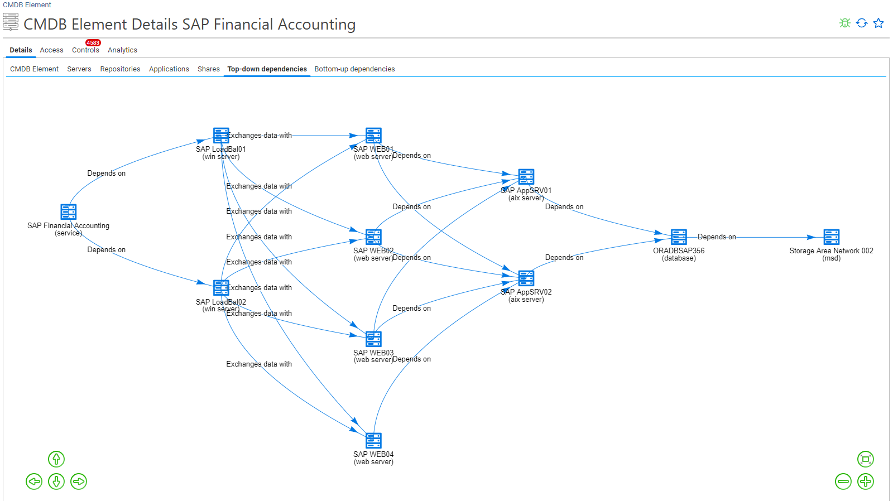
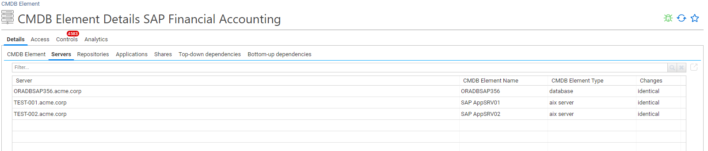

# CMDB Configuration Items Data Correlation

## Introduction

Visibility and continuous monitoring are essential to ensure the proper deployment and application of defense-in-depth principles. Visibility is the first step towards observability. The key to visibility is to make it easier to answer the following questions:

- Which people (identities) or entities (machines) have access to my information system?
  - Who these people are,
  - What are their characteristics?
  - What is the relationship between these people
  - What is the life cycle of these people (recent events related to their characteristics or relationships)?
- Which technical or service accounts (i.e. not associated with an identity) have access to my information system?
  - What are their characteristics
  - Who is in charge of these accounts
  - What resources are they associated with?
  - What are they for?
- What resources (applications, infrastructure, data) does my information system have?
  - What are the characteristics of these resources?
  - Who is in charge of these resources
  - How are these resources linked together to meet a corporate mission?
  - What policies apply to these resources?
- Who has access to which company resources
  - What is the authentication chain
  - In the case of static authorizations, what is the access chain?
  - In the case of dynamic authorizations, which policies apply, and on which identity characteristics are they based?

Visibility correlates all data in information systems and transforms it into intelligible, usable information, based on a universal data model that applies a taxonomy to the data, and weaves links between the different pieces of information. This is the Identity Data Lake.

Identity Analytics, embeds a data model that enables to answer most of the questions.
Within the data model we have information needed to identify precisely who has access to the information system, what resources they have access to, and what are the access chains. This capability enables us to equip the company's first line of defense (line managers, organization managers) with information concerning their teams.

The notion of technical resource (application, server, database) remains rather poor. Although it is possible to associate some metadata with resources (notably the resource manager(s)), there is no information concerning the life cycle of these resources (prod, dev, QA), nor any relationship between resources.
Even if resource managers can access information about their resources (what rights have been configured, who has access), it's still difficult for them to see the big picture at service level.

Let's take a concrete example: SAP Payroll.  
If you want to analyze access rights to the SAP Payroll application, all you have to do is extract information on access accounts, access rights and access logs to find out :

- Who has access to the application
- Who can do what
- Who did what

However, this visibility is only partial. The SAP Payroll application relies on an entire technical infrastructure to deliver its service: servers, databases, etc.  
If you want to know whether there are privileges that give access to the SAP Payroll asset, you need to analyze not only the application, but also the entire technical infrastructure (which ultimately constitutes the service):

- The database
- Middleware components
- Front and back office servers



In the end, it's the consolidation of the access chains of these different components that will enable me, as the person responsible for SAP Payroll, to know whether my service is secure.
We now have the capacity to offer visibility on all these resources:

- The SAP application
- Unix servers
- Middleware (web servers)
- The database

In fact, this information on the links between resources, as well as additional information on the resources themselves, such as: responsibility, description, lifecycle, etc., can be found in the company's CMDB (hosted within ITSM). The ITIL v4 processes ITAM (IT Asset Management) and SCM (Service Configuration Management) outline this need.

If we take the previous example and apply it to the ServiceNow context, we'll find information on the application in the CMDB.



As well as the dependencies between this application and it's technical resources.



This information is particularly interesting, as it also allows you to find missing information on elements by following the links.

## ServiceNow Configuration Items Data Loading

Identity Analytics provides an OOB connector to load CMDB CI elements from ServiceNow.



### Connector

In the configuration panel you have to point to your ServiceNow instance with a valid login / password (basicAuth is used).



You can also configure optional attributes if you want to retrieve only certain `cmdb_ci` classes.

**Query** must contain a filter in [ServiceNow query language](https://docs.servicenow.com/bundle/vancouver-platform-user-interface/page/use/common-ui-elements/reference/r_OpAvailableFiltersQueries.html). Here is an example of a query which retrieve only active production/QA/Staging environments:  

```txt
used_forINProduction,Staging,QA^operational_statusIN1
```

**Filter by class** must contain a list of CMDB CI objects to  retrieve in the form of a comma separated string. This is useful if you have a lot of CMDB CI objects in your CMDB system and only want to  retrieve a part of them. By default, the following objects are retrieved:  

```txt
cmdb_ci_db_mysql_catalog,cmdb_ci_db_ora_catalog,cmdb_ci_appl,cmdb_ci_app_server_java,cmdb_ci_web_server,cmdb_ci_email_server,cmdb_ci_cluster_node,cmdb_ci_win_cluster_node,cmdb_ci_netgear,cmdb_ci_ip_switch,cmdb_ci_ip_router,cmdb_ci_server,cmdb_ci_win_server,cmdb_ci_unix_server,cmdb_ci_aix_server,cmdb_ci_linux_server,cmdb_ci_storage_switch,cmdb_ci_printer,cmdb_ci_msd,cmdb_ci_ups,cmdb_ci_cluster,cmdb_ci_win_cluster,cmdb_ci_service,cmdb_ci_service_group,cmdb_ci_network_adapter,cmdb_ci_peripheral,cmdb_ci_rack,cmdb_ci_disk,cmdb_ci_database,cmdb_ci_datacenter,cmdb_ci_computer_room,cmdb_ci_zone
```

### Attribute Mapping

CMDB CI elements are mapped to Identity Analytics with the following rules

| Identity Analytics Configuration Item | ServiceNow Configuration Item | sample                           |
| ------------------------------------- | ----------------------------- | -------------------------------- |
| Identifier                            | `sys_id`                      | 829e953a0ad3370200af63483498b1ea |
| display name                          | `name`                        | CMS App FLX                      |
| family                                | `sys_class_name`              | `cmdb_ci_appl`                   |
| description                           | `comments`                    |                                  |
| environment                           | `used_for`                    | Production                       |
| address                               |                               |                                  |
| details                               |                               |                                  |
| type                                  | `sys_class_name`              | `cmdb_ci_appl`                   |
| DN                                    |                               |                                  |
| canonical name                        |                               |                                  |
| country code                          |                               |                                  |
| runtime name                          |                               |                                  |
| runtime version                       |                               |                                  |
| DNS name                              |                               |                                  |
| IPv4 address                          |                               |                                  |
| IPv6 address                          |                               |                                  |
| enabled flag                          |                               |                                  |
| state                                 | `operational_status`          | 1                                |
| architecture                          |                               |                                  |
| number of CPU threads                 |                               |                                  |
| memory size                           |                               |                                  |
| allocated storage                     |                               |                                  |
| encrypted storage flag                |                               |                                  |
| URN                                   |                               |                                  |
| critical object flag                  |                               |                                  |
| creation date                         | `sys_created_on`              | 2010-11-25 10:40:31              |
| modification date                     | `sys_updated_on`              | 2010-11-25 10:40:31              |
| password not required                 |                               |                                  |
| password never expires                |                               |                                  |
| password expired                      |                               |                                  |
| logon count                           |                               |                                  |
| last logon date                       |                               |                                  |
| bad logon count                       |                               |                                  |
| last bad password date                |                               |                                  |
| password last set date                |                               |                                  |
| business owner                        | `owned_by`                    | 829e953a0ad3370200af63483498b1eb |
| technical owner                       | `managed_by`                  | 829e953a0ad3370200af63483498b1ec |

### Resource Mapping

As part of the data loading stage, all configured CMDB CI elements are loaded in Identity Ledger and are reconciled with Identity Analytics resources (applications, servers, repositories, shares) with the following reconciliation rule:

```txt
Resource Code = Configuration Item Name
```

As a best practice, it is recommended to name Identity Analytics resources after CMDB Configuration Item names

## ServiceNow Configuration Items custom resource mapping

It is sometimes easier to provide a custom mapping file to reconcile CMDB CI elements with Identity analytics resources (such as servers, applications, etc).

In order to do so, you have to configure a companion connector **ServiceHow - CMDB - Mapping**. this connector is a file bridge which expects you to provide a mapping file. You can provide this file directly through the Data Source Management interface or by leveraging the powershell connector.



> [!warning]
> File name **must** be `idamapping.csv`

File format is the following:

| cmdbcicode                       | applicationcode | repositorycode |
| -------------------------------- | --------------- | -------------- |
| 26e426be0a0a0bb40046890d90059eaa | `SAP_ERP`       | `SAP_ERP`      |
| 3a72d947c0a8ce0100a7a64397fdcd53 | ORADBSAP356     | ORADBSAP356    |
| 3a70f789c0a8ce010091b0ea635b982a |                 | TEST-001       |
| 3a726a31c0a8ce0100902bd28760693f |                 | TEST-002       |

- **cmdbcicode** contains cmdb ci internal `sys_id` value.  
- **applicationcode** and **repositorycode** contain the resource code

> [!warning]
> When a mapping file is provided, the default mapping no longer applies.

## Custom Configuration Items Data Loading

You can load your own Configuration Items elements if needed. CI targets are available in the ETL configuration interface for such purpose.

One thing to consider is the way CI relationships are loaded. You **must** loaded them only in **child** to **parent** direction.



When loading Identity Analytics resources to Configuration Items, links have to be loaded in the direction as well.



### Validate Custom Configuration Items Data Loading

If the ETL configuration is correct, you will see the links between the CI in the CI detail page


You will see the attached resources in the corresponding Tabs

