# My First Review

Through this chapter we will guide you to configure and operate your first access certification review with a typical example.

Five types of review can be configured:  

- Repository accounts review, to review all accounts in the selected repositories,
- Group membership review, to review all group and their member accounts in the selected repositories,
- Application access rights review, to review all access rights in the selected applications,
- Server access rights review, to review all access rights in the selected servers,
- Safe permissions review, to review all access rights in the selected CyberArk PAM Safes if you have enabled PAM Booster.

> For Server review, the Server access rights need to be uploaded in the identity ledger as permissions and servers as application of type server. You can use for windows servers the add-on extracting windows local accounts and groups bw_winlocalresources available in the RadiantLogic Marketplace. This add-on collect and map the extracted data as well in the Identity Analytics: [bw_winlocalresources](http://marketplace.radiantlogic.com/package/bw_winlocalresources/)

In this chapter, we will configure and launch an application access rights review. The repository accounts review, group membership review and server review use the same principles, and a dedicated documentation is also available for the PAM Booster designed for CyberArk.

> As a reminder in IAP version 2.2 a new "sign off" principle has been added to the review process, as well as the the ability to launch the remediation process as soon as the reviewer signs off.  
>
> In IAP version 3.0, the concept of review campaigns has been introduce with the ability to manage campaign configurations, including notification and scheduling capabilities. These new capabilities come with a new "Review Campaign Management" interface. The previous "Review Management" interface contains the finalized reviews in previous versions and has been renamed "Custom Review Management" interface.
>
> Due to these changes in behavior it is **necessary** to finalize **all** web-based reviews **before** upgrading IAP to version 3.0.

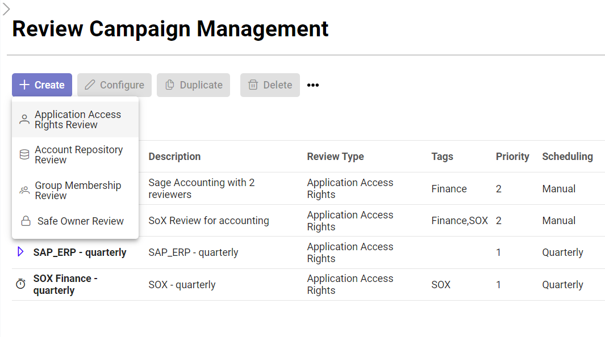  

## Use Case Description

The ACME company is a mid-sized company of roughly 1000 people, they are operating in the US and ran public last year. Therefore they need to comply with SOX constraints. As part of this, their finance systems must be reviewed on a quarterly basis to ensure that access rights are properly configured.

Financial systems are made of three applications:  

- Elyxo-Treasury
- SAGE-Accounting
- SAP

In the following chapters, we will discover how to configure and operate an access certification campaign as well as the remediation process to comply with SOX on this perimeter.

We consider that data has already been loaded and correlated:  

- Identities are loaded
- Line managers are loaded
- Elyxo-Treasury, SAP and SAGE-Accounting applications are loaded and accounts are reconciled with their respective owners
- Application managers are configured (both business owners and technical owners)

## Step 1 - Define the Review Perimeter

### Applications to review

The first step "1. Review Perimeter" is to define the review campaign perimeter: what needs to be reviewed.
In our context we want to review ALL access rights on the following applications:

- Elyxo-Treasury
- SAGE-Accounting
- SAP

To do so, you have to choose the applications to review using two different methods, "Static Selection" or "Selection by Tags".
The first method is to pick in the list the applications, which means here to select SAGE-Accounting, Elyxo-Treasury and SAP applications:

  

The second method consist of using tags, which could be very useful when the number of applications to select is high, and when new SOX applications will be added to Identity Analytics in the future. In that case, you will not have to reconfigure you campaign. In the example below, we are using tags ISO27002 and SOX to choose the three required applications:

  

Note that when using tags, filtering the table by column has no effect on the perimeter. Only the filter to the right of "Selection by Tag" does.

Please note, six steps are required to configure a review campaign:  

1. The first step `Review Perimeter` allows to define your review perimeter,
2. The second step `Review Strategy` helps you define the review strategy,
3. The third step `Perimeter Preview` shows the data for the review on the current timeslot,
4. The fourth step `Reviewer UI` allows to configure the reviewer user interfaces,
5. The fifth step `Campaign Schedule` helps you define the scheduling strategy,
6. The final step `Campaign Information` concerns review campaign information.

ALL selected data MUST be reviewed, the *reviewer* is automatically identified based on the entries to be reviewed as configured in the second step "2. Review Strategy".  
For example, a strategy could be:  
  
- user accounts are reviewed by the line manager,  
- technical are reviewed by the application owner,  
- all other account and if no line manager and no application owner are found, the default reviewer is taken.  

> For reviews on large volumes of data, above 30,000 entries by default, step 3 `Perimeter Preview` is deactivated to smooth the experience, and the KPIs in step 6 are hidden. As a result, the campaign is forced into "on hold" mode to allow perimeter review from the campaign management interface before launching the reviews. This threshold of 30,000 entries can be modified in the project's technical configuration using the variable `ias_reviewdisablepreviewlimit`.

### Accounts Review Perimeter

To refine the review perimeter, the advanced mode in the first step allows you to include or exclude some types of accounts. For example: User accounts, technical accounts, orphaned accounts and leaver accounts.  

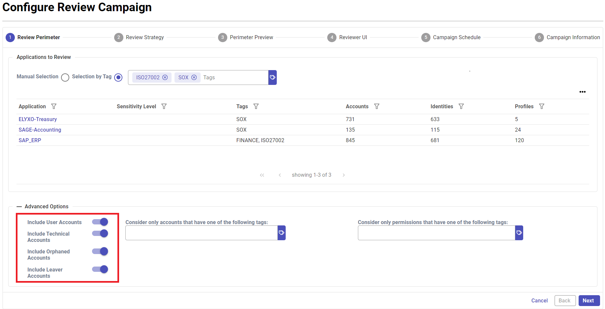

You can configure that only some accounts will be part of the review, either by playing with the options (user accounts, orphaned accounts, ...) or by tagging the accounts you want to include in your review thanks to the account search interface.

This is super flexible as it can be for instance used to review only accounts with some attributes or characteristics such as:

- Accounts from people working in a given division / country / ...
- Accounts with a given sensitivity level,
- Accounts with given controls defects,
- ...

In our use case we want to review **ALL** accounts, so lets keep the default configuration.

### Accounts and Permissions Tag

To identify some specific accounts or some specific permissions, creating tags allows you to filter on them. Creating tags should be done before the review configuration.

For example, to create a tag and filter on accounts that contain "adm" in their login to select most of the administration accounts, go to account search pages and enter in the smartsearch the rule that correspond to your need. And click on "Bulk add a tag in search results" to create your new tag. This new tag can be use to refine the perimeter of your review.

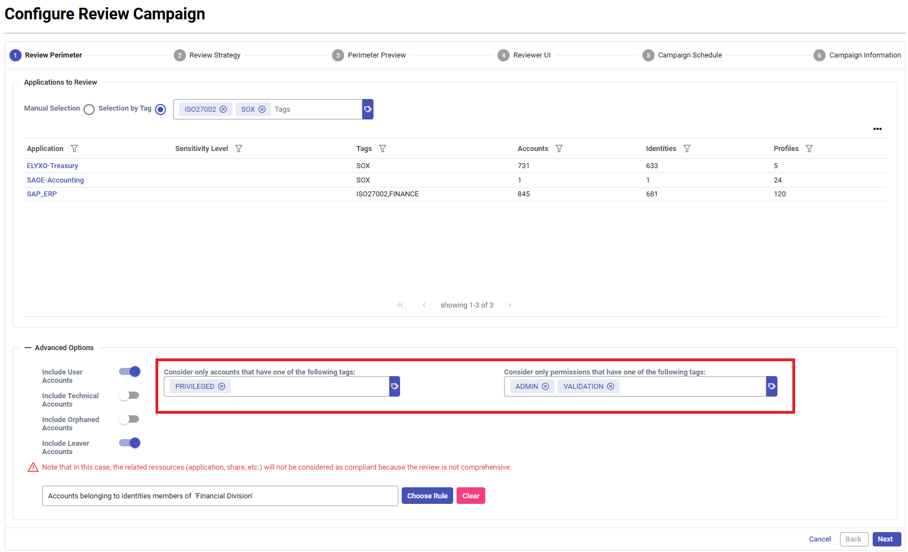

### Permissions Review Perimeter

Once again you can refine your review perimeter in this section by selecting only some permissions to review. In order to do so, you have to tag the permissions that will be part of the review perimeter thanks to the permission search interface.

This is super flexible as it can help you to review only some permissions such as:

- Sensitive permissions
- Permissions with given controls defects
- Admin permissions
- ...

Keep in mind that at the end the review configuration, only the lines whom **BOTH** accounts and permissions are part of the perimeter will be part the review. In that case, the resources that are reviewed (the Elyxo-Treasury, SAP and SAGE-Accounting applications in our case here) will not be considered compliant at the end because the review is not comprehensive.  

In our use case we want to review **ALL** permissions, so lets leave this part empty.

## Step 2 - Define Review Strategy

In this step, you'll find two parts: the reviewer strategy and the AI options.

### Reviewer Strategy

This section helps you to further refine the *reviewer* strategy.

RACI principle is enforced, as a result there is only **ONE** *reviewer* accountable for each entry to review.

- In case of several application owners configured in the system, only one application owner is picked (the one who is not 'delegated')
- In case of several direct line managers configured in the system, only one direct line manager is picked. Keep in mind that as a best practice, **DO NOT** configure several direct line managers in your system as it could lead to duplicated lines in some analytics

In the Application Access Right review, you have the choice between the following strategies:

- User Accounts by Line Manager and Technical Accounts by Application Owner
- User Accounts by Line Manager and All Other Accounts by Application Owner
- User Accounts by Account Owner and All Other Accounts by Application Owner
- All Accounts by Application Owner
- All Accounts by Default Reviewer

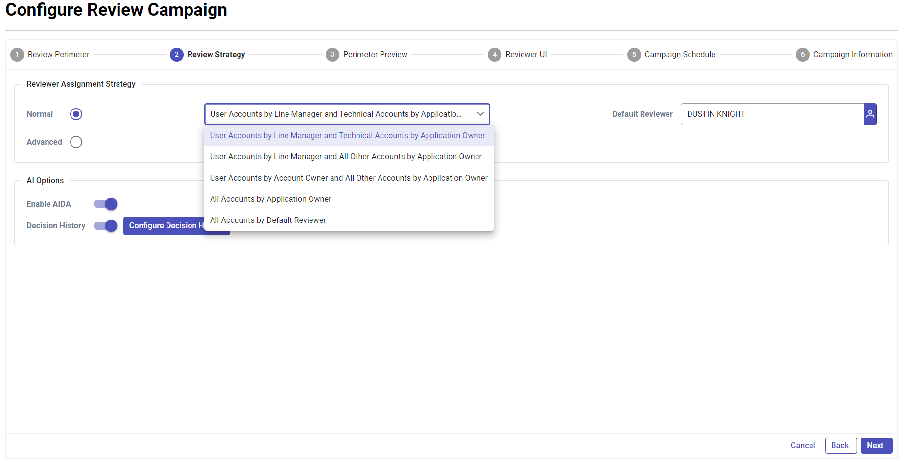

You can make application owners review **ALL** the accounts, including user accounts.

This can be useful if for instance you need to review "privileged permissions" such as admin access rights granted to admin user accounts (accounts whom login is starting with *adm_* for instance). In this particular use case, you will most probably want to have those accounts reviewed by the application owner instead of the IT department line manager of the user accounts owners.  

Finally you can configure a *default reviewer* which will be used when no valid *reviewer* is found for a given entry.
This is the case if:

- A user account owner does not have any direct line manager
- The user account owner is no longer part of the company
- The user account owner does not have an email address
- An application does not have any business owner
- The application business owner is no longer part of the company
- The application business owner does not have an email address

As a best practice this parameter should not be used during the review, you should instead ensure that all entries have a valid "manager" by performing a data quality check prior to launch your review campaign.
As you will see, if RadiantOne Identity Analytics does not find any reviewer for a given line, it will be highlighted in the next section and you won't be able to start your review campaign.

Let's keep the default values for now and let's move to the next section.

### AI Options

#### AIDA (SaaS only)  

When using our SaaS offer with AI enabled, you can activate the Artificial Intelligence Data Assistant AIDA for each campaign. AIDA will assist the reviewers when performing the review if he asks for it.  

Note that AIDA is only available for Application Access Rights type of reviews for now, and will be extended to other types of reviews and other RadiantOne solutions and features in the future.  

The end-user can enable the prompt provided by AIDA by turning on the option “Enable AIDA Prompt”.  

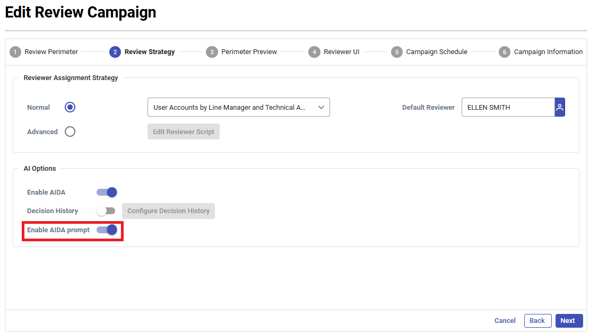  

By doing so, at any time the reviewer can ask AIDA questions at the bottom of the side panel:  

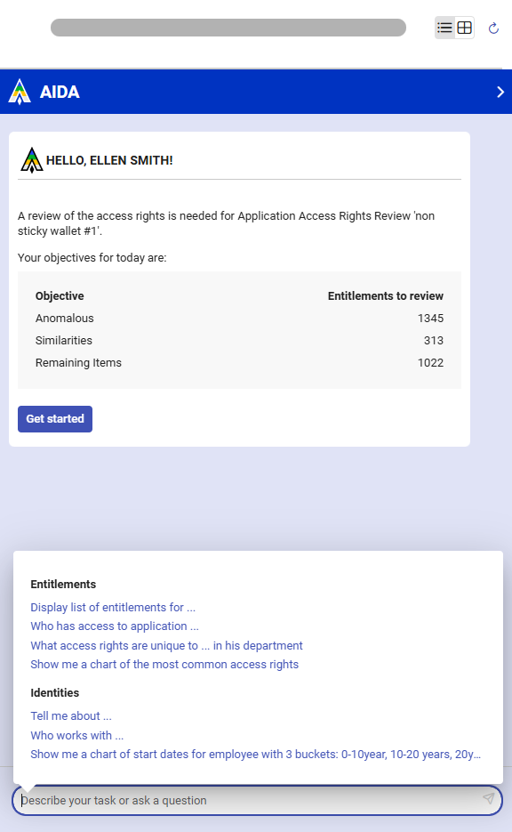  
  
AIDA with User Access Reviews follows these four main principles:

1. AIDA guides the reviewer through the review process, step by step, so that the reviewer is clear about where to start, time is saved and the reviewer has a better understanding of the data.
2. At each stage, AIDA proposes a decision based on the analysis it has carried out, explaining why this decision should be made by presenting the analysis. The reviewer then has the information needed in order to proceed in his decision-making process.
3. Once the reviewer makes his decision, AIDA will carry out the action for him in the system. This method aligns with compliance regulations because it is mandatory that a human being, and not a machine, be the one to fully perform the review.
4. During the review process and in addition to AIDA's suggestions and explanations, the reviewer can delve more deeply by using Large Language Models (LLM) to request further clarification and analysis which helps to explain the context (who can access what, what is the access chain, how to compare accesses, etc.).

#### Decision History

Also called "Incremental Review", this option will help you to leverage previous access certification campaigns.
When enabled, previous review status will be used to "prefill" review status and review comment.

This happens **only** when:

- The entry has been reviewed in the configured timeframe (*A valid entry is an entry which has been reviewed in the last X days*)
- In case of an user account, account owner characteristics have not changed since the last review:
  - Organisation
  - Job Title
  - Internal status

You can also chose to simply remove those entries from the review perimeter if needed (if for instance you only want to review changes that occurred since the last review date, without displaying valid entries)

We won't use this feature for now as it is our very first access review campaign, so let's keep the default values for now and move to the next section by clicking on the *Next* button

## Step 3 - Perimeter Preview

This section will present a preview of the data to be reviewed as well as the *computed reviewer* for each entry.

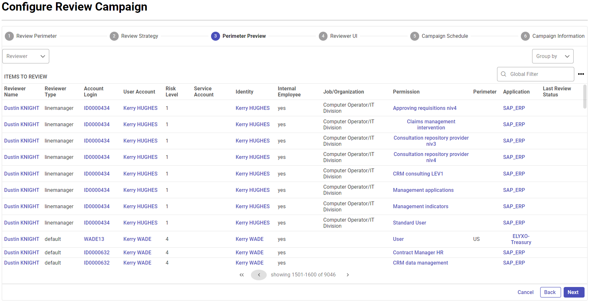

> Creating and launching a review on a previous timeslot is not a standard use case, so the preview shown in the review campaign setup only gives general information based on the last timeslot. The preview based on the timeslot you selected will be available once the campaign is created by entering the details of your access review (see Campaign Follow-up section). This is why we recommend that you configure your campaign “on hold” if it is a scheduled campaign at step 6 of the configuration wizard. 

You can browse through the table, reorder the columns, add or remove columns through the options or export the data in CSV/excel format if needed. Click on the three buttons on the upper right of the table for such purpose.

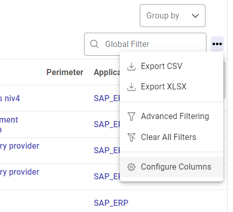

When configuring columns:
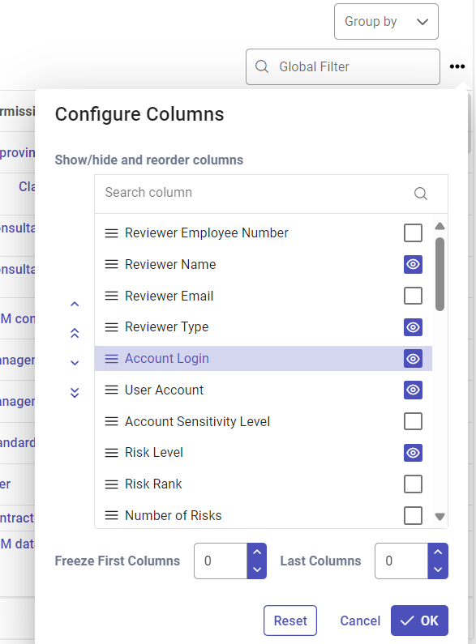

You can also use the filtering capabilities at the top of the table such as the filter per reviewer on the upper left of the table or the global filter and the group by feature on the upper right.
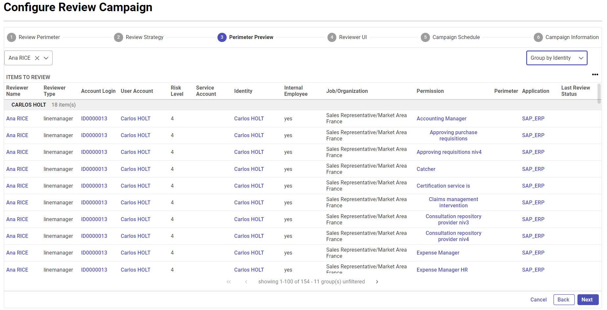

You can access to objects details by clicking on the corresponding labels (login, name, permission, ...)

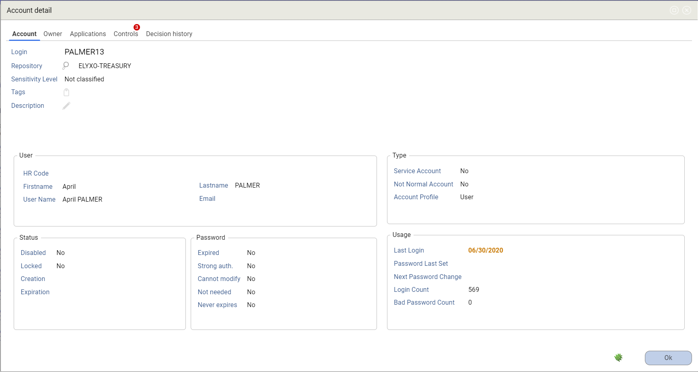

If some *reviewers* have not been found an error message is displayed on the screen and the *Next* button is disabled. click on the *Back* button and refine your configuration by adding the missing managers to solve this problem. This may occur only when using "advanced mode" with the script, since by default, when the reviewer is not found, the default reviewer is set as reviewer.  
  
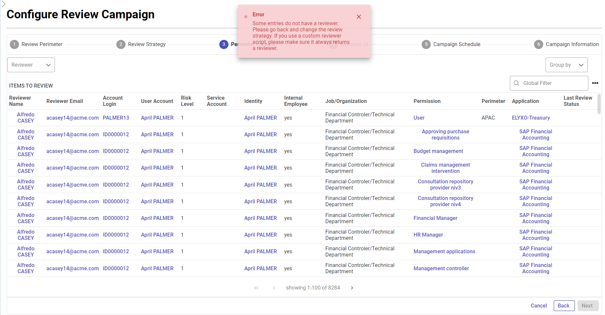  
  
You still can browse the table to check each entry.  
If everything is ok, you can click on *Next* to move forward.  

> **Note** For reviews on large volumes of data, above 30,000 entries by default, this step is deactivated to smooth the experience. In that case, the following message will be displayed:  

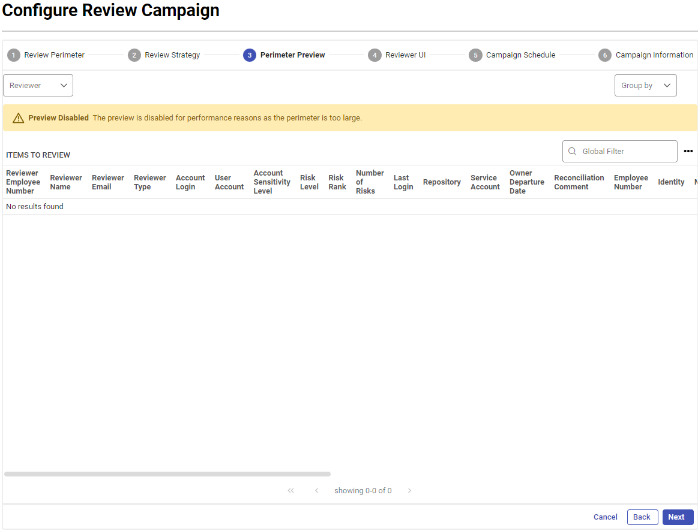

## Step 4 - Reviewer UI  

In this step you can specify the user interfaces you want to provide to the reviewers.  

The first section focus on the reviewer decision configuration: revoke, validate, update entries.

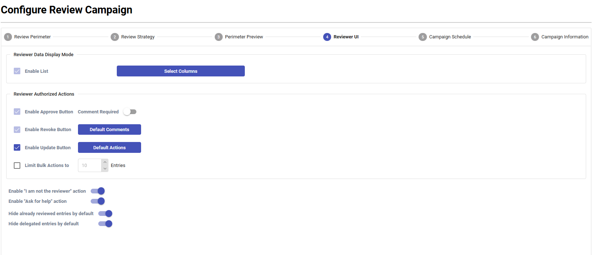

You can make comments mandatory when the `Approve` button is used.
You can modify (add or remove) the default comment list for `Revoke` and `Update` actions, and also add your own new comments if needed.
By default, the following comments are proposed for `Revoke`:

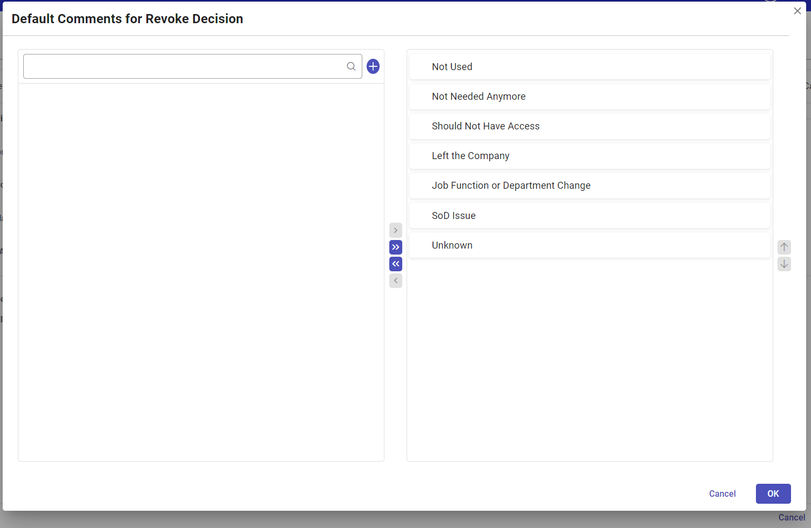

By default, the following comments are proposed for `Update`:

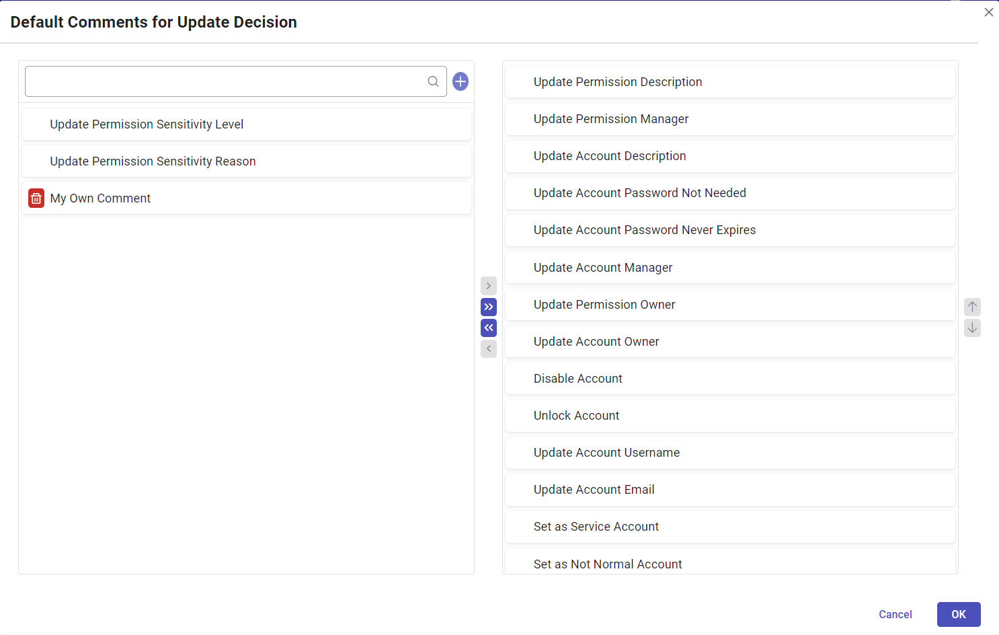

If you want to avoid the "Rubber Stamping" effect, you can limit the bulk actions of the reviewer to a certain number of entries.  
  
Four additional options can be disabled such as:  
  
- allowing the reviewer to specify that he is not the right person with the `I'm not the reviewer` button. In that case the related entries are set as "to reassign" and are not visible any more by the reviewer. The accountable reviewer has to change. The review owner has then to re-assign those entries to another person from the follow-up interfaces of the review instance.  
  
- allowing the reviewer to `ask for help to`another person in his team if he is line manager, or another owner if he is a resource owner. In that case, the reviewer stay the accountable reviewer of the entries, however he ask to a responsible reviewer to take the decisions on his behalf for the selected entries.  
  
- allowing the reviewer to `hide already reviewed entries by default`: when activated, the reviewer will only see by default the remaining entries he has to review. He still can uncheck this option on top of the tables to see all entries, including the one already reviewed.  

- allowing the reviewer to `Hide delegated entries by default`: when activated, the reviewer will only see by default his remaining entries but not the one he has delegated to other people. He still can uncheck this option on top of the tables to see all entries, including the one he has delegated.  
  
In your case, you can keep the default values and click on *Next* to move forward.  
  
## Step 5 - Campaign Schedule  
  
This part allows you to configure the schedule of your review instances and the email notification and reminder strategies.  

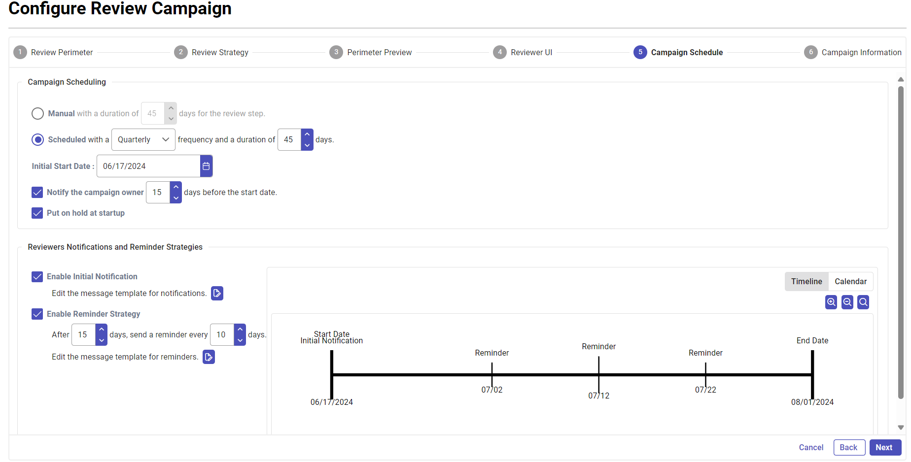

### Campaign Scheduling

In the first section, `Campaign Scheduling`, you can choose either to define a **manual** or a **scheduled** campaign. 

If you choose the **manual** option, the review instance must be launched by the campaign owner when needed. You need to specify the expected duration of the campaign in days, so that notification of completion of the review instance is automatically sent to the campaign owner on the correct date, as well as reminders according to the reminder strategy you define in the next section.

If you choose the **scheduled** option, the first review instances will be launched automatically at the **initial start date** you've specified. Then the next instances will be launched based on the frequency you've defined, which could be weekly, monthly, quarterly, semi-annual, yearly. You have also to set the expected duration of the campaign in days, so that notification of completion of the review instance is automatically sent to the campaign owner on the correct date, as well as reminders according to the reminder strategy you define in the next section.  
You can also activate a reminder to notify the campaign owner a certain number of days, which you can define, before the campaign automatically starts. The aim is to allow the owner to review the scope and reviewers to be called upon before the review instance starts.  

The finalization of **manual** and **scheduled** review instances is therefore manual, allowing the campaign owner to grant a grace period if necessary, to ensure that all reviewers have completed their review.

For both **manual** and **scheduled** campaigns you can check the option "Put on hold at startup" so that when the review will start either automatically or manually, the review instance will be in pause status and the notifications will not be send, allowing you to review the scope and the reviewer strategy before starting it. In your case we will check that option, to review the perimeter before launching the first instance.

In your case here, you can choose a "scheduled" review with a quarterly frequency and keep the default options. In addition, check the "Put on hold at startup" box so that you can log in and check the perimeter before starting the review and sending related notifications.

### Reviewers' Notifications and Reminders Strategies

In this section, you can activate initial notifications and reminders sent to reviewers. For each of these, you can edit the e-mail templates and modify them as required. Those templates are use when notifications are send automatically and also when the campaign owner wants to send reminders manually to a selection of reviewers from the follow-up interface.

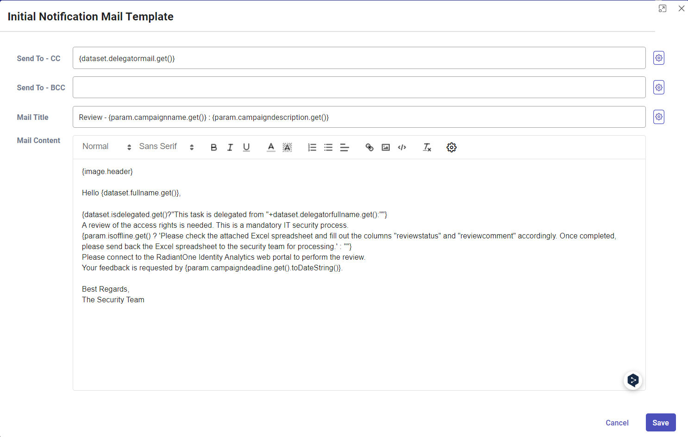

When editing email templates, you can use the gear icons to insert variables in the main text of the email or in the fields of the destination email address.

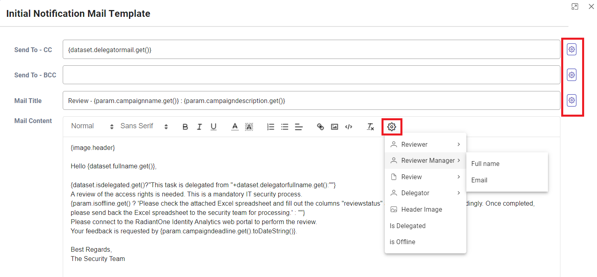  

As far as reminders are concerned, you can set the frequency of notifications by determining after how many days you wish to send the first reminder, and how often you wish to send subsequent reminders. On the right-hand side, you have a graphical representation of this frequency, which you can display in the form of a timeline or calendar.

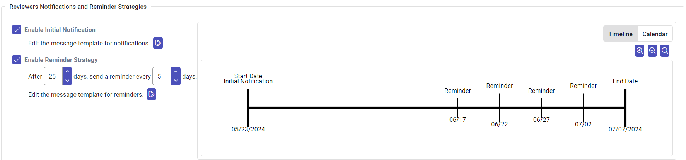  

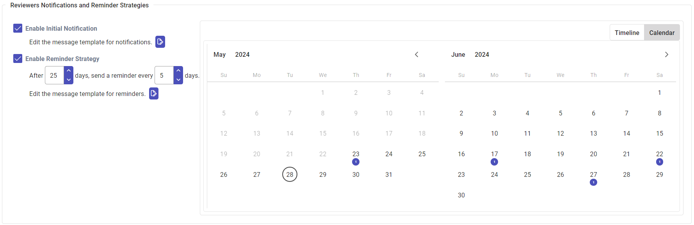  

Later, once you've finalized the configuration of your campaign, you'll be able to update these reminder dates directly from the campaign management interface, with the option of adding or deleting specific dates.

You can leave the default templates and reminder calendar as they are for your use case.

## Step 6 - Campaign Information

You are almost done, the last thing you need is to give additional information to your campaign such as a pretty name, description, specify an owner, a priority level. This priority level can be useful when several review campaigns are being run at the same time, giving your *reviewers* a way of evaluating their entries by priority level.  

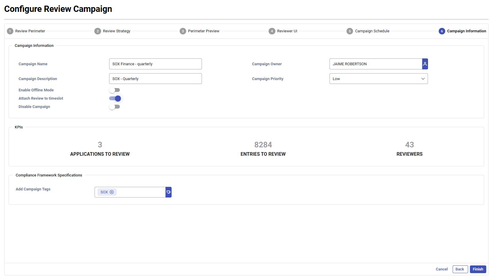  

Three additional options are available here, such as "Enable offline mode", which allows reviewers to download the entries to be reviewed into an Excel spreadsheet from their home page and upload it once they have partially or completely completed it. It allows also the campaign owner to send e-mail notifications with this spreadsheet attached so that reviewers can work offline. This option is particularly appreciated when reviewers travel a lot or have no access to the company's IS for whatever reason (if they are contractors for example). Note that a same reviewer can work both online and offline if needed.  
  
The second option `Attach Review to Timeslot` allows to configure user access review in Identity Analytics that are fixed to a specific timeslot, which represents the configuration of the accesses at a particular time. This way, the User Access Review is not taken into account the newer timeslots where some of the entries may have been removed since the review began.
  
The third option disables the campaign, so that it cannot be launched automatically or manually. You need to edit it and change the deactivation of this setting for it to work. This allows you to work on the configuration at a later date and perform a few additional checks before the review instance starts and notifications are sent automatically.  

  

When offline mode is enabled:  

- The reviewer can complete the entries to review on excel file  

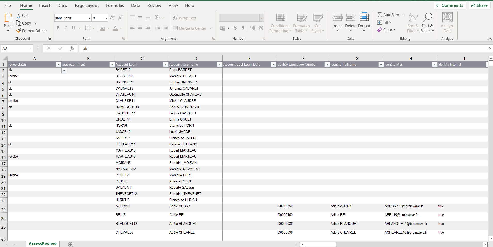

- Download and Upload of the excel file can be done:  

  - By the *campaign owner* from the campaign management interface, by clicking on the "Upload" button in the "Latest Review" section on the right:  

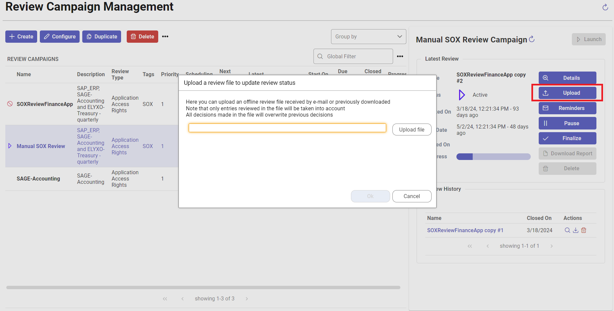  

  - By the *reviewer* from his home page Access360 interface:

  

- When the excel file is uploaded, the number of review entries is displayed:  

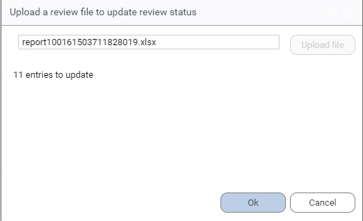

- Then the review progress bar is updated:  

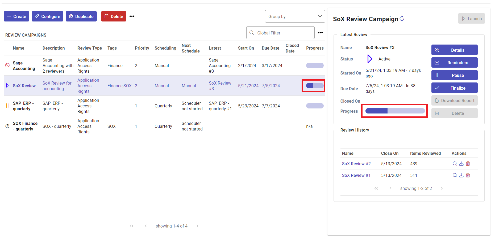  

Finally, in the "Compliance Framework Specification" section, you can define tags for your campaign to easily filter from the "Review Campaign Management" interface on all campaigns contributing to the same compliance framework, as in this example, filtering campaigns configured in accordance with SOX:

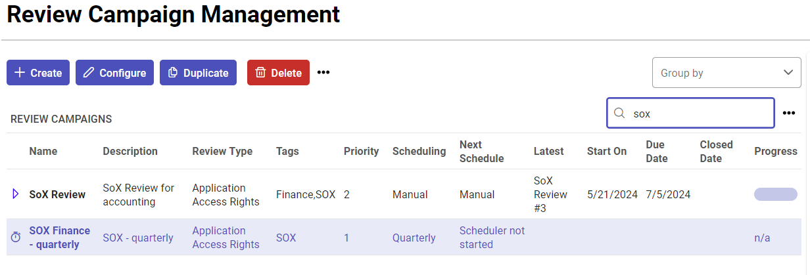  

Once everything is fulfilled, click on **Finish** to save your campaign configuration.  
  
> **Note** For reviews on large volumes of data, above 30,000 entries by default, the KPIs in this step are not displayed to smooth the experience. In addition the campaign is forced into "on hold" mode to allow perimeter review from the campaign management interface before launching the reviews.  

## Step 7 - Managing your review campaign

Once your review campaign configuration has been saved, it appears in the compliance review management page.  
You can access to this page through the menu *Review / Review Campaign Management*  

  

> To check the status of your access review campaigns and their review instances, you must be in the latest timeslot, otherwise if you are in a past timeslot, certain review instances may appear active even though they were closed in the current timeslot.  

When selecting your campaign in the list, you can either edit the configuration by clicking on **Configure**, **Duplicate** the configuration of your campaign or **Delete** it with all its review instances history.  

Additional buttons are available to **Create** new campaigns and **Export Configuration** **Import Configuration** by clicking on the three bullets.

  

On the right side of the screen, you'll find all the information regarding the review instances that are pending, in progress or have already been completed. The left section includes two parts, "Latest Review" listing the on-going/active review instance, and "Review History" listing the completed reviews.

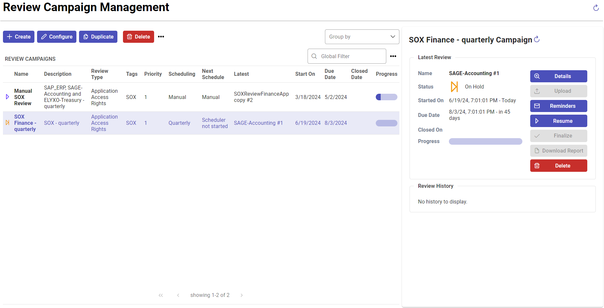  

In this case, we get the message "Scheduler not started", which means that you need to activate the scheduler for the review instances to start on the scheduled date. This happens mainly when you start the solution for the first time. To do so, using the left menu bar, go to "Settings" > "System" and then click on the "Scheduler" button:

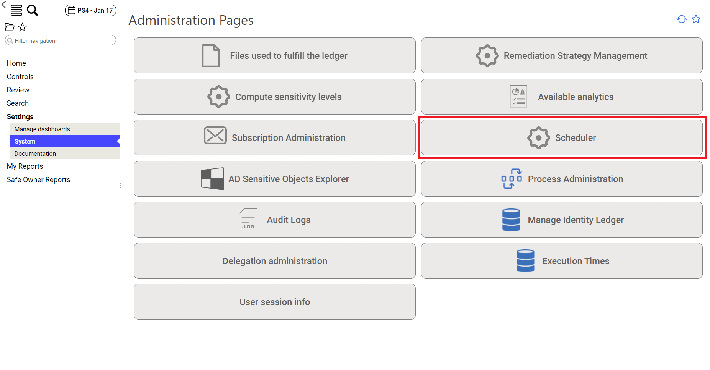  

Specify the hour you need to start the scheduler, click on "Start Scheduler" and then confirm:

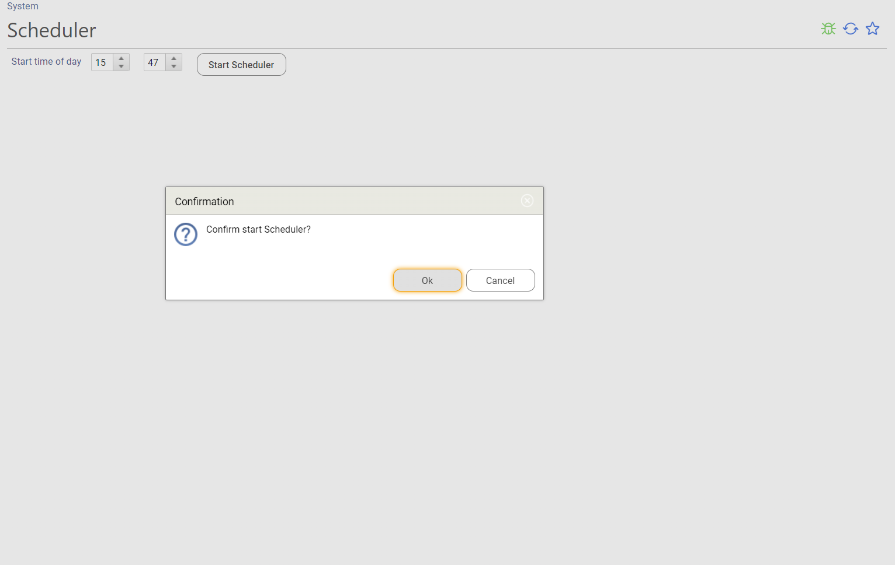  

When the scheduler is started, you'll find in the same page the information about the lifecycle of the scheduler:

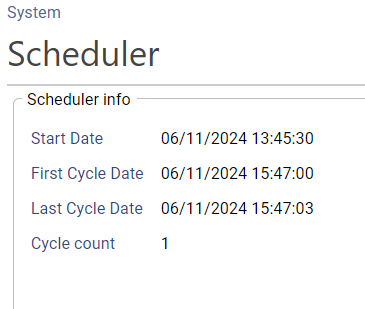  

If the campaign has been scheduled which is the case here, back in the review campaign management dashboard, you must wait until the "initial start date" has been reached to see information on the right side. In your case, you have checked the option "Put on hold at startup" in the configuration of the campaign, this means that your review instance will be on pause, so that you have the time to check its perimeter and reviewer strategy based on the current data before starting it. Once the review instance has started, notifications will be sent to all *reviewers* involved based on the campaign configuration you have defined. On the right you will have the following display wether the review is started or in pause mode:

  

The first occurrence of the review will have "#1" added at the end of its name, the second "#2" and so on.
On the active instance, you can:

- go to the follow-up dashboard by clicking on **Details**,
- manage reminders (remove/create) by clicking on **Reminders**,
- pause your instance by clicking on **Pause**,
- finalize your review instance by clicking on **Finalize**,
- when paused, delete your review instance by clicking on **Delete**.

### Campaign Follow-up: **Details** button

The very first thing you will want to do is to go to the follow-up dashboard to check the review perimeter. Select your review campaign and click on the *Details* button. 

#### Measuring review campaign progress  

The first tabs "Review Status" and "Review Statistics" allow to measure and follow the progress of your review instance with the help of KPIs and graphs. 

  

##### Review Status

In the first "Review Status" tab, *Reviewers* that have already signed off their user access review are shown in the left-hand table. In the table on the right, reviewers who have not yet started reviewing entries, or who are in the process of reviewing them, or who have reviewed all entries but have not yet signed off their review, are displayed.  

When you click on the KPI or reviewer name in the tables on this tab, you go directly to the "Entries to review" tab, with the filter applied according to the KPI/reviewer name you initially clicked on.

Note that from the right table, you can send reminders to a selection of reviewers if needed. This is particularly helpful when you have reassignment (accountable or responsible) that have been done recently and when the next reminders won't be coming soon.  

When doing so, the reminder email template you configured within your campaign is proposed here, with the ability to change/update the text:

  

When offline mode has been activated in the campaign configuration, you can choose also between three different strategies:

- Send a message to the selected *reviewers* with all the entries as an attachment
- Send a message to the selected *reviewers* with the remaining entries to review as an attachment
- Send an email to the selected *reviewers* without attachment

  

The first two choices can be useful if you want to send the review content along with the email for instance when you want to enable "offline" reviews by some *reviewers* (reviewing through an excel spreadsheet instead of reviewing in the UI).
The last one is more "traditional" as they do not include any attachment.  

If the offline mode is disabled in your campaign configuration, you cannot add attachment to your notifications.

Depending on your review strategy and your review phase (initial notification,gentle reminder), you have to select the right Mail Strategy in the combo box.  

The mails look like:  

  

##### Review Statistics

You can also browse through the review statistics to check the current review status in the second tab "Review Statistics".  

  

But what we're interested in here is more the third tab "Entries to Review", to review and refine reviewers if needed before starting the review.

#### Refine reviewers  

In the "Entries to review" tab, you can find all entries with the related reviewers that has been assigned regarding to the review strategy you specified in the campaign configuration.

  

If needed, you can add the "Reviewer Origin" column by right clicking in the table, selecting "Configure", and then in the list the related column or any other information you want to display in the table.  

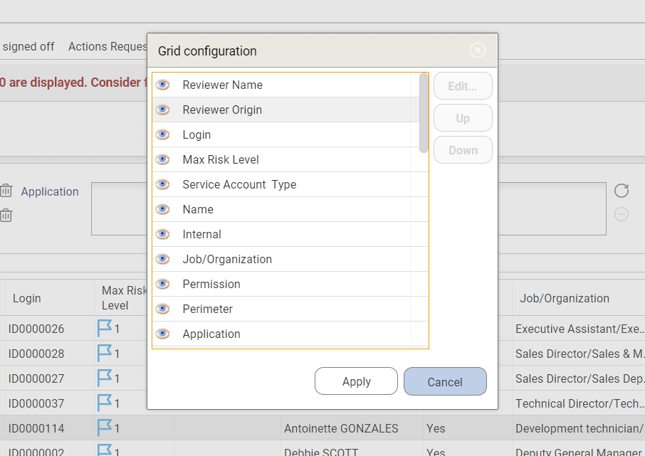  

Then use the filtering capabilities if you want to reassign some entries based on reviewer, permissions, or else. When selecting a set of entries, you can:

- Reassign the entries to another reviewer by clicking on **Reassign**,
- Escalate the entry to the manager of the reviewer by clicking on **Escalate**,
- Take a decision on behalf of the reviewer by clicking on the three-point icon then **Force Bulk Approval/Revocation/Update**,
- Reset the decisions taken for the selected entries by clicking on the three-point icon then **Force Bulk Reset**,
- Force the sign off on the selected entries by clicking on the three-point icon then **Force Sign Off**,
- Add/update comment of the selected entries by clicking on the three-point icon then **Force Bulk Comment**,

Finally you have the option by clicking on the three-point icon then selecting **Download All Entries** to download in an excel spreadsheet the who list of entries.  

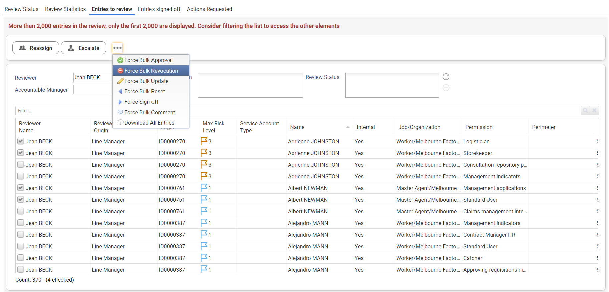  

Note that this table is displaying the first 2,000 entries, so you need to apply filter based on reviewer, accountable manager, application or review status to work on selections of entries.

Once I'm ok with the list of entries and their related reviewers, I can go back to the campaign management interface and start the review by clicking on "Resume":

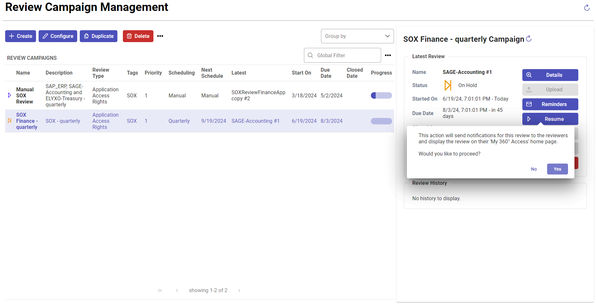  

Then the review will be dispayed as `Active`:  

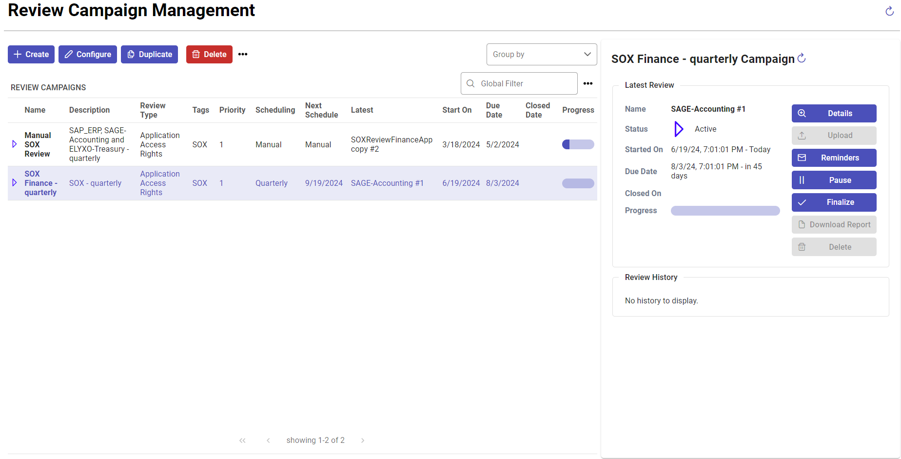  

### Reminders Management: **Reminders** button  

The reminder dialog lets you fine-tune the reminders you wish to send during your campaign. It lists all the dates on which reminders will be sent. You can delete or add new reminders.  

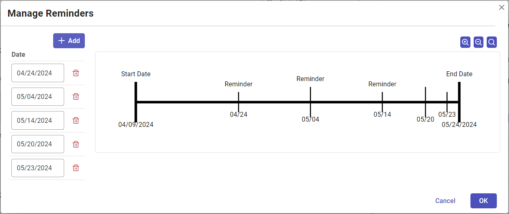  

In your case, in addition to the default reminders, we've chosen to add two, at one day and four days before the end date.

### Update campaign status: **Pause/Resume**, **Abort** and **Finalize** buttons

At any time while a review is in progress, you can choose to pause it. In this case, reviewers will no longer have access to the review interfaces until you click "Resume" again. This allow you to review again the perimeter if you have any doubt or to remove your review by clicking on the **Delete** button.

The **Finalize** button allows you to end the review instance at any time, even if the reviewers have not completed their reviews. In our case, we'll wait until we receive notification of the "end date" before finalizing.

When a review instance starts, either manually or automatically if programmed, the interrupt button can be used if the startup process takes too long:  
  
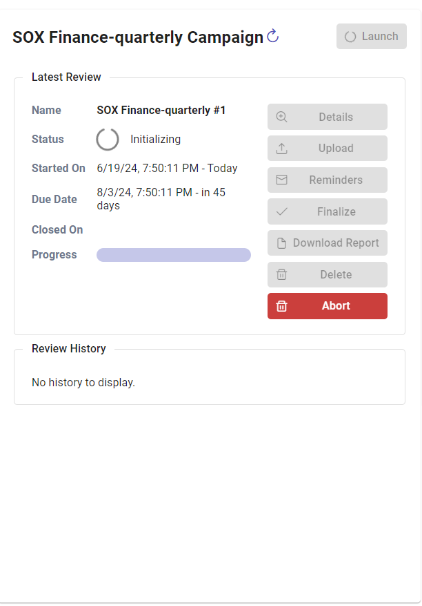  

## Step 8 - Reviewing entries

*Reviewers* have received an email and will connect to the RadiantOne Identity Analytics platform to review their entries. *Reviewers* have to select the review campaign to review.  

  

As a *reviewer* I can approve, revoke or comment one by one, I can also perform bulk operations by selecting several entries at once.  

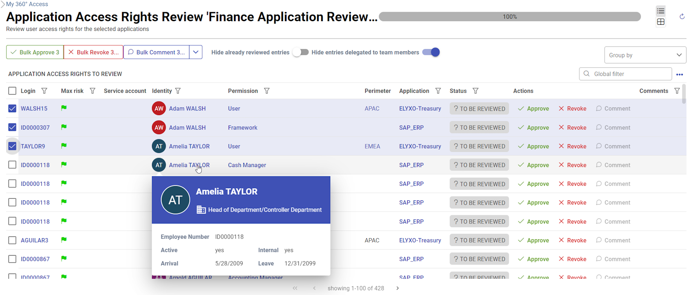  

I can export data when clicking on the advanced options on the right (...) in CSV or XSLX, activate/deactivate advanced filtering and configure columns.

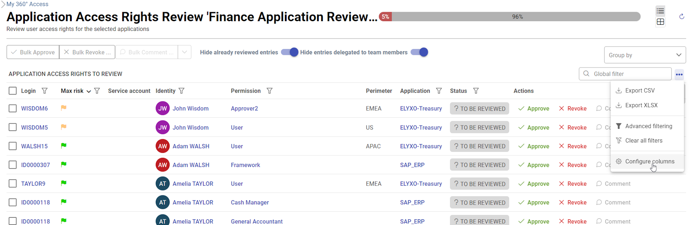  

When activating the "Advanced filtering" option, I can filter and sort easily some of the columns like in an excel spreadsheet.  

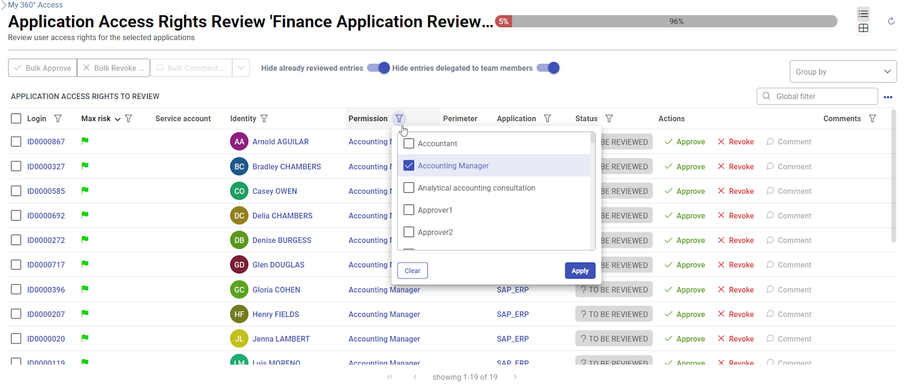  

When clicking on "Configure columns", I can reorder the table, add/remove columns or freeze first/last columns.

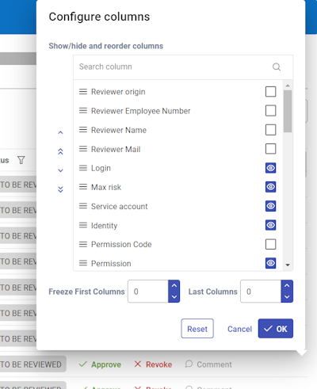  

As I move forward in my reviews, if I check the option "Hide already reviewed entries", I see the list diminishing: all reviewed entries are no longer displayed in the list.
Nevertheless, I can change my mind and I am allowed to change the review status of any entry until the review campaign is finalized.
In order to do so, I just have to uncheck this option.

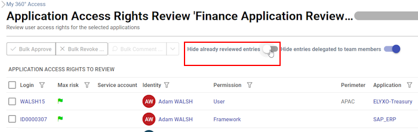  

Only the remaining entries to review are displayed.

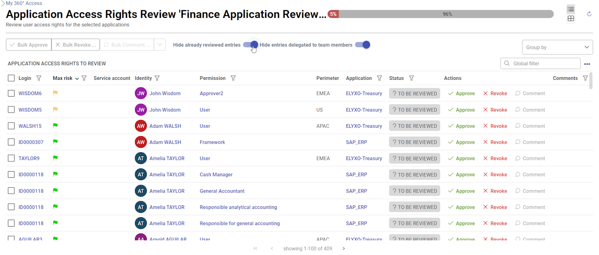  

I can filter the entries by account, identity, permission or application thanks to the Global Filter.
This is useful if I want to review the entries by Login, Identity, Permission, Service Account, Application, Review Comment and use bulk operations when needed

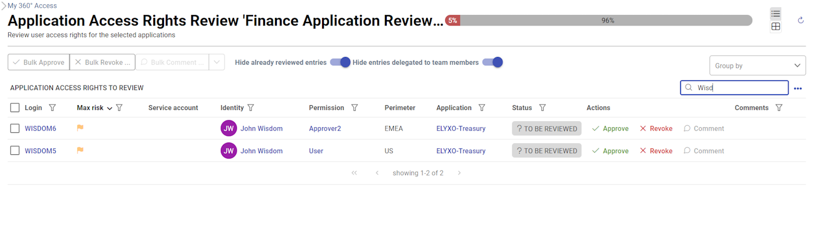  

Once everything has been reviewed, a pop-up window appears asking me to "sign off" or "display all reviewed entries" if I change my mind and want to update later the review status for some of my entries.  

  

If I chose "display all reviewed entries", I can update anytime some of the entries decision and chose to "sign off" later.  

  

If I chose "sign off", all my decisions will be ready for remediation and I'm not able to change my mind anymore until the *review owner* "Force Bulk Reset" for some or all of my reviewed entries.  

  

I can close my web browser. Depending on the configuration chosen, the "signed-off" entries will automatically go in a "pending remediation" state within the next days or manually by the *review owner*.  
Then the *technical owner* or *review owner* will have the ability to process and monitor the remediation from the remediation management user interface.  

  

### Grouped list mode review  

To facilitate the review, *reviewers* can group entries by account login, identity name, permission or application. This mode allows bulk approval or bulk revocation.  

Grouped by permission:  

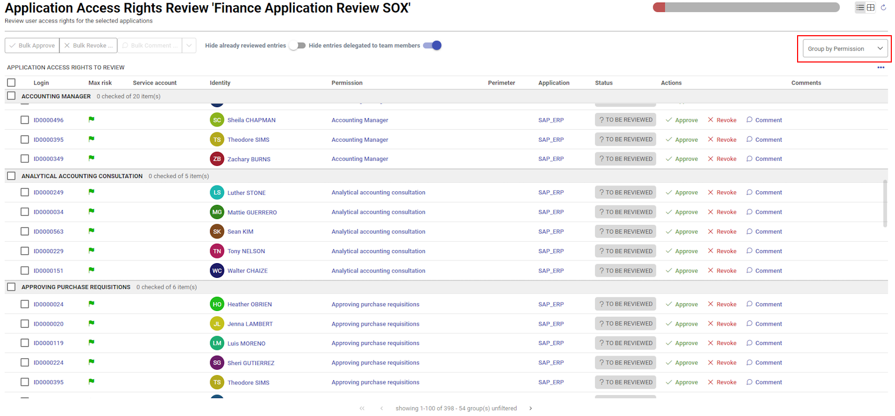  

Grouped by application:  

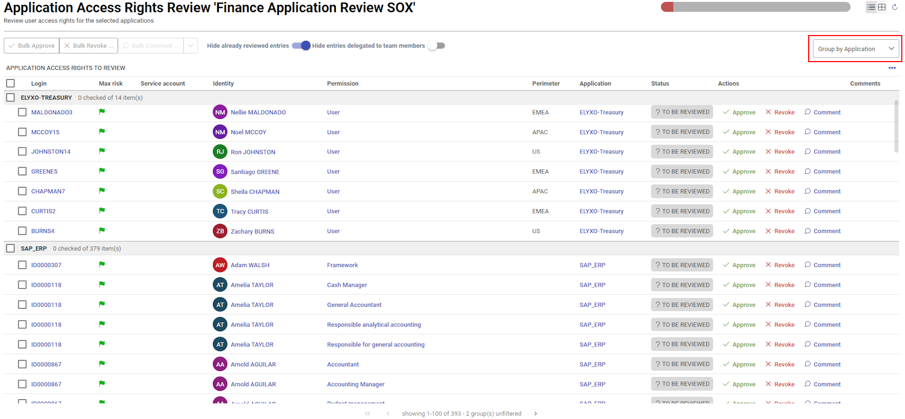  

### Pivot table mode review  

This mode is a graphic mode and allows *reviewers* to have graphic view.  

All entries can be organized to have a rapid view and help to identify discrepancies between accounts. This option allows cluster sorting of crosstable cells using an **advanced classification algorithm**. This will help the end-user to work on peer group. To activate it, he needs to click on the icon on the upper left (framed in red in the copyscreen below). In the case of a cross-table listing identities, accounts and their related permissions, when clicking on the "clustering" button in the cross-table, the data is sorted to group users by similar permission sets. Biggest blocks are displayed to the top left of the cross-table, making easier to tackle the most significant groups of similar entries and to identify the outliers at the right and bottom. 

Discrepancy accounts will be quickly identified as well. With this mode bulk approval and bulk revocation are interesting.  

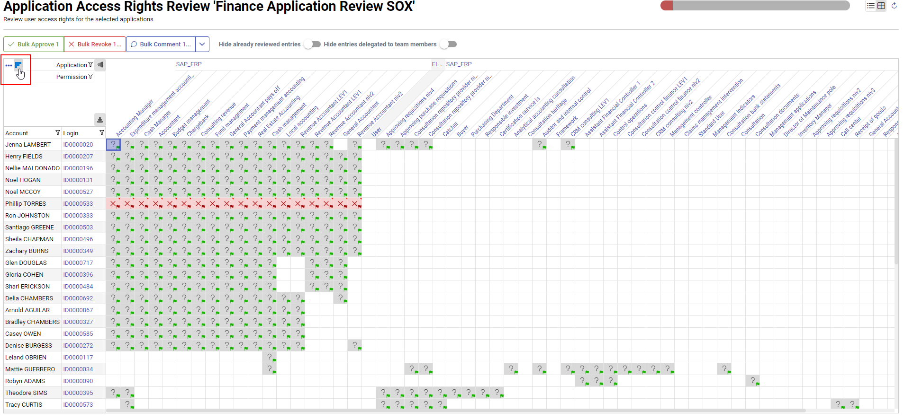

Filters on the pivot table can be directly applied to facilitate review.

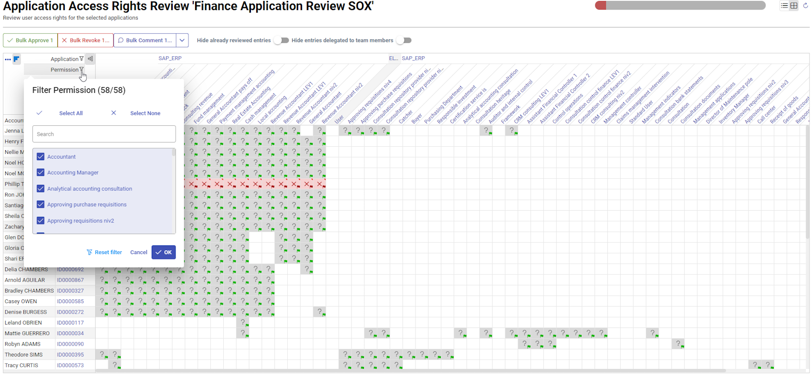

### Reviewing entries and delegate some entries to review to my team

Noel HOGAN receives a gentle reminder, he connects to the RadiantOne Identity Analytics interface to do the review.  
He wants to delegate the review of all the "Elyxo" entries to a member of his team, responsible for this application.  

He filters the list to show only entries related to elyxo  

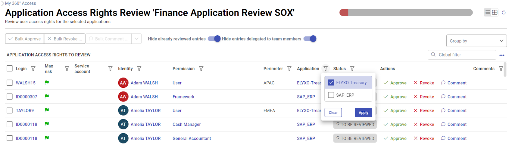  

and he selects all entries thanks to the *Check all* option  

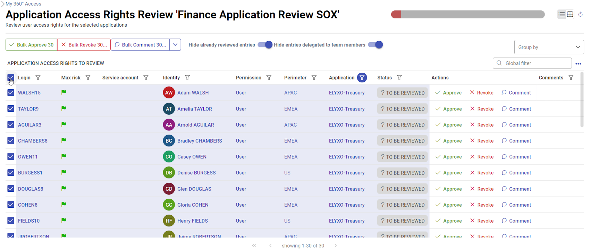  

and select *Ask team for help...*  

  

Noel can now pick a team member to delegate those entries.  

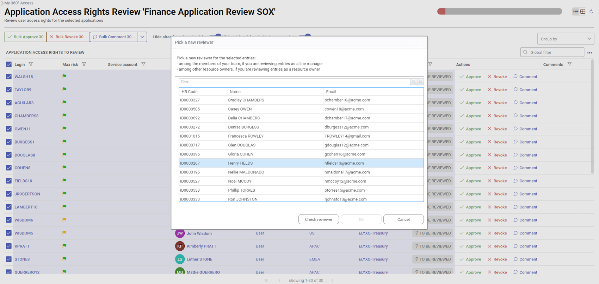  

The following delegation principles are applied:

- When an individual reviews an entry as a *line manager* of the account owner, he can only delegate this entry to a team member
- When an individual reviews an entry as an *application business owner*, he can only delegate this entry to the other application business owners
- When you want to delegate several entries at once, the list **must** be uniform (you cannot delegate at the same time *line managers* entries and *application owners* entries)
- When you are the *default reviewer* of an entry, you cannot delegate it
- You cannot delegate the review of an entry in a way that one will have to review himself

When Noel clicks on "Check", if the person cannot be the *reviewer*, the solution gives him the reason in a window:

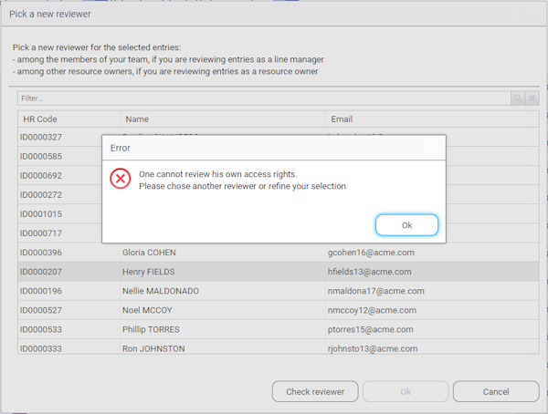

In case of doubt, you can display the 'Reviewer origin' column in the table.

Noel selects Philip TORRES in the list:

  
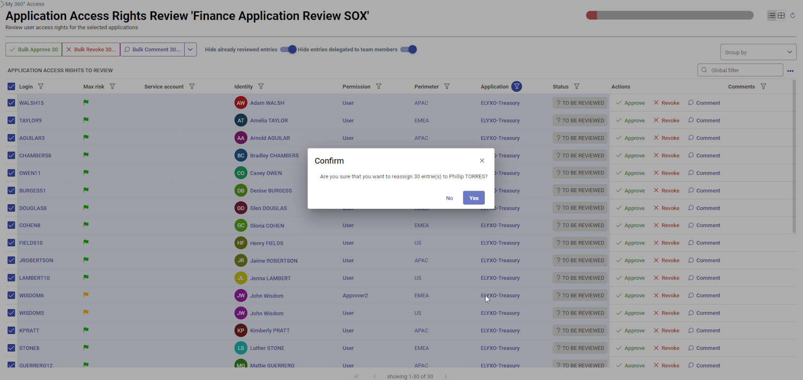  

Once done, the entries are now assigned to Philip. However, if he changed his mind, he still can display the related entries by unchecking the option "Hide entries delegated to team members". He can also add columns, like the "Reviewer name", to manage entries if he has different delegatees, by clicking on the "..." on the right and selecting "Configure columns".

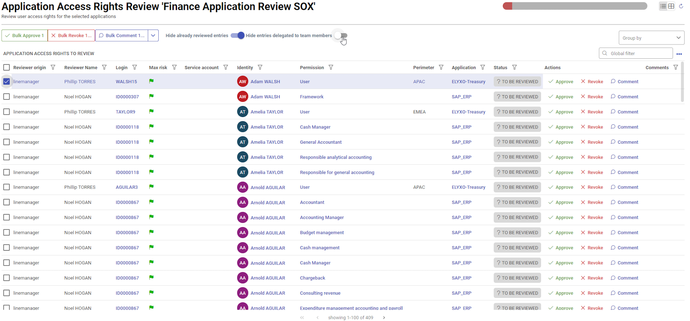  

Then he still can select them and reset them in order to delegate them to another person.  

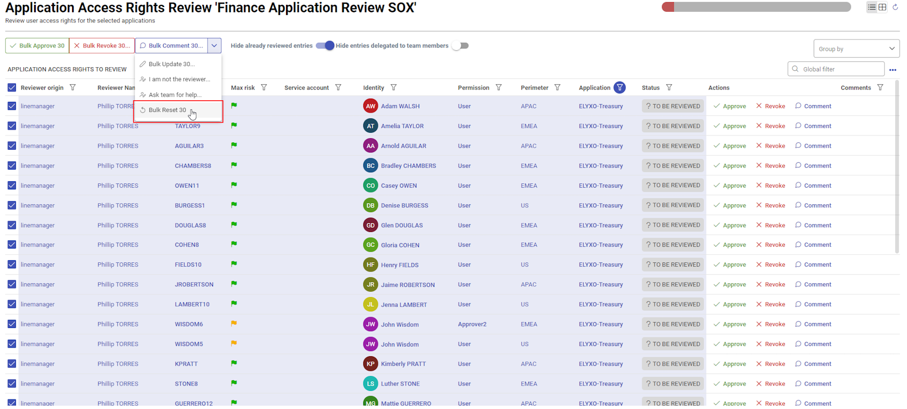  

> From a review campaign management perspective we keep track of all the delegations by enforcing the RACI principles.  
> The initial *reviewers* are considered as **accountable** while the delegated *reviewers* are considered as **responsible**.  
> This can be highlighted in the review campaign management interface.

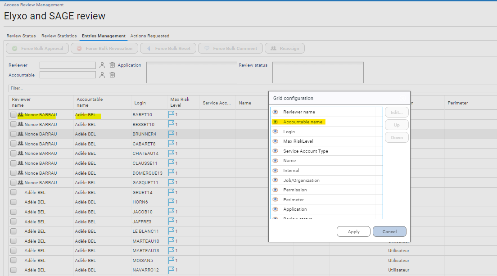  

As you can notice, a small icon appears at the beginning of the line because this review has been self-delegated. You can further display the *'*accountable name* if you want to have both the **responsible** and the **accountable** information.

If needed you can reset the delegation status by selecting those entries and clicking on *Force bulk reset*

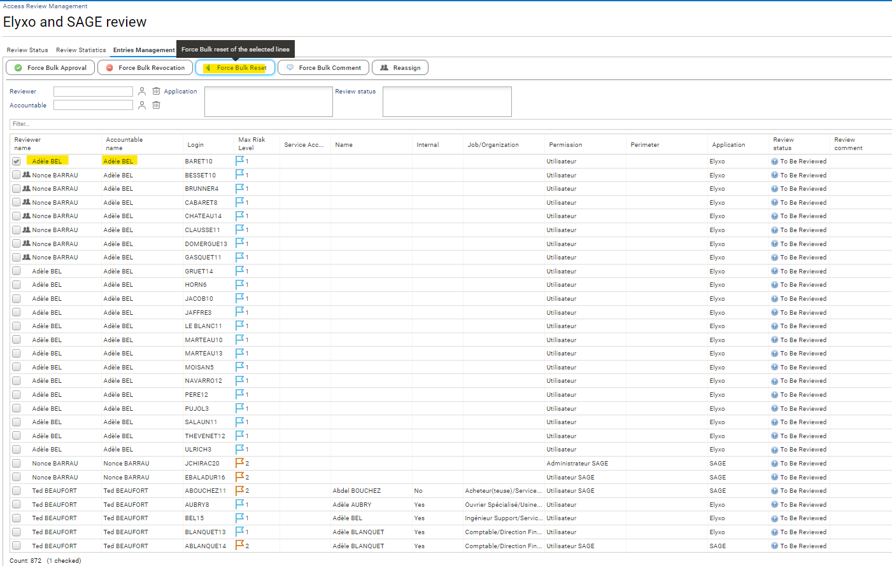

## Step 9 - Managing pending signed-off entries

During the campaign, you can reach the review follow-up interface to manage the the entries signed off so far and start remediation.

When entries are in that particular state, it means that the *reviewer* cannot change his decision anymore. These entries are ready to be remediated. The remediation can be launched automatically based on the script that is executed daily and manually by the *review owner*.  
By selecting entries and clicking on "Proceed Now", the "signed off" entries will be immediately set in "pending remediation" state.  
By selecting entries and clicking on "Force Bulk Reset", the entries will once again be available to the *reviewer* so that he can change his decisions.  

  

> 1. The "proceed now" option is also hidden by default. To make it available, it requires to set the `ias_reviewcanproceedsignedentries` variable to `true`.  
>
> 2. To automate the change from "signed off" to "pending remediation", the variable `ias_reviewautomateproceedsignedentries` and `ias_reviewproceedsignedentriesdelay` have to be set to in the configuration of the project. When `ias_reviewautomateproceedsignedentries` is set to `true` and `ias_reviewproceedsignedentriesdelay` is set to a number of days, the entries will automatically go from a "Signed-off" state to a "Proceed: Remediation Pending" state after the number of days indicated. The remediation will then have to be launched and managed through the "Remediation Management" page. To allow this automation, the related workflow (`bwaccess360_automateProceedSignofAccessRights`) needs to be launch using a batch.  

## Step 10 - Finalizing the review campaign

The review campaign is now almost done, only some entries still need to be reviewed.

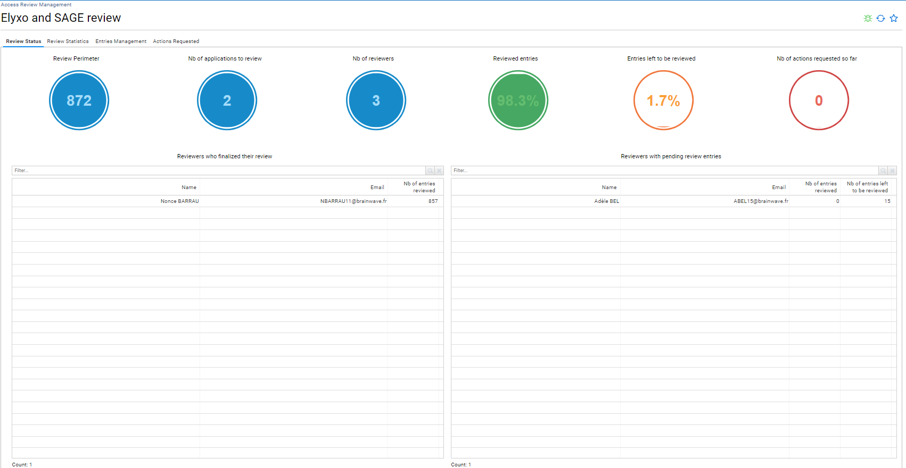  

Miguel MORENO has not reviewed any entries, he still have 63 entries to review.  
Antoinette GONZALES has reviewed all her entries, but she has not signed off.  

Regarding Miguel MORENO, after a quick call with him, the *review owner* decides to approve the 63 entries and make the signed off.
In order to do so, he switch to the *Entries to review* tab, filter on the Reviewer "Miguel MORENO", right click on the table to select all entries and force those entries status to Approval.

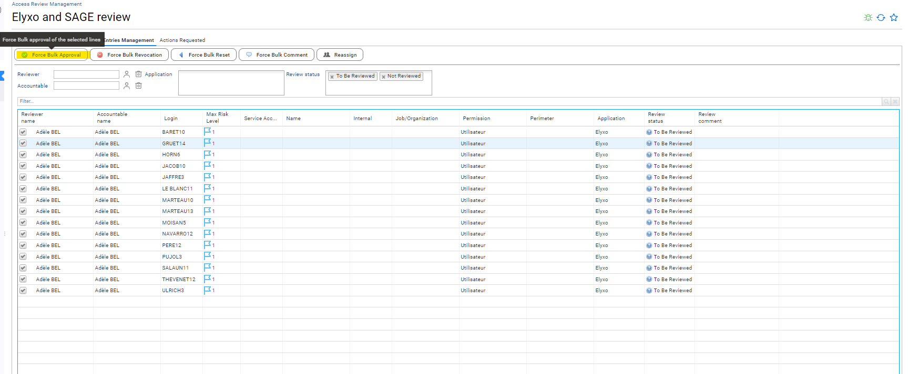  

As you can see, once forced as *approved*, those entries have been marked as reviewed as *Jaime ROBERTSON* (the *review owner*) on behalf of *Miguel MORENO*. It means that when you force a review status as an administrator, RadiantOne Identity Analytics considers that you are acting **on behalf of** the accountable *reviewer*.

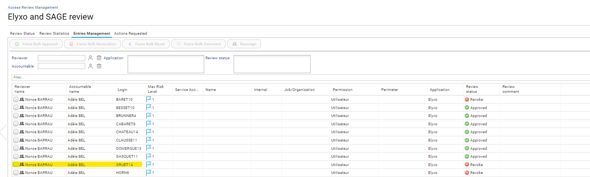  

All entries have now been reviewed, but the "sign off" as not been done by Miguel and Antoinette. As asked by Miguel, I can directly as the *review owner* force the "sign off" so that we can immediately proceed with the remediation phase.  

  

Now that all entries have been signed off, let's go back to the *Access Review Management* page and finalize it:
Select the review campaign and click on *Finalize*.

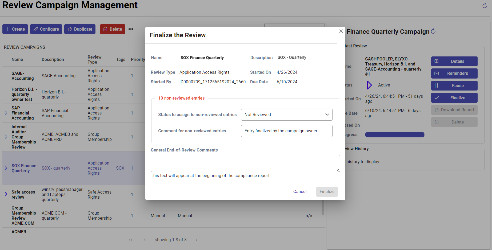

In the example above, some entries still need to be reviewed. This is why a warning message appears and a decision regarding those entries must be taken:

- mark those remaining entries as to be *revoked*
- mark those remaining entries as *ok*
- mark those remaining entries as *not reviewed*

> [!warning]  
>
> SQL server database limitation: when using a SQL Server database (on-premise installation, self-managed k8s and SaaS are not concerned here), you cannot revoke more than 2000 entries at the “Finalize exam” stage. In that case, *not reviewed* has to be selected.

In our case we will mark them as *not reviewed* even though we **know** that it will correspond to a review failure, and add a comment to:

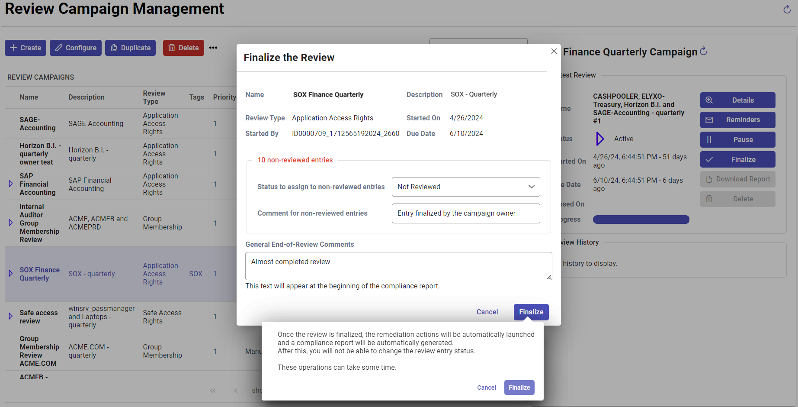

> Once finalized a review cannot be updated anymore wether the automate remediation is activated or not. In any case, the remediation will be automatically launched once the review campaign is finalized. This background operation can take some time.

The review is now finalized, a compliance report is automatically generated and can be downloaded through the *Access Review Management* interface. To do so, click on your campaign in the list and then on the right side click on the download button. If you have several review instances, you can also download directly in the review history section the related compliance report by clicking on the icon framed in red in the screenshot below:  

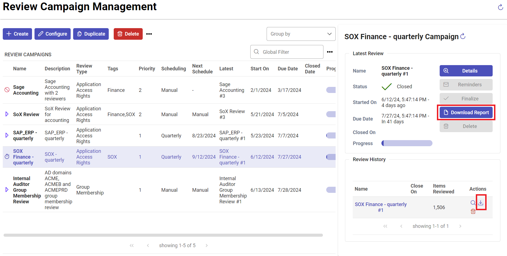

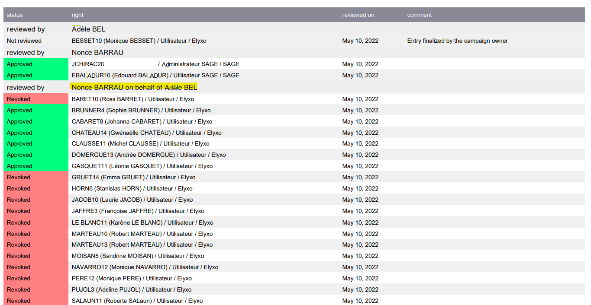

You can also browse the review campaign follow-up dashboard by clicking on the **Details** button to access the KPIs:

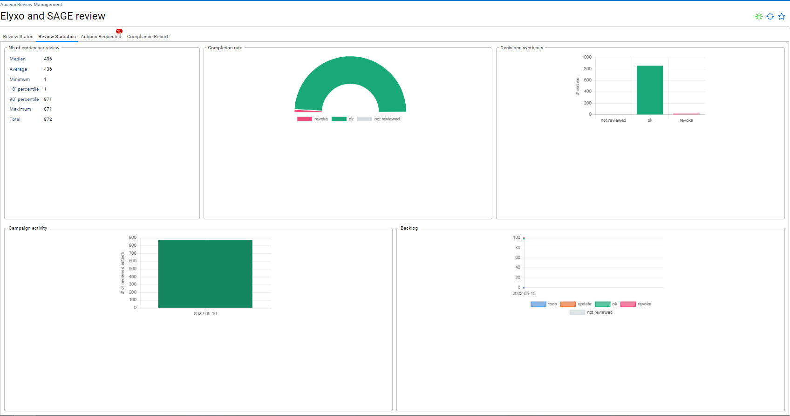

> *Review status* and *Actions Requested* link to *accounts* and *permissions* objects in the Identity Ledger, therefore if data is refreshed and those objects disappear they won't be listed anymore. As a result consider the compliance report as the **only** source of trust to prove that your review perimeter has been done.  

You can also reach the "Compliance Report" tab to view, filter and browse through the reviewed entries and download on the upper right the PDF report. You can display the results in te table grouped by reviewer by checking the related option:

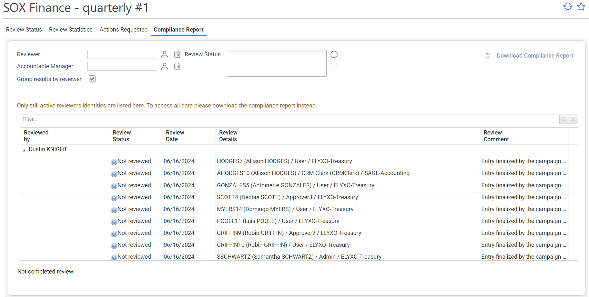

You need to uncheck the option "Groups result by reviewer" to export the data in an excel spreadsheet:

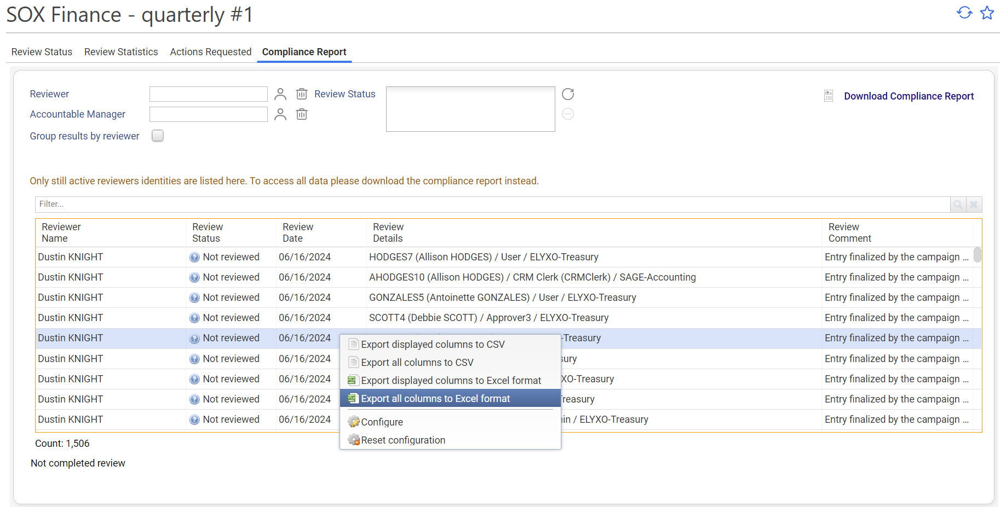  

## Step 11 - Following up the remediation

Once your review campaign is finalized, or once a *reviewer* has signed off his review if you activated the immediate remediation, requested remediations are automatically triggered.

You can follow up the remediation progress through the menu entry *Remediation management*.  

> To automate the change from "signed off" to "pending remediation", the variable `ias_reviewautomateproceedsignedentries` and `ias_reviewproceedsignedentriesdelay` have to be set to in the configuration of the project. When `ias_reviewautomateproceedsignedentries` is set to `true` and `ias_reviewproceedsignedentriesdelay` is set to a number of days, the entries will automatically go from a "Signed-off" state to a "Proceed: Remediation Pending" state after the number of days indicated. The remediation will then have to be launched and managed through the "Remediation Management" page. To allow this automation, the related workflow (`bwaccess360_automateProceedSignofAccessRights`) needs to be launch using a batch.  

By default, it gives you a consolidated overview of *all* the remediation, whatever the review campaigns.

Each remediation is associated with the corresponding **application technical owners**.
While remediation are in progress, application technical owners will see those remediation in their interface.

A remediation is following a simple ITSM change management process. Each remediation has its own current status and open/close state.

> When the resource on which a remediation is launched is no longer available in the current timeslot (the data relating to the resource has not been loaded), the entries will remain in "pending" status. In this case, the remediation administrator must force the status to "won't fix".  

In our use case, once the *remediation management* displayed, the administrator can follow up the remediation
We can notice that some action have already been made

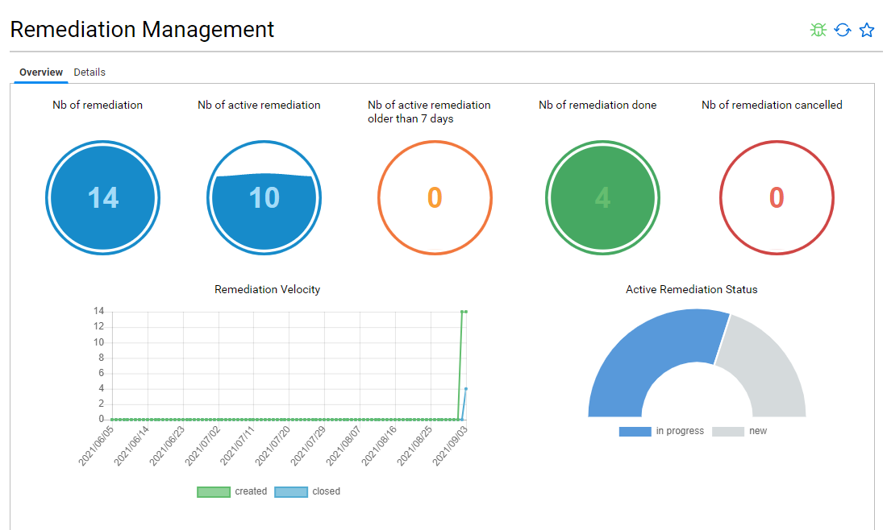

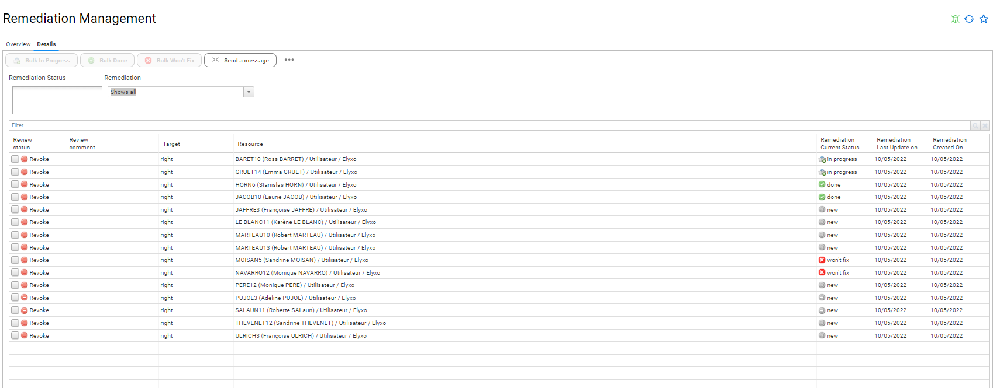

We can filter the remediation UI for our review campaign thanks to the *Advanced Filters* feature in the *Details* toolbar as for now we only want to follow up remediation progress related to our review campaign

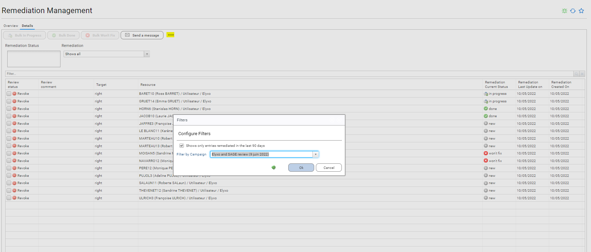

We click on *Send a message* in order to send a mail to **all** the application technical owners with pending remediation

## Step 12 - Revoke entries as an application technical owner

As a technical SAP application owner, Kimberly receives an email.
She connects to the Identity Analytics platform to access the pending remediation list.

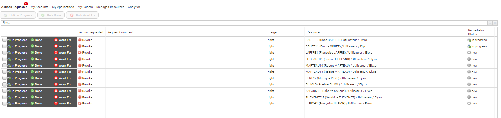

She revokes all the access in SAP except the one for `MARTEAU13` as this one is still needed

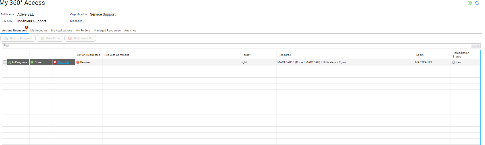

## Step 13 - Double-check that all remediation have **really** been done

Once remediation are marked as done in the Identity Analytics platform, the RadiantOne Identity Analytics administrator refresh the data by extracting and loading fresh data from the target systems (HR, SAGE and Elyxo)

The Identity Analytics administrator can double-check in *Remediation Management* if everything is ok.
In our case, although Kimberly has marked the remediation as been done, nothing has been done in SAP: The access rights are still active

This is automatically highlighted in the *Remediation Management*: A new section *discrepancies* appears and list all those problems

The Identity Analytics  administrator now have to investigate with the application owner why we ended up with this situation
