# Key Concepts

This chapter presents the key concepts of access certification.

## Access Review Process

As seen in the previous chapter, access certification is a straight forward process involving 4 actors:

- Identity Analytics administrator
- Campaign owner
- Reviewer
- Resource technical owner

In order to configure and launch a review campaign as an Identity Analytics administrator, you must either be a **functional administrator** or a **technical administrator** of the RadiantOne Identity Analytics platform. You need to have a valid email address attached to your identity in Identity Analytics. When configuring a campaign, you can define yourself or another identity as *campaign owner*.

The *campaign owner* is responsible for configuring, launching and animating an access certification campaign. He also needs to have a valid email address attached to his identity in Identity Analytics.

The reviewer is either a **direct line manager**, a resource owner set as **reviewer**, a resource owner set as **business owner** or **the user himself**.  

For example, when the "User Accounts by Line Manager and Technical Accounts by Application/Repository/Group/Safe Owner" review strategy is chosen, the following rules apply:  
Each "user account" or "access right" will be reviewed by the account owner direct line manager.
All the other entries (technical accounts, orphaned accounts, ...) will be reviewed by the resource owner. Depending on the review type, it could be an application, a repository, a group or a safe owner.
In Identity Analytics, this owner can be either defined as a **reviewer**, or **business owner** or **technical owner** of the resource he owns. This can be updated in the resource detail pages from the web portal or in the collect.

The resource *technical owner* is involved in the remediation phase in order to apply the requested changes once the access review is finalized, where "resource" can be an application, a repository or a safe.

This can be summarized as:

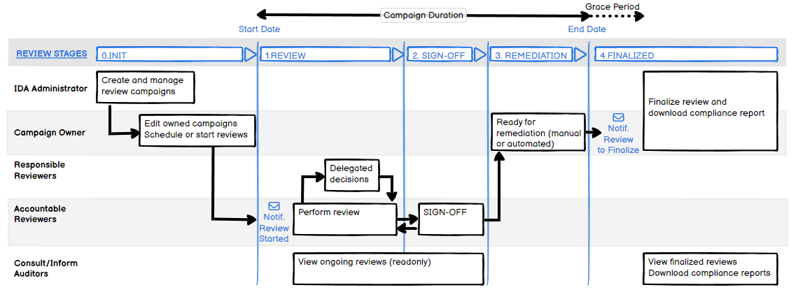  

Once a review campaign is configured, it is immediately launched.  
The review campaign will remain active until it is finalized by the *review owner*. A review campaign due date is part of the review campaign configuration and is displayed in the management interface.  

Several review campaigns can be launched at once. From a end user perspective, all entries to be reviewed are displayed in the same interface per review campaign. The end user can still filter the entries per priority level or due date to better manage his review operations.  

When a reviewer has reviewed all entries, he **has to** "sign off" his review so that remediation can directly be launched automatically or manually by the *review owner* even if the full review campaign has not been finalized.  

The review campaign **must** be finalized by the *review owner* thanks to the *Management Interface*. When a review campaign is finalized, all entries are marked with a review status:  

- ok
- revoke
- not reviewed

Once finalized, a compliance report is generated and all revoked entries are marked as to be remediated.  
The remediation is active immediately after a reviewer has "signed off" his review for his entries or for all entries of the review campaign when it is finalized by the *review owner*.  

Remediation can be both embedded or delegated to a third party ITSM such as ServiceNow.
Embedded remediation follows a simple ITSM change management process:

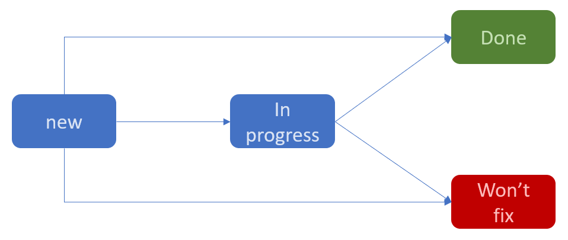

Each entry will be tracked individually. The *application technical owner* is responsible for the remediation. Entries to remediate are displayed in his user interface.

Once an entry has been marked as *successfully remediated*, it will automatically be part of the control plan:
When a new timeslot will be loaded, those remediation will be checked against the entitlement catalog in order to detect any discrepancy:
An access right still presents although it has been marked as *successfully remediated*. The list is available through the *Remediation Management* interface.

## Campaign configuration

**Compliance** is at stake here. As a result, review campaign configuration is all about defining a perimeter of what **needs** to be reviewed.  
In order to do so, review campaign configuration starts with identifying the applications which will be part of the access review.  

You can further refine the review perimeter by specifying that only some accounts/permissions will be part of the review.  
The best practice is to *tag* those accounts/permissions and to specify those tags in the review campaign configuration interface.  

Remember that the reviewer is either a **direct line manager** a **resource owner** or the **user himself**.  
Each "user account" will be reviewed by the account owner direct line manager.  
All the other accounts (technical accounts, orphan accounts, ...) will be reviewed by the resource owner.  

This is computed during the review campaign configuration.  
In order for a review campaign to be valid, **all** entries must have a reviewer assigned to them. If it is not the case, an error message is displayed in the *Preview data* panel which prevents you from launching the review campaign.  

You can refine the reviewers by browsing and updating the entitlement catalog management information.  
A line manager is configured through the *identity detail* page.  

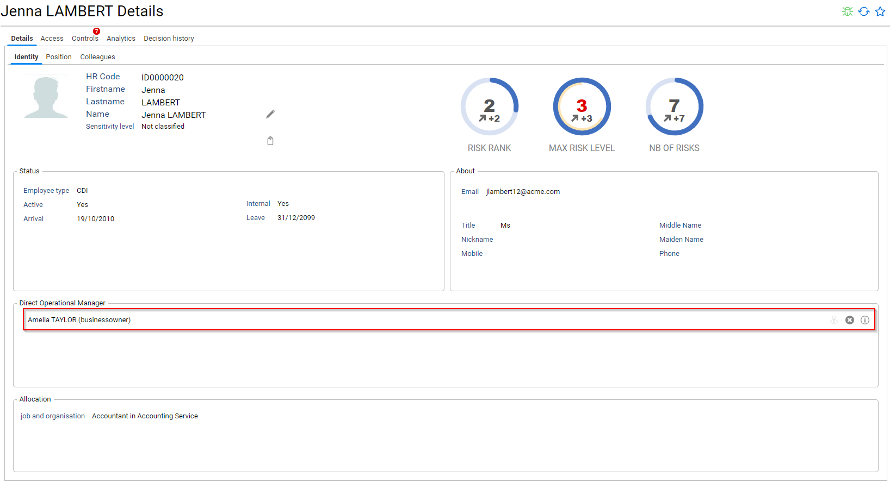  

An *application business owner* or *application reviewer owner* is configured through the *application detail* page.  

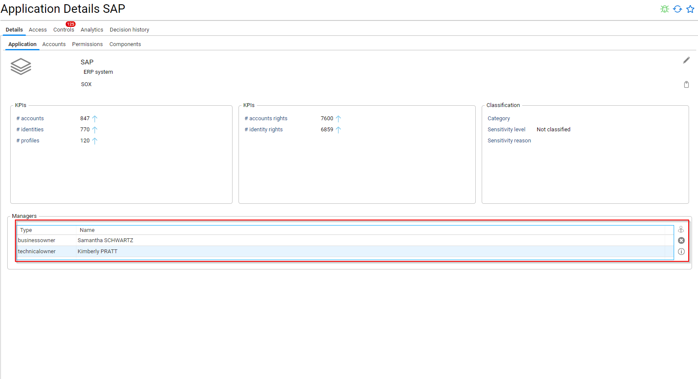  

You can also configure a *default reviewer* in the review campaign configuration page.  

Keep in mind that a manager is considered valid only if:  

- He is still *active* (departure date < current date)
- He has a *valid* email address

RadiantOne Identity Analytics is enforcing the **RACI principles**, as a result each reviewer identified during the configuration phase is considered **accountable** for reviewing its entries.  

There is **only one accountable reviewer per entry**. If several application owners are configured, Identity Analytics will pick the most important one (most probably the one who is not marked as a delegated manager) starting first with the *application reviewer owner*, then the *application business owner*. If several managers have the same priority ranking, RadiantOne Identity Analytics will pick one amongst the list.  

Regarding direct line managers, as a best practice you **should not have** several direct line managers assigned to an identity. If it is the case, RadiantOne Identity Analytics will pick one amongst the list.  

As you will see in the next chapters, the **accountable reviewer** can still reassign entries to his peers, they will then be considered as **responsible** for reviewing their entries *on behalf of* the accountable reviewer.  

Once the configuration is done, you can launch the review. It will be launched automatically, it means that the entries to be reviewed will appear in the reviewers home page.  

> Once the review campaign is launched, the reviewers are definitely assigned to their entries, it means that if you refresh your data afterwards and some management information change, it won't have any effect on the reviewers, they will still have to review their assigned entries.  

## End User Functionalities  

Entries to review are accessible through the end user interface.  
As long as entries still need to be reviewed, *Entries to review* are displayed in the **first** panel "Access 360".  

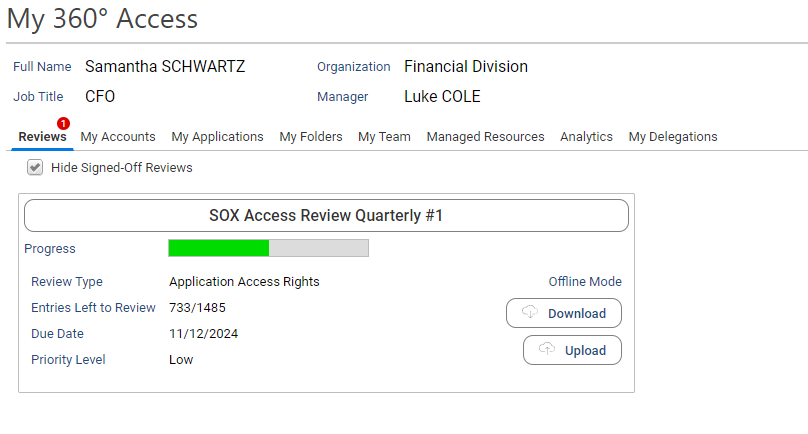  

You can either review entries one by one or through bulk operations by selecting several entries and clicking on *bulk approval*, *bulk revocation* in the contextual menu.  
You can reorder the table, and filter the entries either by selecting a given account/identity/permission/application or with the free text filter.  

A contextual menu accessible with a right click on the table helps you to:  

- export the table content in CSV/Excel format
- reorder columns
- add/remove columns
- select/unselect the displayed entries at once

> Table configuration is *persistent*, it means that if you reorder/add/remove columns this will be *saved* in your personal settings. If you want to roll back to the default configuration you need to *Reset configuration* through the Table contextual menu.  

By default, **all** entries which still needs to be reviewed are displayed in the table.  

You can change your mind until you sign off your review or until the review campaign is finalized by the review owner even if you already have reviewed all your entries.  

In order to do so, you have to chose *Display all reviewed entries* as soon as you have reviewed everything.

You can reassign entries to your peers through the contextual menu. In order to do so, you have to select the entries you want to reassign and pick *Ask for help to*. The "ask for help to" button is active if in the review campaign configuration you have selected the option `Enable "Ask for help" action` at step 4 *Reviewer UI*.  

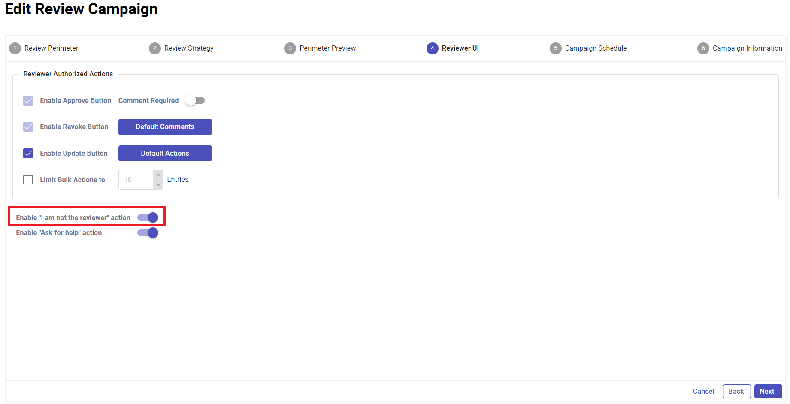  

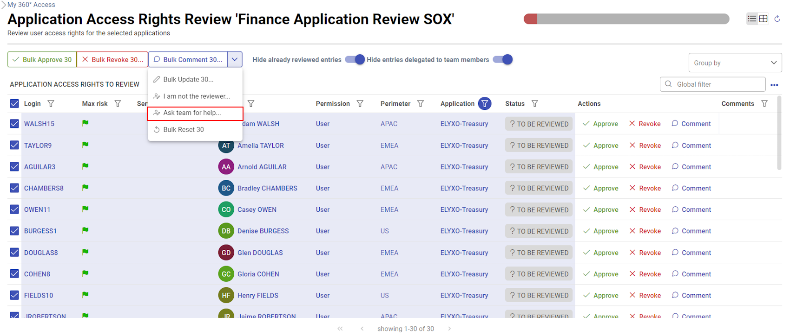  

Please consult the [Reassigning entries](#reassigning-entries) chapter for more information about reassigning entries.  

Finally, you can declare that you are not the reviewer for some entries. In order to do so, you have to select the entries you want to reassign and pick *I am not the reviewer*.  
Those entries will be removed from your list, the *review owner* will be able to identify those entries through the management interface (as their review status will be "to reassign") and reassign them as needed to another person.  

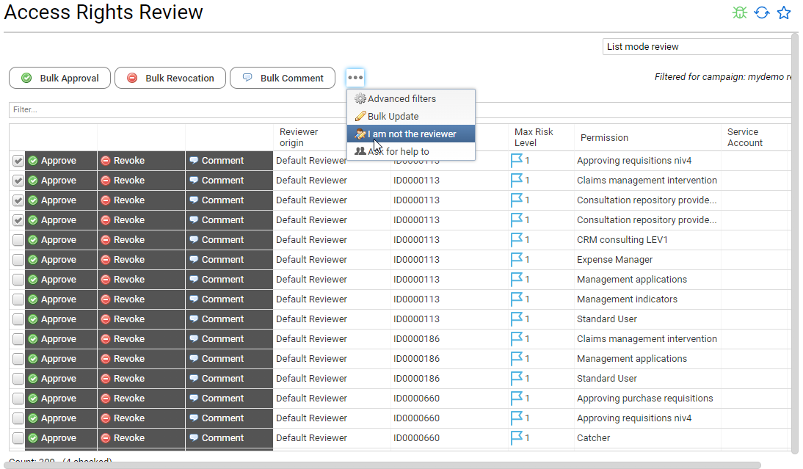  

## Management Interface functionalities  

The management interface helps you to manage review campaigns and to browse through ongoing or finalized review instances.  

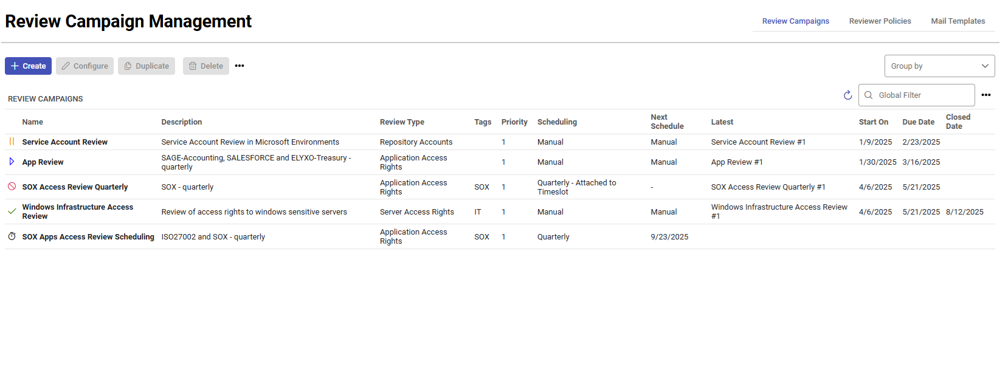  

The following actions at the top of the page are allowed on the selected review campaign in the table:  

- Edit the configuration by clicking on **Configure**,
- **Duplicate** the configuration of your campaign,
- **Delete** it with all its review instances history. Not that this can be done only if there is not an ongoing review instance for the selected campaign.

Additional buttons are available by clicking on the three bullets to:  

- **Create** new campaigns,
- **Export Configuration** of one or a selection of campaigns,
- **Import Configuration** of one or a selection of campaigns.

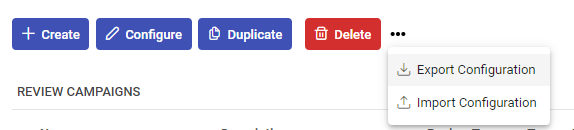  

On the right side of the screen, you'll find all the information regarding the review instances that are pending, in progress or have already been completed. The left section includes two parts, "Latest Review" listing the on-going/active review instance, and "Review History" listing the completed reviews.

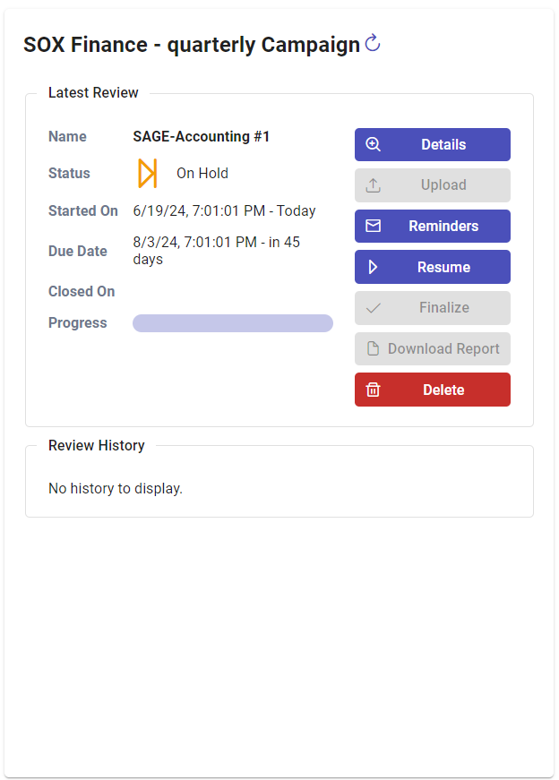  

The following actions are allowed on an ongoing review instance:  

- Open the follow-up dashboard to view statistics and manage the review entries, button *Details*,
- Manage reminders to remove/create new recall dates, button *Reminders*,
- Pause / resume a review campaign, button *Pause* or *resume* when the review instance is already in pause,
- Import review status from an excel spreadsheet, button *Upload*,
- Finalize the review campaign, button *Finalize*.

The following actions are allowed once a review campaign is finalized:  

- Download the compliance report, button *Download Report*,
- Delete the review campaign, button *Delete*, also available when the review instance is in pause.

> Deleting a review instance will remove **all** information associated with this review instance, including review information and remediation information. This cannot be undone. You should use this with caution. However the compliance report will still be available in the database and can be downloaded by the administrator.

### Campaign detail page  

The review campaign detail page, or follow-up dashboard, gives you a real-time view of your review campaign progress.  
Through this page you can access to a series of KPIs  

- review perimeter
- Nb of applications to review
- Nb of reviewers
- Reviewed entries so far
- Entries left to be reviewed
- Nb of actions requested so far
- Statistics around the nb of entries to review per reviewer (percentile, min, max, ...)
- Completion Rate
- Decision Summary
- Review Campaign Activity
- Backlog
- ...

#### Review Status

In the first "Review Status" tab, *Reviewers* that have already signed off their user access review are shown in the left-hand table. In the table on the right, reviewers who have not yet started reviewing entries, or who are in the process of reviewing them, or who have reviewed all entries but have not yet signed off their review, are displayed.  

When you click on the KPI or reviewer name in the tables on this tab, you go directly to the "Entries to review" tab, with the filter applied according to the KPI/reviewer name you initially clicked on.

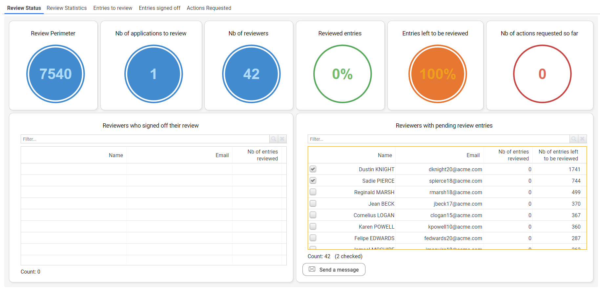  

Note that from the right table, you can send reminders to a selection of reviewers if needed. This is particularly helpful when you have reassignment (accountable or responsible) that have been done recently and when the next reminders won't be coming soon.  

When doing so, the reminder email template you configured within your campaign is proposed here, with the ability to change/update the text:

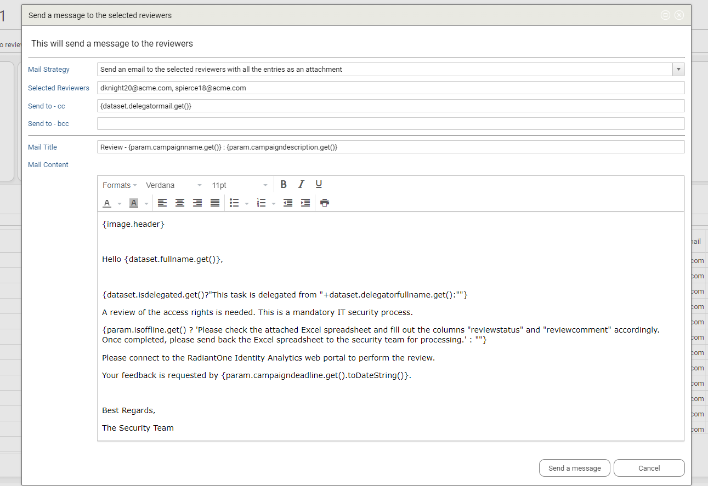  

When offline mode has been activated in the campaign configuration, you can choose also between three different strategies:  

- Send a message to the selected *reviewers* with all the entries as an attachment
- Send a message to the selected *reviewers* with the remaining entries to review as an attachment
- Send an email to the selected *reviewers* without attachment

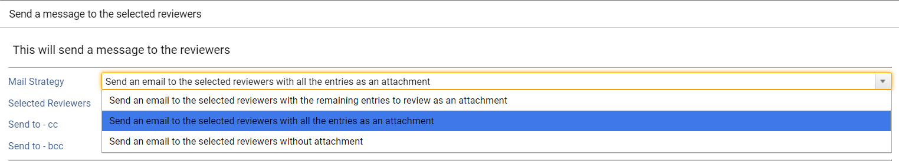  

The first two choices can be useful if you want to send the review content along with the email for instance when you want to enable "offline" reviews by some *reviewers* (reviewing through an excel spreadsheet instead of reviewing in the UI).
The last one is more "traditional" as they do not include any attachment.  

If the offline mode is disabled in your campaign configuration, you cannot add attachment to your notifications.

Depending on your review strategy and your review phase (initial notification,gentle reminder), you have to select the right Email Strategy in the combo box.  

The emails look like:  

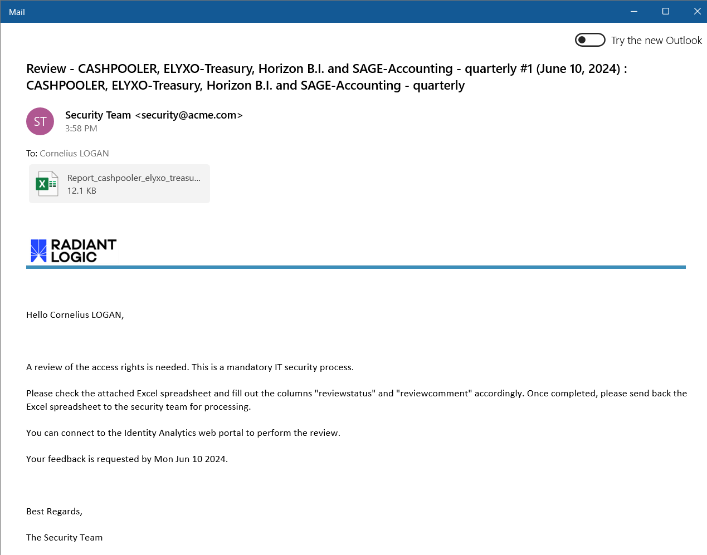  

#### Review Statistics and entries management

You can also browse through the review statistics to check the current review status in the second tab "Review Statistics".  

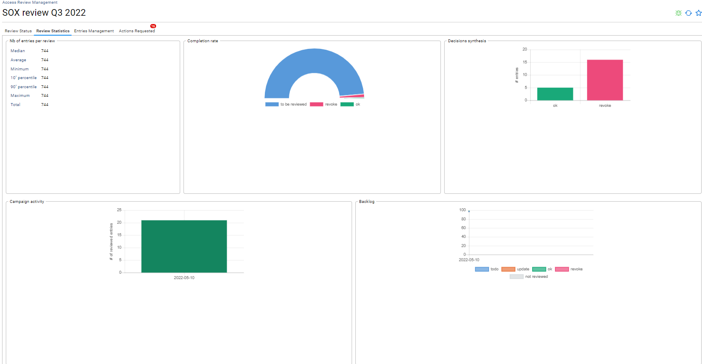  

You can access to a real time view of the entries being reviewed in the tab *Entries to review* with filtering/grouping/export capabilities and identity/permission context as well as a real time view of the actions identified so far with filtering/grouping/export capabilities and identity/permission context.  

As a *review owner*, as long as the review campaign is not finalized, you can perform bulk review operations, reset current review status (status, comment and reassignment) and reassign review entries.  

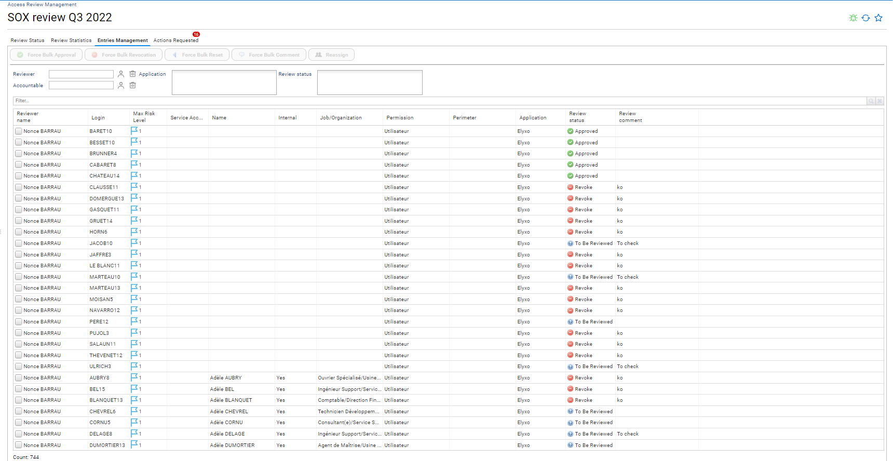  

> **Notes:**  
>
> 1. Due to performance constraints, you cannot perform bulk operations if you have more than 10.000 entries displayed in the list. If this is the case, consider using search bar to reduce the number of items displayed in the table.  
> 2. Due to a technical constraint, you cannot reset review status on more than than 2.000 entries at once.  

Once the entries have been signed off by the *reviewer* or once the sign off have been forced by the *review owner*, the related entries are displayed in the tab "Entries sign off".  

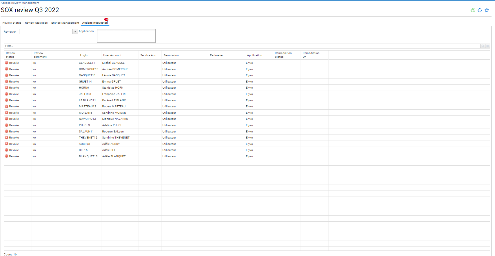  

Those entries are considered ready for remediation even if the review campaign has not been finalized by the *review owner*.  
When entries are in that particular state, it means that the *reviewer* cannot change his decision anymore. These entries are ready to be remediated. The remediation can be launched automatically based on the script that is executed daily and manually by the *review owner*.  

By selecting entries and clicking on "Proceed Now", the "signed off" entries will be immediately set in "pending remediation" state.  
By selecting entries and clicking on "Force Bulk Reset", the entries will once again be available to the *reviewer* so that he can change his decisions.  

> **Notes:**  
> 1. The "proceed now" option is also hidden by default. To make it available, it requires to set the `ias_reviewcanproceedsignedentries` variable to `true`.  
> 2. To automate the change from "signed off" to "pending remediation", the variable `ias_reviewautomateproceedsignedentries` and `ias_reviewproceedsignedentriesdelay` have to be set to in the configuration of the project. When `ias_reviewautomateproceedsignedentries` is set to `true` and `ias_reviewproceedsignedentriesdelay` is set to a number of days, the entries will automatically go from a "Signed-off" state to a "Proceed: Remediation Pending" state after the number of days indicated. The remediation will then have to be launched and managed through the "Remediation Management" page. To allow this automation, the related workflow (`bwaccess360_automateProceedSignofAccessRights`) needs to be launch using a batch.  

The last tab *Actions Requested* gives you a view of the remediation decision taken so far, keep in mind that a *reviewer* can still change is mind until he sign off his review or until the review campaign is finalized by the *review owner*. As a result, those decisions are temporary and are not considered as actionable remediations until the *sign off*.

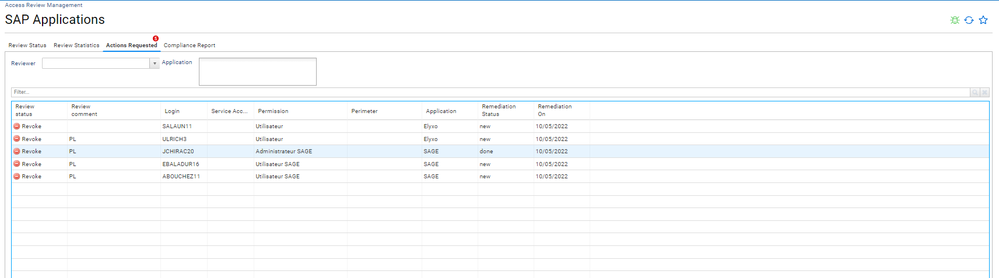

## Remediation Interface functionalities

The remediation interface helps you to manage remediation decisions taken during the review process.  

This interface presents a unified view of **all** remediations. Through this page you can access to a series of KPIs

- Total nb of remediation
- Nb of pending remediation (ready to start)
- Nb of active remediation
- Nb of active remediation > 7 days
- Nb of remediation done
- Nb of remediation cancelled
- Remediation velocity
- Active remediation status
- ...

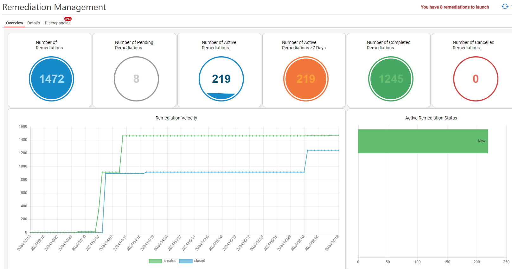

You can also access a real time view of the entries being remediated with filtering/grouping/export capabilities and identity/permission context.

As an administrator, you can perform bulk operations on the remediations. You can also send notification to the **application technical owners**

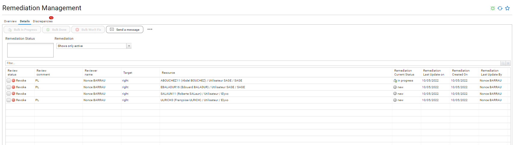

Finally, if discrepancies are found, they are displayed in a dedicated tab.

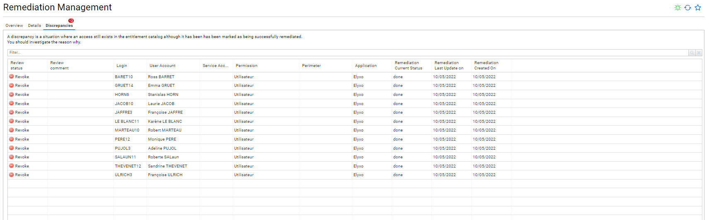

> A discrepancy corresponds to a case where an entry has been marked as to be revoked, has been successfully remediated (remediation finalized with a closed status "Done") and yet is detected as still active upon data refresh.

### Configuring the remediation strategy

You can select for each individual application and each individual repository the remediation strategy that you want to apply.  

To do so, access the *Remediation Strategy Management* page under *Settings/system*.

In this page, you can:  

- Declare third party ITSMs for remediation
- Declare third party RPA for remediation
- Assign a remediation strategy for each individual repository
- Assign a remediation strategy for each individual application

#### Declaring a new third party ITSM or RPA

The last tab helps you declare a third party ITSM for remediations. For the moment only ServiceNow and Jira Cloud are supported off-the-shelf.

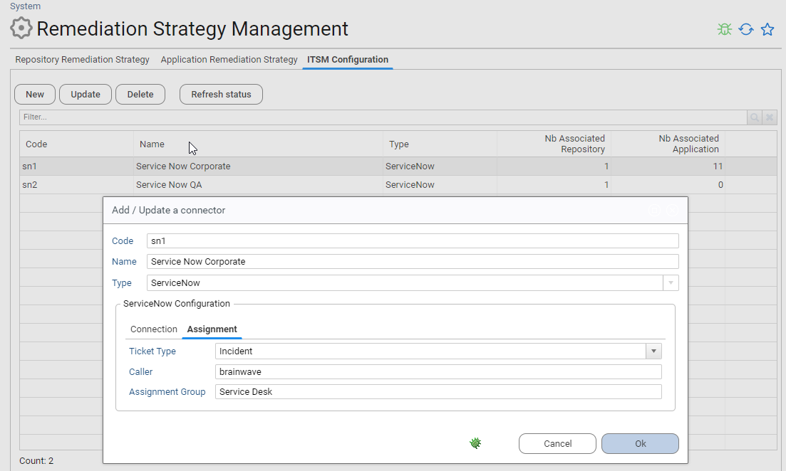

In order to add a new third party ITSM, you **MUST** provide:  

- the URL endpoint
- the account login used to connect to the ITSM
- the account password used to connect to ITSM
You also **SHOULD** provide additional information related to the ITSM such as
- The caller name (ServiceNow user id)
- The assignment group (for ServiceNow)

Please note that both the caller and the assignment group will be resolved when creating a ticket, by searching them in the ServiceNow database. Therefore, you **must** avoid any typo here.

Note that you can declare the same endpoint several time. This can be useful if you want for instance assign remediation actions to different *assignment groups* depending on the target system (repository or application)

Declaring a new RPA is done by selecting "Mail notification" in the list.
An email will be sent for **each** individual remediation. The purpose of this email is to be analyzed by a robot (either an ITSM or a RPA to automate actions upon reception).

#### Assigning a remediation strategy to a repository or an application

You can assign a remediation strategy for each individual repository and application:

- Repository remediation strategies will be used for accounts related reviews
- Application remediation strategies will be used for access rights related reviews  

By default, if no remediation strategy is assigned, an *embedded* remediation strategy will be used.

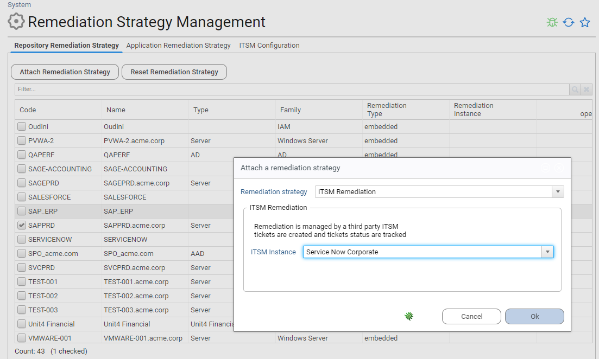

> [!warning]  
>
> - You cannot change a remediation strategy if you have pending remediation actions.
> - You cannot remove an ITSM definition if it is associated with a repository or an application

### Launching pending remediation

Once a review is finalized, or entries have been signed off and proceeded, remediations are automatically created based on the target systems review strategies.  

These remediations are assigned special state called *pending* (corresponding to an *init* status). These remediations are visible in the remediation interface but are not launched yet. This gives you a final chance to review what changes will be done in the target system.  

> To automate the change from "signed off" to "pending remediation", the variable `ias_reviewautomateproceedsignedentries` and `ias_reviewproceedsignedentriesdelay` have to be set to in the configuration of the project. When `ias_reviewautomateproceedsignedentries` is set to `true` and `ias_reviewproceedsignedentriesdelay` is set to a number of days, the entries will automatically go from a "Signed-off" state to a "Proceed: Remediation Pending" state after the number of days indicated. The remediation will then have to be launched and managed through the "Remediation Management" page. To allow this automation, the related workflow (`bwaccess360_automateProceedSignofAccessRights`) needs to be launch using a batch.  

This is the case for **any kind** of remediation, regardless of the remediation strategy.  

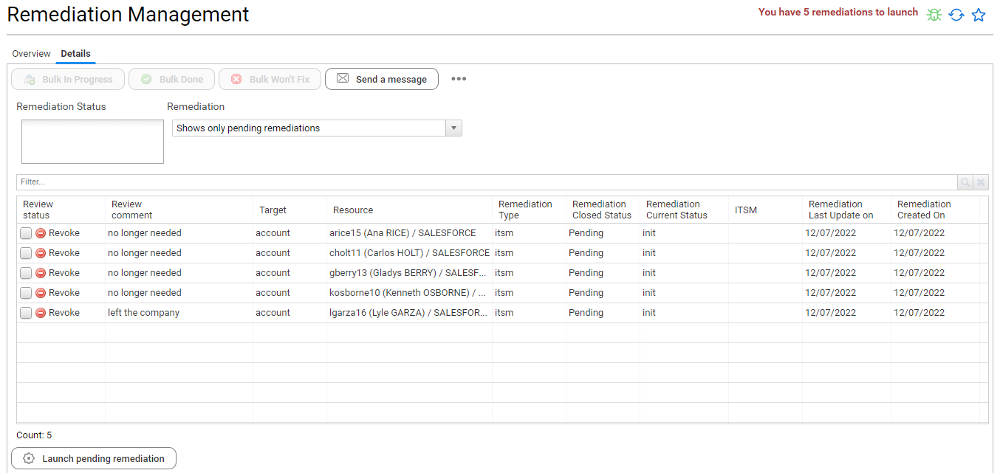  

You can manually mark those remediations if needed (done / won't fix).  

Once you are satisfied with the list of remediation actions to be performed, you can launch them immediately using the *Run Pending Remediation* button. This will populate the *action requested tab* for technical owners for embedded remediation scenario and will automatically create ITSM tickets for ITSM scenario.

Note that for ITSM scenario, RadiantOne Identity Analytics adopts a consolidation strategy: the product will consolidate all requested changes for each target system and will create a single ticket per target system. This allows to avoid situations where after the execution of an access review campaign thousand of tickets are automatically created in the ITSM.  

All requested changes are presented as an attachment to the ticket.  

RadiantOne Identity Analytics will retrieve the ITSM ticket number as well as its current status.  

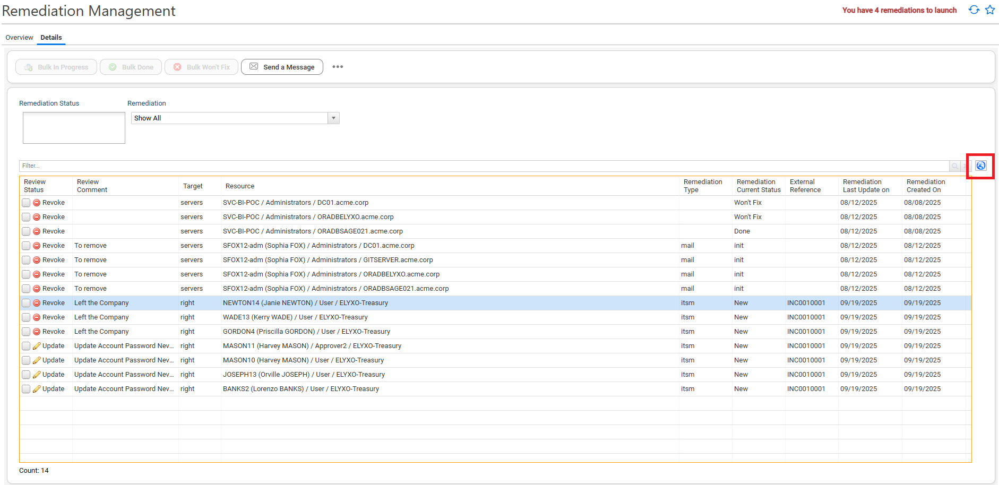  

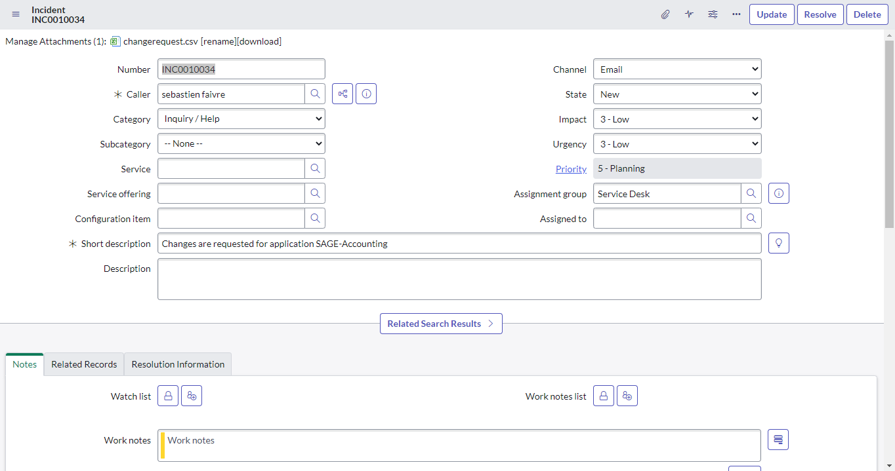  

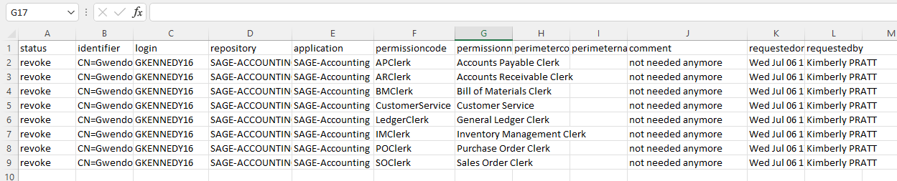  

### Refreshing ITSM tickets status  

You can manually refresh the status of all active ITSM tickets through the menu.  

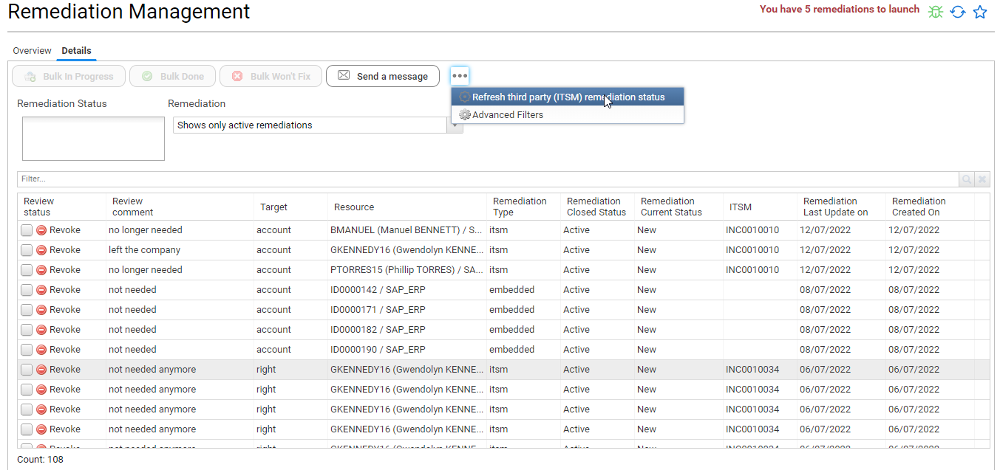  

Note that even though a remediation is managed through an ITSM, you can still manually force its status with the "Bulk in progress", "Bulk done" and "Bulk won't fix" buttons.  

As "Bulk done" and "Bulk won't fix" will move the selected remediations to a finalized state. RadiantOne Identity Analytics will no longer query ServiceNow to update the ticket status.  

This is not the case for "Bulk in progress". You should mark an ITSM ticket as "In Progress" only if you want retrieve the latest ITSM status and that this remediation was previously marked as "finalized".  

## Users notification

In addition to the scheduled reminders and notifications configured in campaigns, the administrator or campaign owner can send emails to the stakeholders both from the *Access Review Management* interface and the *Remediation Management* interface.  

### Access Review Notification

#### Automated Notification

Access review notification are sent automatically based on your campaign configuration. As far as reviewers are concerned, two types of notifications can be automated: initial notifications at the start of the campaign, and reminders based on a predefined schedule configured in the campaign settings.

For each sort of notification, the email template can be modified in the campaign configuration. You can personalize both the email title and email content of those two templates.  
Some dynamic variables are available for your convenience:  

- reviewer fullname as a String: `{dataset.fullname.get()}`
- reviewer email address as a String: `{dataset.mail.get()}`
- reviewer direct line manager fullname as a String: `{dataset.linemanagerfullname.get()}`
- reviewer direct line manager email address as a String: `{dataset.linemanagermail.get()}`
- reviewer delegator fullname as a String: `{dataset.delegatorfullname.get()}`
- reviewer delegator email address as a String: `{dataset.delegatormail.get()}`
- review campaign title as a String: `{param.campaignname.get()}`
- review campaign description as a String: `{param.campaigndescription.get()}`
- review campaign priority as a String: `{param.campaignpriority.get()}`
- review campaign deadline as a Date: `{param.campaigndeadline.get()}`
- attached report name as a String: `{param.reportname.get()}`
- emailcc as a String: `{param.emailcc.get()}`
- emailbcc as a String: `{param.emailbcc.get()}`

Content is rich text (html based).  

#### Ad-hoc Notification

You can also send ad-hoc notifications from the *Access Review Management* interface on a review campaign per review campaign basis.  

You have to select on a campaign with an-going review instance and click on *Details* to reach the "Review Status" page. From there, you can send notification to a selection of reviewers or all the reviewers with pending entries: right click on the table, select all and then click on the button "Send a message".  

Notification are sent to the current *responsible* reviewers (consult [Reassigning entries](#reassigning-entries) to understand the difference between accountable and responsible)  

  

The *Mail strategy* will help you to handle all typical use cases:  

- initial notification when reassignment (new accountable reviewer) or delegation (new responsible reviewer),
- gentle reminder,
- offline review.

Check the [Review Status](#review-status) section for more details about ad-hoc notifications.

### Embedded Remediation Notification  

Remediation notification are sent from the *Remediation Management* interface for all pending remediation regardless of the review campaigns.  

Notification are sent to **all** application **technical owners**, it means that if you have several application owners for a given application they all will receive a notification.  

> **Note** If you filter the *Remediation Management* interface for a given review campaign through *Advanced Filters*, notification will only be sent to *application technical owners* associated with this review campaign for *embedded remediation* only.  

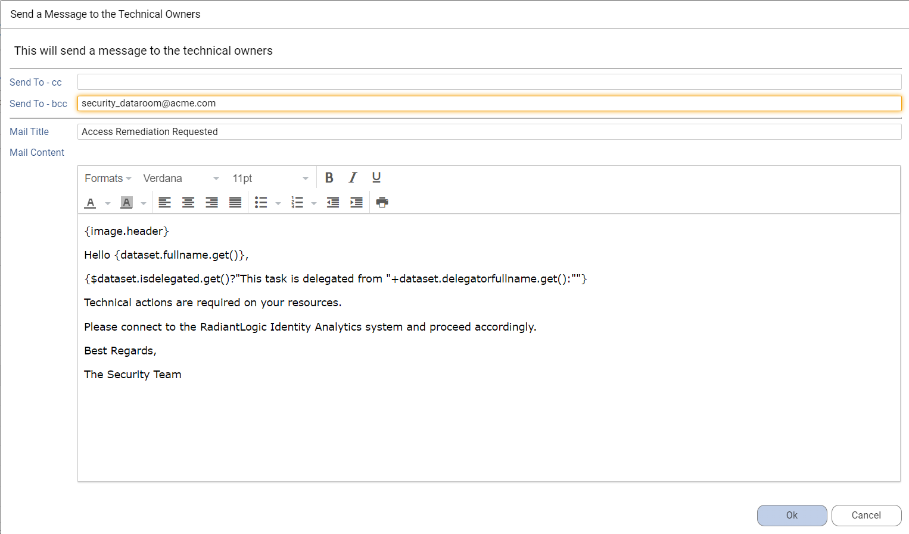

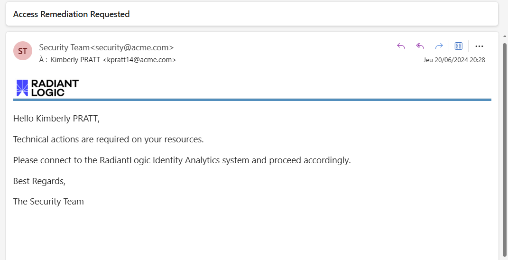

You can personalize both the email title and email content.  

Some dynamic variables are available for your convenience:  

- technical owner employee number as a String: `{dataset.hrcode.get()}`
- technical owner fullname as a String: `{dataset.fullname.get()}`
- technical owner email address as a String: `{dataset.mail.get()}`
- technical owner direct line manager employee number as a String: `{dataset.linemanagerhrcode.get()}`
- technical owner direct line manager fullname as a String: `{dataset.linemanagerfullname.get()}`
- technical owner direct line manager email address as a String: `{dataset.linemanagermail.get()}`
- review campaign title as a String if filtering is enabled: `{param.campaignname.get()}`
- review campaign description as a String if filtering is enabled: `{param.campaigndescription.get()}`
- review campaign priority as a String if filtering is enabled: `{param.campaignpriority.get()}`
- review campaign deadline as a Date if filtering is enabled: `{param.campaigndeadline.get()}`
- emailcc as a String: `{param.emailcc.get()}`
- emailbcc as a String: `{param.emailbcc.get()}`
- Nb of pending remediations as a Number: `{param.nb.get()}`

Content is rich text (html based).  

## AI Options

### AIDA (SaaS only)  

When using our SaaS offer with AI enabled, you can activate the Artificial Intelligence Data Assistant AIDA for each campaign. AIDA will assist the reviewers when performing the review if he asks for it.  

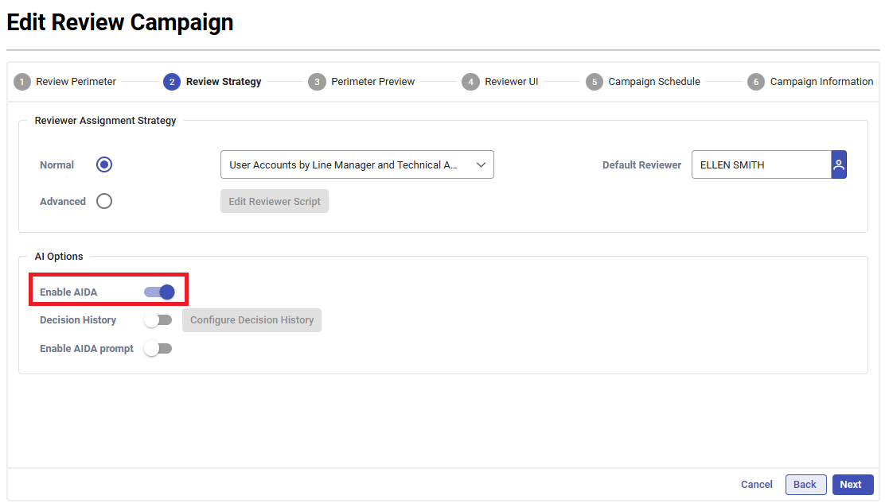

Note that AIDA is currently only available for Application Access Rights type of reviews. Availability will be extended to other types of reviews and other RadiantOne solutions and features in the future.  

AIDA with User Access Reviews follows these four main principles:

1. AIDA guides the reviewer, step by step, through the review process. It is helps the reviewer identify where to start, the time saved and helps provide a better understanding of the data.
2. At each stage, AIDA proposes decisions based on the performed analysis. It details the reasoning behind the decision. The reviewer then has the information needed in order to proceed in his decision-making process.
3. Once the reviewer makes his decision, AIDA will carry out the action for him in the system. This method aligns with compliance regulations as it is mandatory that a human being, and not a machine, be the one to fully perform the review.
4. During the review process and in addition to AIDA's suggestions and explanations, the reviewer can delve more deeply by using Large Language Models (LLM) to request further clarification and analysis which helps to explain the context (who can access what, what is the access chain, how to compare accesses, etc.).

The reviewer can activate AIDA by clicking on the icon at the top right of the screen.  

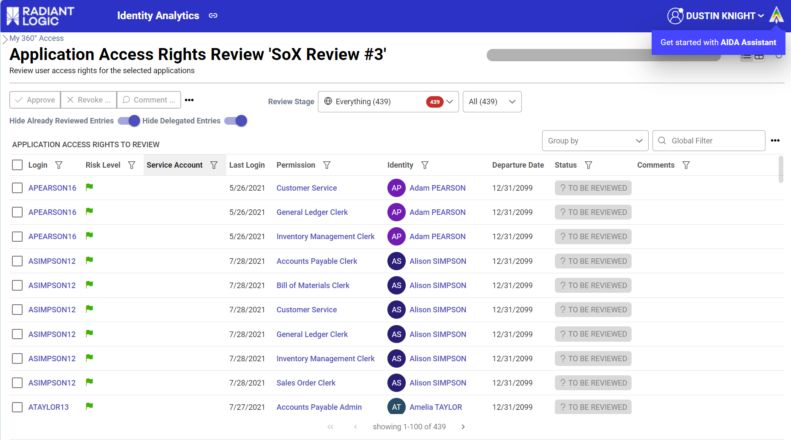

At any time, he can pause AIDA by closing the panel on the right.  

#### AIDA main steps

AIDA will guides the reviewer through four main steps:  

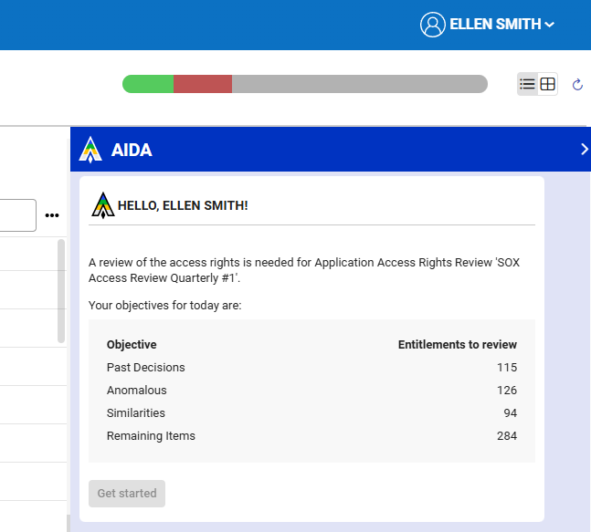  

1. **Past decisions**: in this step, AIDA proposes to review the entries that have already been reviewed in the last 90 days by default. This is linked to the "Decision History" option you configured in the campaign configuration wizard, step "Review Strategy" section "AI Options" (see the next chapter for more details).
2. **Anomalous**: at this stage, AIDA displays the entries with discrepancies in the following order:
    - Leaver Accounts
    - Orphaned Accounts
    - Unused Accounts
3. **Similarities**: this step examines the data in cross-tabular mode and identifies for the reviewer all clusters, i.e. identities with similar accesses, enabling decisions to be made quickly on the basis of similarities. It automatically detects up to 7 clusters and leads the reviewer through each one, from the largest to the smallest, using a dedicated clustering algorythm.
4. **Isolated Items**: this final stage guides the reviewer through the last entries, identity by identity for user accounts and account per account for service/technical.

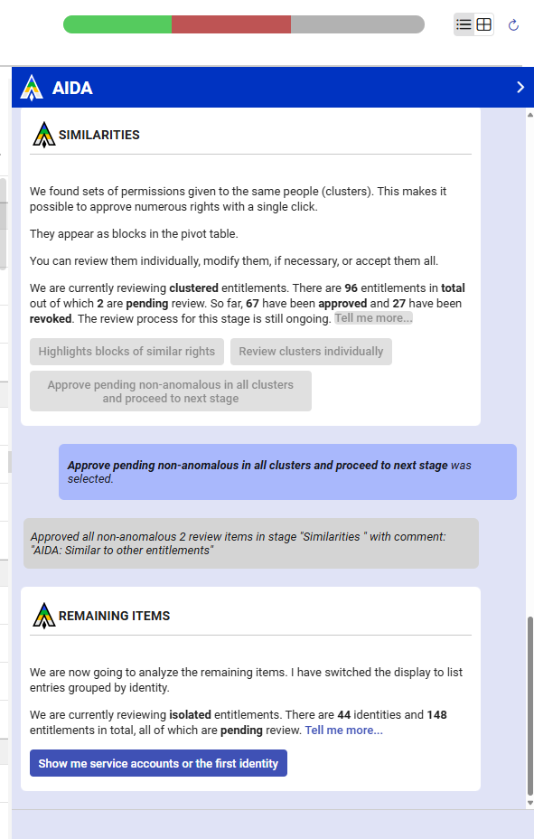  
  
The reviewer can exit AIDA's review mode at any time and reactivate it. In this case, AIDA is paused. The reviewer can also decide directly on certain entries in the interface, without having to leave AIDA.  

#### AIDA feedback  

At any time, the reviewer can provide feedback about the suggestions from AIDA by clicking on the icons on the right of each tile in the AIDA panel.  

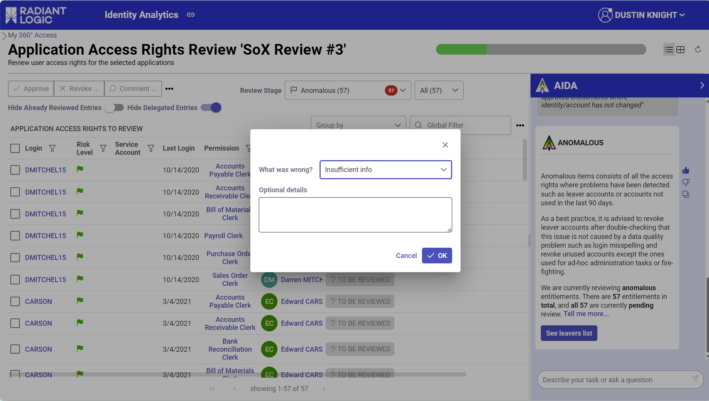  

Note that this information is stored in your Identity Analytics database and will not be used by the LLM agent for reasons of data confidentiality. If you would like RadiantLogic to include these comments to train the LLM agent, please contact us.

### Decision History

Also called "Incremental Review", this option will help you to leverage previous access certification campaigns.
When enabled, previous review status will be used to "prefill" review status and review comment.

This happens **only** when:

- The entry has been reviewed in the configured time frame (*A valid entry is an entry which has been reviewed in the last X days*)
- In case of an user account, account owner characteristics have not changed since the last review:
  - Organisation
  - Job Title
  - Internal status

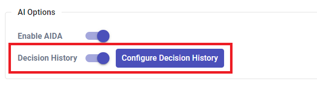

You can also chose to simply remove those entries from the review perimeter if needed (if for instance you only want to review changes that occurred since the last review date, without displaying valid entries).

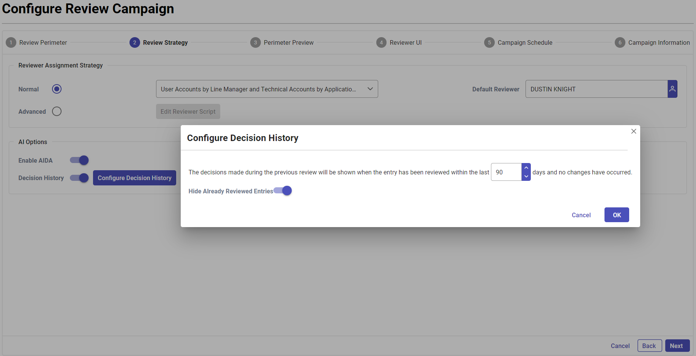

## Offline review

RadiantOne Identity Analytics allows for hybrid review scenario where *reviewers* can both perform online and offline reviews.
Offline reviews are operated through excel spreadsheet sent to the *reviewers* through a notification. The *reviewer* can also directly download the spreadsheet through his own user interface from the "Access360" dashboard.  

The reviewer can fulfill the excel spreadsheet and directly upload it from "Access 360", or send it back to the Identity Analytics administrator. The Identity Analytics administrator then can then import this file in the Identity Analytics platform to fulfill the review status and review comment accordingly.

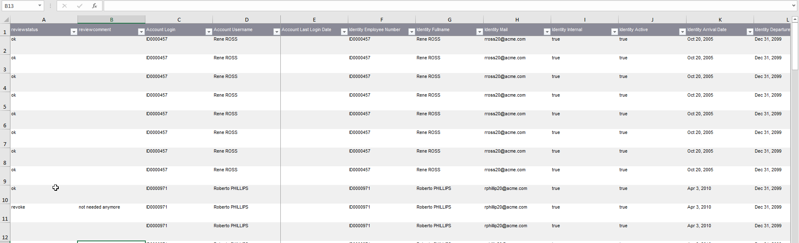  

You can only import excel spreadsheet on *ongoing* review campaigns.  

> **Note** When importing an excel file, **all** reviewed entries will be written, regardless of their current review status in the Identity Analytics platform. It means that if a reviewer has started to review some entries through the user interface and later send an excel spreadsheet, the excel spreadsheet will overwrite the former statuses.  

## Reassigning entries  

Each entry to review has a reviewer. RACI principles, as a result each entry has both a **R**esponsible and an **A**ccountable.  
Only the **R**esponsible reviews the entries. By default, when a review campaign is initialized, both fields contain the same value: The reviewer computed during the initialization phase.  

One can reassign entries to another individual. As RACI principles are enforced, only the **R**esponsible information is updated.  
At the end of the review, it means that you can identify which entries have been reassigned by comparing those two fields. It is visible in the management interface:  

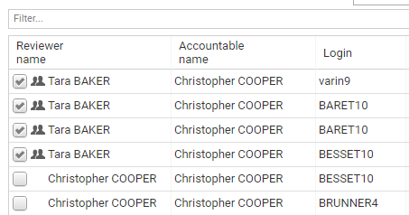  

As you can see here, the first four entries have been reassigned to Tara BAKER, although Christopher COOPER remains accountable for those entries. A small icon is also displayed to highlight the fact that those entries have been reassigned.  

> When you force a review status through the Review Management interface, it will automatically declare you as **R**esponsible for the entries.  

At the end of the review, when the review campaign is finalized the compliance report will highlight the reassignments by indicating who is **R**esponsible and who is **A**ccountable for the entries.

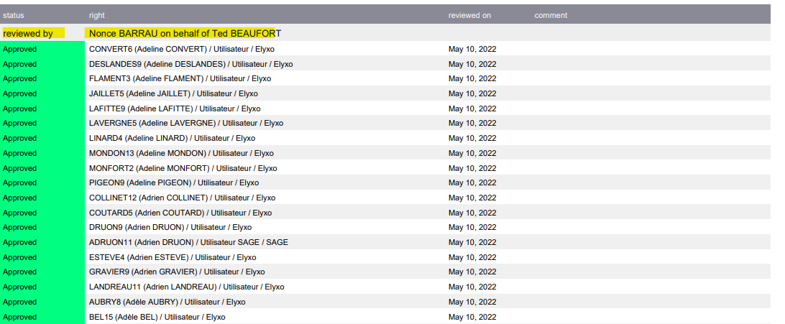

A reviewer can also reassign entries through the review interface. This self-service reassignment is limited as such:

- An entry to review as a line manager can only be reassigned to a team member
- An entry to review as an application owner can only be reassigned to the others *application business owners*
- One cannot review himself
- An entry to review as the *default reviewer* cannot be reassigned
- When you reassign several entries at once, the reassignment rule **must** be consistent (you cannot reassign in a single click entries to review as a line manager and entries to review as an application owner)

In case of doubt, you can display the *Reviewer Origin* column in the review table.

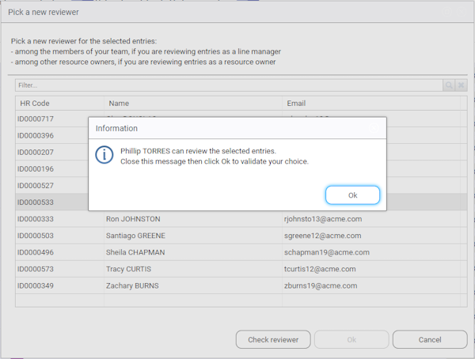

## Compliance report versus Management interface

It is crucial to understand the behavior of the solution when data is updated.  

Let's consider this use case:  

You are launching a review campaign and configure it for 1 month, nevertheless, you still update your identity ledger data on a weekly basis as the solution is also used by internal control people on a weekly basis for ITGC purposes.  

You can end up in a situation where some changes will occur within your initial access certification perimeter:  

- some access rights are removed
- some accounts are disabled
- some accounts are deleted
- some permissions are deleted
- management information changes
- reviewers are disabled
- reviewers are removed

RadiantOne Identity Analytics considers the initial review perimeter (the one displayed during the review campaign launch) as the one to be reviewed.  
As a result, RadiantOne Identity Analytics access certification will automatically adapt its content based on those changes with the following rules:  

- if an account or a permission is deleted, the access right no longer need to be reviewed, it is automatically marked as revoked
- if a right/account is disabled, the access right still needs to be reviewed
- if a reviewer (responsible) is removed, the corresponding line will appear in red in the management interface

At the end of the review, it also means that the management interface (review and remediation) lines corresponding to deleted objects (accounts / permissions) won't appear anymore.  

If you want to prove to your auditors that you have reviewed 100% of your perimeter, you will have to present the **compliance report** as it will always present 100% of the entries.  

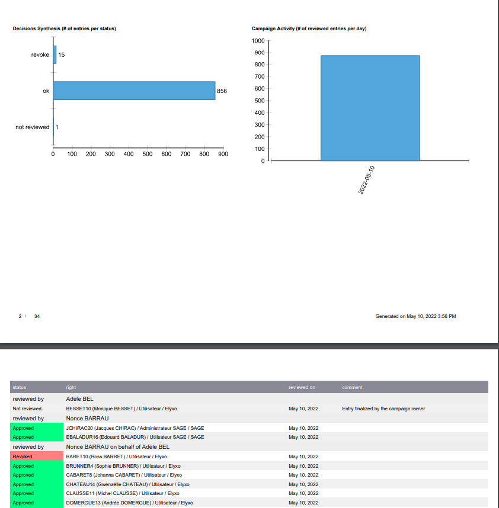  

This information is also presented in the last tab of the review campaign management interface. You can use this tab if you want to search for entries or export those information in a form of a CSV/excel file (right click on the "ungrouped" table for such purpose).  

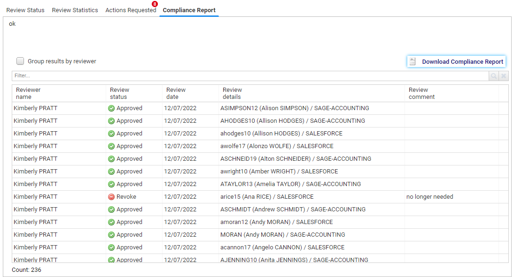  

## Discrepancies

RadiantOne Identity Analytics automatically detects remediation discrepancies.

A discrepancies occurs when a remediation fails: The access rights has been marked as remediated successfully, but when fresh data is loaded in RadiantOne Identity Analytics this access right still exists in the target system.  

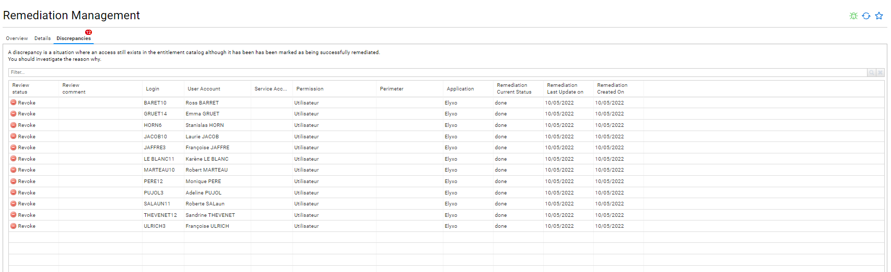

Discrepancies are accessible in the *Remediation Management*. Discrepancies are also identified as control defects (REM02 - remediation ticket closed and access right not removed)
