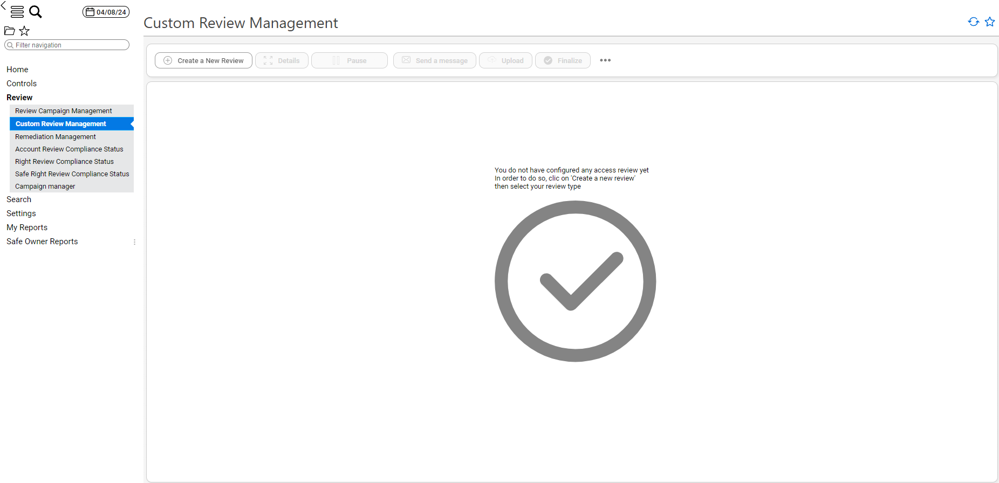
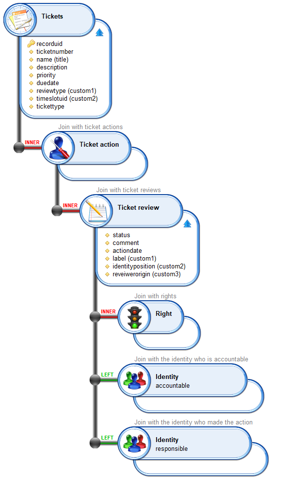
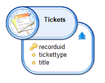
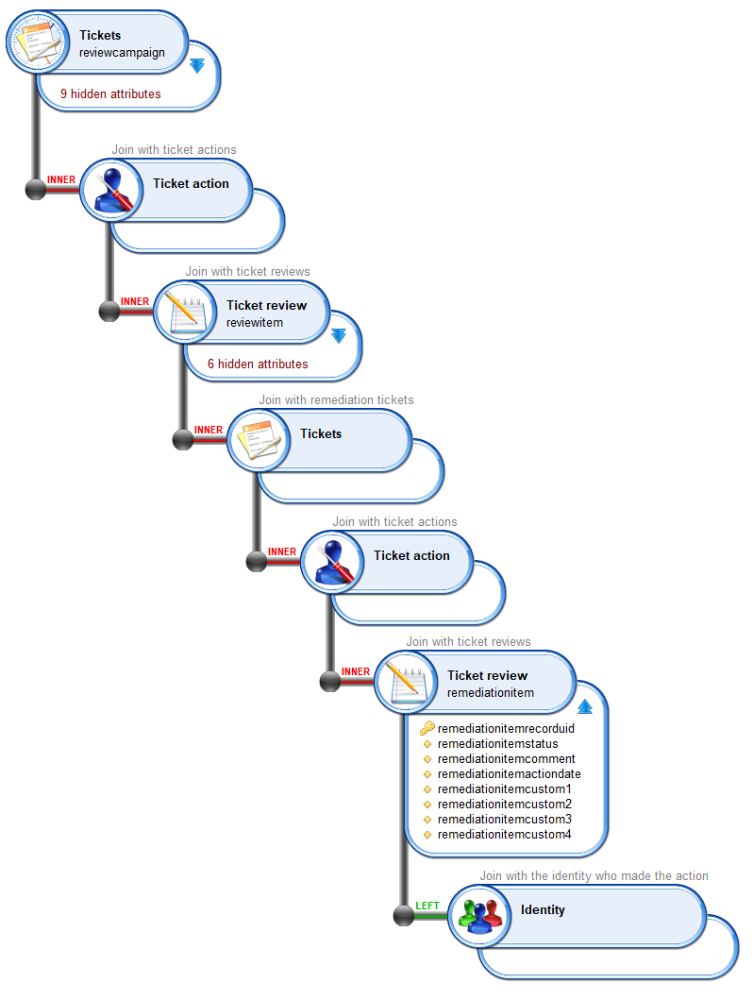
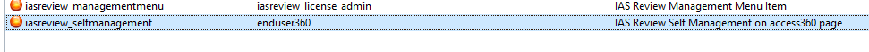

# Technical Corner

This document explains how access reviews are configured in RadiantOne Identity Analytics, from a technical point of view.  
This information is only useful if you have deployed Identity Analytics 'on-prem' and you want to leverage or extend access reviews.  

## Custom Web-based Reviews

Starting with Identity Analytics 3.0, you can create custom web-based reviews by following the principles presented in this "Technical Corner" document.  

Those reviews are available from the main menu on the left in "Custom Review Management". This menu contains both "custom web-based review" and also the manual reviews of the former version of Identity Analytics. For these "legacy" manual reviews, it allows to download excel file and compliance report and reach the follow-up dashboards.

> Note that if you are upgrading Identity Analytics (IAP) from an earlier version to Identity Analytics 3.0, you must first finalize all your reviews.  

For the new custom reviews, the review configuration page needs to have the tag "newiasreview". In that case, it will be directly accessible when clicking on "Create a New Review" button.



## Server Data Extraction For User Access Review

To extract server data for Identity Analytics (IDA) Server Reviews, you can combine PowerShell-based extraction, teledistribution tools (Ansible, Puppet, or SCCM) for script deployment, and automated scheduling. This process aligns with the RadiantLogic Windows Connector methodology and User Access Review server review requirements.  
  
### Server Data Extraction  

For windows accounts, you can use the IDA Extraction Scripts available in the add-on [bw_winlocalresources](http://marketplace.radiantlogic.com/package/bw_winlocalresources/) that you can download from the RadiantLogic Marketplace to extract data.

For that you can execute locally the script on the windows servers using teledistribution tools:  

```sh
.\get-winlocalresources.ps1 -logLevel Debug
```

In addition, you can use for small environment the following scripts from a single server of the domains to extract list of servers from AD and then their local accounts and groups:  

- Example to list Windows server machines available in the current Active Directory Domain, named `intra05` in this example. The output file will be `intra05_hosts.csv`.

```sh
get-hosts.ps1 -prefix intra05`
```

- Then extract, for each Windows server present in `intra05_hosts.csv` file, local accounts and groups, shares:

```sh
get-hosts-sharesinfos.ps1 -prefix intra05 -hostsFile intra05_hosts.csv
```

The output will be csv files that you can transfer to upload them to your Identity Analytics instance.

> For more details, please refer to the documentation embedded within the add-on.

For other kind of servers, you can use other add-ons or your own script to extract data. In that case, you have to make sure that the data mapping is well configured in order to see your servers in the Server Access Reviews.  

### Configuration of the Data Mapping in the IDA data model

Upload the data into the IDA platform:

- For windows server, we recommend installing the add-on `bw_winlocalresources` in your Identity Analytics for the data mapping into IDA
- Or define your own data mapping. For that you need to map servers as applications in the IDA data model with the attribute Application Type set to 'server' and you need to map access rights (that could be local groups within your servers) to permissions.

## Server Data Extraction for User Access Reviews

To extract server data for Identity Analytics (IDA) Server Reviews, you can combine PowerShell-based extraction, teledistribution tools (Ansible, Puppet, or SCCM) for script deployment, and automated scheduling. This process aligns with the RadiantLogic Windows Connector methodology and UAR (User Access Review) server review requirements. 

### Data Extraction

**For Windows Servers:**

Utilize the Identity Analytics Extraction Scripts available in the "bw_windows_local" add-on, which can be downloaded from the RadiantLogic Marketplace. The primary script, `bw_data_collector.ps1`, is designed to extract data from Active Directory and local servers. The extracted data is saved in CSV format, suitable for uploading into your Identity Analytics instance.

**For Other Servers:**

For non-Windows servers, you can employ alternative add-ons or custom scripts to extract access data. Ensure that these scripts are designed to capture all necessary access information. It's crucial to verify that the data mapping configurations are correctly set up to ensure seamless integration with the Identity Analytics platform.

### Configuring Data Mapping

After extracting the data, follow these steps to configure the data mapping in the Identity Data Analytics Data Model:

**Upload Data into Identity Analytics:**

- **For Windows Servers:** It's recommended to install the "bw_windows_local" add-on in your Identity Analytics instance to facilitate data mapping. This add-on simplifies the process of mapping server data into the IDA data model.

- **For Other Servers:** If you're using custom scripts or different add-ons, ensure that the extracted data aligns with the IDA data model's requirements. Specifically, map servers as applications with the attribute "Application Type" set to "server." Additionally, map access rights, such as local groups within your servers, to the appropriate permissions within the IDA model.

## Data model

### Review

When creating an access review campaign, all data to be reviewed (the review perimeter) is marked in the Identity Analytics data model in the form of `ticketreview`.  
All those `ticketreviews` are attached to a `ticketlog` which represents the campaign.  

Information about the review campaign and the review status of each entry are written down in the tickets. `ticketreview` are updated on-the-fly every time a decision is taken. As a result, information in the Identity Ledger is a **real-time** view of the current campaign progress.  

Each entry to review is associated with a **(R)** esponsible and an **(A)** ccountable for the review. This is done through links from the `ticketreview` to the *accountable identity* and the *responsible identity*.

Here is a `view` of an access right campaign.  

  

> As a campaign is launched manually, the `ticketlog` issuer is the one who launched the campaign.  
>
> When the campaign is initialized, the same reviewer information is assigned to the `ticketreview` as Accountable **and** Responsible. Responsible link is the one used to display entries to be reviewed by reviewers. When a reassignment occurs, only the *Responsible* link is updated, *Accountable* link never changes. As a result, you can spot reassigned entries by comparing `accountableuid` and `responsibleuid` (an entry is reassigned if they are different).  

Campaign information is stored as such:  

| Campaign     |                                                             |
| ------------ | ----------------------------------------------------------- |
| recorduid    | Campaign internal unique identifier                         |
| ticketnumber | Campaign unique number                                      |
| title        | Campaign name                                               |
| description  | Campaign description                                        |
| priority     | Campaign priority number                                    |
| duedate      | Campaign due date                                           |
| custom1      | Campaign type ('right', 'account', 'safe', 'group members") |
| custom2      | timeslotuid when the campaign was launched                  |
| custom3      | status page                                                 |
| custom4      | review page                                                 |
| custom5      | finalize page                                               |
| custom6      | offline mode enabled                                        |
| custom7      | self delegation enabled                                     |
| custom8      | is it a full (compliance driven ) review                    |
| tickettype   | ADHOC_UAR                                                   |

The campaign current status is stored in a dedicated metadata named `bwr_campaigninstance` where the subkey equals the campaign recorduid. The status is stored as a String in string3, the possible values are:

- init
- active
- pause
- finalizing
- closed
- cancelled

Review information is stored as such:

| Reviewed item |                                                                                                                                         |
| ------------- | --------------------------------------------------------------------------------------------------------------------------------------- |
| recorduid     | reviewed item internal unique identifier                                                                                                |
| status        | reviewed item status                                                                                                                    |
| comment       | reviewed item comment                                                                                                                   |
| actiondate    | reviewed item last action date                                                                                                          |
| custom1       | reviewed item printable label                                                                                                           |
| custom2       | in case of a user account, characteristics of the account owner in order to check for movements between reviews by comparing the values |
| custom3       | origin of the reviewer                                                                                                                  |
| custom4       | what is reviewed (account, right, safe, group members)                                                                                  |

Review `status` value is one of the following value:

| review status  |                                                        |
| -------------- | ------------------------------------------------------ |
| ok             | Approved entry                                         |
| revoke         | Entry to be revoked                                    |
| update         | Entry to be updated                                    |
| reassign       | Entry marked as to be reassigned by the campaign owner |
| not reviewed   | Marked as not reviewed                                 |
| to be reviewed | Initial status: Entry needs to be reviewed             |

> Entries to review are marked as *to be reviewed* at the very beginning of the campaign; those are the entries displayed to the reviewers. Entries still not reviewed when the campaign is finalized can be marked as *not reviewed*
>
> *Reassign* is a special status used when a reviewer indicates that he considers himself as not being the correct reviewer for some entries. Those entries have to be reassigned by the campaign owner through the management interface.

`custom3` contains the origin of the reviewer. It can be:

| Reviewer origin (custom3) |                                                                             |
| ------------------------- | --------------------------------------------------------------------------- |
| linemanager               | The reviewer is the direct line manager of the account owner                |
| applicationowner          | The reviewer is the application owner                                       |
| permissionowner           | The reviewer is the permission owner                                        |
| accountowner              | The reviewer is the account owner                                           |
| groupowner                | The reviewer is the group owner                                             |
| repositoryowner           | The reviewer is the repository owner                                        |
| myself                    | The reviewer is the user himself                                            |
| default                   | The reviewer is the default reviewer (as configured during campaign launch) |

> [!warning] Although a reviewticket is not attached to a timeslot, the reviewed data is. As a result, you should be very cautious about the way you are designing your *views* as you can end up in situations where the lines won't appear because either the *Account* or the *Permission* no longer exists in the latest timeslot. If you want to display **all** this information whatever reviewed data still exists or not in the Identity Ledger, you should use *ticketreview displayname* instead of pointing to the access right.

### Sign-Off Review

The sign-off principle can be implemented review per review and is not mandatory. Some custom reviews can be created without it.  
  
The sign off is stored entry by entry, in each ticketreview, in the following custom attributes:

- Custom5: sign off entry or not, boolean format,
- Custom6: who made the sign off, the person's UID is entered, string format,
- Custom7: when the sign off was made, date format.

### Finalized Review

As a `ticketlog` is a read-only information in the data model, another `ticketlog` had to be created in order to mark a review as *finalized*.



Ticketlog information is:  

| Finalized ticket log |                                                            |
| -------------------- | ---------------------------------------------------------- |
| recorduid            | Finalized ticketlog information internal unique identifier |
| title                | Review campaign internal unique identifier                 |
| tickettype           | ADHOC_UAR_COMPLIANCE                                       |

> `title` contains the review campaign `ticketlog` recorduid. As a result, if you want to check if a campaign is finalized you either have to create a *business view* and perform a join between those two ticketlogs with: `reviewticketlog.recorduid=finalizedticketlog.title`
>
> Finalized ticketlog contains the **compliance report**
>
> You can also detect if a review is finalized by checking the review campaign status metadata  

### Remediation

Once a campaign is finalized, remediation tickets are automatically created for all reviewed entries with `revoke` or `update` status.

A remediation is a `ticketlog`, nevertheless, as a `ticketlog` is read-only, a `ticketreview` is created for **each** remediation. This `ticketreview` contains the remediation current status.



Remediation information is stored in the remediation `reviewticket` as such

| Remediation ticket review |                                                                   |
| ------------------------- | ----------------------------------------------------------------- |
| recorduid                 | remediation internal unique identifier                            |
| status                    | remediation printable status                                      |
| comment                   | remediation comment                                               |
| actiondate                | remediation last action date                                      |
| custom1                   | remediation access right printable information                    |
| custom2                   | remediation closed status                                         |
| custom3                   | remediation type (embedded/itsm)                                  |
| custom4                   | timeslotuid when the last remediation ticket update has been made |
| custom5                   | External ticket number (displayable info)                         |
| custom6                   | External ticket id (internal info)                                |
| custom7                   | External ITSM instance code                                       |
| custom8                   | External ITSM hyperlink to show the ticket details                |
| custom10                  | Assigned remediation instance code _(error only)_                 |

`status` contains the current review ticket status. This printable value depends on the remediation type (manuel, automated, ...) in case of an automated review through an ITSM system, this value contains the current ITSM ticket status.

`custom2` contains the remediation closed status. This information is managed by RadiantOne Identity Analytics and helps to identify whether this remediation is still active or closed.  

> You cannot rely on `status` to check for the active remediation state as `status` contains a printable status which depends on the remediation type

| Remediation closed status |                                                   |
| ------------------------- | ------------------------------------------------- |
| -1                        | Remediation is ready to be launched               |
| 0                         | Remediation is still active                       |
| 1                         | Remediation is closed and has been done           |
| 2                         | Remediation is closed and has been cancelled      |
| 3                         | Remediation is in error and can be launched again |

As you can notice in the upper table, the only case where a remediation has been done is when `custom2=1`

`custom3` contains the remediation type, it can be:

- `embedded`: Manual remediation through RadiantOne Identity Analytics
- `itsm`: Managed remediation through an ITSM system, as several ITSM can be declared in Identity Analytics, `custom7` contains the Identity Analytics ITSM instanceid

> [!warning] A *remediation ticketreview* is **not** associated with the access right which needs to be remediated. It is associated with a *dummy* reviewed metadata. When configured this way, this ticketreview will never disappear even when the access right itself disappear when refreshing the Identity Ledger. A printable version of the access right is available in `custom1`.

#### Remediation error

Using external ITSM tools can lead to errors during the creation process of the tickets whether it's due to misconfiguration, the external server not being reachable or any other reason. In case of error, the closed status is set to `custom2=3` along with the `custom10=remediationinstancecode`, this way the remediation instance that must be looked into can quickly be identified and the `comment` field, used to store the error returned during the process, can help resolve the issue.

Once the error has been fixed, the remediations in error can be launched again. The `bwr_retrytickets` workflow is executed to do so, with the variable `retrymode=True` sent as an input to the `bwr_inittickets` workflow. This way instead of processing the remediations with a closed status `custom2=-1` it executes on `custom2=3` hence retrying to create the remediation tickets that fell in error before.

## Create and update review status

Several workflows are available to create or update reviews. You should use them whenever possible. Those workflows are located in `/workflow/bw_access360/`

| Workflows                               |                                                                                                    |
| --------------------------------------- | -------------------------------------------------------------------------------------------------- |
| assignAccessRightsReviewTickets         | Used to initialize an access rights review campaign                                                |
| deleteCampaign                          | Used to delete **all** tickets associated with a campaign, including remediation                   |
| writeAccessRightsReviewTickets          | Used to update campaign entries review status                                                      |
| reassignAccessRightsReviewTickets       | Used to reassign some review entries to another Responsible Identity                               |
| resetDelegationAccessRightReviewTickets | Used to reset the reassignment of review tickets by copying accountable entry to responsible entry |
| finalizeAccessRightsReview              | Used to finalize an access rights review campaign, including generating the compliance report      |
| createRemediationTickets                | Used to initialize remediations by creating a series of remediations associated to reviewticket    |
| createRemediationTicket                 | Used to create one remediation ticket                                                              |
| writeRemediationTickets                 | Used to update remediation tickets status                                                          |

## Launch remediation and create ITSM tickets 

Several workflows are available to automatically create and update remediations. You can launch them as a scheduled batch (`igrc_workflow.[cmd|sh]`) to automate remediation creation or refresh ITSM tickets. Those workflows are located in `/workflow/bw_iasreview/`

| Workflows                             |                                                              |
| ------------------------------------- | ------------------------------------------------------------ |
| inittickets (`bwr_inittickets`)       | Used to automatically launch all "pending" remediations.     |
| refreshtickets (`bwr_refreshtickets`) | Used to automatically refresh all active ITSM tickets status |
| retrytickets (`bwr_retrytickets`)     | Used to automatically retry the creation of tickets that previously encountered error(s) |

## Self-Reassignment

Self-reassignment is disabled by default, if you want to enable it for the reviewers you **must** update the security configuration of your project.
Self-reassignment is protected by a feature named `iasreview_selfmanagement` found in `\webportal\features\bw_access360\enduser360.features`

In order to enable it you should assign this feature to `enduser360` featureset

  

## Advanced Mode for Reviewer Strategy

The script mode proposed by the advanced mode in the Reviewer Strategy step of the configuration wizard for "Application Access Rights Review" and "Account Repository Review" can be disabled. The related feature have to be disabled in your project if you don't want to use advanced review strategies. By default, those features are included in the functional and technical administration role (`iasreview_funcadmin` and `iasreview_techadmin`).

To do so, you have to edit the following feature file: `\webportal\features\bw_iasreview\iasreview.features`. The feature `iasr_accountreviewadvancedreviewermode` for repository accounts reviews has to be associated to the relevant feature sets. The feature `iasr_rightreviewadvandedreviewermode` for application rights reviews has to be associated to the relevant feature sets.

Please contact your Identity Analytics project owner to configure this.

## New configuration variables

### Configuration variable to handle notifications languages

When managing notifications from the user access review campaign management interface, tab "Mail Templates", the technical administrator can create new email template, edit and duplicate existing ones, or remove some templates. Deleting templates will not affect any campaigns that have already been set up using those templates.
For each template, you can define emails in english, french and spanish. The Identity Analytics can specify the languages that need to be supported by setting in the technical configuration of the project the variable `ias_supportedlanguages` to "en,fr,es".  

### Configuration variables to handle large volume of data

Four new configuration variables have been added to the project to handle large amount of data.

- `ias_reviewersdisplaylimitvalue` used by Identity Analytics 3.X and 2.2, indicates the maximum number of reviewers to display the "Review Statsitics" tab in the review follow-up interface (accessible via the **Details** button of a review instance). The default value is 1000.
- `ias_maxentriestoreview` in Identity Analytics 2.2, the maximum number of entries to review per reviewer can be limited by this configuration variable. By default, the limit is set to 30,000. In Identity Analytics 3.X, the limit does not depend to this variable and is set to 100,000.
- `ias_disablenoniappreviews` allows to disable the display of custom workflow review types in Access360 to improve performance, used by Identity Analytics 3.X and 2.2. The default value is false, and it should be activated only if you don't have any custom workflow reviews.
- `ias_reviewercriticalthreshold` in Identity Analytics 3.X and 2.2, indicates the number of entries upon which the review instance is forced to offline mode. The default value is 30,000.
- `ias_reviewdisablepreviewlimit` in Identity Analytics 3.1 and above, allows for reviews on large volumes of data, above 30,000 entries by default, to deactivate the step 3 `Perimeter Preview` to smooth the experience, as well as hide the KPIs in step 6. As a result, the campaign is forced into "on hold" mode to allow perimeter review from the campaign management interface before launching the reviews.  
  
### AIDA configuration variables

In the technical project configuration file, two variables are available:

- `aida_enabled` which allows to disable/enable the AIDA service in your Identity Analytics project.  
- `aida_service_url` which is the API URL used to reach the LLM agents in AWS Bedrock.  


